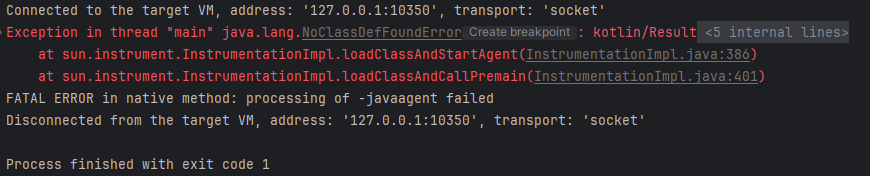
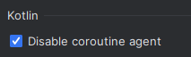

## 디버그 모드에서 계속 에러가 발생한다.

### 개요

스카우터의 agent.java의 동작 과정을 알아보기 위해,  
특정 소스코드의 main 함수를 실행해봤다.

그냥 실행했을 떄는 문제없이 실행됐는데,  
디버그 모드에서만 계속 에러가 발생했다.

### 원인

그래서 일반 모드와 디버그 모드일 때의  
자바 에이전트의 차이를 알아보기로 했다.

"-javaagent:C:\Program Files\JetBrains\IntelliJ IDEA 2023.2.4\lib\idea_rt.jar=8962:C:\Program Files\JetBrains\IntelliJ IDEA 2023.2.4\bin"  
일반 모드의 자바 에이전트

-javaagent:C:/Users/HSH/.m2/repository/org/jetbrains/kotlinx/kotlinx-coroutines-core-jvm/1.5.2/kotlinx-coroutines-core-jvm-1.5.2.jar  
-javaagent:C:\Users\HSH\AppData\Local\JetBrains\IntelliJIdea2023.2\captureAgent\debugger-agent.jar  
디버그 모드의 자바 에이전트

디버그 모드일 때, 자바 에이전트로 코루틴 관련 jar 파일을 사용하는 것을 확인했다.

### 해결

코루틴 관련 jar 파일이 javaagent에 추가된 이유는,  
내가 실행한 프로젝트에 코틀린 코드가 포함되어 있기 때문이었다.

이를 해결하는 방법은 2가지가 있다.
1. 코틀린 코드를 제거한다.
2. 설정에서 disable coroutine agent를 체크한다.  
   

> 2번 방법은  
> https://stackoverflow.com/questions/68753383/how-to-fix-classnotfoundexception-kotlinx-coroutines-debug-agentpremain-in-debu  
> 위 사이트를 통해 알게 됐다.

### 인사이트

인텔리제이가 자바 에이전트를 이용해 내가 짠 코드를 실행한다는 것을 알게 됐다.