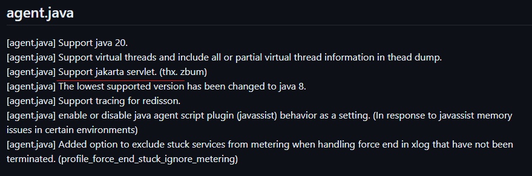

### Variable Expected

변수를 입력해야 하는데, 그냥 숫자나 메서드가 입력되었을 때

```cpp
5++; // x
member.getTeam() = temp; // x
```

두번째 예시는 수정 메서드를 만들어서 처리한다.

```cpp
member.setTeam(temp);
```

---

## scouter의 agent.java를 자바 프로그램과 같이 실행했는데 xlog가 확인이 되지 않는다.

### 개요

agent.java jar 파일을 javaagent 로 하고 기존 프로젝트 jar 파일과 같이 실행했는데,  

GC 나 Heap 같은 메트릭은 collector에서 수집이 됐지만, xlog, TPS 같은 사용자 요청과 관련된 메트릭이 수집이 되지 않았다.

### 원인

scouter 깃허브 문서를 보고, 구글링으로 비슷한 오류를 찾아봤지만  
도저히 찾을 수 없어서,  

직접 agent.java 의 코드를 뜯어봤다.

agent.java 의 코드를 보다가 버전에 의한 문제라는 것을 확인했다.

  
scouter 2.20 버전의 agent.java 파일에서  
HttpServiceASM 클래스는 jakarta 클래스를 지원하는데

  
scouter 2.17 버전의 agent.java 파일에서  
HttpServiceASM 클래스는 jakarta 클래스를 지원하지 않는다.

> 자바 9 이후로 javax 패키지가 jakarta 패키지로 변경되었다.  
> 프로젝트의 스프링 부트 버전은 3.X인데, 이 버전은 jakarta 패키지를 사용한다.

스프링 부트는 jakarta 를 사용하는데, agent.java의 버전은 2.17 이라서 jakarta 클래스를 지원하지 않아서,  
Xlog, TPS 메트릭이 수집되지 않았다.

(2.20 버전의 업데이트 내용을 보면 알 수 있다)  


### 해결

agent.java 버전을 2.17에서 2.20으로 올려주었다.  
그랬더니 xlog TPS 메트릭이 정상적으로 수집되었다.


> 이래서 공식 문서를 꼼꼼이 보라는 거구나...  
> 
> 이 문제는 에러나 로그가 아예 없어서 찾기 힘들었다.

---

## response의 body 관련 헤더가 로깅이 되지 않는다.

### 개요

스프링 프로젝트에서 http 메시지에 대해 로그를 남기는 필터를 만들었다.

여기서 response의 body 관련 헤더가 로깅이 되지 않는다.

### 원인

로깅을 하기 위해 ContentCachingResponseWrapper 클래스를 사용함으로서,  
response의 body를 write 하는 시기가 변해서 이런 문제가 발생했다.

response의 body 관련 헤더(`Content-Length`, `Content-Type`)가  
response에 입력되는 시점은 responseBody를 write 하는 시점이다.

이때 나는 ContentCachingResponseWrapper를 사용해서 responseBody를 write 하는 시점을  
response의 헤더를 로깅하는 시점보다 늦춰버렸다.

> ContentCachingResponseWrapper는 copyBodyToResponse 메서드를 통해  
> responseBody를 사용자에게 write 한다.
>
> 이때 바디 관련 헤더가 response에 입력된다.

### 해결

헤더를 로깅하는 시점보다 먼저 copyBodyToResponse 메서드를 호출하는 것으로 해결했다.

---

