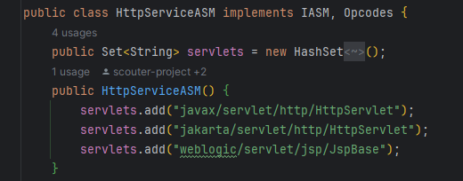

## scouter의 agent.java를 자바 프로그램과 같이 실행했는데 xlog가 확인이 되지 않는다.

### 개요

agent.java jar 파일을 javaagent 로 하고 기존 프로젝트 jar 파일과 같이 실행했는데,

GC 나 Heap 같은 메트릭은 collector에서 수집이 됐지만, xlog, TPS 같은 사용자 요청과 관련된 메트릭이 수집이 되지 않았다.

### 원인

scouter 깃허브 문서를 보고, 구글링으로 비슷한 오류를 찾아봤지만  
도저히 찾을 수 없어서,

직접 agent.java 의 코드를 뜯어봤다.

agent.java 의 코드를 보다가 버전에 의한 문제라는 것을 확인했다.

  
scouter 2.20 버전의 agent.java 파일에서  
HttpServiceASM 클래스는 jakarta 클래스를 지원하는데

  
scouter 2.17 버전의 agent.java 파일에서  
HttpServiceASM 클래스는 jakarta 클래스를 지원하지 않는다.

> 자바 9 이후로 javax 패키지가 jakarta 패키지로 변경되었다.  
> 프로젝트의 스프링 부트 버전은 3.X인데, 이 버전은 jakarta 패키지를 사용한다.

스프링 부트는 jakarta 를 사용하는데, agent.java의 버전은 2.17 이라서 jakarta 클래스를 지원하지 않아서,  
Xlog, TPS 메트릭이 수집되지 않았다.

(2.20 버전의 업데이트 내용을 보면 알 수 있다)  

### 해결

agent.java 버전을 2.17에서 2.20으로 올려주었다.  
그랬더니 xlog TPS 메트릭이 정상적으로 수집되었다.

> 이래서 공식 문서를 꼼꼼이 보라는 거구나...
>
> 이 문제는 에러나 로그가 아예 없어서 찾기 힘들었다.

---