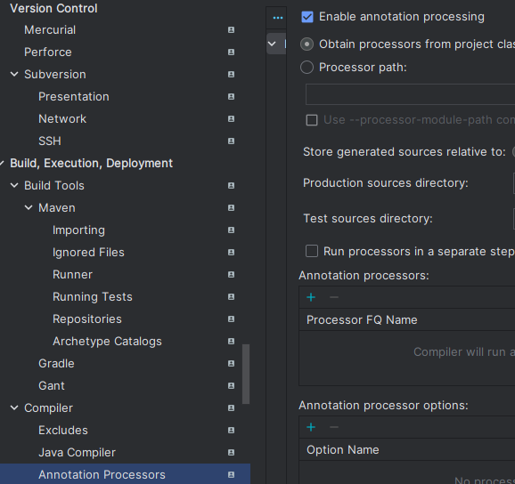

### java.io.IOExcetion: 파이프가 닫히는 중입니다.
오류 : 기본 클래스 worker.org.gradle.process.internal.worket.GradleWorkerMain을(를) 찾거나 로드할 수 없습니다.

./gradlew.bat clean test 명령어를 실행 중에 일어난 문제

(직접 IDE에서 테스트했을 때는 문제가 없었다)

이 문제를 해결하는 방법은 두가지가 있다.

1. Build and run using과 Run tests using 환경을 Gradle -> IntelliJ IDEA로 설정 후 실행
2. 경로에 한글이 있는지 검사 -> 영어로 바꿔야 한다.

> 이때 윈도우 사용자명이 한글이라면, 포맷을 해서 영어 이름으로 바꿔야 한다...

---

### Could not resolve all files for configuration ':annotationProcessor'.
Could not find org.projectlombok:lombok

이 문제는 롬북을 build.gradle에 추가했는데도 이를 IDE가 인식하지 못하는 문제

설정에서 Enable annotation processing을 체크해주면 문제가 해결된다.