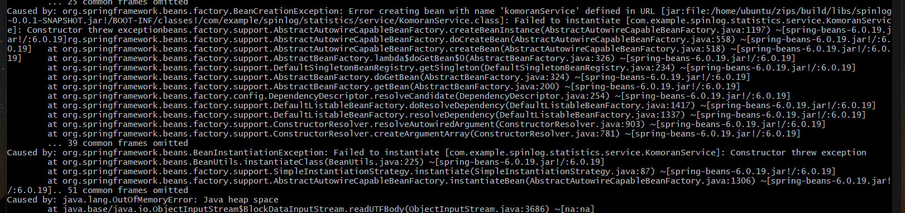

## java.io.IOExcetion: 파이프가 닫히는 중입니다.
오류 : 기본 클래스 worker.org.gradle.process.internal.worket.GradleWorkerMain을(를) 찾거나 로드할 수 없습니다.

./gradlew.bat clean test 명령어를 실행 중에 일어난 문제

(직접 IDE에서 테스트했을 때는 문제가 없었다)

이 문제를 해결하는 방법은 두가지가 있다.

1. Build and run using과 Run tests using 환경을 Gradle -> IntelliJ IDEA로 설정 후 실행
2. 경로에 한글이 있는지 검사 -> 영어로 바꿔야 한다.

> 이때 윈도우 사용자명이 한글이라면, 포맷을 해서 영어 이름으로 바꿔야 한다...

---

## Could not resolve all files for configuration ':annotationProcessor'.
Could not find org.projectlombok:lombok

이 문제는 롬북을 build.gradle에 추가했는데도 이를 IDE가 인식하지 못하는 문제

설정에서 Enable annotation processing을 체크해주면 문제가 해결된다.

---

## java.lang.OutOfMemoryError: Java heap space

### 개요

빌드 완료한 jar 파일을 EC2에서 실행하는데, 바로 위 에러가 나고 프로그램이 종료됨

### 원인

KOMORAN 라이브러리 때문이다.

해당 라이브러리가 너무 무거워서 발생한 문제

### 해결 과정

처음 로컬에서 테스트 했을 떄는 문제가 없었다.

이때 로컬 컴퓨터의 메모리 용량은 16GB라서 문제가 없었을 것이다.

그래서 로컬 컴퓨터에서 Komoran 라이브러리만 넣고 실행했을 때와 안 넣고 실행했을 때의,  
메모리 사용량을 확인해보았다.

`komoran full로 설정했을 때`  
Heap Size: 492830720		약 500MB  
Max Heap Size: 4141875200  
Free Heap Size: 126938536

`komoran light로 설정했을 때`  
Heap Size: 197132288		약 200MB  
Max Heap Size: 4141875200  
Free Heap Size: 82946776

`komoran 없을 떄`  
Heap Size: 85983232		약 90MB  
Max Heap Size: 4141875200  
Free Heap Size: 46811960

EC2에서 아무 설정도 하지 않고, 자바 프로그램을 실행했을 때의 힙 사이즈는 약 250MB였다.

이 문제를 해결하기 위해,
1. komoran full -> light로변경  
2. 최대 힙 크기 -> 512 MB로 변경

위 두가지를 적용하여 에러를 해결했다.

> 결국 마지막에는 해당 라이브러리를 사용하지 않고,  
> 외부 API를 사용하여 문제를 해결했다.

---