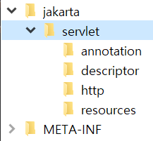

## *.jar에 기본 Manifest 속성이 없습니다.

### 개요

./gradlew build를 통해 jar 파일을 만들고  
java -jar을 통해 실행했는데  
생긴 오류

### 원인

jar 파일을 실행하면,  
먼저 Manifest 파일을 찾아서,  
해당 파일에서 메인 함수의 위치를 찾은 다음에  
메인 함수를 실행한다.

그런데 이때 (jar 파일을 실행할 때) Manifest 파일이 없어서 생기는 오류

### 해결법

build.gradle 파일에서 직접 메인 함수의 위치를 지정해주면 된다.  
그러면 빌드할 때 메인 함수의 위치 정보가 포함 된 Manifest 파일이 생성된다.

```groovy
jar {
    manifest {
        attributes(
                'Main-Class': 'subFolder.Main'
        )
    }
}
```

여기서 경로의 시작위치는 `java` 파일이다.

위 코드와 함께 ./gradlew build 명령을 실행하면,  

jar 파일에 MANIFEST.MF 파일이 생기고  
메인 함수의 위치가 등록된다.

```
Main-Class: subFolder.Main
```
(MANIFEST.MF 파일 내용)

---

## jar 파일 실행 했을 떄 ClassNotFoundException (외부 클래스)

> 여기서 못 찾은 클래스는 외부 라이브러리의 클래스다.

### 개요

./gradlew build를 통해 jar 파일을 만들고  
java -jar을 통해 실행하는데  
ClassNotFoundException이 터졌다. (org.sl4fj.Logger 를 못찾았음)

일단 manifest 파일을 찾아  
메인 함수를 찾아서 실행 성공한 상태다.  
여기서 의존하고 있는 외부 라이브러리의 클래스를 탐색하지 못해 발생한 문제다.

### 원인

그냥 빌드한다면,  
jar 파일에 외부 라이브러리들의 class 파일이 생기지 않는다고 한다.

이를 shadowJar 이나 스프링부트의 도움을 받아  
jar 파일에 외부 라이브러리들의 class 파일을 같이 넣어줄 수 있다고 한다.  
(외부 라이브러리의 파일들이 포함된 jar 파일을 `fatJar`이라고 한다)

### 해결 과정

외부 라이브러리를 같이 빌드하는 편한 방법은 두가지가 있다.

`1. shadowJar을 활용해 fatJar 생성`

build.gradle 파일에 `com.github.johnrengelman.shadow` 플러그인을 추가해준다.

```
plugins {
    ...
    id 'com.github.johnrengelman.shadow' version '8.1.1'
    // 여기서 gradle의 버전별로 shadowJar 버전을 맞춰줘야 한다.
    // (gradle 버전이 8.X.X 이라 shadowJar 버전도 8.X.X로 맞춰줬다
}
```

> Shadow 플러그인은 Gradle 빌드 시 라이브러리 의존성을 하나의 fat JAR로 병합하는 데 사용된다.

그리고 빌드 명령에서 ```./gradlew shadowJar``` 명령을 해준다.

그럼 `{project_name}-1.0-SNAPSHOT-all.jar` 파일이 생성된다.

이 파일에는 외부 라이브러리의 class 파일들이 포함되어 있다.



`~-all.jar` 파일을 ```java -jar``` 명령으로 실행하면 성공한다.

`2. 스프링 부트를 통해 편하게 설정`

build.gradle 파일에 `org.springframework.boot` 플러그인을 추가해준다.

```
plugins {
    id 'java'
    id 'org.springframework.boot' version '3.1.9'
}
```

이제 그냥 ```./gradlew build```와 ```java -jar``` 명령을 실행해주면 성공한다.
(스프링 부트가 알아서 의존하고 있는 라이브러리들을 jar 파일에 넣어준다)

> 스프링 부트 플러그인을 넣어주면,  
> manifest 파일을 생성하기 위해  
> build.gradle 파일에 넣어줬던 메인 함수 위치 지정 코드도  
> 넣을 필요가 없다.  
> (스프링 부트가 다 해준다)

> spring initializr를 통해 스프링 부트 프로젝트를 생성하면  
> 위 플러그인이 자동으로 들어가 있다.  
> 그래서 스프링부트 프로젝트를 할 때는  
> 이것들을 신경쓰지 않고 프로젝트를 진행할 수 있다.

### 인사이트

맨 처음 build.gradle을 통해 빌드 해본 건  
스프링 부트 프로젝트로 해봤을 때다.

그때는 그냥 빌드하고 실행하면 바로 실행이 되서  
지금도 바로 실행이 될꺼라 생각했다.

그런데 알고보니 스프링부트가 이런 과정들을 아주 깔끔하게 해줘서  
개발자가 편하게 빌드할 수 있게 됐다는 것을 알게 됐다.

---

## Incompatible because this component declares a component for use during compile-time, compatible with Java 17 and the consumer needed a component for use during runtime, compatible with Java 11

### 개요

aws ec2에서 빌드할 떄 생긴 오류

### 원인

로컬 컴퓨터는 자바 17이 default

하지만 ec2는 자바 11이 default라서 호환되지 않는 문제

### 해결 과정

ec2에 jdk 17을 install 해서 해결했다.

### 인사이트

오류 내용을 천천히 읽기만 해도 바로 알 수 있다.

---

## error: invalid source release: 21

### 개요

./gradlew build를 통해 빌드할 때 생긴 오류

### 원인

build.gradle 파일에서 sourceCompatibility를 21로 설정했는데,

JAVA_HOME은 jdk 17이기 때문

### 해결법

jdk 21이 설치된 디렉토리를 직접 지정해줬다.

```./gradlew build -Dorg.gradle.java.home={jdk_21_path}```

> java 명령어를 실행할 때는, {path}/bin/java 까지 지정해줘야 한다.  
> (java 실행 파일이 있는 경로까지)
> 
> gradle 명령어를 실행할 때는, {path} 까지만 지정해줘야 한다.

---