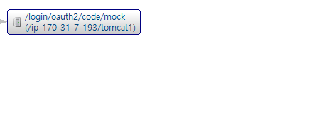

## nGrinder + Spring Security + OAuth2 인증 - 쿠키 관련 레이스 컨디션 문제

### 개요

nGrinder를 이용해서 100명의 vuser로 성능테스트를 해봤는데  
(프로세스 1개, 스레드 100개)

실제 API 테스트 전의 OAuth2 인증에서 문제가 발생했다.

100명의 vuser에서 절반정도만 인증에 성공하고, 나머지는 실패했다.

여기서 특이한 점은 100명의 유저 중에서,  
초반에 요청한 유저들만 인증에 실패하고  
나중에 요청한 유저들은 인증에 성공했다.

> 이 테스트를 실행할 때마다 성공/실패 한 유저의 수가 다르게 나왔다.  
> -> 멀티 스레드 환경에서 발생하는 문제일 것으로 예상했다.

---

### 원인 1 - 어떤 시점에 vuser의 요청이 서버에서 종료됐는지 확인

스카우터를 이용해 인증에 실패한 유저의 로그를 확인해보니,  
OAuth2 인증을 위한 액세스 토큰 요청, userInfo 요청을 하지 않고 바로 종료됐다.

성공한 인증 요청의 플로우  
(내부에서 액세스 토큰 요청, userInfo 요청을 모두 성공적으로 수행했다)  


실패한 인증 요청의 플로우  
(내부에서 아무 요청도 하지 못했다)  


---

그리고 인증에 실패한 요청을 에러 로그로  
authorization_request_not_found 라는 에러 메시지를 확인했다.  


해당 로그 메시지가 어디서 발생했는지 알아보기 위해  
OAuth2LoginAuthenticationFilter 클래스의 attemptAuthentication 메서드를 디버깅 해봤다.

해당 메시지는 맨처음 요청을 검증하는 단계에서 발생한 것으로 확인했다.  
```java
class OAuth2LoginAuthenticationFilter {
    @Override
    public Authentication attemptAuthentication(HttpServletRequest request, HttpServletResponse response) throws AuthenticationException {
        // ... 
        OAuth2AuthorizationRequest authorizationRequest = this.authorizationRequestRepository.removeAuthorizationRequest(request, response);
        if (authorizationRequest == null) {
            OAuth2Error oauth2Error = new OAuth2Error("authorization_request_not_found");
            throw new OAuth2AuthenticationException(oauth2Error, oauth2Error.toString()); // 여기서 에러 발생
        }
        // ...
    }
}

```

위 두가지 사실로 보아,  
이 문제는 인증 서버, 리소스 서버와의 통신에서 문제가 발생한 것이 아니라  
맨 처음, 사용자가 Application에 권한 부여 승인 코드를 전달하는, 요청을 검증하는 단계에서 문제가 발생한 것으로 확인했다.

---

### 원인 2 - 인증에 실패한 이유

인증에 실패한 유저들의 http 메시지 로그를 확인해보니,  
사용자가 Application에 권한 부여 승인 코드를 전달하는 요청의  
Cookie 헤더에 JSESSIONID가 없었다.

이로 인해 세션이 없어서 인증에 실패했다.  

> OAuth2 인증 프로세스
> 
> 맨 처음 사용자는 Applicaiton에 로그인을 시도했을 때,  
> 인증 서버로 리다이렉트 되도록 302 응답을 받는다.  
> 이때 Location 헤더의 url에서 쿼리 파라미터로 state 값을 전달한다.  
> (이때 세션에 state 값을 저장한다)
> 
> 이 다음 사용자가 인증 서버로부터 로그인을 성공하면,  
> 권한 부여 승인 코드(code)와 state 값을 Application으로 전달한다.
> 
> 이때 Applicaiton은 state 값을 이용해 사용자를 검증한다.  
> (요청에 있는 state 파라미터를 세션의 state와 비교한다)

이때 내가 만든 Application은 OAuth2 인증을 위해 스프링 시큐리티를 사용했다.  

스프링 시큐리티는 사용자의 세션을 이용해서 state를 검증하는데,  
인증에 실패한 유저들은 (JSEESIONID 쿠키를 요청에 담지 않아서) 세션이 생성되지 않아서 인증에 실패한 것이다.

---

### 원인 3 - JSESSIONID 쿠키를 요청에 담지 못한 이유

사용자가 Application에게 권한 부여 승인 코드를 전달하는 요청을 보낼 때  
JSESSIONID 쿠키가 요청에 담기지 않았다.

그런데 이전에 사용자가 Application으로부터 인증 서버로 리다이렉트 되었을 때,  
JSESSIONID 쿠키가 응답에 (Set-Cookie 헤더로) 담겨 있었다.

결국 문제는 쿠키를 받고 나서,  
이를 nGrinder vuser가 Application에 요청할 때, 쿠키를 담지 못한 것이 문제였다.

---

### 원인 4 - nGrinder의 쿠키 관리 방식

먼저 nGrinder에서 맨 처음 요청의 쿠키가 잘 담겨있는지 확인해보기 위해  
로그로 확인해봤다.

모든 스레드가 JSESSIONID 쿠키를 잘 받았지만,  
몇몇 쿠키의 도메인이 (Application 서버가 아닌) 다른 도메인으로 나왔다.

> 해당 도메인은 OAuth2 인증을 위한 모의 인증 서버의 도메인이었다.

여기서 테스트를 매번할때마다 쿠키의 도메인이 다르게 나온 것은 아니다.  
다른 테스트와 똑같이 인증에 실패한 vuser가 있었지만, 해당 vuser의 쿠키의 도메인은 올바르게 나온 케이스도 있었다.

이를 보고 이 문제는 nGrinder에서 쿠키를 관리할 때 레이스 컨디션이 발생한 것으로 판단했다.

---

### 원인 5 - 쿠키 관련 레이스 컨디션

// TODO