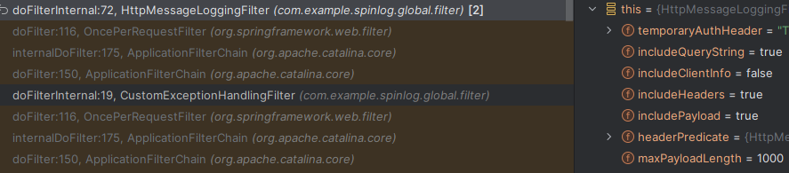

## 필터 관련 문제 두가지

### 개요

1. 커스텀 필터를 추가했는데, doFilterInternal 메서드가 두번 호출된다.
2. 첫번째로 호출되는 필터에만 order가 세팅되어 있고, 로깅 관련 설정은 두번쨰로 호출되는 필터에만 세팅되어 있다.  
   
   

> 해당 필터는 AbstractRequestLoggingFilter 클래스를 상속받은 클래스로  
> 로그 관련 기능을 수행하는 필터이다.

### 원인

ApplicationFilterChain에 등록된 필터 목록을 보니  
내가 만든 필터가 두번 등록되어 있었다.

첫번째는 Config 파일에서 RegistrationBean을 통해 추가한 필터이고,  
두번째는 직접 추가된 필터인 것으로 확인된다.

이를 보고 해당 필터를 어떻게 스프링 빈으로 등록했는지 확인해보니,  
@Bean, @Component를 동시에 사용하고 있었다.

> 첫번째 필터에만 order가 세팅되어 있고,  
> 두번째 필터에만 로깅 관련 필드가 세팅되어 있는 이유
> 
> 첫번째 필터는 @Bean을 통해 등록했는데 이때 order를 세팅했다.
> 그리고 로깅 관련 필드는 해당 필터 클래스 내부에서 @PostConstruct 를 통해 설정했는데,  
> 해당 메서드는 모든 스프링 빈들이 등록된 이후에 해당 클래스의 필드를 세팅하기 때문에  
> 두번째 필터에만 세팅이 되어 있었던 것이다.

### 해결 방법

결국 @Bean or @Component 둘 중 하나를 삭제해야 한다.

내가 원하는 건 필터의 순서를 위한 order를 세팅하는 것이기 때문에,  
@Component를 삭제하는 것으로 결정했다.

> 로깅 관련 필드 설정은  
> @PostConstruct 를 이용하지 않고,  
> 빈을 등록할 때, 해당 메서드를 직접 호출하는 것으로 해결했다.

위 문제는 인텔리제이 디버깅 덕분에 그나마 빠르게 해결할 수 있었다.

> 위 문제를 해결하면서,  
> 스프링 시큐리티에서 이용하는 필터는  
> DelegateFilterProxyRegistrationBean을 통해 등록하는 것을 알게 됐다.  
> 그리고 해당 필터의 order는 default로 -100 인 것을 알게 됐다.