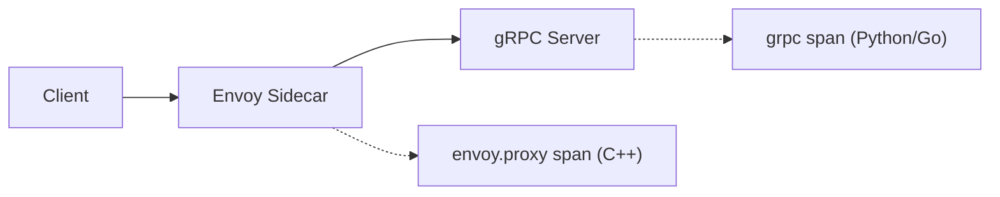

# Datadog MCP 사용법

Claude Code에서 Datadog MCP를 활용하는 방법을 정리한다.

> Datadog 공식 MCP는 아직 Preview 단계로 트레이스 조회 기능이 제한적이다. 여기서는 커뮤니티 MCP([winor30/mcp-server-datadog](https://github.com/winor30/mcp-server-datadog))를 사용한다.

---

## 사용 가능한 기능

| 카테고리 | 도구 | 설명 |
|---|---|---|
| Monitors | `get_monitors` | 모니터 목록 조회 (이름, 태그, 상태 필터) |
| Metrics | `query_metrics` | 메트릭 타임시리즈 쿼리 |
| APM | `list_traces` | 트레이스 조회 |
| Dashboards | `list_dashboards`, `get_dashboard` | 대시보드 조회 |
| Hosts | `list_hosts`, `mute_host`, `unmute_host` | 호스트 관리 |
| Incidents | `list_incidents`, `get_incident` | 인시던트 조회 |
| Downtimes | `list_downtimes`, `schedule_downtime`, `cancel_downtime` | 다운타임 관리 |
| RUM | `get_rum_events`, `get_rum_page_performance` | Real User Monitoring |
| Logs | `get_logs`, `get_all_services` | 로그 조회 (Datadog Logs 사용 시) |

---

## 트레이스 조회

### 기본 사용법

`list_traces`는 Unix timestamp(초 단위)를 사용한다.

```bash
# 현재 timestamp 확인
date +%s
# 예: 1764994838 (2025-12-06 기준)
```

잘못된 연도의 timestamp를 사용하면 빈 결과가 반환되므로 주의해야 한다.

### 트레이스 구조 (Istio 환경)

Istio 서비스 메시 환경에서는 하나의 요청에 두 개의 span이 생성된다:



| span | 위치 | 측정 범위 |
|---|---|---|
| envoy.proxy | Istio sidecar | 전체 요청 시간 (네트워크 포함) |
| grpc | 애플리케이션 내부 | 순수 비즈니스 로직 |

두 span은 같은 traceId를 공유하며, grpc span의 parentId가 envoy.proxy span의 spanId이다.

예시:
- envoy.proxy: 16.2ms (전체)
- grpc: 11.5ms (비즈니스 로직)
- 차이 4.7ms: Envoy 프록시 오버헤드

---

## 모니터 조회

### 상태별 필터링

```
# alert 또는 warn 상태인 모니터만 조회
groupStates: ["alert", "warn"]
```

### 제한사항

- 현재 시점의 모니터 상태만 조회 가능
- 과거 시점의 모니터 상태 조회 불가 (from/to 파라미터 없음)
- 모니터 생성/수정 불가

---

## 지원하지 않는 기능

- 모니터 생성/수정
- 과거 모니터 상태 조회
- SLO 조회
- Events API
