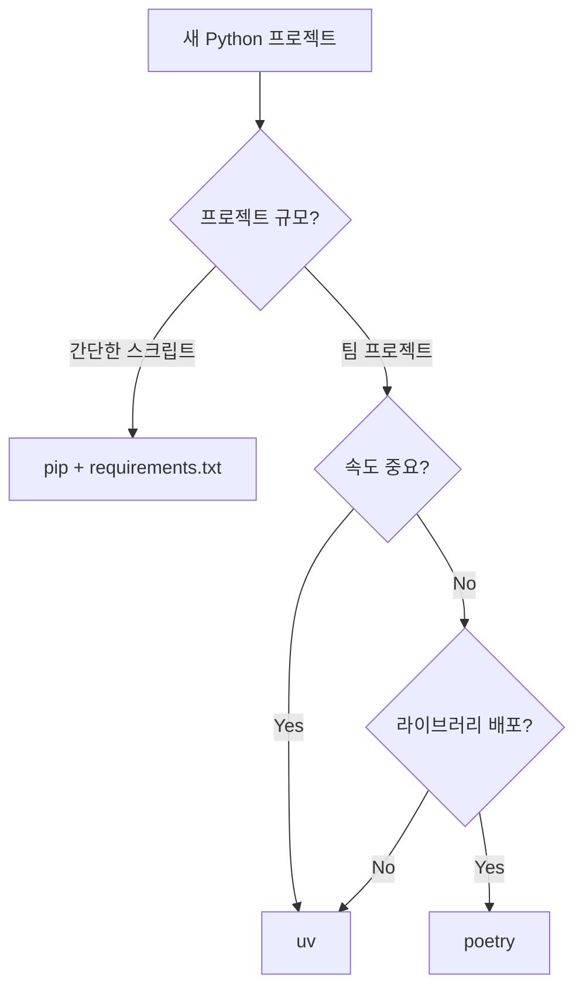

# Python 패키지 관리 도구 비교 (pip, poetry, uv)

## 개요

2025년 기준 Python 패키지 관리 도구 3가지를 비교한다.

| 도구 | 출시 | 언어 | 월간 다운로드 (2025.12) |
|------|------|------|------------------------|
| pip + requirements.txt | 2008년 | Python | (기본 도구) |
| poetry | 2018년 | Python | 61.6M |
| uv | 2024년 2월 | Rust | 80.7M |

## pip + requirements.txt

### 사용 방법

```bash
# 가상환경 생성
python -m venv .venv
source .venv/bin/activate

# 패키지 설치
pip install requests pandas

# 의존성 저장
pip freeze > requirements.txt

# 의존성 설치 (다른 환경)
pip install -r requirements.txt
```

### 파일 구조

```
project/
├── requirements.txt    # 의존성 목록
└── .venv/              # 가상환경 (수동 생성)
```

### requirements.txt 예시

```
requests==2.31.0
pandas==2.0.0
numpy==1.24.0
```

### 장점

- 단순함, 별도 도구 설치 불필요
- Python 기본 제공
- 가벼운 스크립트/일회성 작업에 적합

### 단점

- 의존성 충돌 자동 해결 안 됨
- lock 파일 없음 (하위 의존성 버전 고정 불가)
- Python 버전 관리 별도 필요 (pyenv)

## poetry

### 사용 방법

```bash
# 설치
curl -sSL https://install.python-poetry.org | python3 -

# 프로젝트 생성
poetry new my-project
cd my-project

# 또는 기존 프로젝트에서 초기화
poetry init

# 패키지 추가
poetry add requests pandas
poetry add --group dev pytest ruff

# 설치
poetry install

# 실행
poetry run python main.py
poetry run pytest
```

### 파일 구조

```
project/
├── pyproject.toml    # 의존성 정의
├── poetry.lock       # 정확한 버전 고정
└── .venv/            # 가상환경 (자동 생성)
```

### pyproject.toml 예시

```toml
[tool.poetry]
name = "my-project"
version = "0.1.0"

[tool.poetry.dependencies]
python = "^3.10"
requests = "^2.31.0"
pandas = "^2.0.0"

[tool.poetry.group.dev.dependencies]
pytest = "^7.0.0"
ruff = "^0.1.0"
```

### 장점

- lock 파일로 재현 가능한 빌드
- 의존성 충돌 자동 해결
- dev/prod 의존성 그룹 분리
- PyPI 배포 기능 내장
- 7년간 검증된 안정성

### 단점

- pip보다 느림
- Python 버전 관리 없음 (pyenv 필요)
- 독자 포맷 사용 (Poetry 2.0에서 PEP 621 지원 추가)

## uv

### 사용 방법

```bash
# 설치
curl -LsSf https://astral.sh/uv/install.sh | sh

# 프로젝트 생성
uv init my-project
cd my-project

# Python 버전 지정
uv python install 3.12
echo "3.12" > .python-version

# 패키지 추가
uv add requests pandas
uv add --dev pytest ruff

# 설치
uv sync

# 실행
uv run python main.py
uv run pytest
```

### 파일 구조

```
project/
├── pyproject.toml    # 의존성 정의 (PEP 621)
├── uv.lock           # 정확한 버전 고정
├── .python-version   # Python 버전
└── .venv/            # 가상환경 (자동 생성)
```

### pyproject.toml 예시

```toml
[project]
name = "my-project"
version = "0.1.0"
requires-python = ">=3.12"
dependencies = [
    "requests>=2.31.0",
    "pandas>=2.0.0",
]

[dependency-groups]
dev = [
    "pytest>=7.0.0",
    "ruff>=0.1.0",
]
```

### 장점

- pip 대비 10-100배 빠름 (Rust 구현)
- Python 버전 관리 내장 (pyenv 불필요)
- 단일 바이너리 (Python 없이 설치 가능)
- pip/venv/pyenv 통합 대체
- PEP 621 표준 준수

### 단점

- 2년 미만 신생 도구
- API 자주 변경됨
- VC 기업 소유 (향후 수익화 우려)

## pip에서 uv로 마이그레이션

```bash
# 기존 requirements.txt 유지하면서 uv 속도만 사용
uv pip install -r requirements.txt

# 완전 마이그레이션
uv init
uv add -r requirements.txt
# requirements.txt 삭제 가능
```

## 비교 요약



| 기준 | pip | poetry | uv |
|------|-----|--------|-----|
| 설치 속도 | 느림 | 보통 | 빠름 |
| 의존성 충돌 해결 | 수동 | 자동 | 자동 |
| lock 파일 | 없음 | 있음 | 있음 |
| Python 버전 관리 | 없음 | 없음 | 있음 |
| 학습 곡선 | 낮음 | 중간 | 낮음 |
| 안정성 | 높음 | 높음 | 중간 |

## 선택 가이드

- 간단한 스크립트, 일회성 작업: pip + requirements.txt
- 새 프로젝트, 빠른 개발: uv
- 라이브러리 배포, 장기 유지보수: poetry
- 기존 poetry 프로젝트: poetry 유지
