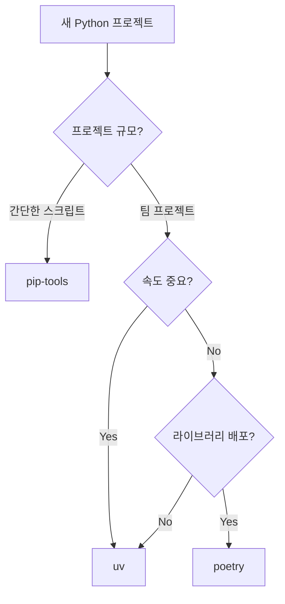

# Python 패키지 관리 도구 비교 (pip-tools, poetry, uv)

## 개요

2025년 기준 Python 패키지 관리 도구 3가지를 비교한다.

| 도구 | 출시 | 언어 | 특징 |
|------|------|------|------|
| pip-tools | 2014년 | Python | pip 확장, lock 파일 도입 |
| poetry | 2018년 | Python | 올인원 패키지 매니저 |
| uv | 2024년 2월 | Rust | 차세대, pip/venv/pyenv 통합 대체 |

## pip-tools (requirements.in)

pip의 단점을 보완한 도구. lock 파일 개념을 도입했다.

### 사용 방법

```bash
# 설치
pip install pip-tools

# 가상환경 (직접 생성)
python -m venv .venv
source .venv/bin/activate

# requirements.in 작성
cat > requirements.in << EOF
requests
pandas
EOF

# lock 파일 생성
pip-compile requirements.in

# 설치
pip-sync requirements.txt

# 패키지 추가 시
echo "fastapi" >> requirements.in
pip-compile requirements.in
pip-sync requirements.txt
```

### 파일 구조

```
project/
├── requirements.in      # 내가 작성 (패키지 목록)
├── requirements.txt     # 자동 생성 (lock 파일)
├── requirements-dev.in  # dev용 (선택)
├── requirements-dev.txt # dev lock (선택)
└── .venv/               # 수동 생성
```

### 장점

- pip 기반이라 익숙함
- 학습 곡선 거의 없음
- 가볍고 단순함
- 기존 인프라와 호환

### 단점

- 패키지 추가마다 파일 편집 필요
- dev/prod 분리 불편 (파일 여러 개)
- 의존성 충돌 해결 능력 제한적
- Python 버전 관리 별도 (pyenv 필요)
- 느림

## poetry

### 사용 방법

```bash
# 설치
curl -sSL https://install.python-poetry.org | python3 -

# 프로젝트 생성 (가상환경 자동)
poetry new my-project && cd my-project

# 패키지 추가 (lock 자동 갱신)
poetry add requests pandas
poetry add --group dev pytest ruff

# 설치
poetry install

# 실행
poetry run python main.py
```

### 파일 구조

```
project/
├── pyproject.toml    # 의존성 + 프로젝트 설정
├── poetry.lock       # lock 파일
└── .venv/            # 자동 생성
```

### pyproject.toml 예시

```toml
[tool.poetry]
name = "my-project"
version = "0.1.0"

[tool.poetry.dependencies]
python = "^3.10"
requests = "^2.31"
pandas = ">=2.0"

[tool.poetry.group.dev.dependencies]
pytest = "^7.0"
ruff = "^0.1"
```

### 장점

- 올인원 (의존성 + 빌드 + 배포)
- dev/prod 그룹 분리 깔끔
- PyPI 배포 내장
- 7년간 검증된 안정성

### 단점

- pip-tools/uv보다 느림
- Python 버전 관리 없음 (pyenv 필요)
- 설정이 복잡할 수 있음

## uv

### 사용 방법

```bash
# 설치 (Python 없이도 가능)
curl -LsSf https://astral.sh/uv/install.sh | sh

# 프로젝트 생성 (가상환경 자동)
uv init my-project && cd my-project

# Python 버전 지정 (내장 기능)
uv python install 3.12
echo "3.12" > .python-version

# 패키지 추가 (lock 자동 갱신)
uv add requests pandas
uv add --dev pytest ruff

# 설치
uv sync

# 실행
uv run python main.py
```

### 파일 구조

```
project/
├── pyproject.toml    # 의존성 + 프로젝트 설정
├── uv.lock           # lock 파일
├── .python-version   # Python 버전
└── .venv/            # 자동 생성
```

### pyproject.toml 예시

```toml
[project]
name = "my-project"
version = "0.1.0"
requires-python = ">=3.10"
dependencies = [
    "requests>=2.31",
    "pandas>=2.0",
]

[dependency-groups]
dev = ["pytest>=7.0", "ruff>=0.1"]
```

### 장점

- 10-100배 빠름 (Rust)
- Python 버전 관리 내장
- pip/venv/pyenv 통합 대체
- PEP 621 표준 준수

### 단점

- 2년 미만 신생 도구
- API 자주 변경됨
- VC 기업 소유 (수익화 우려)

## 명령어 비교

| 작업 | pip-tools | poetry | uv |
|------|-----------|--------|-----|
| 프로젝트 생성 | (수동) | `poetry new` | `uv init` |
| 패키지 추가 | 파일 편집 → `pip-compile` | `poetry add pkg` | `uv add pkg` |
| dev 추가 | 별도 파일 | `poetry add -G dev pkg` | `uv add --dev pkg` |
| lock 생성 | `pip-compile` | `poetry lock` | `uv lock` |
| 설치 | `pip-sync` | `poetry install` | `uv sync` |
| 실행 | `python` | `poetry run python` | `uv run python` |
| Python 설치 | pyenv 필요 | pyenv 필요 | `uv python install` |

## pip-tools에서 uv로 마이그레이션

```bash
uv init
uv add -r requirements.in
rm requirements.in requirements.txt
```

## 비교 요약



| 기준 | pip-tools | poetry | uv |
|------|-----------|--------|-----|
| 설치 속도 | 느림 | 보통 | 빠름 |
| 의존성 충돌 해결 | 제한적 | 자동 | 자동 |
| lock 파일 | 있음 | 있음 | 있음 |
| Python 버전 관리 | 없음 | 없음 | 있음 |
| 학습 곡선 | 낮음 | 중간 | 낮음 |
| 안정성 | 높음 | 높음 | 중간 |
| PyPI 배포 | 없음 | 있음 | 없음 |

## 선택 가이드

- 기존 pip 워크플로우 유지: pip-tools
- 새 프로젝트, 빠른 개발: uv
- 라이브러리 배포, 장기 유지보수: poetry
- 기존 pip-tools 프로젝트: uv로 마이그레이션 추천
- 기존 poetry 프로젝트: poetry 유지
