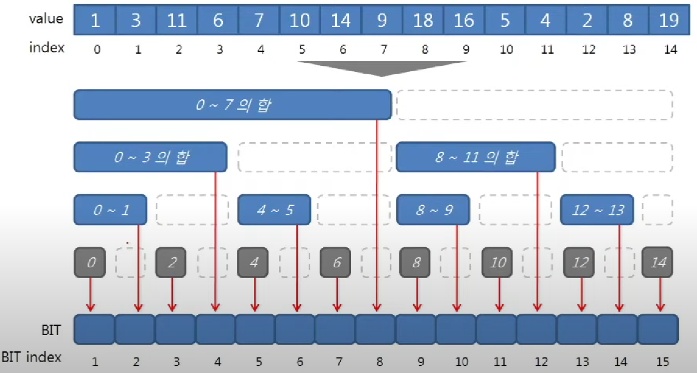
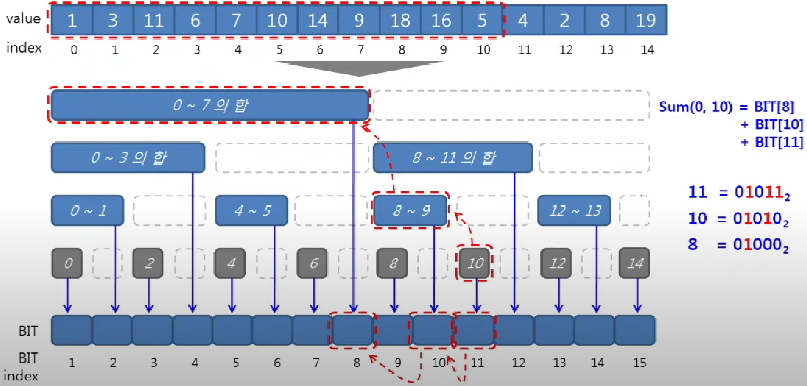
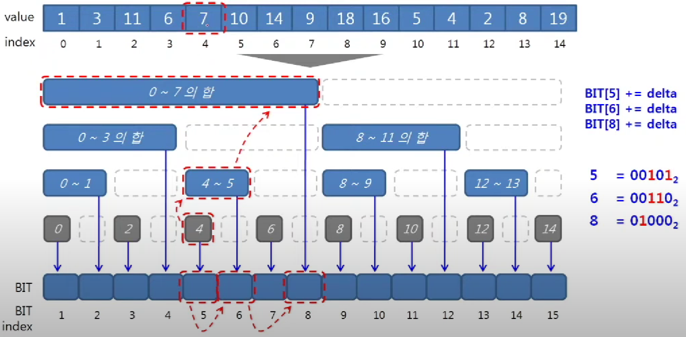

# 팬윅 트리(Fenwick Tree)

누적합(prefix sum)을 이용한 자료 구조
그리고 bit 연산을 이용한 자료 구조이다.

> 2번 부터 4번까지의 합은  
> 0번부터 4번까지의 합 - 0번부터 1번까지의 합  
> 이다.
> 
> 이를 이용한 자료 구조

> BIT(Binary Indexed Tree)를 팬윅트리라고도 부른다.
> 
> 그래서 BIT는 팬윅 트리를 의미하고,  
> bit는 1 bit를 의미한다.

---

## 팬윅 트리의 구조



위처럼 prefix sum을 배열에 저장한다.

---

## 누적 합(Prefix Sum)



(그림은 0부터 N-1로 나와있지만 편의상 1부터 N까지라고 가정하겠다)

1번부터 11번까지의 합을 구한다면  
bit[11] + bit[10] + bit[8] 을 반환하면 된다.

이때 특징이 있는데,  
2진수로  
11 = 01011  
10 = 01010  
8  = 01000  
이다.

11부터 시작해서 맨 끝 1을 빼주면 11->10->8 순서로 탐색할 수 있다.

```pos &= pos-1;```  
위 코드를 통해 (2진수의) 맨 끝 1을 빼줄 수 있다.

### 누적 합 코드

```
int prefixSum(int pos){
    assert(0 < pos && pos <= N);
    
    int result = 0;
    while(pos > 0){
        result += node[pos];
        pos &= pos - 1; // 최하위 bit clear
    }
    
    return result;
}
```

> 시간복잡도는 O(logn)이다.

---

> 구간 합도 누적 합을 이용해 쉽게 구할 수 있다.  
> ```rangeSum(5,11) = prefixSum(11) - prefixSum(4);```

---

## 특정 원소 업데이트

특정 원소를 업데이트 해주면,  
이 원소를 포함하는 prefix sum을 모두 업데이트 해줘야 한다.




5번 원소를 업데이트 한다면,  
6번(4-5)과 8번(0-7)도 업데이트 해줘야 한다.

5 = 00101
6 = 00110
8 = 01000

맨 끝 원소에 1씩 더해주면 5->6->8 순서로 탐색할 수 있다.

```pos += pos & -pos;``` (pos & -pos = 맨 끝 1만 남음)  
위 코드를 통해 (2진수의) 맨 끝에 1씩 더해줄 수 있다.

### 특정 원소 업데이트 코드

```
void add(int pos, int delta){
    assert(0 < pos && pos <= N);
    
    while(pos < node.size()){
        node[pos] += delta;
        pos += pos & -pos; // 최하위 bit를 더함
    }
}
```

---

## Fenwick Tree vs Segment Tree

간단하게 말하면  
`팬윅 트리는 최적화, 세그먼트 트리는 범용성`

세그먼트 트리는 구간 합 뿐만 아니라,  
최솟값, 최댓값, gcd, lcm 등 다양한 케이스에서 사용 가능하다는 장점이 있지만,  
팬윅 트리에 비해 메모리 사용량이 높고, 구현이 복잡하다는 단점이 있다.

팬윅 트리는  
세그먼트 트리보다 메모리 사용량이 적다는 장점이 있지만,  
다양한 케이스에서 사용하지 못한다는 단점이 있다.  

> 그런데 팬윅 트리로도 최소값 최댓값 찾는 자료 구조를 만들 수 있다고 한다.
> (어쨌든 범용성은 세그먼트 트리가 좋다)

