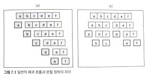
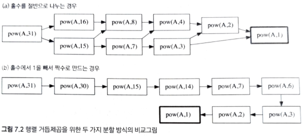
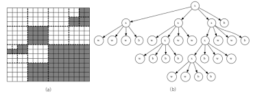
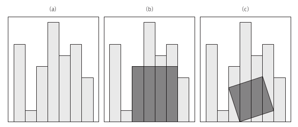

언제 Divide & Conquer 알고리즘을 적용할 수 있을까?

    언제 쓰라는게 아니라, 이런 유형의 문제들은 분할 정복 알고리즘으로 접근해보면 좋다.
    이런게 궁금한 것

-> 하나의 큰문제를 유형이 비슷하고 작은 여러 문제들로 분할할 수 있을 때? 그리고 이 작은 문제들을 독립적으로 해결할 수 있을 때?

# 7. 분할 정복

## 7.1 도입

분할 정복(Divide & Conquer)은 가장 유명한 알고리즘 디자인 패러다임으로, 각개 격파라는 말로 간단히 설명할 수 있습니다.

분할 정복 패러다임을 차용한 알고리즘들은 주어진 문제를 둘 이상의 부분 문제로 나눈 뒤 각 문제에 대한 답을 재귀 호출을 이용해 계산하고, 각 부분 문제의 답으로부터 전체 문제의 답을 계산해 냅니다.

분할 정복이 일반적인 재귀 호출과 다른 점은 문제를 한 조각과 나머지 전체로 나누는 대신 거의 같은 크기의 부분 문제로 나누는 것입니다.



(a)가 일반적인 재귀 호출(한 조각과 나머지 조각으로 나눔)이고<br>
(b)가 분할 정복의 예(항상 절반씩 나눔)입니다.

---

분할 정복을 사용하는 알고리즘들은 대게 세 가지의 구성 요소를 갖고 있습니다.

    문제를 더 작은 문제로 분할하는 과정(divide)
    각 문제에 대해 구한 답을 원래 문제에 대한 답으로 병합하는 과정(merge)
    더이상 답을 분할하지 않고 곧장 풀 수 있는 매우 작은 문제(base case)

분할 정복을 적용해 문제를 해결하기 위해서는, <br>
1 - 문제를 둘 이상의 부분 문제로 나누는 자연스러운 방법이 있어야 하며<br>
2 - 부분 문제의 답을 조합해 원래 문제의 답을 계산하는 효율적인 방법이 있어야 합니다.

분할 정복은 많은 경우 같은 작업을 더 빠르게 처리해 줍니다.

---

`예제: 수열의 빠른 합과 행렬의 빠른 제곱`

초항이 1이고 공차가 1인 등차수열의 합을 빠르게 구하는 방법

fastSum(n) = 1+2+3+ ... +n = (1+2+ ... +n/2) + ((n/2+1) + ... + n)

여기서 <br>
((n/2+1) + ... + n) = (n/2+1) + (n/2+2) + ... + (n/2+n/2)<br>
=n/2*n/2 + (1+2+3+ ... +n/2) = n/2*n/2 + fastSum(n/2)

따라서 $fastSum(n) = 2*fastSum(n/2) + n^2/4$

이를 코드로 구현하면

```java
int fastSum(int n){
    if(n == 1) return 1;
    if(n%2 == 1) return fastSum(n-1) + n;
    return 2*fastSum(n/2) + n/2*n/2;
}
```

시간복잡도: $O(lgn)$

O(n)이 O(lgn)으로 줄었다.

---

`예제: 행렬의 거듭제곱`

행렬 A의 거듭제곱인 $A^m$을 구한다고 할때 시간복잡도는 $O(n^3*m)$이 걸린다.

    행렬의 곱셈의 가장 단순한 알고리즘은 O(n^3)의 시간이 든다.
    (스트라센의 행렬 곱 알고리즘 같은 효율적인 알고리즘도 있다)

이를 분할 정복을 이용하면 빠르게 구할 수 있습니다.

여기서 중요한 법칙이 있습니다.

$A^m = A^{m/2} * A^{m/2}$

이를 코드로 구현하면

```java
SquareMatrix pow(const SquareMatrix& A, int m){
    if(m == 0) return identity(A.size()); // 항등 행렬 반환
    if(m % 2 == 1) return pow(A, m-1) * A;
    SquareMatrix half = pow(A, m/2);

    return half*half;
}
```

시간복잡도: $O(n^3 * lgm)$

`주의할 점`

m이 홀수일때, $A^m$을 $A^m*A$로 나누지 않고 바로 절반으로 나눌수도 있다.

$A^m = A^{(m-1)/2} * A^{(m+1)/2}$

하지만 이렇게 하면 분할정복의 이점을 버리게 된다.



(a)처럼 바로바로 절반으로 나누면, base case까지 더 빨리 도달하지만, 같은 케이스가 반복적으로 호출되면서, 같은 값을 중복으로 계산하는 일이 많아진다.<br>
(pow(A,4)는 모두 세번 호출된다)<br>
-> overlapping subproblems(부분문제가 계속 겹친다)

    DP를 이용하면 (a)가 (b)보다 더 빠를수도 있다.

---

`예제: 병합 정렬과 퀵 정렬`

병합 정렬과 퀵 정렬도 분할 정복을 이용하는 알고리즘

merge sort : 주어진 수열을 가운데에서 쪼개 비슷한 크기의 수열 두 개로 만든 뒤 이들을 재귀 호출을 이용해 각각 정렬. 그 후 정렬된 배열을 하나로 합침으로써 정렬된 전체 수열을 얻는다.

quick sort : 한쪽의 배열에 포함된 수가 다른 쪽 배열의 수보다 항상 작도록 배열을 분할. partition이라고 부르는 단계 도입(배열에 있는 수 중 임의의 pivot(기준 수)를 지정하고 기준보다 작거나 같은 숫자를 왼쪽, 더 큰 숫자를 오른쪽으로 보냄)

merge sort는 병합 과정에서 O(n)의 시간복잡도를 가진다.

quick sort는 분할 과정에서 O(n)의 시간복잡도를 가진다.

best case, avg case에서 시간복잡도: 둘다 O(nlgn)

worst case에서 시간복잡도: merge sort - O(nlgn), quick sort - O(n^2)

---

`예제: 카리츠바의 빠른 곱셈 알고리즘`

---

## 7.2 문제: 쿼드 트리 뒤집기



모든 픽셀이 검은 색일 경우, 이 그림의 쿼드 트리 압축 결과는 크기에 관계없이 b

모든 픽셀이 흰 색일 경우, 이 그림의 쿼드 트리 압축 결과는 크기에 관계없이 w

모든 픽셀이 같은 색이 아니라면, 가로 세로로 각각 2등분 즉 4개의 조각으로 쪼갠뒤 각각을 쿼드트리로 압축한다. <br>
이때 전체 그림의 압축 결과는 x(왼쪽위 결과)(오른족위 결과)(왼쪽아래 결과)(오른쪽아래 결과)

쿼드 트리 압축 결과가 주어졌을때, 이를 상하로 뒤집은 그림의 결과를 쿼드 트리 압축 결과로 반환하라

---

## 7.3 풀이: 쿼드 트리 뒤집기

쿼드트리 압축 결과를 풀고, 상하반전후, 다시 압축해서 결과를 구하는건 너무 오래걸린다.

`압축 다 풀지 않고 뒤집기`

쿼드 트리의 압축 결과가 1234라면, 상하반전의 결과는 3412이다.

이를 코드로 구현

```cpp
int offset = -1; // 재귀 함수의 공유변수

string reverse(string& board){
    offset++;

    if(board[offset] != 'x'){ // 다 같은 색
        return "" + board[offset]; // 그냥 편하게 썼음
    }

    char leftUp, rightUp, leftDown, rightDown;
    leftUp = reverse(board);
    rightUp = reverse(board);
    leftDown = reverse(board);
    rightDown = reverse(board);

    return "x" + leftDown + rightDown + leftUp + rightUp; // 그냥 편하게 썼음
    // 문자열 이렇게 다루는건 비효율적
}
```

---

## 7.4 문제: 울타리 잘라내기

막대의 개수가 n인 막대그래프가 주어졌을때, 막대그래프에서 구할 수 있는 직사각형의 최대 넓이를 구하는 문제



(c)는 안됨 (b)처럼 딱 맞아야함

---


## 7.5 풀이: 울타리 잘라내기

`분할 정복 알고리즘 설계`

우리가 찾는 직사갹형은 다음 세가지 중 하나에 속할 겁니다.

(절반으로 나눴을때)<br>
1 - 가장 큰 직사각형을 왼쪽 부분 문제에서만 잘라낼 수 있다.<br>
2 - 가장 큰 직사각형을 오른쪽 부분 문제에서만 잘라낼 수 있다.<br>
3 - 가장 큰 직사각형은 왼쪽 부분 문제와 오른쪽 부분문제에 걸쳐 있다.

`양쪽 부분 문제에 걸친 경우의 답`

가운데 좌표에서 출발 -> 양쪽의 높이를 비교한다. 더 높은 쪽으로 좌표를 옮김(투포인터) -> 현재 높이가 가장 낮은 값과 가로를 곱한게 현재 직사각형의 넓이

위 과정을 반복하면서 직사각형의 최대값을 찾는다.

`정당성 증명`

각 단계마다 더 높은 쪽을 택하는 것이 항상 옳은지를 보여야 한다.

    귀류법으로 증명한다는데, 이건 잘 이해가 안됨

---

## 7.6 문제: 팬미팅

위 카리츠바의 빠른 곱셈 알고리즘을 공부하고 나중에...


