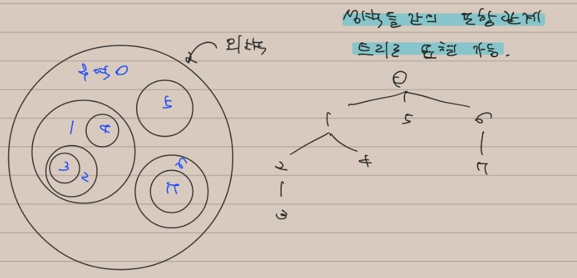

# 21 트리

선형적으로 표현하기 어려운 형태의 자료 중 흔한 것으로 계층 구조가 있습니다. 
> 회사 조직도, 월드컵 대진표 등

계층적 구조를 갖는 자료를 표현하기 위한 자료 구조가 바로 트리(tree)입니다.

이 장에서는 현실 세계의 계층 구조를 트리로 구현하고 다루는 방법들을 소개합니다.

    트리의 재귀적 속성

    트리가 유용하게 사용되는 큰 이유 중 하나는 트리가 재귀적인 성질을 갖고 있다는 것입니다.
    이 속성 때문에 트리를 다루는 코드들은 대개 재귀 호출을 이용해 구현됩니다.

## 21.2 트리의 순회

자료구조의 가장 기초적인 연산 중 하나는 포함되어 있는 자료를 전부 순회하는 것입니다.

이를 위해서는 트리의 재귀적 속성을 이용해야 합니다.

    모든 트리는 각 자식들을 루트로 하는 서브트리와 루트로 나눌 수 있으므로, 트리의 루트가 주어질 때 루트를 '방문'한 뒤 각 서브트리를 재귀적으로 방문하는 함수르 만들어 트리의 모든 노드를 순회할 수 있습니다.

```cpp
class TreeNode{
    string data;
    vector<TreeNode*> children;
}

void printTreeData(TreeNode* root){
    cout<<root->data<<'\n';

    for(int i=0;i<root->children.size();i++)
        printTreeData(root->children[i]);
}

// appendix: 트리의 높이 구하기
int height(TreeNode* root){
    int h=0;
    for(int i=0;i<root->children.size();i++)
        h = max(h, 1 + height(root->children[i]));
    return h;
}
```

## 21.3 문제: 트리 순회 순서 변경

이진트리는 순회 방식이 3가지가 있다.
1. 전위순회(preorder traverse) - 중왼오
2. 중위순회(inorder traverse) - 왼중오
3. 후위순회(postorder traverse) - 왼오중

(항상 왼쪽에서 오른쪽으로, 중이 어디있는지로 갈림)

전위순회와 중위순회의 결과가 주어졌을때 이를 후위순회로 출력하는 프로그램을 작성하라

## 21.4 풀이: 트리 순회 순서 변경

이 문제는 얼핏 보기엔 까다로워 보이지만 재귀 호출을 이용하면 아주 간단하게 구현할 수 있습니다.

printPostOrder(preorder[], inorder[]) = 트리의 전위순회순서 preorder[]와 중위순회순서 inorder[]가 주어질때, 후위순회순서를 출력한다.

전위순회는 중왼오 - 맨앞이 루트노드이다.<br>
전위순회에서 찾은 루트노드를 가지고, 중위순회에서 루트노드를 찾는다.<br>
중위순회에서 루트노드를 기준으로, 이전노드들은 왼쪽서브트리이고, 다음노드들은 오른쪽서브트리이다.

    전위순회 - (루트노드) (왼쪽서브트리) (오른쪽서브트리)
    중위순회 - (왼쪽서브트리) (루트노드) (오른쪽서브트리)

찾은 서브트리를 다시 재귀호출하면 구현 가능하다.

```cpp
void printPostOrder(const vector<int>& preorder, const vector<int>& inorder){
    if(preorder.empty()) return;

    const int N = preorder.size();
    // 전위순회에서 첫번쨰 원소가 루트노드
    const int root = preorder[0];
    // 중위순회에서 루트노드의 위치(=왼쪽서브트리의 크기)를 찾는다.
    const int L = find(inorder.begin(), inorder.end(), root) - inorder.begin();

    const int R = N - 1 -L;

    // slice는 두번째원소의 위치부터 세번쨰원소의 위치전까지 잘라주는 함수라고 가정
    printPostOrder(slice(preorder, 1, L+1), slice(inorder, 0, L));
    printPostOrder(slice(preorder, L+1, N), slice(inorder, L+1, N));

    cout<<root<<'\n';

    // 왼오중으로 출력됨
}
```

## 21.5 문제: 요새

요새는 원 모양의 방벽을 갖고 있다.

n개의 요새의 (x,y)위치와 반지름의 크기가 주어졌을때, 요새 내에서 서로 왕래하는데 성벽을 가장 많이 넘어야 하는 두 지점의 사이의 성벽의 개수를 구하라.

## 21.6 풀이: 요새

이 문제는 언뜻 보면 트리와 별 관계가 없어 보이지만, 성벽들은 서로 닿거나 겹치지 않는다는 조건에 주목하면 성이 계층적 구조로 구성되어 있음을 알 수 있습니다.

    성벽들은 서로 닿거나 겹치지 않는다 -> 트리의 자식노드들은 오직 하나의 부모노드만을 가진다
    라고 생각할 수 있음(개인적인 생각)

따라서 성벽들 간의 포함 관계를 트리로 나타내어 문제를 풀어봅시다.



(https://velog.io/@sunjoo9912/%EC%A2%85%EB%A7%8C%EB%B6%81-21%EC%9E%A5-%ED%8A%B8%EB%A6%AC%EC%9D%98-%EA%B5%AC%ED%98%84%EA%B3%BC-%EC%88%9C%ED%9A%8C 해당 사이트 이미지 참조)

이렇게 트리를 구성하고 나면, 한 구역에서 인접한 다른 구역으로 가기 위해 성벽을 넘는 일은 이 트리에서 간선을 따라 다른 노드로 옮겨가는 것으로 대응됩니다.

-> 트리에서 가장 멀리 떨어진 두 노드를 찾는 문제가 됩니다.

`트리에서 가장 긴 경로 찾기`

최장 경로 문제를 푸는 열쇠는 최장 경로의 양 끝 노드가 항상 `루트노드` 혹은 `잎노드`여야 함을 깨닫는 것입니다.

    예를 들어 내부노드(inner node)가 경로의 끝점이라고 가정합시다.
    그런데, 내부노드는 항상 두개 이상의 간선과 연결되어 있습니다. 따라서 내부노드에서 경로가 끝나는 경우 연결된 간선 중 최소한 하나는 사용되지 않은 채 남아있게 됩니다.
    이를 이용하면 더 긴 경로를 만들 수 있기 때문에, 원래 주어진 경로는 최장경로일 수 없습니다.

따라서 최장 경로의 길이는 다음 둘 중 더 큰 값이 됩니다.
1. 가장 긴 루트-잎 경로의 길이
2. 가장 긴 잎-잎 경로의 길이

루트-잎 경로는 트리의 높이를 구하는 경우 - 쉽게 구할 수 있음

잎-잎 경로를 구할 때, 두 잎 노드는 중간에서 항상 같은 부모 노드를 거친다.(이게 루트노드일 수 있음)

따라서 각 서브트리의 높이를 구한 뒤, 가장 높은 두개의 서브트리를 선택하면 가장 긴 잎-잎 경로를 구할 수 있다.

```cpp
int longest = 0;

// 트리의 높이를 반환하면서, 해당 트리에서 가장 긴 길이를 longest에 저장함
int height(TreeNode* root){
    vector<int> heights;
    for(int i=0;i<root->children.size();i++)
        heights.push_back(height(root->children[i]));

    if(heights.empty()) return 0;
    sort(heights.begin(), heights.end());

    if(heights.size() >= 2)
        longest = max(longest, 
            2 + heights[heights.size()-1] + heights[heights.size()-2]);
    
    return heights.back()+1;
}

int solve(TreeNode* root){
    longest = 0;
    int h = height(root);
    // 루트-잎 경로 길이(트리의 높이)와 잎-잎 경로 길이 중 큰걸 반환
    return max(longest, h);
}
```

`실제 구현` - 책 참조(입력으로부터 트리를 생성하는 과정)


---

### 내 생각 정리

트리의 핵심은 `계층적 구조`

트리를 이용하는 문제는 
1. 문제의 입력 자체가 계층적 구조로 이루어져 있음
2. 문제를 풀때 최적화를 위해 트리를 이용하는 알고리즘을 사용(이진 검색 트리, 우선순위 큐 등)

위 두가지중 하나의 경우이다.

    계층적 구조를 띄는 입력을 트리로 변환하는 응용력도 필요하다