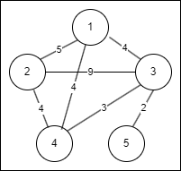

# MST(Minimum Spanning Tree) - Kruscal 알고리즘

> MST 관련 설명은 Prim 알고리즘 페이지에 있음
>
> 바로 크루스칼 알고리즘 설명 들어감

---

## Kruscal 알고리즘

> 해당 알고리즘을 코드로 구현하려면 Union-Find 알고리즘을 알아야함

전체 간선을 탐색하면서 MST를 찾는 알고리즘

## 과정

 1. 모든 간선들의 가중치를 오름차순으로 정렬
 2. 간선을 하나씩 체크하는데, 만약 해당 간선때문에 사이클이 발생한다면 해당 간선은 추가하지 않는다.
     > 사이클을 확인할때 union-find 알고리즘을 사용한다.
 3. 사이클이 발생하지않는다면 해당 간선을 추가한다.
 4. 간선을 추가하는 과정을 n-1번(전체 노드의 개수-1)만큼 반복한다.

## Kruscal 알고리즘 예시



1. 가중치가 가장 낮은 3-5 간선을 추가한다. 가중치 +2 (현재 노드: 3,5 , 가중치: 2)
2. 그 다음으로 가중치가 가장 낮은 3-4 간선을 추가한다. 가중치 +3 (현재 노드: 3,4,5 , 가중치:5)
3. 그 다음으로 가중치가 가장 낮은 1-3 간선을 추가한다. 가중치 +4 (현재 노드: 1,3,4,5 , 가중치:9)
4. 그 다음으로 가중치가 가장 낮은 간선은 1-4 간선인데, 1-4 간선을 추가하면 사이클이 발생하므로, 추가하지 않는다.
5. 그 다음으로 가중치가 가장 낮은 2-4 간선을 추가한다. 가중치 +4 (현재 노드: 1,2,3,4,5 , 가중치:13)

---
## 실제 코드와 시간복잡도


```cpp
int Find(int x) {
	if (x == parent[x]) return x;
	else return parent[x] = Find(parent[x]);
}

parent.resize(v + 1);
for (int i = 1; i <= v; i++) {
    parent[i] = i;
}

int s, f, w;
for (int i = 0; i < e; i++) {
    cin >> s >> f >> w;
    kruscal.push_back({ w,s,f });
}

sort(kruscal.begin(), kruscal.end(), compare);

int result = 0;
int cnt = 0;
int rs, rf;
for (auto& cur : kruscal) {
    rs = Find(cur.s);
    rf = Find(cur.f);
    if (rs == rf) continue; // 해당 간선을 추가하면 사이클 생성됨

    result += cur.w;
    if (rs > rf) parent[rs] = rf;
    else parent[rf] = rs;
    cnt++;

    if (cnt == v - 1) break;
}


```

시간복잡도: $O(elge)$

모든 간선을 정렬하는데 걸리는 시간: $elge$

간선하나씩 탐색하면서 MST만드는 시간: $elge$