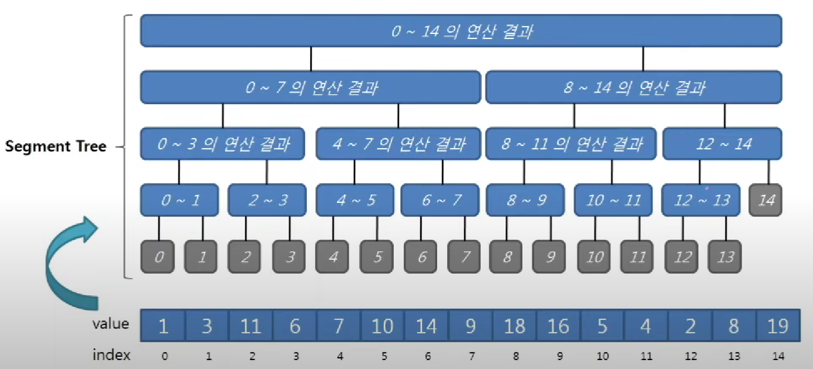

# 세그먼트 트리

> N개의 원소를 가진 배열의 누적 합을 구하는 알고리즘의 시간복잡도는 O(n)이다.
> 
> 누적 합을 한번만 구한다면 문제가 되지 않지만, 
> 계속 특정 범위의 값을 업데이트하고, 또 계속 누적 합을 구한다면
> 
> 누적 합 알고리즘으로 위 문제를 풀었을 때의 시간복잡도는 O(n^2)이 될 것이다.
> 
> 이떄 세그먼트 트리를 이용하면 시간복잡도를 O(nlogn)으로 줄일 수 있다.

## 방법

특정 범위의 원소의 합을 구한다면,  
일일이 더하지 말고,  
2, 4, 8, ..., $2^k$개의 원소를 더한 블록을 저장해놓는다.
이를 이용해 시간복잡도를 줄인다.



> 1 2 3 4 5 6 7 의 합을 구한다.  
> -> 1+2+3+4 5+6 7 합을 저장  
> -> 3번의 연산 만으로 합을 구할 수 있다.
> (이건 그냥 간단한 예시)

$2^k$개의 원소를 더한 블록을 트리의 구조를 이용해 저장한다.


## buildTree - 트리를 만드는 과정

트리를 표현할 벡터의 원소의 개수를 4n개로 설정해준다.(n = 입력 배열의 사이즈)  
(사실 대부분 2n개도 충분하지만, 원소의 개수가 2의 배수가 아닐 때를 생각해서 4n개로 설정해준다고 한다)

```cpp
int SegTree::merge(int a, int b) {
	return a + b; // 지금은 합을 구하는 트리, min이나 max도 가능하다.
}

int SegTree::buildTree(const int arr[], int index, int nodeLeft, int nodeRight) {
	// arr: 입력 원소 배열
	// index: 벡터에서 현재 노드의 번호
	// nodeLeft: 현재 노드가 포함하는 원소의 시작 번호
	// nodeRight: 현재 노드가 포함하는 원소의 마지막 번호
	if (nodeLeft == nodeRight)
		return node[index] = arr[nodeLeft];

	int mid = nodeLeft + (nodeRight - nodeLeft) / 2; // overflow 막는 계산(그냥 더하면 오버플로우 날 수 있음)
	
	int leftSum = buildTree(arr, index * 2, nodeLeft, mid);
	int rightSum = buildTree(arr, index * 2 + 1, mid + 1, nodeRight);
	return node[index] = merge(leftSum, rightSum);
}
```

맨 처음 buildTree를 호출할 때
index = 1 (세그먼트 트리의 root index)  
nodeLeft = 0 (입력 배열의 첫번째 인덱스)  
nodeRight = N-1 (입력 배열의 마지막 인덱스)

---

## query

```cpp
int SegTree::query(int left, int right, int index, int nodeLeft, int nodeRight) {
	// left: 쿼리의 시작 값, right: 쿼리의 끝 값
	// index: 벡터에서 현재 노드의 번호
	// nodeLeft: 현재 노드가 포함하는 원소의 시작 번호
	// nodeRight: 현재 노드가 포함하는 원소의 마지막 번호

	// 재귀함수에서
	// left, right는 바뀌지 않음
	// index, nodeLeft, nodeRight는 계속 바뀜

	if (left > nodeRight || right < nodeLeft) // 쿼리가 현재 노드를 포함하지 않는다
		return 0; // sum일 때 default value
	// min, max면 그때 그때 달라져야 함 
	// min->엄청 큰값, max->엄청 작은 값

	cout << index << ' ';

	if (left <= nodeLeft && right >= nodeRight) // 쿼리가 현재 노드에 있는 모든 값들을 전부 포함한다
		return node[index];

	int mid = nodeLeft + (nodeRight - nodeLeft) / 2;

	return merge(query(left, right, index * 2, nodeLeft, mid)
		, query(left, right, index * 2 + 1, mid + 1, nodeRight));
}
```

---

### buildTree & query 시간복잡도

둘 다 O(logn) 이다.

---

> 결국 세그먼트 트리가 누적 합보다 유용할 경우는  
> 특정 범위의 값들을 업데이트 해주고, 구간 합을 구할 때  
> 위 명령이 계속 반복될 때 유용하다.
> 
> 그런데 특정 범위의 값을 업데이트 해주는 메서드의 시간복잡도는 O(n)이다.  
> 이를 줄일려면 lazy propagation 알고리즘이 필요하다.

---

## Lazy Propagation

// TODO

---

> 세그먼트 트리는 배열의 길이가 고정일 때 사용 가능한 자료 구조이다.
> 
> 배열의 길이가 가변이라면 팬윅트리를 사용해야 한다. 