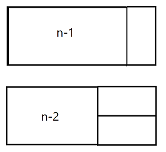
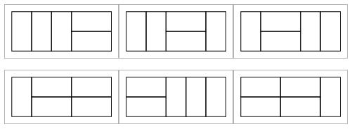
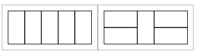
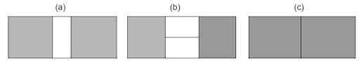
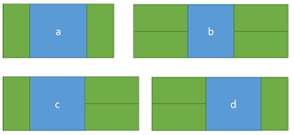

# 8 동적 계획법

## 8.1 도입

동적 계획법(Dynamic Programming)은 최적화 문제를 연구하는 수학 이론에서 왔습니다.

    Dynamic Programming의 적절한 번역은 동적 프로그래밍이 아니라 동적 계획법입니다.
    여기서 Programming은 최적의 프로그램을 찾아낸다는 의미로 사용된다고 합니다.

`중복되는 부분 문제`

동적 계획법은 큰 의미에서 분할 정복과 같은 접근 방식을 의미합니다.

    동적 계획법과 분할 정복의 차이가 발생하는 부분은 문제를 나누는 방식입니다.
    동적 계획법에서 어떤 부분 문제는 두개 이상의 문제를 푸는데 사용될 수 있기 때문에, 이 문제의 답을 여러번 계산하는 대신 한번만 계산하고 계산 결과를 재활용함으로써 속도의 향상을 꾀할 수 있습니다.

    이때 이미 계산한 값을 저장해 두는 메모리의 장소를 캐시라고 부르며,
    두번 이상 계산되는 부분 문제를 중복되는 부분 문제(overrlapping subproblems)라고 부릅니다.

---

동적 계획법 알고리즘의 가장 유명한 예 중 하나는 이항계수(binomial co-efficient)의 계산입니다.

$nCr = _{n-1}C_{r-1} + _{n-1}C_r$

이때 n-1Cr-1과 n-1Cr을 계산한 뒤에 저장해놓으면 나중에 겹치는 부분 문제들을 다시 계산할 필요가 없습니다.

이와 같이 함수의 결과를 저장하는 장소를 마련해 두고, 한번 계산한 값을 저장해 뒀다 재활용하는 기법을 `메모이제이션`(memoization)이라고 부릅니다.

메모이제이션을 사용하면 모든 부분 문제가 한번씩만 계산된다고 보장할 수 있기 때문에 함수 호출 횟수가 엄청나게 감소하리라 예상할 수 있습니다.

이와 같이 두번 이상 반복 계산되는 부분 문제들의 답을 미리 저장함으로써 속도의 향상을 꾀하는 알고리즘 설계 기법은 `동적 계획법`이라고 합니다.

`메모이제이션을 적용할 수 있는 경우`

프로그래밍을 처음 배울때 혼란스러운 점 중 하나는, 수학의 함수와 프로그래밍에서의 함수가 비슷해 보이지만 사실 다르다는 것입니다.

    수학 함수의 예: f(x) = x/2
    f(10)는 나중에 호출하든 지금 호출하든 항상 같은 값 5가 나온다.

    그러나 프로그래밍을 할때는 이러한 속성이 성립하지 않는다.
    프로그래밍에서의 함수는 함수의 입력 외에도 전역 변수, 입력 파일, 클래스의 멤버 변수 등 수많은 입력에 의해 작동하기 때문이다.

    int count = 0;
    int counter(){
        return count++;
    }

    counter 함수는 입력을 전혀 받지 않지만, 호출할 때마다 매번 다른 결과(0,1,2, ...)를 반환합니다.
    
    반면 입력이 같으면 출력도 항상 같은 함수도 작성할 수 있다.
    함수의 반환 값이 그 입력 값 만으로 결정되는지의 여부를 유식한 말로 참조 투명성(referential transparency)이라고 부릅니다.
    결과가 항상 같은 함수들은 참조적 투명 함수라고 부릅니다.

    당연하게도 메모이제이션은 참조적 투명 함수의 경우에만 적용할 수 있습니다. 
    입력이 같은데도 외부 요소에 따라 다른 값이 반환된다면 캐싱을 할 수가 없습니다.

---

`메모이제이션 구현 패턴`

동적 계획법은 가장 흔한 문제 유형 중 하나이기 때문에 메모이제이션은 굉장히 자주 구현하게 됩니다.
그런 만큼 한가지 패턴을 정해두고 항상 같은 형태로 구현하기로 하면 작성하기도, 버그를 찾기도 쉬워집니다.

> 이 책에서는 항상 한가지 형태로 메모이제이션을 구현합니다. (재귀 함수로)

```cpp
int cache[A][B]; // 원하는 크기로

// 항상 a<A, b<B
// 반환 값은 int형 안에 들어가는 정수, int 범위 밖이라면 long long 활용 시도
int someObscureFunction(int a, int b){
    // 기저 사례를 처음에 처리한다.
    if(...) return ...;

    // a와 b에 대한 답이 있다면 곧장 반환
    int& ret = cache[a][b];
    if(ret != -1) return ret;

    // 여기서 답을 계산한다.
    ...
    return ret;
}
```

---

동적 계획법을 구현할 때 다음과 같은 점을 유의해서 보자.

1 - `항상 기저 사례를 제일 먼저 처리합니다`<br>
입력이 범위를 벗어난 경우 등을 기저 사례로 처리하면 유용한데, 기저 사례를 먼저 확인하지 않고 cache[]에 접근하면 범위를 벗어나는 등의 오류가 있을 수 있습니다.

2 - `함수의 반환 값을 유의하면서 cache의 초깃값을 설정하자`<br>
해당 문제의 값이 항상 양수라면 cache[]를 -1로 초기화해도 문제 없지만, 음수가 나온다면 이는 해당되지 않는다.

추가로 이 책의 코드에서 유의할 부분

`ret가 cache[a][b]에 대한 참조형이라는 데 유의하자`

`memset()을 이용해서 cache[]를 초기화하는 부분`<br>
memset으로 배열을 초기화할때는 0또는 -1로만 초기화하자.

    memset은 두번째 인자로 주어진 값을 주어진 메모리의 모든 바이트에 채운다.
    0과 -1은 내가 원하는대로 초기화되지만, 다른 수는 예상치 못한 수로 초기화 될것이다.

---

`메모이제이션의 시간 복잡도 분석`

메모이제이션의 시간 복잡도를 분석할 때는 다음 식을 이용하자
```
(존재하는 부분 문제의 수) x (한 부분 문제를 풀때 필요한 반복문의 수행 횟수)
```

    물론 이 식은 수행 시간의 상한을 간단히 계산할 수 있는 방법일 뿐이며, 항상 정확하지는 않습니다.
    예를 들어 존재할 수 있는 모든 부분 문제 중 일부분 만을 계산해도 답을 찾을 수 있는 경우에는 실제 수행 시간이 이 식보다 훨씬 작을 수 있습니다.

---

`예제: 외발 뛰기`

각 칸이 양의 정수로 이루어진 nxn 크기의 보드판이 주어지고, (0,0)에서 시작하고, 해당 칸의 크기만큼 아래나 오른쪽으로 이동할 수 있을때, (n-1,n-1)칸에 도달할 수 있는지를 판단하는 문제

`재귀 호출에서 시작하기`

동적 계획법 알고리즘을 만드는 첫 단계는 해당 문제를 재귀적으로 해결하는 완전 탐색 알고리즘을 만드는 것입니다.

완전 탐색 알고리즘은 (0,0)칸에서 시작하는 모든 경로를 하나씩 만들어 보면서 마지막 칸에 도달할 수 있는지 검사합니다.
이런 알고리즘은 재귀 호출로 자연스럽게 구현할 수 있습니다.

```jump(y,x)=(y,x)에서부터 맨 마지막 칸까지 도달할 수 있는지 여부를 반환한다```

jump를 이용해서 점화식을 표현하면,

```jump(y,x)=jump(y,x+board[y][x]) || jump(y+board[y][x],x)```

이 점화식을 구현한 코드는 아래와 같습니다. 

```cpp
int n, board[100][100];
bool jump(int y, int x){
    // 기저 사례: 게임판을 벗아난 경우
    if(y >= n || x >= n) return false;

    // 기저 사례: 마지막 칸에 도착한 경우
    if(y==n-1 && x==n-1) return true;

    return jump(y,x+board[y][x]) || jump(y+board[y][x],x);
}
```

---

`메모이제이션 적용하기`

"원하는 답은 존재하는가?"라는 질문을 완전 탐색으로 구할 때 흔히 가장 문제가 되는 것은, 원하는 답은 없는데 전체 답의 개수는 무지막지하게 많은 경우입니다.
위 문제도 이런 경우에 해당합니다.

만약 보드의 모든 칸이 1로 이루어져 있다면, jump() 함수는 모든 경로를 일일이 탐색하게 됩니다.<br>
그리고 시간복잡도는 n에 대해 지수적으로 늘어나므로 금방 시간을 초과해버립니다.

여기서 주목할 것은 완전 탐색이 만드는 경로의 수는 엄청나게 많지만, jump()에 주어지는 입력의 개수는 100x100 = 10000개뿐이라는 사실입니다.<br>
이 경우, 비둘기집의 원리에 의해 중복으로 해결되는 부분 문제들이 항상 존재함을 알게 됩니다.

    비둘기집의 원리
    n개의 집에 n+1마리의 비둘기가 들어간다면, 한 집은 무조건 두마리 이상의 비둘기가 존재한다.

jump()는 참조적 투명 함수이기 때문에 메모이제이션을 적용해서 중복된 연산을 없앨 수 있습니다.

이를 구현한 코드를 보면

```cpp
int n, board[100][100];
int cache[100][100]; // 전부 -1로 초기화 되어있다고 가정

// cache[][]를 -1로 초기화했기 때문에 jump2 함수의 리턴타입을 int로 세팅했습니다.
int jump2(int y, int x){
    //기저 사례 처리
    if(y>=n || x>=n) return 0;
    if(y==n-1 && x==n-1) return 1;

    //메모이제이션
    int& ret = cache[y][x];
    if(ret != -1) return ret; // 이미 저장되어 있음
    return ret = jump(y,x+board[y][x]) || jump(y+board[y][x],x);
}
```

---

`동적 계획법 레시피`

대게 동적 계획법 알고리즘의 구현은 다음과 같은 두 단계로 이루어집니다.

1. 주어진 문제를 완전 탐색을 이용해 해결합니다.
2. 중복된 부분 문제를 한번만 계산하도록 메모이제이션을 적용합니다.

물론 이 설명은 대단히 단순화한 것입니다. 이 장의 다른 절들에서는 동적 계획법을 적용할 수 있는 문제 유형별로 유의해야 할 점과 알고리즘을 고안하는데 필요한 과정들에 대해 소개합니다.

`다른 구현 방법에 관하여`

물론 재귀 호출을 이용하지 않고도 동적 계획법 알고리즘을 구현할 수 있습니다.<br>
이런 방법을 반복적 동적 계획법이라고 합니다. 

9.21절에서 반복적 동적 계획법을 구현하는 요령과 그 장단점을 이야기하겠습니다.

## 8.2 문제: 와일드카드

와일드카드 문자 1개와 n개의 문자열가 주어졌을때, 와일드카드에 대응하는 문자열들을 출력하는 프로그램을 작성하세요.<br>
(모든 문자열의 길이는 0글자에서 100글자 사이)

    와일드카드 패턴
    파일 이름의 일부만 저장하는 패턴
    ?: 아무 문자나 다됨
    *: 아무 문자열 다 됨(0글자도 가능)

    *p*: hellp, hpl, p 됨 / hello 안됨

## 8.3 풀이: 와일드카드

`*가 문제로다`

이 문제를 어렵게 만드는 것은 *가 몇글자에 대응되어야 하는지를 미리 알 수 없다는 점입니다.

이럴때 우리가 할 수 있는 가장 쉬운 방법은 역시 완전 탐색입니다.

```cpp
// 와일드카드 패턴 w가 문자열 s에 대응되는지 여부를 반환한다.
bool match(const string& w, const string& s){
    // w[pos]와 s[pos]를 맞춰나간다.
    int pos=0;
    while(pos<s.size() && pos<w.size() && (w[pos] == '?' || w[pos] == s[pos]))
        ++pos;
    ...
}
```

while문은 w와 s를 더이상 맞춰나갈 수 없을때 종료합니다. 종료하는 경우의 수를 좀더 자세히 따지면,

1 - s[pos] != w[pos] : 볼것도 없이 대응 실패라는 것을 알 수 있습니다.<br>
2 - pos == w.size() : 패턴에 *이 하나도 없는 경우. 이 경우에 패턴과 문자열의 길이가 정확히 같아야만 패턴과 문자열이 정확히 대응된다고 할 수 있습니다.<br>
3 - pos == s.size() : 패턴은 남았지만 문자열이 이미 끝난 경우. 남은 패턴이 전부 *로 구성되어 있다면 사실 두 문자열은 대응될 수 있습니다. 이 경우를 제외하고는 답은 항상 거짓입니다.<br>
4 - w[pos] == * : *가 몇 글자에 대응될 지 모르기 때문에, 0글자부터 남은 문자열의 길이까지를 순회하며 모든 가능성을 검사합니다. 이때 w의 pos+1 이후를 패턴 w'으로 하고, s의 pos+skip 이후를 문자열 s'로 해서 match(w',s')로 재귀 호출했을때 답이 하나라도 참이라면 답은 참이 됩니다.<br>

이를 코드로 구현하면,

```cpp
// 와일드카드 패턴 w가 문자열 s에 대응되는지 여부를 반환한다.
bool match(const string& w, const string& s){
    // w[pos]와 s[pos]를 맞춰나간다.
    int pos=0;
    while(pos<s.size() && pos<w.size() && (w[pos] == '?' || w[pos] == s[pos]))
        ++pos;
    
    // 1. 더이상 대응할 수 없으면 왜 while문이 끝났는지 확인한다.
    // 2. 패턴 끝에 도달해서 끝난 경우: 문자열도 끝났어야 함
    if(pos == w.size())
        return pos == s.size();

    // 4. *를 만나서 끝난 경우, *에 몇 글자를 대응해야 할지 재귀 호출하면서 확인한다.
    // 3은 for문의 끝까지 간다면 체크된다.
    if(w[pos] == '*'){
        for(int skip = 0; pos + skip <= s.size(); ++skip){
            if(match(w.substr(pos+1), s.substr(pos+skip)))
                return true;
        }
    }
    return false;
}
```

---

`중복되는 부분 문제`

이 알고리즘은 일부 예제 입력의 경우에는 너무 오랜 시간이 걸릴 수 있다는 문제가 있습니다.<br>
******a와 aaaaaaaaaab 같은 경우가 이런 경우의 좋은 예입니다.<br>
딱 봤을때 문자열은 b로 끝나기 때문에 답은 거짓이지만, 패턴에 *이 많이 있기때문에, for문에서 *을 만날때마다 재귀함수를 호출합니다.

만약 이 코드가 실행되는 과정에서 수행하는 계산의 대부분이 여러 번 중복된다면, 입력이 주어졌을 때 답을 지정하는 캐시를 이용하여 프로그램을 훨씬 빠르게 할 수 있을 것입니다.

그런데 과연 중복 계산이 얼마나 일어날까요?

중요한 단서는 입력으로 주어지는 w와 s의 종류는 제한되어 있다는 것입니다. 재귀 호출할 때 우리는 항상 w와 s앞에서만 글자들을 뗴내기 때문에 w와 s는 항상 입력에 주어진 패턴 W와 문자열 S의 접미사가 됩니다.

    ******a와 aaaaaaaab를 비교해보죠.
    패턴과 문자열을 한개씩 비교할때 *을 만나면 재귀함수를 호출합니다.

    여기서 처음에 호출하는 패턴을 보면
    { 1,0 / 1,1 / 1,2 / 1,3 / 1,4 / ...  / 1,8 } 입니다.
    (재귀 함수의 인자의 첫글자의 위치입니다)

    그다음 1,0이 호출하는 패턴은
    { 2,0 / 2,1 / 2,2 / 2,3 / ... / 2,8 }
    그리고 1,1이 호출하는 패턴은
    { 2,1 / 2,2 / 2,3 / ... / 2,8 }
    그리고 1,2 
    ...
    마지막으로 1,8이 호출하는 패턴은
    { 2,8 } 입니다.

    상당히 많은 부분이 겹치는걸 알 수 있습니다.

따라서 입력으로 주어질 수 있는 w와 s는 각각 최대 101개밖에 없습니다.<br>
(문자열의 길이는 각각 최대 100이니까요)<br>
이때 match()가 101x101 = 10201번 이상 호출되었다면 비둘기집의 원리에 의해 어떤 부분 문제가 반드시 여러번 계산되고 있다는 뜻이겠죠.

메모이제이션을 사용해 이 상황을 해결해 봅시다. w는 항상 전체 패턴 W의 접미사이기 때문에 w의 길이가 결정되면 w 또한 결정됩니다.<br>
이 점을 이용하면 101 x 101 크기의 배열에 모든 부분 문제의 답을 저장할 수 있지요.

아래는 메모이제이션을 이용해 같은 알고리즘을 구현한 코드입니다.

```cpp
// -1: 아직 답이 계산되지 않았다
// 1: 참, 0: 거짓
int cache[101][101];
// 패턴과 문자열
string W, S;
// 와일드카드 패턴 w가 문자열 s에 대응되는지 여부를 반환한다.
bool matchMemoized(int w, int s){
    // 메모이제이션
    int& ret = cache[w][s];
    if(ret != -1) return ret;
    //W[w]와 S[s]를 맞춰나간다.
    while(s<S.size() && w<W.size() && (W[w] == '?' || W[w] == S[s])){
        w++;s++;
    }

    // 더이상 대응할 수 없으면 왜 while문이 끝났는지 확인한다.
    if(w == W.size()) return ret = (s == S.size());

    if(W[w] == '*'){
        for(int skip = 0; skip+s <= S.size(); ++skip){
            if(matchMemoized(w+1, s+skip))
                return ret=1;
        }
    }
    
    return ret=0;
}
```

패턴과 문자열의 길이가 n이라면, 부분 문제의 개수는 $n^2$이다.<br>
matchMemoized()는 한번 호출될때마다 최대 n번의 재귀 호출을 하기때문에 전체 시간복잡도는 $O(n^3)$이다.

---

`다른 분해 방법`

사실 좀더 똑똑한 분해 방식을 쓰면 이 문제를 $O(n^2)$ 시간에 풀수 있습니다. 

만약 재귀함수 자체에 반복문이 하나도 없도록 코드를 바꿀 수 있다면 우리는 부분 문제 개수와 같은 시간만을 사용해 문제를 풀 수 있을 것입니다.

(자세한건 책 참고)

## 8.4 전통적 최적화 문제들

동적 계획법의 가장 일반적인 사용처는 최적화 문제의 해결입니다.

    최적화 문제란 여러 개의 가능한 답 중 가장 좋은 답(최적해)을 찾아내는 문제를 말합니다.

최적화 문제를 동적 계획법으로 푸는 것 또한 완전 탐색에서 시작합니다만, 최적화 문제에 특성 성질이 성립할 경우에는 단순히 메모이제이션을 적용하기보다 좀더 효율적으로 동적 계획법을 구현할 수 있습니다.

---

`최적화 문제 동적 계획법 레시피`

1. 모든 답을 만들어 보고 그중 최적해의 점수를 반환하는 완전 탐색 알고리즘을 설계한다.
2. 전체 답의 점수를 반환하는 것이 아니라, 앞으로 남은 선택들에 해당하는 점수만을 반환하도록 부분 문제의 정의를 바꾼다.
3. 재귀 호출의 입력에 이전의 선택에 관련된 정보가 있다면 꼭 필요한 것만 남기고 줄인다. 문제에 최적 부분 구조가 성립할 경우에는 이전 선택에 관련된 정보를 완전히 없앨 수도 있다. 여기서 우리의 목표는 가능한 한 중복되는 부분 문제를 많이 만드는 것이다. 입력의 종류가 줄어들면 줄어들수록 더 많은 부분 문제가 중복되고, 따라서 메모이제이션을 최대한도로 활용할 수 있게 됩니다.
4. 입력이 배열이거나 문자열인 경우 가능하다면 적절한 변환을 통해 메모이제이션을 할 수 있도록 한다.
5. 메모이제이션을 적용한다.

---

`예제: 삼각형 위의 최대 경로`

삼각형으로 배치된 자연수들이 있고, 맨위의 숫자에서 시작해서 한번헤 한칸씩 아래로 내려가는데, 바로 아래 숫자 혹응ㄴ 오른쪽 아래 숫자로만 내려갈 수 있다. 이때 맨위에 숫자에서 맨아래의 숫자로 갈수 있는 수들의 최대합은?

`완전 탐색으로 시작하기`

경로를 각 가로줄로 조각 낸 뒤, 각 조각에서는 아래로 내려갈지 오른쪽으로 내려갈지를 선택하면서 모든 경로를 만들기로 한다.

재귀 함수에는 현재 위치와 지금까지 만난 숫자들의 합을 전달한다.

pathSum1(y, x, sum) = 현재 위치가 (y,x)이고, 지금까지 만난 수의 합이 sum일때, 이경로를 맨 아래줄까지 연장해서 얻을 수 있는 최대 합을 반환한다.

점화식
```
pathSum1(y, x, sum) = max(pathSum1(y+1, x, sum + triangle[y][x]), pathSum1(y+1, x+1, sum + triangle[y][x]))
```

이 점화식은 답을 구하기 위해 모든 경로를 다 만들어 봐야 한다는 심각한 문제가 있다. 삼각형의 가로줄이 하나 늘어날 때마다 경로의 수가 두배씩 늘어난다.

시간복잡도: $O(2^n)$

---

`메모이제이션`

함수의 반환값을 전체 경로의 최대치가 아니라 (y,x)에서 시작하는 부분 경로의 최대치로 바꿀 필요가 있다.

path2(y,x) = (y,x)에서 시작해서 맨 아래줄까지 내려가는 부분 경로의 최대합을 반환한다.

점화식
```
path2(y,x) = triangle[y][x] + max(path(y+1,x),path(y+1,x+1))
```

이 알고리즘에서 부분 문제의 수는 $n^2$이고 각 부분 문제를 계산하는 시간은 상수 시간이기 때문에 전체 시간복잡도는 $O(n^2)$입니다.

---

`이론적 배경: 최적 부분 구조`

이 문제의 시간복잡도를 최적화할 수 있었던 이유는 sum이라는 정보가 문제를 해결하는데 아무 상관이 없다는 사실을 파악한 덕분입니다. 

    다시 말해, 지금까지 어떤 경로로 이 부분 문제에 도달했건 남은 부분 문제는 항상 최적으로 풀어도 상관없다는 뜻이죠.

이것은 효율적인 동적 계획법 알고리즘을 적용하기 위해 아주 중요한 조건입니다.

이를 최적 부분 구조(optimal substructure)라고 부릅니다.

---

최적화 문제 동적 계획법 레시피와 엮어보면

1. 모든 경로를 만들어 보고 전체 합 중 최대치를 반환하는 완전 탐색 알고리즘 메서드를 만들었다.
2. 메서드를 최대합을 반환하는 것이 아니라 (y,x)이후로 만난 숫자들의 최대합만 반환하도록 바꾼다.
3. 이렇게 반환 값의 정의를 바꿨기 때문에 이전에 한 선택에 대한 정보인 sum을 입력 받을 필요가 없어진다.
4. 이부분은 필요없다.
5. 메모이제이션을 적용한다.

---

## 8.7 문제: 원주율 외우기

숫자를 세 자리에서 다섯 자리까지 끊어서 외우는데, 각 조각들의 난이도는 다음과 같습니다.

|경우|예|난이도|
|--|--|--|
|모든 숫자가 같을때|333, 55555|1|
|숫자가 1씩 증가하거나 감소할때|123, 87654|2|
|두 개의 숫자가 번갈아 나타날떄|23232, 56565|4|
|숫자가 등차수열을 이룰 떄| 147, 8642|5|
|이 외의 모든 경우|12632, 5464|10|

원주율의 일부가 입력으로 주어질때, 난이도의 합을 최소화하도록 숫자들을 세 자리에서 다섯 자리까지 끊어 읽고 싶습니다.

최소의 난이도를 계산하는 프로그램을 작성하세요

    예시

    12341234 - 4
    12122222 - 5
    22222222 - 2
    12673939 - 14

## 8.8 풀이: 원주율 외우기

입력의 크기를 보면, 어떤 방식이든지 완전 탐색으로 이 문제를 해결하기란 불가능하다는 것을 본능적으로 알 수 있습니다.

`메모이제이션의 적용`

하지만 적절한 완전 탐색 알고리즘을 만들면 메모이제이션으로 이 문제를 해결할 수도 있지요. 이 문제를 푸는 완전 탐색 알고리즘은 주어진 수열을 쪼개는 모든 방법을 하나씩 만들어 보며 그중 난이도의 합이 가장 작은 조합을 찾아냅니다. 각 재귀 함수는 한번 불릴때마다 첫조각의 길이를 하나하나 시도해보며 남은 수열을 재귀적으로 쪼갭니다. 첫 조각의 길이는 3,4,5 중의 하나입니다. 이때 세개의 부분 문제에 대한 최적해를 구했다고 하면, 전체 문제의 최적해는 다음 세경우중 가장 작은 값이 되지요.

    길이 3인 조각의 난이도 + 3글자 빼고 나머지 수열에 대한 최적해
    길이 4인 조각의 난이도 + 4글자 빼고 나머지 수열에 대한 최적해
    길이 5인 조각의 난이도 + 5글자 빼고 나머지 수열에 대한 최적해

> 여기서 나머지 수열의 최적해를 구할때 앞의 부분을 어떤 식으로 쪼갰는지는 중요하지 않습니다. (최적 부분 구조가 성립한다는 말이죠)

이에 대한 점화식

$memorize(begin) = min^5_{L=3}(memorize(begin+L) + classify(N_{begin, L})$

여기서 $N_{begin, L}$은 N[begin]에서 시작하는 길이 L인 부분 문자열이고, classify()는 해당 조각의 난이도를 반환하는 함수라고 합시다.

시간복잡도

조각의 난이도를 판정하는 것은 번거롭지만 어렵거나 시간이 오래걸리는 작업은 아닙니다.<br>
이 알고리즘에는 최대 n개의 부분 문제가 있고, 각 부분 문제를 해결하는데 최대 3개의 부분 문제를 봅니다. 따라서 시간 복잡도는 $O(n)$입니다.

---

## 8.11 경우의 수와 확률

경우의 수를 세거나 확률을 계산하는 문제에도 흔하게 사용됩니다. 경우의 수를 계산하는 문제는 많은 경우 재귀적인 특징을 가지고 있기 때문이죠.

`경우의 수 계산하기 레시피`

1. 모든 답을 직접 만들어서 세어보는 완전 탐색 알고리즘을 설계합니다. 이때 경우의 수를 제대로 세기 위해서는 재귀 호출의 각 단계에서 고르는 각 선택지에 다음과 같은 속성이 성립해야 합니다.
    <br>a) 모든 경우는 이 선택지들에 포함됨
    <br>b) 어떤 경우도 두개 이상의 선택지에 포함되지 않음
2. 최적화 문제를 해결할 때처럼 이전 조각에서 결정한 요소들에 대한 입력을 없애거나 변형해서 줄입니다. 재귀 함수는 앞으로 남아 있는 조각들을 고르는 경우의 수만을 반환해야 합니다.
3. 메모이제이션을 적용합니다.

`예제: 타일링 방법의 수 세기`

2xn 크기의 사각형을 2x1 크기의 타일로 채우는 방법의 수를 계산하는 문제

우선 완전 탐색을 이용해 모든 답을 만들면서 개수를 세어보는 함수를 작성한 뒤, 메모이제이션을 이용해 동적 계획법 알고리즘으로 바꿔봅시다.



(오른쪽 버전)

2xn 사각형을 채우는 모든 방법들은 맨 왼쪽 세로줄이 어떻게 채워져 있느냐로 나눌 수 있습니다.
이 세로줄은 위쪽 그림처럼 한개의 세로 타일에 의해 덮여 있을 수도 있고, 아래쪽 그림처럼 두개의 가로 타일에 의해 덮여 있을 수도 있지요. 이때 다음의 조건이 성립함을 알 수 있습니다.

1. 이 두가지 분류는 타일링하는 모든 방법을 모두 포함합니다.
2. 두가지 분류에 모두 포함되는 타일링 방법은 없습니다.

따라서 재귀 호출을 이용해 각 경우의 수를 쉽게 계산할 수 있습니다.

tiling(n) = 2xn 크기의 사각형을 타일로 덮는 방법을 반환

tiling(n) = tiling(n-1) + tiling(n-2)

메모이제이션을 이용하면 O(n)으로 문제를 풀 수 있습니다.

## 8.12 문제: 비대칭 타일링

위 문제와 비슷한 유혀이지만, 여기서 대칭인 경우를 제외한 경우의 수를 구하는 프로그램을 작성해야 합니다.



위 경우는 비대칭인 경우입니다.



위 경우는 대칭인 경우라서, 이 경우는 제외해야 합니다.

## 8.13 풀이: 비대칭 타일링

`완전 탐색의 함정`

이 문제를 직접적으로 풀기보다 좀더 단순화된 문제의 해법을 이용해서 더 쉽게 풀 수 있는 경우가 있습니다.



힌트는 모든 타일링은 대칭이거나 비대칭이라는 데서 옵니다.

n이 홀수일때 타일링이 대칭이기 위해서는, (a)처럼 항상 정가운데 있는 세로줄은 세로 타일 하나로만 덮여야 합니다. 그리고 왼쪽 절반과 오른쪽 절반은 서로 대칭이어야 겠지요.

n이 짝수일때 타일링이 대칭이기 위해서는, (b)처럼 정가운데 세로줄 둘을 가로 타일로 덮고 나머지 절반이 서로 대칭인 경우와, (c)처럼 절반으로 나뉜 부분들이 서로 대칭인 경우죠.

이제 각 경우에서, 왼쪽의 회색 부분을 채우고 나면 오른쪽 회색 부분은 대칭이기 때문에 자연스럽게 결정됩니다. 결국 이방법들은 회색 부분 하나를 채우는 방법과 1:1 대응됩니다.

위 경우를 기존 모든 경우에서 제외시켜주면 답을 구할 수 있습니다.

이를 코드로 구현하면

```cpp
// tiling(width)는 이전 문제에서 구했던 메서드를 이용했습니다
int asymmetric(int width){
    if(width % 2 == 1)
        return (tiling(width) - tiling(width/2))

    int ret = tiling(width);
    ret -= tiling(width/2);
    ret -= tiling(width/2 - 1);

    return ret;
}
```

시간복잡도: O(n)

`직접 비대칭 타일링의 수 세기`

물론 이렇게 돌아가지 않고 직접 비대칭 타일링의 수를 셀 수도 있습니다.



위 그림은 타일링 방법을 양쪽 끝을 덮은 타일들로 분류하는 방법입니다.

a와 b는 양쪽 끝을 덮은 타일들이 서로 대칭이고, 
c와 d는 양쪽 끝을 덮은 타일들이 대칭이 아닙니다.

    a,b: 가운데 남은 부분을 덮는 방법을 재귀호출로 찾습니다. 물론 이부분은 대칭이 아니어야 합니다.

    c,d: 가운데 남은 부분을 덮는 경우는 대칭이든 아니든 상관없습니다. 양쪽 끝이 이미 비대칭이기 때문입니다.

a와 b는 재귀 호출로 해결하고, c와 d는 tiling()을 이용해 해결할 수 있습니다.

```cpp
int cache2[100];

int asymmetric2(int width){
    if(width <= 2) return 0;

    int& ret = cache2[width];
    if(ret != -1) return ret;

    ret = asymmetric2(width - 2); // a
    ret += asymmetric(width - 4); // b
    ret += tiling(width-3); // c
    ret += tiling(width-3); // d
    
    return ret;
}
```

시간복잡도: O(n) // 추가적으로 메모이제이션을 위한 cache2가 필요합니다.

---

    결국 DP를 잘하려면 완전 탐색을 잘해야 한다.

    완탐 후 이를 겹치는 상태를 메모이제이션을 통해 시간복잡도를 줄이는게 DP의 핵심이다.


