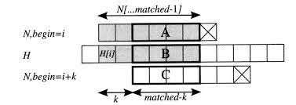

# 20 문자열

이장에서는 문자열 검색 문제를 위한 KMP 알고리즘에 대해 알아보겠습니다.

    용어 정리

    S = "abcda"
    
    S[4] = a
    |S| = 5 (|S| = 문자열 S의 길이)
    S[1-3] = "bcd" (S[i-j] = i번글자부터 j번 글자까지로 구성된 문자열)
    S[-3] = "abcd" (S[-j] = 0번 글자부터 j번 글자까지로 구성된 문자열 - 접두사)
    S[2-] = "cda" (S[i-] = i번 글자부터 마지막 글자까지로 구성된 문자열 - 접미사)

---

### 문자열 검색

문자열 H에 문자열 N이 있는지 찾아보고 싶다. 
이때 한글자씩 검색하면 된다. 
이때의 시간복잡도는 O(|H|x|N|)이다.

> c++에서 string::find(), 자바에서 indexOf() 등이 모두 이와 같은 알고리즘을 사용한다.

---

`보지 않고도 알 수 있는 것이 있다: KMP 알고리즘`

일정한 글자의 수는 항상 0에서 |N| 사이의 정수이기 때문에, 전처리 과정에서 이 정보들을 미리 계산해 저장해 둘 수 있습니다. 이와 같은 최적화를 적용한 문자열 검색 알고리즘이 커누스-모리스-프랫 알고리즘으로, 흔히 KMP 알고리즘이라고 부릅니다. KMP 알고리즘은 다양한 문자열 검색 알고리즘 중 비교적 이해하기 힘든편에 속하지만, KMP 알고리즘의 아이디어는 여러 문자열 문제에 응용될 수 있기 때문에 아주 중요합니다.

`다음 시작 위치 찾기`

KMP 알고리즘은 불일치가 일어났을 때 지금까지 이리한 글자의 수를 이용해 다음으로 시도해야 할 시작위치를 빠르게 찾아냅니다.

위 그림은 시작위치 i에서 H와 N을 맞춰봤을 때 matched 글자가 일치하고 다음 글자가 불일치한 상황을 보여줍니다. matched 글자가 일치했기 때문에, N의 접두사 N[-(matched-1)]가 H[i-(i+matched-1)]와 일치했음을 알 수 있지요.

그림에서 회색으로 칠해진 글자들은 서로 일치하기 때문에, 굵은 선으로 표시된 두 부분 문자열 A와 B는 서로 같음을 알 수 있습니다. 그런데 시작위치 i+k가 답이 될 수 있으려면 B와 C도 서로 같아야 하므로, 결과적으로 A와 C도 같아야 합니다.

이때 A는 N[-(matched-1)]의 접미사이고, C는 N[-(matched-1)]의 접두사입니다.

정리하면, 시작위치 i+k에서 답을 찾을 수 있기 위해서는 N[-(matched-1)]의 길이 matched-k인 접두사와 접미사가 같아야 합니다.

KMP 알고리즘은 전처리 과정에서 다음과 같이 정의되는 배열 pi[]를 계산합니다.

    pi[i] = N[-i]의 접두사도 되고 접미사도 되는 문자열의 최대 길이

pi[]는 N이 어디까지 일치했는지가 주어질 때 다음 시작 위치를 어디로 해야할지를 말해주기 때문에, 부분 일치 테이블이라고 부릅니다.

---

    사실 코딩테스트에서 KMP 알고리즘을 쓸정도로 빡빡한 문제가 나올것 같지는 않음

    지금은 그냥 기본 구현에 집중하자
