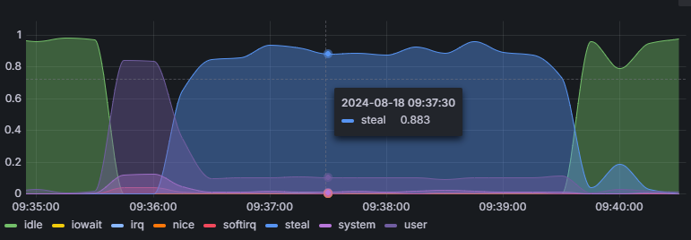

# AWS EC2

## EC2란

EC2란, Elastic Compute Cloud의 약자로, AWS에서 제공하는 가상 서버 서비스이다.

## 프리 티어 인스턴스

AWS는 프리 티어 계정에게 EC2를 1년간 무료로 사용할 수 있는 서비스를 제공한다.

이때 해당 서비스는 t2.micro 인스턴스를 제공한다.

---

### t2.micro

vCPU: 1, 메모리: 1 GiB

스펙이 낮은 편이지만, 프리 티어 계정에서는 무료로 사용할 수 있으므로,  
학습용이나 테스트용으로 사용하기에 적합하다.

---

### Bustable Performance

t2 시리즈는 Burstable Performance 인스턴스로,  
CPU 사용량이 일정 수준 이하로 유지되면 CPU 크레딧을 축적한다.

이후 CPU 사용량이 일정 수준 이상으로 올라가면,  
축적된 CPU 크레딧을 사용하여 CPU 성능을 높일 수 있다.

> 이때 CPU 크레딧은 시간이 지남에 따라 점차 축적되지만,  
> 한도가 있으므로 주의해야 한다.  

만약 CPU 크레딧이 소진되면,  
CPU 성능이 낮아지게 되므로 주의해야 한다.

---

### t2.micro의 CPU 크레딧

t2.micro의 경우, CPU 크레딧이 1시간에 6 크레딧씩 축적되며,  
최대 144 크레딧까지 축적할 수 있다.

그리고 vCPU 당 기준 성능은 10%이다.

위 사진은 t2.micro가 CPU 크레딧을 모두 소진했을 때의 메트릭이다.

user CPU 사용량이 100%에서 10%로 떨어지고,  
steal CPU 사용량이 90%로 올라가는 것을 확인할 수 있다.
