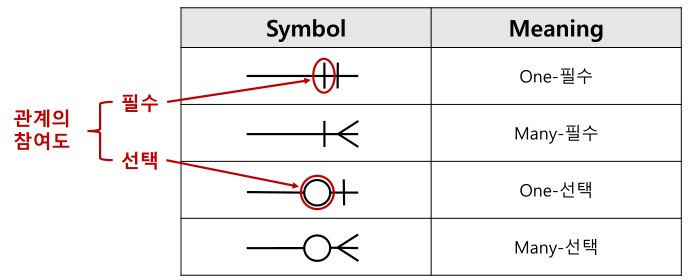

# 데이터베이스 모델링

## 데이터 모델링의 정의
- 고객과 함께 고객의 업무 프로세스를 이해해야 데이터 모델링을 제대로 할 수 있다.
- 현실 세계를 데이터베이스에서 표현하기 위한 추상화 과정
- 데이터 모델링 표기법을 사용해서 모델링한다.
- 고객의 업무 프로세스내 비즈니스 프로세스 규칙을 정의하여 데이터 모델로 표현 할 수 있어야 한다.
- 고객이 이해하기 쉽게 간결하게 모델링 해야 한다.

## 데이터 모델링의 특징
|||
|--|--|
|추상화 Abstraction|현실 세계를 일정한 양식(표기법)에 맞게 간략하게 표현한다.|
|단순화 Simplification|누구나 이해하기 쉽도록 약속된 규약에 의해 제한된 표기법 또는 언어를 이용하여 표기한다.|
|명확화 Clarity|명확하게 의미가 한가지로 해석되어야 함으로 애매모호함을 제거하고 정확하게 현상을 기술한다.|

## 대이터 모델링의 단계 - 개논물
1. 개념적 모델링 - 추상화수준 가장낮음, 업부측면의 모델링, 전시적이고 포괄적인 모델링, 핵심 엔티티 도출, ERD 작성
2. 논리적 모델링 - 특정 DB 모델에 종속된다. 세부속성, 식별자, 관계등을 정확하게 표현, 데이터 정규화 완료, 재사용성이 높음
3. 물리적 모델링 - 물리적인 성능과 데이터, 저장을 고려한 설계, 가장 구체적인 데이터 모델링, 추상화 수준이 가장 낮은 단계, 성능, 보안, 가용성을 고려한 DB 모델링

## 데이터 모델링의 3가지 관점
데이터 관점 -  데이터와 업무 간의 어떤 관련이 있는지, 데이터와 데이터 사이의 관계가 무엇인지에 따라 모델링을 한다. 비즈니스 프로세스 에서 사용되는 데이터를 의미한다.
- 구조 분석, 정적 분석

프로세스 관점 - 실제 하는 업무에 따라 무엇을 어떻게 하는지 모델링한다. 비즈니스 프로세스에서 수행하는 작업을 의미한다.
- 시나리오 분석, 도메인 분석, 동적 분석

데이터와 프로세스의 상관 관점 - 업무의 처리(프로세스)와 데이터 간의 서로 어떤 영향을 주고받는지를 모델링한다.
- CRUD

## 데이터 모델링을 위한 ERD(Entity Relationship Diagram)
대표적인 표기법 - Chen, UML, IE, Barker

    제일많이 사용하는 표기법은 IE이다.

작성하는 순서
1. 엔티티 도출
2. 엔티티 배치
3. 엔티티 관계 설정
4. 관계명 기술
5. 관계 참여도 기술
6. 관계 필수 여부 기술

---

### ERD 표기법

`식별자 관계` 
실선으로 표현 
부모 자식 관계에서 자식이 부모의 주 식별자를 외래 식별자로 참조해서 자신의 주 식별자로 설정 
아래 그림에선 자식 엔티티(학생별 취미)가 부모 엔티티(학생)의 학번을 자신의 주 식별자로 설정하였다.

`비식별자 관계` 
점선으로 표현 
부모 자식 관계에서 자식이 부모의 주 식별자를 외래 식별자로 참조해서 일반 속성으로 사용. 
아래 그림에선 자식 엔티티(사원정보)가 부모 엔티티(부서정보)의 부서코드를 일반 속성으로 두었다.

`그 외 표기법`

---

## 3단계 구조 스키마
데이터베이스의 독립성을 위해서 존재

사용자(외부 스키마), 설계자(내부 스키마), 개발자(개념 스키마)의 각기 관점에 따라 DB를 기술하고 이들관의 관계를 표준으로 정했다.

데이터의 독립성 확보를 통해서 데이터 복잡도 감소, 데이터 중복 뺴고, 요구사항 변경에 따른 대응력 향상 관리 및 유지보수 비용 절감등의 장점이 생긴다.

각계층을 뷰라고 부르면 서로 독립성을 확보한다.

## DB 3단계 구조 특징
|||
|--|--|
|외부스키마|데이터베이스의 개별 사용자 관점의 이해와 표현, 응용프로그램이 접근하는 데이터베이스, 여러개의 외부 스키마 존재|
|개념 스키마|관리자의 관점, 전체적인 논리구조, 일반적으로 스키마는 개념스키마를 지정함|
|내부 스키마|시스템 설계자의 관점, 실제로 물리적으로 어떻게 저장되는지 확인|

## 엔티티(Entity)
데이터의 집합

저장되며 관리되는 데이터

개념, 사건, 장소등의 명사

유형과 무형에 따른 분류
||예시|
|--|--|
|유형 엔티티| 사원,제품,교수 등 - 물리적, 안정적|
|개념 엔티티| 강의, 금융상품, 부서 등 - 물리적x 개념적o|
|사건 엔티티| 구매, 판매, 영업, 수납 등 - 비즈니스 프로세스|

발생 시점에 따른 엔티티 분류
||예시|
|--|--|
|기본 엔티티|고객, 부서, 판매제품 - 키엔티티, 독립적|
|중심 엔티티|계좌, 주문, 수납 - 기본엔티티로부터 발행되는 행위엔티티를 생성하는 중간 엔티티|
|행위 엔티티|주문이력, 접속이력 - 위 2개로부터 발생되는 엔티티|

|종류|설명|
|--|--|
|독립 엔티티[Kernel Entity, Master Entity]|사람, 물건, 장소 등과 같이 현실세계에 존재하는 엔터티|
|업무중심 엔터티[Transaction Entity]|Transaction이 실행되면서 발생하는 엔터티|
|종속 엔터티[Dependent Entity]|주로 1차 정규화로 인해 관련 중심엔티티로부터 분리된 엔터티|
|교차 엔티티[Intersaction Entity]|M:M의 관계를 해소하려는 목적으로 만들어진 엔터티 [ex> M:M -> 1:M]|

## 속성(Attribute)
엔티티가 가지는 항목

속성은 더 이상 분리되지 않는다.

업무에 필요한 데이터를 저장한다.

속성의 특징
1. 업무에서 관리되는 정보
2. 하나의 값만 가진다
3. 주식별자에게 함수적으로 종속됨. 기본키에따라 속성값도 변경될수있음

특성에 따른 속성의 종류
|||
|--|--|
|기본속성|이름, ID, 전화번호 - 본래의 속성|
|설계속성|상품코드, 지점코드 - 데이터 모델링과정에서 발생되는 속성|
|파생속성|합계, 평균 - 다른 속성에 의해 만들어지는 속성|

    엔티티는 두개이상의 속성을 가지고 있다.

---

식별자

식별자의 특징 - 유일성(오직 한개), 최소성(최소한의 column), 불변성(바뀌면 안됨), 존재성(null x)

식별자 분류

|식별자 분류|식별자|설명|
|--|--|--|
|대표성여부|주식별자|- 엔터티 내에서 각 행을 구분할 수 있는 구분자이며, 타 엔터티와 참조관계를 연결할 수 있는 식별자 (ex. 사원번호, 고객번호)|
|--|보조식별자|- 엔터티 내에서 각 행을 구분할 수 있는 구분자이나 대표성을 가지지 못해 참조관계 연결을 못함(ex. 주민등록번호)|
|스스로 생성여부|내부식별자|- 엔터티 내부에서 스스로 만들어지는 식별자(ex. 고객번호)|
|--|외부식별자|- 타 엔터티와의 관계를 통해 타 엔터티로부터 받아오는 식별자(ex. 주문엔터티의 고객번호)|
|속성의 수|단일식별자|- 하나의 속성으로 구성된 식별자(ex. 고객엔터티의 고객번호 )|
|--|복합식별자|- 둘 이상의 속성으로 구성된 식별자(ex. 주문상세엔터티의 주문번호+상세순번)|
|대체여부|본질식별자|- 업무(비즈니스)에 의해 만들어지는 식별자(ex. 고객번호)|
|--|인조식별자|- 업무적으로 만들어지지는 않지만 원조식별자가 복잡한 구성을 가지고 있기 때문에 인위적으로 만든 식별자(ex. 주문엔터티의 주문번호(고객번호+주문번호+순번))|

