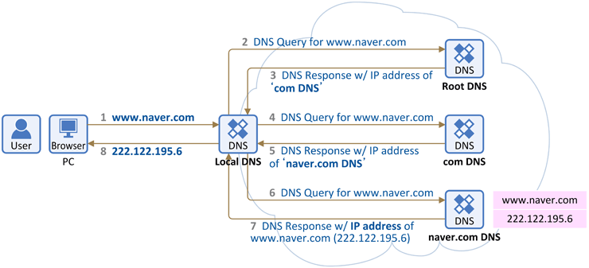
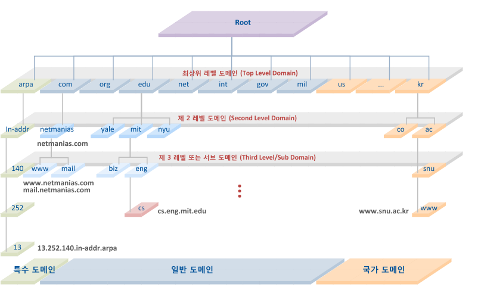

> www.naver.com에 접속하려면, TCP/IP 연결을 해야 한다. -> IP 주소를 알아야 한다.  
> 하지만 우리는 IP주소를 모른다.
>
> 이를 알고있는 데이터베이스가 있다.

## DNS(Domain Name System)

도메인 네임 시스템(Domain Name System, DNS)은  
호스트의 도메인네임 (www.example.com)을 네트워크주소(192.168.1.0)로  
변환하거나, 그 반대의 역할을 수행하는 시스템이다.

빠른 응답을 제공하기 위해 DNS는 UDP 기반으로 동작하고 DNS 서버들은 요청 정보를 캐싱해둡니다.

> UDP를 사용하는 이유
>
> DNS는 일반적으로 작은 쿼리와 짧은 응답을 전송하기 때문에, UDP를 사용하여 속도를 향상시킨다.  
> DNS는 연결 상태를 유지할 필요가 없고, TCP보다 많은 클라이언트를 수용할 수 있는 UDP를 사용한다.

---

### Domain Name

www.naver.com = naver.com 도메인에 속한 이름이 www인 호스트

www는 naver에 속해있음

naver는 com에 속해있음

> naver.com은 도메인 네임  
> www는 호스트 네임

---

### DNS 작동 원리

클라이언트가 도메인명을 브라우저에 검색하면,  
먼저 도메인 정보가 저장된 네임 서버(DNS 서버)로 가서 도메인과 일치하는 IP주소로 가라고 지시하게 되고,  
다시 그 IP주소로 접속하게 되면 홈페이지가 열리는 기본적인 골자는 같다.

단지, DNS 서버에서 도메인 & IP정보를 얻는 과정이 약간 복잡하게 되어 있을 뿐이다.

> 전세계에 도메인 수가 너무 많기 때문에 DNS 서버 종류를 계층화해서 단계적으로 처리하기 때문이다.

1. 웹 브라우저에 www.naver.com을 입력하면 먼저 PC에 저장된 Local DNS 서버(기지국 DNS 서버)에게 "www.naver.com"이라는 hostname에 대한 IP 주소를 요청한다.  
   (로컬 DNS 서버 캐시에 해당 IP 주소가 없다고 가정)
2. 그러면 Local DNS는 IP 주소를 찾아내기 위해 다른 DNS 서버들과 통신(DNS 쿼리)을 시작한다.  
   먼저 Root DNS 서버에게 IP 주소를 요청한다.
3. Root DNS 서버는 (의 IP 주소"를 찾을 수 없어) Local DNS 서버에게 "IP 주소 찾을 수 없다고 다른 DNS 서버에게 물어봐" 라고 응답을 한다.
4. 이제 Local DNS 서버는 com 도메인을 관리하는 TLD DNS 서버(최상위 도메인 서버)에 다시 IP 주소를 요청한다.
5. com 도메인을 관리하는 DNS 서버에도 해당 정보가 없으면, Local DNS 서버에게 "IP 주소 찾을 수 없음. 다른 DNS 서버에게 물어봐" 라고 응답을 한다.
6. 이제 Local DNS 서버는 naver.com DNS 서버(Authoritative DNS 서버)에게 다시 "IP 주소" 를 요청한다.
7. naver.com DNS 서버에는 IP 주소 가 있다.그래서 Local DNS 서버에게 "www.naver.com에 대한 IP 주소는 222.122.195.6" 라는 응답을 한다.
8. 이를 수신한 Local DNS는 IP 주소를 캐싱을 하고 이후 다른 요청이 있을시 응답할 수 있도록 IP 주소 정보를 단말(PC)에 전달해 준다.

> 이렇게 Local DNS 서버가 여러 DNS 서버에 차례대로 요청하여  
> (Root DNS 서버 → TLD DNS 서버(.com) → Authoritative DNS 서버(naver.com))  
> 그 답을 찾는 과정을 재귀적 쿼리 Recursive Query 라고 부른다.

---

### DNS 서버의 종류

`Root DNS 서버`  
DNS 계층 구조의 정점, DNS를 위한 DNS, 13대 있음  
TLD 서버의 주소 정보를 제공한다.

`TLD 서버` (Top-Level Domain, 최상위 도메인 서버)  
인터넷 도메인의 시작점이 된다.(kr, com)  
(TLD(최상위 도메인은 국가명을 나타내는 국가최상위도메인과 일반적으로 사용되는 일반최상위도메인으로 구분된다)  
Second-level DNS 서버의 주소 정보를 제공한다.

> 루트 도메인 바로 아래 단계에 있는 것을 TLD라고 한다.

`Second-level DNS 서버`
sub 도메인 서버의 주소 정보를 제공한다.

`Sub DNS 서버 (최하위 서버)`  
특정 도메인 이름의 IP 주소와 관련된 DNS 레코드를 저장하고 있다.

`Local DNS 서버`  
ISP(Internet Service Provider)가 제공하는 DNS 서버  
클라이언트의 요청을 받아서, DNS 정보를 찾아주는 서버  
위 네임 서버들과 통신하여 IP 주소를 찾아준다.  

> Local DNS 서버는 클라이언트의 요청을 받아서,  
> Root DNS 서버부터 Authoritative DNS 서버까지 차례대로 요청하여 IP 주소를 찾아준다.  
> 
> 클라이언트는 직접 Root DNS 서버에 요청을 보내지 않는다.  
> Local DNS 서버가 대신해서 Root DNS 서버에 요청을 보내고,  
> 그 이후의 과정을 처리하여 IP 주소를 찾아준다.  
> (Root 네임 서버를 비롯한 하위 네임 서버들과 통신하여 IP 주소를 찾아준다)  
> 그 결과를 클라이언트에게 전달해준다.

> 이때 클라이언트가 로컬 DNS 서버에 요청을 한 뒤  
> 로컬 DNS 서버는 반환할 IP 주소가 있을 때까지 다른 DNS 서버들에게 요청을 보내는 과정을  
> 재귀적 쿼리(Recursive Query)라고 한다.
> 
> 로컬 DNS가 여러 DNS 서버에 차례대로 요청하여  
> (Root DNS 서버 → TLD DNS 서버(.com) → Authoritative DNS 서버(naver.com))  
> 그 답을 찾는 과정을 반복적 쿼리(Iterative Query)라고 한다.

### DNS 레코드

DNS 레코드란 도메인 이름과 관련된 정보를 저장하는 데이터이다.

- A 레코드 : 도메인 이름과 IP 주소를 매핑한다.
- CNAME 레코드 : 도메인 이름을 다른 도메인 이름으로 매핑한다.
- NS 레코드 : 도메인 이름을 관리하는 DNS 서버를 식별한다.

### DNS Cache

dns에 한번이라도 질의를 한다면 해당 도메인 네임에 대한 ip 주소를 저장해놓는다.  
-> pc마다 dns 내역을 가지고 있다.  
(이때 유효기간이 있다)

---

URL과 URI

URL - Uniform Resource Locator // 위치 지정자

URI - Identifier // 식별자

리소스의 본질은 파일이다.

> 포트번호 안쓰면 TCP 80

---

### HTTP(HyperText Transfer Protocol)

HTML 문서를 전송받기 위해 만들어진 L7 통신 프로토콜

L5이상이면 소켓 통신 - 스트림 데이터  
(시작은 확실하지만 끝은 명확하지 않다)

HTTP는 문자열로 되어있다. -> 직관성 높다

헤더 - 요청 헤더, 응답 헤더

---

web에서 기본적인 두가지

HTML 문서, HTML 문서를 실어 나르는 HTTP

http는 html 문서를 실어나르기 위해 설계되었다. & TCP/IP를 활용

> 논문 참고문헌 링크를 누르는 것만으로, 해당 논문을 볼 수 있다.  
> -> html 문서 덕분에

---

## 웹 서비스 기본 구조

### 1. 맨 처음 HTTP

처음 HTTP는 HTML 문서만을 주고받기 있었다. + 이미지

따라서 GET 방식으로 서버에 http 요청을 하면,  
그에 대한 정적 HTML 문서를 http 응답으로 받는다.

이때 좀더 꾸미기 위해 CSS(Cascading Style Sheet) 파일도 같이 줌으로써,  
html 문서의 가독성이 올라가고 예쁘게 꾸며짐

> HTML과 CSS를 합치면 유지보수 상 별로다.  
> 그래서 따로 줌

### 2. 넷스케이프 내비게이터의 등장

다음으로 넷스케이프 내비게이터가 등장  
-> 정적인 문서에 움직임을 넣어주거나, 내용이 동적인 제어가 가능한 문서로 만들기 위해 자바스크립트 파일을 같이 주게 된다.  
(동적인 행동에 대한 규칙의 문서 - 자바스크립트 코드)

> 기존 문서는 정적인 문서(신문)  

> 문서 뷰어의 역할
> 1. html 문서(텍스트+태그) 구문 분석
> 2. 렌더링
> 3. 자바스크립트 엔진

자바스크립트 코드를 통해 정적 문서에서 동적 문서로 발전

> 자바스크립트 코드는 서버에 있는데   
> 실행은 클라이언트에서 이루어짐  
> (서버로부터 다운로드 받음)

---

> 기존 서버는 달라고 하는 파일을 주기만 하는 역할만 했음(도서관)  
> -> 단방향 상호작용

### 양방향 상호작용

클라이언트도 서버에 무언가 상호작용을 하고 싶다.  
-> http method POST의 등장  
-> 양방향 상호작용

양방향 상호작용이 되면서 상태가 전이된다.  
그런데 http는 stateless  
-> 상태를 어딘가에 기억시켜놔야 한다

클라와 서버둘다 기억을 구현하게 된다.

> 클라이언트 - 쿠키  
> 서버 - 데이터베이스

클라이언트가 건넨 정보는, 서버 관점에서 `원격지 사용자 입력`  
-> 이것은 서버는 신뢰하면 안된다. (검증 대상)

---

(동적 html 문서는 클라의 요청에 의해 생성된다)

### WAS(Web Application Server)

서버는 클라이언트가 요청한 데이터를 처리해서 동적 문서를 응답으로 반환한다.

정적 문서를 제공하는 서버 뒤에, 클라의 요청을 처리하는 서버가 따로 있다  
-> WAS(Web Application Server)

> MVC(Model, View, Controller)
> 
> View = 눈에 보이는 것을 담당
> Model = 자료를 결합해서 최종적인 뷰를 생성하는 역할
> Controller = 클라의 요청을 처리하는 역할

---

> web server의 처리가 아무리 빨라도, WAS나 DB의 처리가 느리다면,  
> 그 서버의 응답은 느리게 처리가 된다.
> 
> APM(Application Performance Management System) - 웹 애플리케이션이 잘 작동하는지 테스트하는 시스템  
> (스카우터)

---

동적 문서는 만들수 있는데, 이를 받는 사용자 환경(client-side)이 너무 다양하다(스마트폰, 태블릿, 컴퓨터)

> 데이터 위주인 html 문서도 결국은 일정 수준의 UI를 갖고 있다.
>
> 이에 비해 사용자 환경에서의 UI는 너무 많다.
> 따로따로 논다

### UI와 데이터를 분리하자

request가 날라가는 건 똑같다

응답을 순수한 데이터만 보낸다. (xml, json 형식)  
& 클라이언트 사이드에서 자바스크립트 기반의 소프트웨어가 실행되서  
html을 그자리에서 생성한다.

(리액트, 뷰 등)

---

### RESTful API

결국 클라의 요청의 기능은 CRUD 위주 -> 이에 대한 반응을 함수 형태로 만들자  
-> 함수 자체가 URI가 된다.(함수 == API)  
-> RESTful API

---

### 서버에서의 보안장치

IPS(1차), SSL, WAF(Web Application Firewall)(2차)

> 가끔 2차 방어체계가 Web Server와 WAS 사이에 있을 수 있다

여기서 SSL 처리가 클라의 요청과 합쳐지면 -> HTTP`S`

---