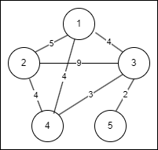

# MST(Minimum Spanning Tree) - Kruscal 알고리즘

> MST 관련 설명은 Prim 알고리즘 페이지에 있음
>
> 바로 크루스칼 알고리즘 설명 들어감

---

## Kruscal 알고리즘

> 해당 알고리즘을 코드로 구현하려면 Union-Find 알고리즘을 알아야함

전체 간선을 탐색하면서 MST를 찾는 알고리즘

> 프림 알고리즘은 visited 배열을 이용해서 사이클 형성 여부를 확인할 수 있지만,  
> 크루스칼 알고리즘은 사이클 형성 여부를 확인하기 위해 분리 집합 알고리즘을 이용해야 한다.  
> 
> 그 이유는,  
> 프림 알고리즘은 선택한 edge들이 하나의 그룹을 형성하고 있지만,  
> 크루스칼은 선택한 edge들이 하나의 그룹이 아닌, 여러 그룹을 형성할 수 있기 때문이다.  
> 
> (visited로 체크해도, 그래프로 연결되어 있지 않을 수 있다)  
> 1-2, 3-4 이면 visited[1] = visited[2] = visited[3] = visited[4] = true 이지만,  
> 1,2 그룹과 3,4 그룹은 연결되어 있지 않아, Spanning Tree가 아닌 상태이다.  
> -> 분리 집합을 이용할 수 밖에 없다.

## 과정

 1. 모든 간선들의 가중치를 오름차순으로 정렬
 2. 간선을 하나씩 체크하는데, 만약 해당 간선때문에 사이클이 발생한다면 해당 간선은 추가하지 않는다.
     > 사이클을 확인할때 union-find 알고리즘을 사용한다.
 3. 사이클이 발생하지않는다면 해당 간선을 추가한다.
 4. 간선을 추가하는 과정을 n-1번(전체 노드의 개수-1)만큼 반복한다.

## Kruscal 알고리즘 예시



1. 가중치가 가장 낮은 3-5 간선을 추가한다. 가중치 +2 (현재 노드: 3,5 , 가중치: 2)
2. 그 다음으로 가중치가 가장 낮은 3-4 간선을 추가한다. 가중치 +3 (현재 노드: 3,4,5 , 가중치:5)
3. 그 다음으로 가중치가 가장 낮은 1-3 간선을 추가한다. 가중치 +4 (현재 노드: 1,3,4,5 , 가중치:9)
4. 그 다음으로 가중치가 가장 낮은 간선은 1-4 간선인데, 1-4 간선을 추가하면 사이클이 발생하므로, 추가하지 않는다.
5. 그 다음으로 가중치가 가장 낮은 2-4 간선을 추가한다. 가중치 +4 (현재 노드: 1,2,3,4,5 , 가중치:13)

---
## 실제 코드


```cpp
int Find(int x) {
	if (x == parent[x]) return x;
	else return parent[x] = Find(parent[x]);
}

int main(){
    parent.resize(v + 1);
    for (int i = 1; i <= v; i++) {
        parent[i] = i;
    }
    
    int s, f, w;
    for (int i = 0; i < e; i++) {
        cin >> s >> f >> w;
        kruscal.push_back({ w,s,f });
    }
    
    sort(kruscal.begin(), kruscal.end(), compare);
    
    int result = 0;
    int cnt = 0;
    int rs, rf;
    for (auto& cur : kruscal) {
        rs = Find(cur.s);
        rf = Find(cur.f);
        if (rs == rf) continue; // 해당 간선을 추가하면 사이클 생성됨
    
        result += cur.w;
        
        // Union
        if (rs > rf) parent[rs] = rf;
        else parent[rf] = rs;
        
        cnt++;
    
        if (cnt == v - 1) break;
    }
}


```

## 크루스칼 알고리즘의 시간복잡도

시간복잡도: $O(elge)$

모든 간선을 정렬하는데 걸리는 시간: O(elge)

간선하나씩 탐색하면서 MST만드는 시간: O(e𝛼(v)) (𝛼(v)는 역 Ackermann 함수)