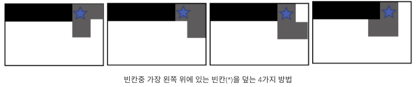
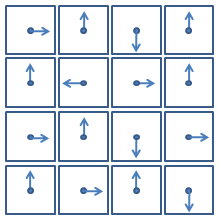

# 6 무식하게 풀기

## 6.1 도입
프로그래밍 대회에서 대부분의 사람들이 가장 많이 하는 실수는 쉬운 문제를 어렵게 푸는 것입니다. <br>
이런 실수를 피하기 위해 문제를 마주하고 나면 가장 먼저 스스로에게 물어봅시다.<br>
`무식하게 풀 수 있을까?`

    무식하게 푸는 알고리즘을 가리켜 흔히 완전 탐색(exhaustive search)라고 부릅니다.

실제로 프로그래밍 대회에서도 프로그램을 빠르고 정확하게 구현하는 능력을 검증하기 위해 입력의 크기를 작게 제한한 문제들이 흔히 출제되며, 완전 탐색은 더 빠른 알고리즘의 기반이 되기도 하기 때문에 완전 탐색에 대해 잘 익혀 둘 필요가 있습니다.

## 6.2 재귀 호출과 완전 탐색
`재귀 호출`

범위가 작아지면 작아질수록 각 조각들의 형태가 유사해지는 작업들을 많이 볼 수 있습니다. 이런 작업을 구현할 때 유용하게 사용되는 개념이 바로 재귀 함수(recursive function) 또는 재귀 호출(recursion)입니다.

    재귀함수란 자신이 수행할 작업을 유사한 형태의 여러 조각으로 쪼갠 뒤 그중 한 조각을 수행하고, 나머지를 자기 자신을 호출해 실행하는 함수를 가리킵니다.

재귀 호출은 다양한 알고리즘을 구현하는 데 매우 유용하게 사용할 수 있는 도구입니다.

`예제: 중첩 반복문 대체하기`

0번부터 차례대로 번호 매겨진 n개의 원소 중 네 개를 고르는 모든 경우를 출력하는 코드를 작성해보자.

4중 for문을 이용하면 간단하게 구현 가능하다.
```cpp
for(int i=0;i<n;i++){
    for(int j=i+1;j<n;j++){
        for(int k=j+1;k<n;k++){
            for(int l=k+1;l<n;l++){
                cout<<i<<' '<<j<<' '<<k<<' '<<l<<'\n';
            }
        }
    }
}
```

만약 다섯 개를 골라야 하는 경우라면 어떻게 할까? 5중 for문?

그럼 여섯개, 일곱개, ... , 열개는? 또 for문?

위와 같은 중첩 for문은 골라야 할 원소의 수가 늘어날수록 코드가 길고 복잡해지는데다, 골라야할 원소의 수가 입력에 따라 달라질 수 있는 경우에는 사용할 수 없다는 문제가 있습니다.

재귀 호출은 이런 경우에 단순한 반복문보다 간결하고 유연한 코드를 작성할 수 있도록 해줍니다.

위 코드 조가가이 하는 작업을 4개의 조각으로 나눌 수 있습니다. 각 조각에서 한 원소를 고릅니다. 고른뒤, 남은 원소들을 고르는 작업을 자기 자신을 호출해 떠넘기는 재귀 함수를 작성합니다.

```cpp
void pick(int n, vector<int>& picked, int toPick){
    if(toPick == 0) {printPicked(picked); return;}

    int smallest = picked.empty()?0:picked.back()+1;

    for(int next = smallest;next<n;next++){
        picked.push_back(next);
        pick(n, picked, toPick-1);
        picked.pop_back();
    }
}
```

위 재귀 함수는 중첩 for문과 달리 n개의 원소 중에서 몇개를 고르든지 사용할 수 있다는 장점이 있습니다.

---

`완전 탐색 레시피`

어떤 문제를 완전 탐색으로 해결하기 위해 필요한 과정은 대략 다음과 같습니다.

1. 완전 탐색은 존재하는 모든 답을 하나씩 검사하므로, 걸리는 시간은 가능한 답의 수에 정확히 비례합니다. 최대 크기의 입력을 가정했을 때 답의 개수를 계산하고 이들을 모두 제한시간안에 생성할 수 있을지를 가늠합니다. 만약 시간 안에 계산할 수 없다면 다른 최적화 설계 패러다임을 적용해야 합니다.

2. 가능한 모든 답의 후보를 만드는 과정을 여러 개의 선택으로 나눕니다. 각 선택은 답의 후보를 만드는 과정의 한 조각이 됩니다.

3. 그중 하나의 조각을 선택해 답의 일부를 만들고, 나머지 답을 재귀 호출을 통해 완성합니다.

4. 조각이 하나밖에 남지 않은 경우, 혹은 하나도 남지 않은 경우에는 답을 생성했으므로, 이것을 기저 사례(base case)로 선택해 처리합니다.

`이론적 배경: 재귀 호출과 부분 문제`

재귀 호출을 공부하면서 짚고 넘어가야 할 중요한 개념 중의 하나로 문제(problem)와 부분 문제(sub problem)의 정의가 있습니다.

    `문제`란 항상 수행해야 할 작업과 그 작업을 적용할 자료의 조합을 의미합니다.

    `부분 문제`란 원래 문제에서 한 조각을 떼어낸, 형식이 같은 또 다른 문제를 푼 결과를 의미합니다.

## 6.3 문제: 소풍

n과 m이 주어지고, m개의 숫자 쌍이 주어진다. n은 사람의 수, m은 친구 쌍의 수

숫자 쌍이 의미하는 것은, 해당 두 숫자는 친구 - 옆에 붙어있을 수 있음

친구가 아닌 숫자들은 붙으면 안된다.

이때 가능한 경우의 수는?

## 6.4 풀이: 소풍

첫번째 접근

그냥 0부터 n-1까지 2중 for문을 두명씩 탐색하는데 두명이 친구라면, 둘이 짝지어주고, 다음 재귀함수로 떠넘긴다.

위 접근은 중복때문에 정답이 아니다. - (0,1) , (2,3) == (1,0) , (2,3) == (2,3) , (0,1)

그래서 중복을 제거하기 위해 무조건 i번째 사람은 i보다 번호가 높은 사람이랑 짝지어 준다.

    이는 2장에서 설명한 체계적인 접근을 하기 위한 방법 중 하나를 사용한 것이다.
    `순서를 강제할 수 있을까?`

    무조건 다음 번호의 친구랑 짝지어 주도록 하여(순서를 강제) 중복을 제거한다.

```cpp
int n;
bool areFriends[10][10];

int countPairings(bool taken[10]){
    int firstFree = -1;
    for(int i=0;i<n;i++){ // 짝이 없는 사람 search
        if(!taken[i]){
            firstFree = i;
            break;
        }
    }

    if(firstFree == -1) return 1; // 모두 짝지어있음
    int ret = 0;
    for(int pairWith = firstFree+1;pairWith<n;pairWith++){
        if(!taken[pairWith] && areFriends[firstFree][pairWith]){
            taken[firstFree] = taken[pairWith] = true;
            ret += countPairings(taken);
            taken[firstFree] = taken[pairWith] = false;
        }
    }
    return ret;
}
```

`답의 수의 상한`

이 문제에서 최종 답의 개수는 최대 $9*7*5*3*1 = 945$ 입니다. (n < 10)

## 6.5 문제: 게임판 덮기

H x W 크기의 게임판이 있습니다. 여기서 #은 벽이고, *은 빈 공간인데, 빈 공간을 블럭이 세개짜리인 L모양의 블럭으로 모두 채우고 싶습니다.

가능한 경우의 수는 몇가지 일까요? (H,W <= 20, 빈 칸은 최대 50개)

## 6.6 풀이: 게임판 덮기

여기서도 순서를 강제해야 중복이 제거됩니다.

가장 간편한 방법은 재귀 호출의 각 단계마다 아직 빈 칸 중에서 가장 윗 줄, 그 중에서도 가장 왼족에 있는 칸을 덮도록 하는 것입니다.

    우리는 항상 빈 칸 중에서 가장 위, 그중에서도 가장 왼쪽에 있는 칸을 처음 채운다고 가정하기 때문에, 
    `그 왼쪽과 위에 있는 칸은 항상 이미 채워져 있다고 가정할 수 있습니다`

특정 칸을 채우는 방법은 4가지입니다. 



특정 칸을 4가지 중하나로 채우고, 보드의 상태를 재귀함수로 호출해주면 되겠네요.

`시간복잡도`

모든 빈칸을 채우는 데 필요한 블럭 = 50/3 = 16

따라서 시간복잡도: $4^{16} = 2^{32}$

> 하지만 경우의수를 따지면, 실제 시간은 그렇게 오래거릴지 않습니다.

## 6.7 최적화 문제

지금까지 다뤘던 문제와 달리 문제의 답이 하나가 아니라 여러 개이고, 그 중에서 어떤 기준에 따라 가장 좋은 답을 찾아 내는 문제들을 통칭해 최적화 문제라고 부릅니다.

이 문제를 해결하는 방법 중 가장 기초적인 것이 완전 탐색입니다.<br>
가능한 답을 모두 생성해 보고 그중 가장 좋은 것을 찾아내면 되기 때문입니다.

## 6.8 문제: 시계 맞추기



위와 같이 4x4 격자 형태로 배치된 16개의 시계가 있습니다.

그리고 10개의 스위치가 주어지는데, 이 스위치를 누르면 몇몇 시계의 시간이 3시간씩 바뀝니다. (3 -> 6 -> 9 -> 12)

|스위치 번호|연결된 시계들 번호|
|--|--|
|0|0, 1, 2|
|1|3, 7, 9, 11|
|2|4, 10, 14, 15|
|3|0, 4, 5, 6, 7|
|4|6, 7, 8, 10, 12|
|5|0, 2, 14, 15|
|6|3, 14, 15|
|7|4, 5, 7, 14, 15|
|8|1, 2, 3, 4, 5|
|9|3, 4, 5, 9, 13|

스위치를 이용해서 모든 시계를 12시로 맞추고 싶다면 스위치를 최소 몇번 눌러야 할까요?

## 6.9 풀이: 시계 맞추기

이 문제를 있는 그대로 풀려고 하면 꽤나 복잡합니다. 그러나 문제의 특성을 이용해 적절히 단순화하면 완전 탐색으로 해결할 수 있습니다.

    1. 스위치를 누르는 순서는 중요하지 않다
    2. 시계는 12시간이 지나면 제자리로 돌아온다. -> 어떤 스위치건 최대 세번 이상 누를 일이 없다. -> 스위치를 누르는 횟수는 0 ~ 3
>
    처음에는 2번 특징이 바로 와닿지 않았다.
    여러개의 스위치들이 담당하는 시계가 겹칠때도 3번이하로 가능할까?

    만약 A 스위치가 담당하는 시계가 1,2 이고,
    B 스위치가 담당하는 시계가 2,3 인데,
    1은 6시, 3은 9시라면
    A는 무조건 (2+4*k)번 눌러야 하고, B는 무조건 (1+4*k)번 눌러야 한다.

    그럼 2번 시계는 3시간씩 (3+8*k)번 돌아간다. (A,B 스위치를 누른만큼)
    이때 2번 시계가 가능한 시간은 3시밖에 없다. (8*k는 무조건 4의 배수)

    이때 2번 시계가 3시가 아니라면 그냥 그 문제는 답이 없는 문제이다.
    (스위치를 4번 누르면 시계가 제자리로 돌아오기 때문에)

    여기서 알 수 있는건 특정 시계가 담당하는 스위치가 겹쳐도, 결국 4번 누르면 돌아오기 때문에 스위치는 3번이하로 눌러야 한다.

따라서 이 문제의 시간복잡도는 $4^{10}$ 입니다.

완전 탐색으로 무난하게 풀 수 있습니다.

## 6.10 많이 등장하는 완전 탐색 유형

`모든 순열 만들기`

서로 다른 N개의 원소를 일렬로 줄 세운 것을 순열(permutation)이라고 부릅니다.

주어진 원소의 모든 순열을 생성해수 풀 수 있는 문제는 꽤 자주 만날 수 있습니다.

    따라서 모든 순열을 생성하는 코드를 한번 신경써서 작성해보면 좋습니다.

    단 가능한 순열의 수는 N!이 되는데, N이 10을 넘어간다면 시간복잡도가 말도 안되므로, 다른 방법을 생각해야 합니다.

    c++의 STL에 포함된 next_permutation() 함수는 모든 순열을 순서대로 생성하는 작업을 해줍니다.

`모든 조합 만들기`

N개의 원소중에서 R개를 순서없이 골라낸 것을 조합(combination)이라고 부릅니다.<br>
재귀 호출을 이용하면 손쉽게 가능합니다. (6.3 코드 참고)

`2^n가지 경우의 수 만들기`

n개의 질문에 대한 답이 예/아니오 중의 하나라고 할 때 존재할 수 있는 답의 모든 조합의 수는 $2^n$가지 입니다.