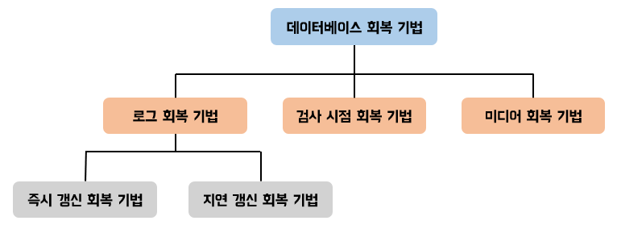
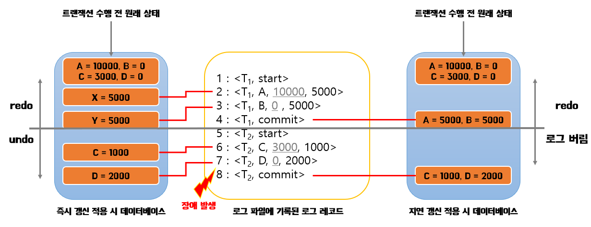

## DB 세션(session)

클라이언트와 DB가 연결되어 있는 상태

> 세션 vs 커넥션
> 
> 커넥션(connection)  
> DB에 대한 물리적인 경로, 클라와 DB 서버 간의 네트워크 연결이 이루어질 때, 이를 커넥션이라 한다.  
> (사용자가 DB에 접속하려면 먼저 커넥션을 만들어야 한다, 일반적으로 TCP/IP를 통해 생성)
> 
> 세션  
> DB에 대한 논리적인 경로  
> 커넥션이 만들어진 이후의 상호작용  
> 사용자가 DB에 로그인하여 연결을 생성하면, 그 연결에 대한 세션도 생성됨  
> 세션은 사용자의 DB 작업이 이루어지는 동안 유지됨  
> 로그아웃하면 세션도 종료  
> 세션 내에서 사용자의 모든 트랜잭션, 쿼리 등의 작업이 이루어짐

---

## 트랜잭션

데이터베이스의 작업 단위,  
하나의 논리적 작업을 수행하기 위한 일련의 연속된 명령들을 의미한다.

### 트랜잭션의 목적

여러 단계로 이루어진 작업들을 하나의 논리적인 단위로 묶어, 데이터베이스의 상태를 일관성 있게 변화시키는 것

---

### 트랜잭션 실행 과정

시작 - 수행 - 커밋/롤백

커밋: 트랜잭션의 성공적인 완료, 커밋을 통해 트랜잭션의 결과가 DB에 영구적으로 반영

롤백: 트랜잭션의 실패 or 중단, 롤백을 통해 트랜잭션이 시작되기 전 상태로 되돌려진다.  
(트랜잭션의 변경 사항을 반영하지 않음)

> 오토커밋 - 트랜잭션의 자동 완료를 의미  
> 오토 커밋이 활성화되면, 각 SQL 문장이 별도의 트랜잭션으로 간주되어 자동으로 커밋/롤백이 수행된다.
> 
> start transaction 명령을 주면, 오토커밋은 off된다.  
> 커밋/롤백과 함께 해당 트랜잭션이 종료되면, 다시 오토커밋이 on된다.

---

## 트랜잭션의 속성(ACID)

원자성 (Atomicity), 일관성 (Consistency), 고립성 (Isolation), 지속성 (Durability)

> ACID 속성은 데이터베이스 시스템이 안정성과 신뢰성을 유지하며 데이터의 무결성을 보장하는 데 중요한 역할을 한다.  
> 이러한 속성은 트랜잭션 처리 과정에서 데이터베이스의 일관성과 신뢰성을 확보하며, 데이터 손실을 방지한다.

---

### 원자성 (Atomicity)

트랜잭션은 원자적이어야 한다.  
즉, 트랜잭션 내의 모든 작업은 전체가 성공하거나 실패해야 한다  
(하나의 작업이라도 실패하면 트랜잭션 전체가 실패하고, 모든 작업이 성공했을 때만 트랜잭션이 성공적으로 완료된다)

---

### 일관성 (Consistency)

트랜잭션이 완료된 후에도 데이터베이스는 일관된 상태를 유지해야 한다.  
(트랜잭션의 시작 전과 후에 정의된 모든 제약 조건을 만족해야 함)

예시 - 은행 계좌이체 후에 내 계좌 잔액이 마이너스가 되면 안된다.

---  

### 고립성 (Isolation)

동시에 여러 트랜잭션이 실행될 때 영향을 주지 않도록 보장해야 한다.  
(여러 트랜잭션이 동시에 실행되더라도, 각각의 트랜잭션은 다른 트랜잭션에 영향을 받지 않고 독립적으로 수행되는 것처럼 보여야 한다)

---

### 지속성 (Durability)

트랜잭션이 성공적으로 완료되면 그 결과는 영구적으로 저장되어야 한다.  
시스템 장애 또는 다시 시작되더라도 트랜잭션의 결과는 손실되지 않아야 한다.

---

## 트랜잭션의 격리 수준

하나의 트랜잭션 내에서 또는 여러 트랜잭션 간의 작업 내용을  
어떻게 공유하고 차단할 것인지를 결정하는 레벨

4가지가 있다.  
(READ UNCOMMITED, READ COMMITED, Repeatable Read, Serializable)

---

### READ UNCOMMITTED

트랜잭션의 변경 내용이 커밋이나 롤백 여부애 상관없이 다른 트랜잭션에서 보여지는 격리 수준

Dirty Read 문제가 있다.

> Dirty Read  
> 어떤 트랜잭션에서 처리한 작업이 완료되지 않았는데도,  
> 다른 트랜잭션에서 해당 (미완성) 데이터를 볼 수 있게 되는 현상
> 
> 이 현상은 데이터가 나타났다가 사라졌다 하는 현상을 초래하므로,  
> 개발자와 사용자를 상당히 혼란스럽게 만든다.

> 데이터 정합성에 문제가 많은 격리 수준

---

### READ COMMITED

어떤 트랜잭션에서 데이터를 변경했더라도 커밋이 완료된 데이터만 다른 트랜잭션에서 조회할 수 있는 격리 수준

데이터를 조회할 때, 다른 트랜잭션에서 해당 데이터를 수정했을 경우(커밋은 아직 안함)  
수정되기 전의 데이터가 조회된다.

> (커밋은 하지 않았지만) 트랜잭션을 통해 데이터를 변경하면, 이전 데이터를 Undo 영역에 저장된다. (백업)  
> 다른 트랜잭션에서 해당 데이터를 조회하면, Undo 영역의 데이터가 조회된다.  
> 
> 처음 트랜잭션이 변경된 내용을 커밋하면,  
> 그때부터는 다른 트랜잭션에서도 백업된 데이터가 아니라 새롭게 변경된 데이터가 조회된다.
> 
> Undo 영역의 데이터(Undo 레코드)는  
> 트랜잭션의 격리 수준을 보장하기 위한 용도뿐 아니라  
> 트랜잭션의 롤백에 대한 복구에도 사용된다.

이 레벨부터는 Dirty Read가 발생하지 않는다.  
하지만 Non-Repeatable Read 문제가 있다.

> Non-Repeatable Read  
> 한 트랜잭션 내에서 같은 튜플을 조회했을 때, 동일함을 보장할 수 없다는 문제
> (트랜잭션 내에서 같은 튜플을 한번 더 조회하기 전에, 다른 트랜잭션에의 커밋을 통해 해당 데이터가 변경될 수 있다)
> 
> 일반적인 웹 프로그램에서는 크게 문제가 되지는 않지만,  
> 은행의 입출금 같은 서비스에서 치명적인 문제가 될 수 있다.

---

### REPEATABLE READ

동일 트랜잭션 내에서는 동일한 결과를 보여주는 격리 수준

이 격리 수준부터는 Non-Repeatable Read 문제가 발생하지 않는다.  
하지만 Phantom Read 문제가 있다.  
(MySQL의 InnoDB는 발생하지 않음)

> Phantom Read  
> 다른 트랜잭션에서 수행한(커밋된) 변경 작업에 의해, 같은 쿼리에 대한 결과에 새 행이 삽입되거나 제거될 때 발생하는 문제
> 
> 일반 select 쿼리는 문제가 없지만,  
> select ... for update에서 문제가 발생한다.  
> 
> select ... for update 쿼리는 select하는 레코드에 쓰기 잠금을 걸어야 하는데,  
> 언두 레코드에는 잠금을 걸 수 없다.  
> -> 이 쿼리로 조회되는 레코드는 언두 영역의 변경 데이터x, 현재 레코드의 값을 가져오게 된다.  
> (현재 레코드의 값은 다른 트랜잭션의 커밋으로 인해 변경될 수 있음)

> MySQL InnoDB의 기본 트랜잭션 격리 수준이  
> Repeatable Read이다.

---

### SERIALIZABLE

가장 단순한 격리 수준이지만, 가장 엄격한 격리 수준  
(동시 처리 성능도 다른 트랜잭션 격리 수준보다 떨어진다)

한 트랜잭션에서 `읽고` 쓰는 레코드를 다른 트랜잭션에서는 절대 접근할 수 없는 격리 수준

Phantom Read 문제가 발생하지 않는다.

> 하지만 InnoDB 스토리지 엔진에서는 REPEATABLE READ 격리 수준에서도  
> 이 문제가 발생하지 않기 때문에, 굳이 SERIALIZABLE 격리 수준을 사용할 필요가 없다.

---

### Non-Repeatable Read vs Phantom Read

Non-Repeatable Read는 트랜잭션이 다른 트랜잭션에서 커밋된 업데이트를 읽는 경우  
이제 동일한 행은 거래가 시작되었을 때와 다른 값을 갖는다.

Phantom Read는 유사하지만 다른 트랜잭션에서 커밋된 INSERT 또는 DELETE 된 테이블을 읽을 때 발생한다.  
거래를 시작한 이후 새로운 행이나 사라진 행이 있다.

---

InnoDB는 트랜잭션이 롤백될 가능성에 대비해 변경되기 전 레코드를 Undo 공간에 백업해두고 실제 레코드 값을 변경한다.  

`MVCC(Multi Version Concurrency Control)`  
하나의 레코드에 대해 다양한 버전을 가지고 있다.  
(필요에 따라 어느 버전의 데이터가 보여지는지는 여러 가지 상황(격리 수준)에 따라 다르다)

---

## DB 락(Lock)

DB의 동시성 제어를 위해 필요한 기능

> DB 동시성 제어
>
> 여러 트랜잭션들이 동시에 수행될 때, 데이터의 일관성을 해치지 않도록 데이터 접근을 제어하는 것
> 
> 동시성 제어 없이, 두개 이상의 트랜잭션이 동시에 write 연산을 진행시 갱신 손실 문제 등이 발생할 수 있다.
> 
> > 갱신 손실 문제
> > 
> > 하나의 트랜잭션이 갱신한 내용을 다른 트랜잭션이 덮어씀으로써 갱신이 무효화가 되는 것을 의미  
> > (두 개의 트랜잭션이 한 개의 데이터를 동시에 갱신(Update)할 때 발생)

---

## 락의 종류

락은 적용 방식, 범위에 따라 구분된다.

---

`1. 락의 적용 방식`

### 낙관 락(Optimistic Lock)
데이터 갱신시 충돌이 발생하지 않을 것으로 예상하므로 우선적으로 락을 걸지는 않음(비선점적)  
버전을 이용해 관리. 조회를 다시 수행했을 때 버전이 다르면 예외를 터트림. (예방이 아닌 사후 처리)

> 트랜잭션은 락을 획득하지 않고 읽은 후에 충돌을 확인하고 처리

예시 - JPA에서 @Version을 사용하면 낙관 락이 적용된다.

### 비관 락(Pessimistic Lock)
데이터 갱신시 충돌이 계속 발생할 것으로 예상하므로 조회를 할때부터 우선적으로 락을 검(선점적)  
데드락이 발생할 수 있음(아래에서 설명)

> 비관 락은 두가지로 나뉜다.
>
> 공유 락(Shared Lock): 읽기는 동시에 되지만 수정, 삭제 (Update, Delete) 은 락으로 막음  
> 베타 락(Exclusive Lock) 읽기, 수정, 삭제 모두 락으로 막음

---

`2. 락의 범위`

### 글로벌 락

데이터베이스 전체에 대한 락  
하나의 트랜잭션이 전체 데이터베이스에 대한 락을 설정하면, 다른 트랜잭션들은 해당 데이터베이스에 접근할 수 없다.

### 테이블 락

테이블에 대한 락  
특정 트랜잭션이 특정 테이블에 대한 락을 설정하면, 다른 트랜잭션들은 해당 테이블에 대한 작업을 할 수 없다.

### 레코드 락

특정 레코드에 대한 락  
트랜잭션이 특정 레코드에 대한 락을 설정하면, 다른 트랜잭션들은 해당 레코드에 대한 작업을 할 수 없다.

### 갭 락

인덱스의 범위에 대한 락  
주로 범위 쿼리에서 사용되며,  
특정 범위의 레코드에 대한 락을 설정하여 다른 트랜잭션이 해당 범위에 새로운 레코드를 추가하지 못하도록 한다.

---

> 트랜잭션의 격리 수준과 락의 차이점이 뭘까
> 
> 격리 수준, 락을 각각 공부했을 때는 이해가 되는데,  
> 같이 봤을 때는 좀 헷갈린다.

`트랜잭션과 락의 차이점`

락(Lock)은 `동시성 제어`를 위한 기능이고,  
트랜잭션 격리 수준은 여러 트랜잭션 간의 작업 내용을 어떻게 공유하고 차단할 것인지를 결정하는 레벨을 의미한다.

> 두가지가 헷갈리는 이유가 SERIALIZABLE 때문이다.
> 
> 다른 격리 수준과 다르게 SERIALIZABLE 격리 수준은,  
> 한 트랜잭션에서 접근하는 레코드를 다른 트랜잭션에서는 절대 접근할 수 없게 하는 격리 수준이기 때문에,  
> 락과 헷갈리게 된 것 같다.  
> (살짝 겹치는 부분이 있는 것 같다)

---

## DB 데드락

DB에서 둘 이상의 트랜잭션이 서로, 상대방이 락을 포기하기를 기다리는 상황

### 데드락을 해결하기 위한 방법

1. 데드락 감지  
   트랜잭션 시작 요청을 했을 때, 일정시간 이후에도 트랜잭션이 실행되지 않을 경우, 롤백
2. wait-die/wound wait 방법  
   타임스탬프를 기점으로 트랜잭션을 대기, 선점, 종료하는 방식

> wait-die vs wound wait
> 
> wait-die(대기하거나 죽이거나): 데드락 방지를 위한 비선점 기법  
> T5, T10, T15 가 있을 때  
> T10이 데이터를 보유하고 있을 때, 해당 데이터를 T5가 요청하면 기다린다.(wait)  
> T15가 해당 데이터를 요청하면 죽는다.(die) - 롤백된다
> 
> wound wait(상처를 주거나 기다리거나): 데드락 방지를 위한 선점 기법  
> T5, T10, T15 가 있을 때  
> T10이 데이터를 보유하고 있을 때, 해당 데이터를 T5가 요청하면 T5가 해당 데이터를 선점하고,  
> T10은 롤백된다. (wound)  
> T15가 해당 데이터를 요청하면 기다린다. (wait)

이 외에도 다양한 방법이 있다.

---

## DB 회복

트랜잭션들을 수행하는 도중 장애로 인해 손상 된 데이터베이스를 손상되기 이전의 정상적인 상태로 복구시키는 작업

회복 기법은 크게 3가지로 나뉜다.
1. 로그 회복 기법
2. 체크포인트 회복 기법
3. 미디어 회복 기법

---

데이터 회복의 핵심 원리는 데이터 중복이다.   
데이터를 별도의 장소에 미리 복사해두고, 장애로 문제가 발생했을 때 복사본을 이용해 원래의 상태로 복원하는 것이다.  
이를 위해 덤프 또는 로그 방법을 사용해 데이터를 복사해두었다가 회복시킬 때 복사본을 사용한다.

덤프(dump): 데이터베이스 전체를 다른 저장 장치에 주기적으로 복사하는 방법  
로그(log): 데이터베이스에서 변경 연산이 실행될 때마다 데이터를 변경하기 이전 값과 변경한 이후의 값을 별도의 파일에 기록하는 방법|

---

> 장애가 발생했을 때,  
> 덤프나 로그 방법으로 중복 저장한 데이터를 이용해 데이터베이스를 복구하는 가장 기본적인 방법은 redo나 undo 연산을 실행하는 것이다.

### Redo & Undo 

Redo(재실행): 트랜잭션 로그를 이용하여 오류가 발생한 트랜잭션을 재실행하여 복구 수행  
Undo(취소): 트랜잭션 로그를 이용하여 오류와 관련된 모든 변경을 취소하여 복구 수행

---

### 로그 기반 회복 기법

로그를 이용한 회복 기법은 데이터를 변경한 연산 결과를 데이터베이스에 반영하는 시점에 따라 두 가지로 나뉜다.  
(로그 파일에 로그 레코드를 먼저 기록한 후 데이터베이스에서 변경 연산을 수행한다)

`1. 즉시 갱신 회복 기법`  
(연산의 결과를 즉시 로그 파일과 DB에 반영한다)   
트랜잭션 완료 후 장애가 발생했다면, redo 연산 진행  
트랜잭션 진행 중 장애가 발생했다면, undo 연산 진행  
(이미 DB에 즉시 갱신했기 때문에 취소해야 한다)

`2. 지연 갱신 회복 기법`  
(연산의 결과를 로그 파일에 기록하고, 커밋하면 전체를 DB에 반영한다)
트랜잭션 완료 후 장애가 발생했다면, redo 연산 진행  
트랜잭션 진행 중 장애가 발생했다면, 연산x 로그 버림  
(완료되지 않았기 때문에(DB에 반영 안됨) 연산할 필요없다)

### 체크포인트 회복 기법

체크포인트 회복 기법은 로그 회복 기법과 같은 방법으로 로그 기록을 이용하되,  
일정 시간 간격으로 검사 시점(Checkpoint)을 만들어둔다.  
그리고 장애가 발생하면 가장 최근 검사 시점 이전의 트랜잭션에는 회복 작업을 수행하지 않고, 이후의 트랜잭션에만 회복 작업을 수행한다.

### 미디어 회복 기법

덤프를 이용하는 기법

디스크 장애가 발생하면 가장 최근에 복사해둔 덤프를 이용해 장애 발생 이전의 일관된 데이터베이스 상태로 복구한다.  
그런 다음 필요에 따라 로그의 내용을 토대로 redo 연산을 실행한다.

> 전체 데이터베이스를 다른 저장 장치에 복사하는 것은 비용이 많이 들고  
> 복사하는 동안에 트랜잭션 수행을 중단해야 하므로  
> 미디어 회복 기법은 CPU가 낭비된다는 단점이 있다.

---

## (Appendix) InnoDB에서 REPEATABLE READ 격리 수준에서도 Phantom Read가 발생하지 않는 이유

`핵심은 InnoDB의 Next-Key Lock 덕분`

### Next-Key Lock

레코드 락과 갭 락을 합친 락  
특정 Row를 변경하는 경우 해당 Row에는 Record Lock이, 그리고 다음 Record 까지의 구간에는 Gap Lock을 설정됨  
(하지만 실제 테스트를 해 보면, 변경이 발생하는 앞 뒤 구간에 모두 Gap Lock이 설정된다고 한다...)