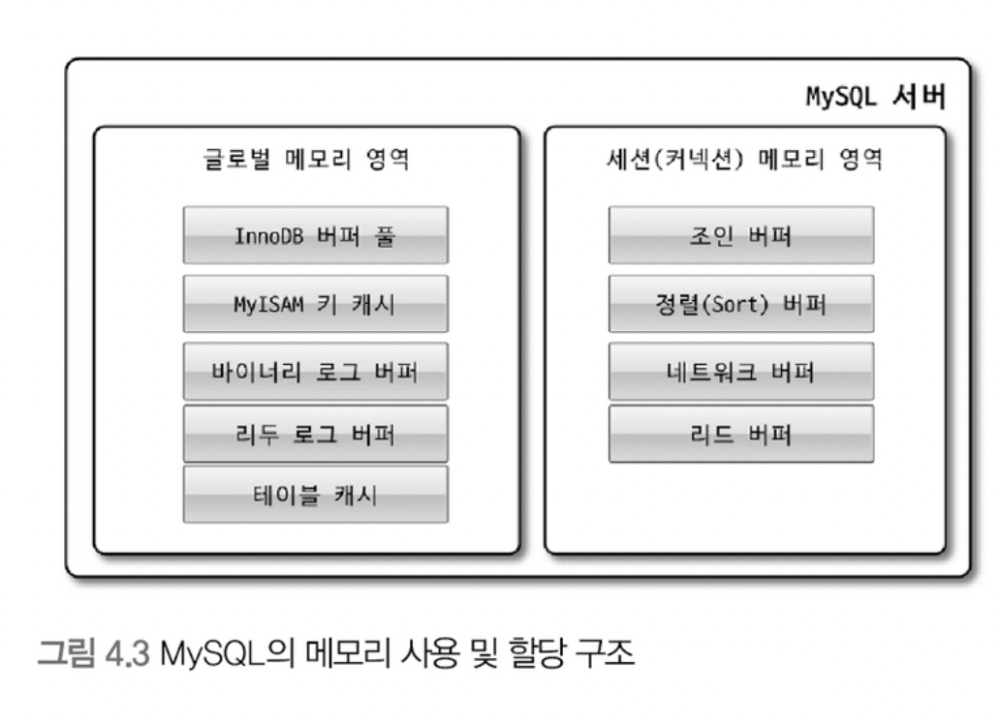

# MySQL 아키텍쳐 구조

mysql 서버는 사람의 머리 역할을 담당하는 MYSQL 엔진과 손발 역할을 담당하는 스토리지 엔진으로 구분된다.

> 스토리지 엔진은 핸들러 API만 만족하면 따로 구현 가능하다.

## MySQL 엔진 아키텍쳐

MySQL 엔진은 클라이언트로부터 접속 및 쿼리 요청을 처리하는 커넥션 핸들러와 SQL 파서 및 전처리기, 쿼리의 최적화된 실행을 위한 옵티마이저가 중심을 이룬다.
MYSQL 엔진은 요청된 SQL 문장을 분석, 최적화 하는 처리를 수행하고,
실제 데이터를 디스크 스토리지에 저장하거나 읽어오는 부분은 스토리지 엔진이 전담한다.

MYSQL 엔진의 쿼리 실행기에서 데이터를 쓰거나 읽어야 할때는 각 스토리지 엔진에 
쓰기/읽기를 요청하는데, 이러한 요청을 핸들러 요청이라 하고,
사용되는 API를 핸들러 API라고 한다.

### MySQL 스레딩 구조

MYSQL 서버는 스레드 기반으로 작동한다.

포그라운드 스레드와 백그라운드 스레드로 구분할 수 있다.

`포그라운드 스레드`

포그라운드 스레드는 MYSQL 서버에 접속한 클라이언트의 수만큼 존재
요청하는 쿼리 문장을 처리
(사용자 스레드 == 포그라운드 스레드)

클라가 커넥션 종료하면 담당하던 스레드는 다시 스레드 캐시로 돌아간다.

포그라운드 스레드는 데이터를 MYSQL의 버퍼나 캐시로부터 가져오며,  
버퍼나 캐시에 없는 경우에는 직접 디스크의 데이터나 인덱스 파일로부터 데이터를 읽어와서 작업을 처리한다.
(이때 InnoDB는 백그라운드 스레드가 버퍼로부터 디스크까지 기록하는 작업을 처리한다고 한다)

`백그라운드 스레드`

InnoDB는 다음과 같은 여러 가지 작업이 백그라운드로 처리된다.
- 인서트 버퍼(Insert Buffer)를 병합하는 스레드
- 로그를 디스크로 기록하는 스레드 (!)
- InnoDB 버퍼 풀의 데이터를 디스크에 기록하는 스레드 (!)
- 데이터를 버퍼로 읽어 오는 스레드
- 잠금이나 데드락을 모니터링하는 스레드

( (!) 이 중요 )

### 메모리 할당 및 사용 구조

크게 글로벌 메모리 영역과 로컬 메모리 영역으로 구분할 수 있다.

`글로벌 메모리 영역`
- 테이블 캐시
- InnoDB 버퍼 풀
- InnooDB 어댑티브 해시 인덱스
- InnoDB 리두 로그 버퍼

글로벌 메모리 영역은 MySQL 서버가 시작되면서 운영체제로부터 할당된다.  
클라이언트 스레드의 수와 무관하게 하나의 메모리 공간만 할당된다.

`로컬 메모리 영역`  
(세션 메모리 영역이라고도 표현한다)
- 정렬 버퍼
- 조인 버퍼
- 바이너리 로그 캐시
- 네트워크 버퍼

클라이언트 스레드가 쿼리를 처리하는 데 사용하는 메모리 영역이다.  
(각 로컬 메모리 영역은 공유가 안된다)

> 로컬 메모리 영역의 중요한 특징은  
> 각 쿼리의 용도 별로 필요할 때만 공간이 할당되고  
> 필요하지 않은 경우에는 MySQL이 메모리 공간을 할당조차도 하지 않을 수 있다.

### 쿼리 실행 구조

`쿼리 파서`  
사용자 요청으로 들어온 쿼리 문장을 토큰(MySQL이 인식할 수 있는 최소 단위)  
으로 분리해 트리 형태의 구조로 만들어 내는 작업  
(쿼리 문장의 기본 문법 오류는 이 과정에서 발견된다)

`전처리기`  
파서 과정에서 만들어진 파서 트리를 기반으로 쿼리 문장에 구조적인 문제점이 있는지 확인한다.  
(해당 객체의 존재 여부, 접근 권한 확인)

`옵티마이저`  
어떻게 쿼리 문장을 저렴한 비용으로 가장 빠르게 처리할지를 결정하는 역할  
(실행 계획 수립)

`실행 엔진`  
만들어진 실행 계획대로 각 핸들러에게 요청해서 받은 결과를  
또 다른 핸들러 요청의 입력으로 연결하는 역할

`핸들러(스토리지 엔진)`  
실행 엔진의 요청에 따라 데이터를 디스크로 저장하고 디스크로부터 읽어 오는 역할

> 옵티마이저가 두뇌라면 실행 엔진과 핸들러는 손과 발

## InnoDB 스토리지 엔진 아키텍처

> InnoDB는 MySQL에서 사용할 수 있는 스토리지 엔진 중 거의 유일하게 레코드 기반의 잠금을 제공,  
> 그 때문에 높은 동시성 처리가 가능하고 안정적이고 성능이 뛰어나다

`InnoDB 스토리지 엔진의 주요 특징들`

### PK에 의한 클러스터링

InnoDB의 모든 테이블은 기본적으로 PK를 기준으로 클러스터링 되어 저장된다.  
(Clustered Index)

-> 테이블의 레코드가 PK 순서대로 디스크에 저장된다.
-> 모든 세컨더리 인덱스는 레코드의 주소 대신 PK의 값을 사용한다.

> 쿼리의 실행 계획에서 PK는 기본적으로 다른 보조 인덱스에 비해 높게 설정된다.  
> (보조 인덱스보다 PK가 선택될 확률이 높다)

### 외래 키 지원

InnoDB에서 외래 키는 부모 테이블과 자식 테이블 모두 해당 칼럼에 인덱스 생성이 필요하고,  
변경 시에는 반드시 두 테이블에 데이터가 있는지 체크하는 작업이 필요하므로,  
잠금이 여러 테이블로 전파되고, 그로 인해 데드락이 발생할 수 있다.

### MVCC(Multi Version Concurrency Control)

(Multi Version: 하나의 레코드에 대해 여러 개의 버전이 동시에 관리된다)

InnoDB는 언두 로그를 이용해 이 기능을 구현한다.

(예시)
UPDATE member SET m_area='경기' where m_id=12;
위 쿼리가 실행되면 아래 그림처럼 된다.

UPDATE 문장이 실행되면 커밋 실행 여부와 관계없이  
버퍼 풀은 새로운 값인 '경기'로 업데이트 되고,  
언두 로그에 기존 값인 '서울'이 저장된다.

이때 다른 사용자가 해당 레코드를 조회한다면,  
이때의 결과는 격리 수준에 따라 달라진다.
(READ_UNCOMITTED는 버퍼 풀의 결과가 나오고, 나머진 언두 로그의 데이터가 반환된다)

-> 이러한 과정을 DBMS에서는 MVCC라고 표현한다.

> 만약 트랜잭션이 길어지면 언두에서 관리하는 데이터가 삭제되지 못해,  
> 언두 영역의 공간이 늘어나는 상황이 발생할 수 있다.

### 잠금 없는 일관된 읽기(Non-Locking Consistent Read)

InnoDB 스토리지 엔진은 MVCC 기술을 이용해 잠금을 걸지 않고 읽기 작업을 수행한다.

> 격리 수준이 SERIALIZABLE이 아닌 다른 격리 수준인 경우,  
> INSERT와 연결되지 않은 순수한 읽기(SELECT) 작업은  
> 다른 트랜잭션 UPDATE 작업과 관계없이  
> 항상 Lock을 대기하지 않고 바로 실행된다.

### InnoDB 버퍼 풀(가장 핵심적인 부분)

디스크의 데이터 파일이나 인덱스 정보를 메모리에 캐시해 두는 공간  
쓰기 작업을 지연시켜 일괄 작업으로 처리할 수 있게 해주는 버퍼 역할도 같이 한다.  
(랜덤 I/O를 줄일 수 있다)

InnoDB 스토리지 엔진은 버퍼 풀이라는 거대한 메모리 공간을 페이지 크기의 조각으로 쪼개어 관리한다.
버퍼 풀의 페이지 조각을 관리하기 위해 InnoDB 스토리지 엔진은  
크게 LRU 리스트, 플러시 리스트, 프리 리스트라는 3개의 자료 구조로 관리한다.

LRU(Least Recently Used) 리스트  
최근에 쓰인 페이지들의 목록  
(디스크로부터 한 번 읽어온 페이지를 최대한 오랫동안 버퍼 풀에 유지하기 위해 사용)

프리(Free) 리스트  
버퍼 풀에서 실제 사용자 데이터로 채워지지 않은 비어 있는 페이지들의 목록  
(사용자의 쿼리가 새롭게 디스크의 데이터 페이지를 읽어와야 할 때 사용)

플러시(Flush) 리스트
더티 페이지(Dirty Page)들의 목록
(특정 시점이 되면 디스크에 기록)

### 언두 로그

언두 로그의 목적
1. 트랜잭션 보장 - 롤백 되면 언두 영역을 이용해 복구
2. 격리 수준 보장

### 체인지 버퍼

RDBMS에서 레코드가 INSERT 되거나 UPDATE 될 때는  
데이터 파일을 변경하는 작업 뿐만 아니라  
해당 테이블에 포함된 인덱스를 업데이트하는 작업도 필요하다.

> 인덱스를 업데이트하는 작업은 랜덤하게 디스크를 읽는 작업이 필요하므로  
> 테이블에 인덱스가 많다면, 이 작업은 많은 자원을 소모하게 된다.

InnoDB는 변경해야 할 인덱스 페이지가 버퍼 풀에 있으면 바로 업데이트를 수행하지만,  
디스크로부터 읽어와서 업데이트해야 한다면  
이를 즉시 실행하지 않고 임시 공간에 저장해 두고  
바로 사용자에게 결과를 반환시키는 형태로 성능을 향상시키게 되는데,  
이 임시 공간을 체인지 버퍼(Change Buffer)라고 한다.

> 반드시 중복 여부를 체크해야 하는 유니크 인덱스는  
> 체인지 버퍼를 사용할 수 없다.

> 체인지 버퍼에 의해 나중에 백그라운드 스레드에 의해 병합되는데,  
> 이 스레드를 체인지 버퍼 머지 스레드라고 한다.

### 리두 로그 및 로그 버퍼

대부분 DB 서버는 데이터 변경 내용을 로그로 먼저 기록한다.

DB 서버는 쓰기 비용이 낮은 리두 로그를 가지고 있으며,  
비정상 종료가 발생하면 리두 로그의 내용을 이용해  
데이터 파일을 다시 서버가 종료되기 직전의 상태로 복구한다.

리두 로그를 버퍼링할 수 있는 InnoDB의 버퍼 풀이나,  
로그 버퍼와 같은 자료 구조도 가지고 있다.

> 로그 버퍼의 크기는 기본값이 16MB인데,  
> BLOB이나 TEXT 같이 큰 데이터를 자주 변경하는 경우에는  
> 더 크게 설정하는 것이 좋다.

### 어댑티브 해시 인덱스

사용자가 수동으로 생성하는 인덱스가 아니라,  
InnoDB 스토리지 엔진에서 사용자가 자주 요청하는 데이터에 대해  
자동으로 생성하는 인덱스이다.  
(B-Tree의 검색 시간을 줄여주기 위해 도입된 기능)

어댑티브 해시 인덱스를 이용하면,  
레코드가 저장된 데이터 페이지를 즉시 찾아갈 수 있다.  
(B-Tree의 루트-리프 노드까지 찾아가는 비용이 없어진다)

이 인덱스의 키 값은 B-Tree 인덱스의 고유번호(id)와 B-Tree 인덱스의 실제 키 값  
조합으로 생성된다.

> 어댑티브 해시 인덱스가 성능 향상에 도움이 안될 수도 있다.
> - 디스크 읽기가 많은 경우
> - 특정 패턴의 쿼리가 많은 경우(조인, like)
> - 매우 큰 데이터를 가진 레코드를 폭넓게 읽는 경우

> 어댑티브 해시 인덱스도 메모리를 사용한다는 것을 기억하자

---

## MySQL 로그 파일

// TODO