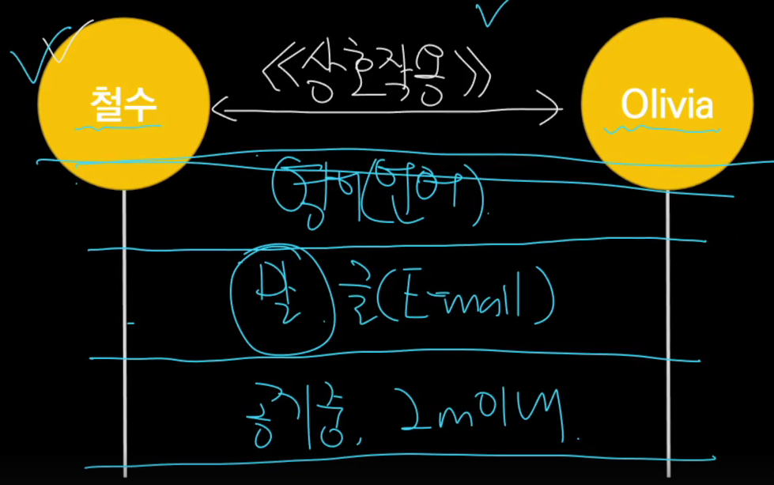
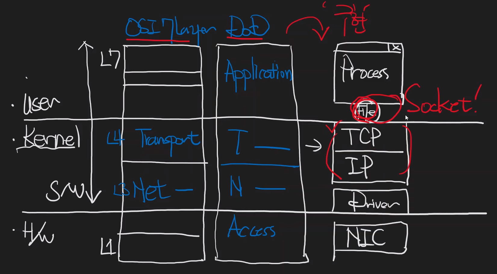

## Network, OSI 7 Layer

네트워크 - 관계  
네트워킹 - 상호작용

(이 사진이 공감이 많이 됐다)  

외국 사람과 대화를 하려면,  
공기중에서 2m 이내여야 하고(L1)  
말로 전달해야 하고(L2)  
영어를 할 줄 알아야 한다.(L3)

-> Layered 구조(OSI 7 Layer)

OSI 7 Layer는 L1 ~ L7을 개념적으로 풀어 설명한 것

각 계층 예시  
2계층 - 이더넷(유선 네트워크)
3계층 - IP
4계층 - TCP, UDP
5계층 - SSL
7계층 - HTTP

(HTTPS = HTTP + SSL)

---

소켓이 뭐냐  
프로세스가 네트워크로 통신하기 위한 인터페이스  
(tcp/ip를 유저모드 어플리케이션 프로세스가 접근할 수 있도록 파일 형식으로 추상화한 인터페이스)

Access 수준의 식별자 - MAC 주소  
Network 수준의 식별자 - IP 주소  
Transport 수준의 식별자 - port 번호

---

포트번호, 아이피 주소(v4, v6), 맥 주소는 무엇에 대한 식별자 일까?

### MAC 주소

맥 주소는 네트워크 인터페이스 카드(NIC)에 대한 식별자
-> LAN 카드

NIC(Network Interface Card)  
PC나 서버 등 컴퓨터를 네트워크에 연결하기 위해 필요한 하드웨어  
(모든 네트워크 단말은 애플리케이션과 운영체제가 처리한 패킷을 NIC를 이용해 LAN 케이블이나 전파로 보낸다)

> LAN 카드는 유선도 있고 무선도 있다
> 
> 노트북이 유선,무선 랜카드 가지고 있으면  
> 노트북은 두개의 맥 주소를 가지고 있다.
> 
> -> 어떤 호스트에 장착된 컴퓨터 부품
> (자주 변경되지 않는다)

맥주소는 변경 가능하다.  
(Virtual MAC)

### IP 주소

ip 주소는 호스트에 대한 식별자

한 컴퓨터에 ip주소는 n개가 있다

> 포트 번호는 프로세스, 서비스에 대한 식별자  
> (자세한 건 나중에)

---

### Host, Switch, Network

호스트 = 네트워크를 연결한 컴퓨터

네트워크의 이용주체인 호스트 - end-point(단말)

client, server, peer(p2p 통신)

> end-point + computer = 단말기

네트워크 그 자체를 이루는 호스트 - 스위치  
(네트워크를 관리하는)

router, IPS(security 스위치)

---

### 스위치가 하는 일

(고속도로에서 교차로 나오면, 이정표를 보고 더 빠른길을 선택한다)

스위치에서 경로 선택을 한다  
-> interface를 선택한다  
-> switching

자동차는 패킷 - 인터넷이라는 도로를 돌아다닌다  
목적지까지 가기 위해 중간중간 스위치를 만남

이때 L3 스위치를 라우터라고 부른다.

라우터마다 이정표가 들어있는데  
이것이 Routing table

(고속도로 예시 -> 네트워크 - IP 기준)  
도로 -> 인터넷  
자동차 -> 패킷  
교차로 -> 라우터(L3 스위치)  
이정표 -> 라우팅 테이블

MAC 주소를 가지고 switching하면 - L2 스위치  
port 번호 가지고 switching하면 - L4 스위치

> 항상 고민해야 할 주제는 '비용'  
> 비용 - Matric 값