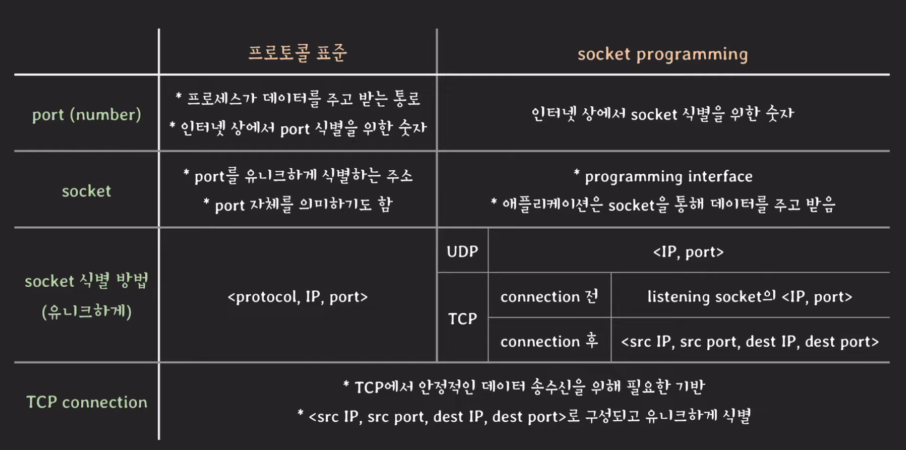

### Socket

소켓이란 인터넷 상에 존재하는 각 port를 유니크하게 식별하기 위한 주소

각 포트는 유니크하다.

한 쌍의 소켓은 커넥션을 유니크하게 식별한다.

하나의 소켓은 동시에 여러 커넥션들에서 사용할 수 있다.

---

애플리케이션이 시스템의 기능을 함부로 쓸 수 없다.

대신 시스템은 애플리케이션이 네트웤크 기능을 사용할 수 있도록 프로그래밍 인터페이스를 제공한다.  
-> socket

애플리케이션은 소켓을 통해 데이터를 주고 받는다.

개발자는 소켓 프로그래밍을 통해 네트워크 상의 다른 프로세스와 데이터를 주고 받을 수 있도록 구현한다.

> 대부분의 시스템은 소켓 형태로 네트워크 기능 제공

> 보통 소켓을 직접 조작해서 통신 기능을 구현할 일은 적다
>
> application layer의 프로토콜은 보통 라이브러리나  
> 모듈 형태로 해당 기능이 제공되는데, 이때 내부를 열어보면  
> 소켓을 활용해서 프로토콜을 구현했음을 알 수 있다.

---

Port Number

16 bits로 이루어진 숫자

0~1023 well known ports(80, 443, 53)

---

---

socket - 유저 모드의 프로세스가 네트워크 통신을 하기 위해 사용하는, OS가 제공하는, 파일 형식의 인터페이스