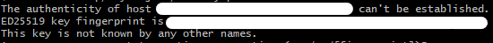

# SSH(Secure Shell)

TCP/IP 를 기반으로 동작하는 응용 계층 프로토콜

원격 시스템에 안전하게 접속하고 데이터를 안전하게 전송하기 위해 사용된다.

SSH는 데이터 전송을 암호화하여 중간에 누출되는 것을 방지한다.

> SSH는 비대칭키 방식을 이용해 인증을 한다.  
> 이때 대칭키를 주고받고,  
> 대칭키를 이용해 데이터를 암호화 해 주고받는다.

먼저 접속을 요청한 클라이언트의 인증을 한다. (1)  
그리고 서버와 클라이언트는 대칭키를 주고받는다. (2)

> (1)번은 클라이언트의 개인키/공개키를 이용해 진행된다.  
> (2)번은 서버의 개인키/공개키를 이용해 진행된다.

---

## SSH 연결 과정

> SSH 연결의 목적
> 1. 서버의 인증
> 2. 클라이언트의 인증
> 3. 데이터 암호화/복호화를 위한 대칭키 공유

먼저  
서버의 인증 & 대칭키 공유를 진행한 후,  
클라이언트의 인증을 진행한다.

### 서버의 인증 과정

1. 클라가 서버에게 ssh 요청
2. 서버는 클라에게 자신(서버)의 공개키를 응답으로 준다.
3. 클라는 서버로부터 받은 공개키를 `.ssh/known_hosts` 을 이용해 검증한다.  
   이 공개키를 가지고 서버의 인증을 진행한다.  
   (이때, 해당 서버의 공개키가 `.ssh/known_hosts` 에 저장되어 있지 않다면,  
   해당 서버의 공개키를 저장하라는 메시지가 뜬다 - 수동 인증)
4. 클라는 대칭키를 생성하고, 해당 대칭키를 서버의 공개키로 암호화하여 서버에게 전송
5. 서버는 자신(서버)의 개인키를 통해 클라로부터 받은 대칭키를 복호화
6. 서버와 클라가 대칭키를 공유하게 된다.

> 맨 처음 ssh 명령어를 통해 원격 서버에 접속을 요청하면, 아래와 같은 메시지가 뜬다.
>
> 
>
> 이는 해당 서버에 대한 요청의 응답으로 서버의 공개키를 받았는데,  
> 해당 공개키가 알 수 없는 공개키이기 때문이다.  
> (즉, 해당 서버의 공개키가 `.ssh/known_hosts` 에 저장되어 있지 않다는 뜻이다)
> 
> 여기서 수락을 하면, 수동으로 서버를 인증하는 것이다.
>
> (나중에 다시 요청한다면, 해당 서버의 공개키가 이미 저장되어 있기 떄문에, 위의 메시지는 뜨지 않는다)

### 클라이언트 인증 과정

> 클라이언트 인증 방법은 여러 가지가 있지만,  
> 여기서는 공개키 방식을 이용한 인증을 설명한다.

원리는 서버의 인증 과정과 같다.  
(역할만 반대로 바뀐다)

여기서 클라이언트의 개인키가 .pem 파일이다.

그리고 클라이언트의 공개키는 서버에 저장되는데,  
.ssh/authorized_keys 파일에 저장된다.

1. 클라가 서버에게 자신(클라)의 공개키를 전송한다.
2. 서버는 클라이언트의 공개키를 `.ssh/authorized_keys` 에 저장한다.
3. 서버는 임의의 값을 생성하고, 해당 값을 전송한다.
4. 클라이언트는 서버로부터 받은 값을 해시함수로 해시한 값을 자신의 개인키로 암호화하여 서버에게 전송한다.
5. 서버는 클라이언트로부터 받은 값을 클라이언트의 공개키로 복호화한다.  
   그리고 클라이언트가 전송한 값과 서버가 생성한 값의 해시 값을 비교한다.

---

이떄 처음에  
(서버의 인증) 서버의 공개키를 전달할 때,  
(클라의 인증) 클라이언트의 공개키를 전달할 때,  
(클라의 인증) 서버에서 생성한 임의의 값을 전달할 때,  
위 데이터들은 암호화되지 않은 상태로 전달된다.

> 암호화 할 필요가 없다.  
> (공개키는 공개되어도 상관없고, 임의의 값도 역시 암호화할 필요가 없다)

---

### 인증 후 데이터 전송 과정

서버와 클라이언트 모두 인증에 성공했다면,  
대칭키를 공유하게 된다.

> 세션키라고도 한다.  
> (해당 연결이 끊나면 사라지기 때문)

이 대칭키를 이용해 데이터를 암호화해서 주고받는다.