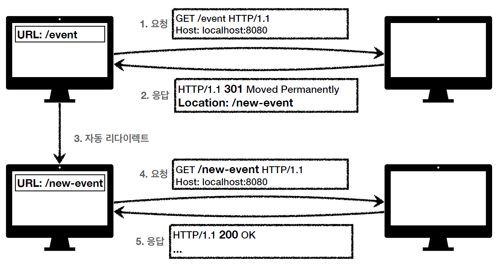

# HTTP 상태 코드(Status Code)

클라이언트가 보낸 요청(Request)의 처리 상태를 응답(Response)에서 알려주는 기능

---

## 1XX: 요청이 수신되어 처리 중

> 거의 사용하지 않는다고 한다.

---

## 2XX: 요청 정상 처리

### 200 OK

### 201 Created

요청 성공해서 새로운 리소스가 생성 됨

### 202 Accepted

요청이 접수되었으나 처리가 완료되지 않았음  
(나중에 처리하는 요청일 때)

### 204 No Content

서버가 요청을 성공적으로 수행했지만, 응답 Payload 본문에 보낼 데이터가 없음

---

## 3XX: 리다이렉션

요청을 완료하기 위해 클라이언트의 추가 조치 필요

> 웹 브라우저는 3XX 응답의 결과에 Location 헤더가 있으면, Location 위치로 자동 이동  
> (Redirect)

> 리다이렉트의 종류
> 
> 영구 리다이렉션 (301, 308)  
> 특정 리소스의 URI가 영구적으로 이동(/members -> /users)  
> 원래의 URL을 사용하면 안된다. (검색 엔진에서도 변경 인지)
> 
> 일시 리다이렉션 (302, 303, 307)  
> 일시적인 변경(구매 완료 후 구매 내역 화면 이동)  
> 검색 엔진 등에서 URL을 변경하면 안됨

> PRG(Post/Redirect/Get)
> 
> POST로 구매 요청을 하고,  
> 리다이렉트를 통해 GET을 요청(구매 내역 화면)하도록 지시하는 패턴  
> -> 새로 고침을 해도 GET으로 요청한다.  
> -> POST로 구매 후에 새로 고침으로 인한 중복 구매를 방지한다.

### 301 Moved Permanently

(영구 리다이렉션)  
리다이렉트 요청시 요청 메서드가 GET으로 변하고, 본문이 제거될 수 있음(may)

### 308 Permanent Redirect

(영구 리다이렉션)  
리다이렉트시 요청 메서드와 본문을 유지(처음에 POST로 보내면 리다이렉트도 POST 유지)

### 302 Found

(일시 리다이렉션)  
리다이렉트 요청시 요청 메서드가 GET으로 변하고, 본문이 제거될 수 있음(may)

### 307 Temporary Redirect

(일시 리다이렉션)  
리다이렉트시 요청 메서드와 본문을 유지(처음에 POST로 보내면 리다이렉트도 POST 유지)

### 303 See Other

(일시 리다이렉션)  
302와 기능은 같음

---

## 4XX: 클라이언트 오류

클라이언트의 요청에 잘못된 문법 등으로 서버가 요청을 수행할 수 없음  
(오류의 원인이 클라이언트에 있다)

> 클라이언트가 이미 잘못된 요청을 하기 때문에, 재시도 해도 계속 실패한다.

### 400 Bad Request

클라이언트가 잘못된 요청을 해서 서버가 요청을 처리할 수 없다.

요청 파라미터가 잘못 되거나, API 스펙이 맞지 않을 떄 등에 나타나는 상태 코드

### 401 Unauthorized

클라이언트가 해당 리소스에 대한 인증이 필요하다.

인증(Authentication) 되지 않음

### 403 Forbidden

서버가 요청을 이해했지만 승인을 거부함

인증 자격 증명은 했지만, 접근 권한이 불충분한 경우

### 404 Not Found

요청 리소스를 찾을 수 없음

> 클라이언트의 권한이 부족해 접근할 수 없을 때, 리소스를 숨길 수 없을 때 사용하기도 한다.

---

## 5XX: 서버 오류

서버 문제로 오류 발생

> 서버에 문제가 있기 때문에, 재시도 하면 성공할 수도 있다.

### 500 Internal Server Error

서버 내부 문제로 인한 오류 발생

### 503 Service Unavailable

서버의 일시적인 과부하 또는 예정된 작업으로 잠시 요청을 처리할 수 없음