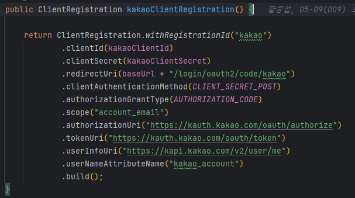

# OAuth2 인증

## Oauth2 인증이란 무엇인가?

OAuth2는 인증 및 권한 부여 프로토콜로,  
카카오 등의 리소스 서버에서 제공하는 사용자 신원에 대한 접근 권한을 서비스에 위임하는 방식을 제공한다.

> 이를 통해 사용자는 각 서버에 대한 계정을 가지고,  
> 다른 서비스를 이용할 수 있다.

### OAuth2의 주요 구성 요소

- Resource Owner: 리소스에 대한 접근 권한을 가지고 있는 사용자
- Client: 리소스 서버에 접근하기 위한 Application
- Authorization Server: 사용자의 인증을 담당하는 서버
- Resource Server: 사용자의 리소스를 보관하고, 제공하는 서버

> Resource Owner는 사용자를 의미한다.  
> Client는 우리가 만든 WAS 또는 다른 Application이 될 수 있다.  
> Authorization Server는 카카오, 구글, 네이버 등이 될 수 있다.

---

## OAuth2 프로세스

> 현재 대부분의 OAuth2 권한 부여 방식은  
> (클라이언트가 사용자(리소스 소유자)의 리소스에 접근하기 위해 사용하는 방식)
> 
> Authorization Code Grant 방식을 사용한다.  
> (사용자가 인증 서버에 인증 후, 인가 코드를 클라이언트에게 전달하여)  
> (클라이언트가 인가 코드를 이용해 액세스 토큰을 요청하는 방식)
> 
> 이 방식을 기준으로 설명한다.

### OAuth2 인증 과정의 주요 단계

1. Authorization Grant (권한 부여):  
   자원 소유자가 클라이언트에게 자원 접근을 허가하는 단계.  
   이 단계에서 사용자는 자신의 인증 정보를 제공하여 권한을 부여하고, 인증 서버는 authorization code를 클라이언트에게 전달한다.  
   (Authorization Code Grant 방식에서는 리다이렉션을 통해 code를 전달한다)
2. Access Token (엑세스 토큰) 발급:  
   클라이언트는 authorization code를 인증 서버에 제출하고, 인증 서버는 access token을 클라이언트에게 발급한다.  
   이 access token을 사용하여 클라이언트는 자원 서버에 접근할 수 있다.
3. Resource Access (자원 접근):  
   클라이언트는 access token을 자원 서버에 전달하여 사용자의 자원에 접근한다.

### OAuth2 인증 프로세스 풀어서 설명

1. 사용자가 Application에 로그인을 시도한다.
2. Application은 사용자를 인증 서버로 리다이렉트한다.
3. 사용자는 인증 서버에 로그인을 시도한다.
4. 로그인에 성공하면, 인증 서버는 권한 부여 승인 코드를 Application으로 전달한다.  
   (이때 인증 서버에서 바로 Application으로 전달하는 것이 아니라, 리다이렉트를 통해 User를 거친 후에 Application으로 전달한다)
5. Application은 권한 부여 승인 코드를 이용해 인증 서버에 Access Token을 요청한다.
6. Access Token을 받으면, Application은 리소스 서버에 Access Token을 전달한다.
7. 리소스 서버는 Access Token을 검증하고, 사용자의 리소스를 전달한다.
8. 사용자는 Application을 통해 리소스를 이용한다.

> 2 ~ 5 번까지는 인증 서버와의 통신이고,  
> 6 ~ 8 번까지는 리소스 서버와의 통신이다.

---

## OAuth2 관련 코드 분석

OAuth2를 사용하기 위해서, 스프링 시큐리티를 이용했다.

아래는 OAuth2 관련 코드(ClientRegistration 클래스 설정 코드)를 캡쳐한 사진이다.

맨처음 사용자가 Application에 로그인을 시도하면,  
Application은 인증 서버로 사용자를 리다이렉트한다.  
(이때의 url: `https://kauth.kakao.com/oauth/authorize`)  
(authorizationRequestUri로 설정)

사용자가 인증 서버에 로그인을 성공한다면,  
인증 서버는 권한 부여 승인 코드를 Application으로 전달한다.  
(이때의 url: `http://localhost:8080/login/oauth2/code/kakao`)  
(redirectionUri로 설정)

위에서 받은 권한 부여 승인 코드를 이용해,  
Application은 인증 서버에 Access Token을 요청한다.  
(이때의 url: `https://kauth.kakao.com/oauth/token`)  
(tokenUri로 설정)

Access Token을 받으면,  
Application은 리소스 서버에 Access Token을 전달하여 원하는 리소스를 요청한다.  
(이때의 url: `https://kapi.kakao.com/v2/user/me`)  
(userInfoUri로 설정)

---

## OAuth2 프로세스 분석

> 로컬호스트에서 카카오 로그인을 시도한 것을 캡쳐했다.

> 크롬의 개발자 도구를 이용해 OAuth2 프로세스를 분석했다.

> 스프링 시큐리티는  
> 사용자가 Application에게 로그인 성공 이후  
> 권한 부여 승인 코드를 전달 했을 때,  
> 이를 가지고 이후의 작업을 자동으로 처리한다.  
> 
> 이러면 중간에 어떤 요청/응답이 있었는지 확인하기 어렵기 때문에,  
> tokenUri를 다른 uri로 설정하여 자동으로 처리하는 것을 막은 다음,  
> Access Token 이후의 과정을 포스트맨으로 직접 요청했다.

### 1. 사용자가 Application에 로그인을 시도한다.

Application에 로그인을 시도한다.

Application은 이를 인증 서버로 리다이렉트한다.

> 이때 쿼리 파라미터로,  
> `client_id`, `redirect_uri`, `response_type`, `scope`, `state` 를 전달한다.

### 2. 사용자가 인증 서버에 로그인을 성공한다.

인증 서버에서 로그인에 성공한 이후,  
인증 서버는 권한 부여 승인 코드를 Application으로 전달한다.

> 이때 쿼리 파라미터로 `code`, `state` 를 전달한다.

### 3. Application은 권한 부여 승인 코드를 이용해 Access Token을 요청한다.

http method는 POST이고,  
Content-Type은 application/x-www-form-urlencoded이다.

이때 body에는 `client_id`, `client_secret`, `redirect_uri`, `code`, `grant_type` 를 전달한다.

결과  

access_token과 token_type 등을 받았다.

> 이때 scope 결과로 ClientRegistration에서 설정한 scope를 전달한다.

### 4. Application은 리소스 서버에 Access Token을 전달하여 원하는 리소스를 요청한다.

http method는 GET이고,  
Authorization에는 `Bearer {access_token}`을 전달한다.  
(Bearer는 `token_type`에 해당한다)

결과  

사용자의 정보를 받았다.

json 데이터 id 필드와, ClientRegistration에서 설정한 userNameAttributeName 필드(`kakao_account`)를 받았다.

kakao_account 필드 안에는 이메일 정보가 들어있다.

> 이 경우는 카카오에 해당하며,  
> 구글과 네이버에서는 json 데이터 형식이 다를 수 있다.

---

### 이후 작업

마지막으로 사용자의 정보를 받은 이후에,  
이를 이용해 로그인을 진행하거나 회원가입을 진행할 수 있다.

> DefaultOAuth2UserService 클래스의 loadUser 메소드를 오버라이딩하면,  
> 위의 OAuth2 프로세스를 통해 받은 사용자 정보를 이용할 수 있다.

---

## OAuth2 인증 프로세스 중 발생할 수 있는 보안 이슈

### 1. CSRF(Cross Site Request Forgery)

CSRF는 사용자의 인증된 세션을 악용하는 공격 방식이다.  
(사용자의 인증된 세션을 악용하는 공격 방식)

만약 권한 부여 승인 코드를 Client에게 전달할 때,  
이 결과로 액세스 토큰을 응답으로 받는다면,  
공격자가 이를 이용해 사용자의 정보를 탈취할 수 있다.

### CSRF 공격 방지 방법

`state` 파라미터를 이용해 CSRF 공격을 방지할 수 있다.  

> 맨 처음 사용자가 Application에 로그인을 시도할 때,  
> Application은 인증 서버로 사용자를 리다이렉트한다.  
> 이때, Application은 `state` 파라미터를 생성하여,  
> 이를 인증 서버로 전달한다.
> 
> 사용자의 인증 이후, 인증 서버는 권한 부여 승인 코드를 Application으로 전달할 때,  
> 이때 `state` 파라미터를 그대로 전달한다.
> 
> `state` 파라미터를 이용해,  
> 사용자의 요청이 유효한지 검사할 수 있다.  
> 
> 이때 state 값은 해당 유저의 세션에 저장된 값이어야 한다.  
> 그래서 사용자가 인가 코드를 전달할 때,  
> 사용자는 세션 쿠키와 함께 `state` 파라미터를 전달한다.  
> (Application은 이를 이용해 사용자의 요청이 유효한지 검사할 수 있다)

하지만 `state` 파라미터를 이용해도,  
리다이렉트 url을 브라우저에서 확인할 수 있기 때문에,  
`state` 파라미터 마저도 탈취당할 수 있다.  
(그리고 XSS 공격으로 세션 쿠키마저도 탈취당할 수 있다)

따라서 인증 서버에서 Application으로 권한 부여 승인 코드를 전달하고 나서,  
Application은 액세스 토큰을 사용자에게 전달하지 않아야 한다.

> 만약 공격자에 의해 code, state를 탈취 당해도  
> 액세스 토큰을 응답으로 보내지 않는다면,  
> 공격자는 사용자의 정보를 탈취할 수 없다.

> 그리고 추가로 PKCE를 사용하면,  
> 인증 서버로부터 액세스 토큰을 받을 때,  
> 공격자가 탈취한 code를 사용해도 액세스 토큰을 받을 수 없게 할 수 있다.  
> (아래에서 설명)

---

### 2. Redirect URI Manipulation (리디렉트 URI 변조)

리디렉트 URI 변조는 사용자의 리디렉트 URI를 변조하는 공격 방식이다.  
(사용자의 리디렉트 URI를 공격자가 제어하는 URI로 변경하는 공격 방식)

만약 사용자의 리디렉트 URI를 변조한다면,  
인증 서버에서 권한 부여 승인 코드를 전달할 때,  
공격자가 이를 탈취할 수 있다.

### Redirect URI Manipulation 공격 방지 방법

인증 서버에서 리다이렉트 URI를 검증하면 된다.

> 실제로 구글, 카카오 등의 인증 서버에서는  
> 리다이렉트 가능한 URI를 설정할 수 있도록 제한을 두고 있다.

---

### 3. Authorization Code Interception (인가 코드 가로채기)

> 인가 코드와 권한 부여 승인 코드는 같은 의미이다.

인가 코드 가로채기는 사용자의 인가 코드를 가로채는 공격 방식이다.

가로챈 인가 코드를 이용해  
공격자가 직접 인증 서버에 액세스 토큰을 요청할 수 있다.

### Authorization Code Interception 공격 방지 방법 - PKCE

> 여기서 PKCE는 Client secret을 사용할 수 없는 환경에서 사용하는 방법이다.  
> (client_secret: 액세스 토큰을 요청할 때 사용하는 비밀 키)
> 
> 일반적인 서버 기반 애플리케이션이나 비공개 클라이언트에서는  
> Client secret을 사용할 수 있기 때문에  
> PKCE는 모바일 앱 등에서 사용된다

PKCE는 Proof Key for Code Exchange의 약자로,  
인가 코드 교환을 위한 증명 키를 의미한다.

PKCE를 사용하면,  
인가 코드를 이용해 액세스 토큰을 요청할 때,  
액세스 토큰을 받기 위한 증명 키를 함께 전달해야 한다.

1. 클라이언트가 사용자를 인증 서버로 리다이렉트할 때,  
   `code_challenge` 파라미터를 전달한다.  
   (해시 함수를 이용해 생성한 증명 키, 원본 값은 `code_verifier`)
2. 인증 서버는 `code_challenge`를 저장한다.
3. 나중에 클라이언트가 인가 코드를 이용해 액세스 토큰을 요청할 때,  
   `code_verifier`를 함께 전달한다.
4. 인증 서버는 `code_verifier`를 해시 함수를 이용해 생성한 값과,  
   저장된 `code_challenge`를 비교한다.

만약 공격자가 인가 코드를 가로채더라도 `code_verifier`를 알지 못하기 때문에,  
액세스 토큰을 요청하더라도 받을 수 없다.

> 해시 함수는 단방향 함수이기 때문에,  
> 암호화된 값(`code_challenge`)을 이용해 원본 값(`code_verifier`)을 알 수 없다.
> 
> 따라서 공격자는 `code_challenge`를 탈취해도,  
> `code_verifier`를 알지 못하면 액세스 토큰을 요청할 수 없다.

---