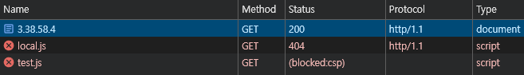

# CSRF(Cross-Site Request Forgery)

목적: 사용자의 권한을 이용하여 악의적인 요청을 서버에 전송하는 것

CSRF(Cross-Site Request Forgery) 공격은 인증된 사용자의 권한을 이용하여 악의적인 요청을 서버에 전송하는 공격이다.

이때 CSRF 공격이 성립되기 위한 조건
1. 사용자가 로그인한 상태여야 한다.
2. 사용자가 악의적인 페이지를 방문해야 한다.

> 사용자가 로그인한 사이트가 아닌,  
> 다른 사이트에서 악의적인 사용자가 만든 페이지를 통해  
> 사용자의 권한을 이용하여 서버에 요청을 보낼 수 있다.
>
> (이때, 사용자는 이 요청이 자신의 권한으로 보내는 것이라는 것을 모르고 있다)

> 여기서 서버의 인증 방식이 쿠키 방식이라면 CSRF 공격이 가능하지만,  
> 토큰 방식이라면 CSRF 공격을 막을 수 있다.  
> (인증 값을 스토리지에 저장하고, 요청 시마다 토큰을 함께 보내는 방식)

## 이를 막는 방법

CSRF 토큰을 이용해 사용자의 요청을 검사할 수 있다.  
(요청 할 때마다 토큰의 값을 통해 사용자의 요청이 유효한지 검사)

그리고 쿠키의 `SameSite` 속성을 이용해 CSRF 공격을 막을 수 있다.  
(쿠키의 `SameSite` 속성을 `Strict`로 설정하면, 같은 사이트에서만 쿠키를 전송할 수 있게 된다)  
(외부 사이트로부터의 요청에서 쿠키를 전송하지 않게 된다)

> `SameSite=Lax` 설정은 대부분의 CSRF 공격을 막아주지만,  
> GET 요청에 대해서는 CSRF 공격을 막을 수 없다.
> 
> `` 태그나 `<script src=...>` 태그 등을 이용해 GET 요청을 보낼 수 있기 때문이다.  
> (위 요청은 GET 요청이라서 쿠키가 전송된다)

---

# XSS(Cross-Site Scripting)

목적: 사용자 측에서 악성 스크립트를 실행시키는 것

공격자가 웹사이트에 악성 스크립트를 삽입하고,  
해당 웹사이트를 방문한 사용자가 스크립트를 실행하게 한다.  

공격자가 주입한 악성 스크립트를 통해, 다른 사용자의 정보를 탈취할 수 있다.

## XSS 공격 종류

### 저장형 XSS(Stored XSS)

위 설명과 같이, 공격자가 악성 스크립트를 저장하여 사용자가 접근할 수 있는 페이지에 삽입하는 방식

> 모든 사용자가 피해를 입을 수 있다.

### 반사형 XSS(Reflected XSS)

공격자는 URL에 악성 스크립트를 포함시켜, 사용자가 해당 URL을 클릭하게 한다.  
(악성 스크립트가 쿼리 파라미터에 포함된 URL을 전달)

사용자는 서버에 위 URL로 요청을 하면 서버는  
공격자의 악성 스크립트가 포함된 요청을 그대로 응답에 포함시켜 사용자에게 전달한다.  
-> 브라우저에서 악성 스크립트가 실행된다.

특정 사용자에게 메일, 링크 등을 통해 전달하여 공격하는 방식  
(악성 스크립트가 쿼리 파라미터에 포함된 URL을 전달)

> 특정 사용자에게만 피해를 입힐 수 있다.

### DOM 기반 XSS(DOM-based XSS)

서버와의 상호작용 없이, 클라이언트 측에서 발생하는 XSS 공격  
자바스크립트에서 URL 파라미터 등을 이용해 DOM을 조작하는 공격

> 공격 방식이 반사형 XSS와 유사하지만,  
> 서버와의 상호작용이 없다는 점에서 차이가 있다.

## 이를 막는 방법

1. 사용자의 입력 값을 검증한다.
2. CSP(Content Security Policy) - 웹 페이제에서 실행되는 스크립트의 출처를 제한하고, 허용된 리소스만 로드할 수 있도록 제한

---

# XSS vs CSRF

둘다 사용자의 브라우저를 대상으로 한다는 공통점이 있다.

CSRF는 사용자의 인증된 세션을 악용하는 공격 방식이지만,  
XSS는  사용자의 인증 없이도 공격을 진행할 수 있다

---

# CSP(Content Security Policy)

CSP의 역할은  
우리 서버로부터 받은 리소스를 웹 브라우저가 어떻게 처리할지 제어하는 것이다.

1. 웹 페이지에서 실행되는 스크립트의 출처를 제한하고, 허용된 리소스만 로드할 수 있도록 제한한다.
2. 우리 서버의 자바 스크립트의 실행을 제한할 수 있다.  
   (인라인 스크립트, eval 함수 사용을 제한할 수 있다)
3. HTTPS를 강제할 수 있다.  
   (upgrade-insecure-requests: 모든 HTTP 요청을 HTTPS로 리다이렉트)  
   (block-all-mixed-content: HTTP로 로드되는 리소스를 차단)  
   -> 이 기능으로 MITM(중간자 공격)을 막을 수 있다. (예시: 패킷 스니핑)
4. CSP 위반 사항을 보고할 수 있다.  
   (report-uri: 보고서를 보낼 URL을 설정)

> A 서버로부터 html 파일을 얻었는데,  
> 해당 html 파일에 B 서버의 스크립트가 포함되어 있다고 가정하자.
>
> 이때 A 서버는 자기 자신의 서버가 아닌 B 서버의 스크립트를 실행하게 된다.  
> (이때, B 서버의 스크립트가 악성 스크립트라면, 사용자의 정보를 탈취할 수 있다.)
>
> CSP는 이러한 공격을 막기 위해,  
> 스크립트의 출처를 제한하고, 허용된 리소스만 로드할 수 있도록 제한한다.

CSP를 사용하면,  
악성 스크립트가 포함된 URL을 통해 공격하는 것을 막을 수 있다.  
(악성 스크립트가 다른 도메인에 요청을 보내는 것을 막을 수 있다.)

## CSP 실습

웹 서버에 CSP를 설정하고,  
웹 페이지에 악성 스크립트를 포함시켜 CSP가 작동하는지 확인해보자.

nginx 설정 파일에 CSP를 설정한다.

```nginx
server {
    listen 9000;
    server_name localhost;

    # 웹 루트 디렉토리 설정
    root /var/www/html;

    # 기본 파일 설정
    index index.html;

    # CSP 헤더 추가
    add_header Content-Security-Policy "default-src 'self';";

    location / {
        try_files $uri $uri/ =404;
    }
}
```

`/var/www/html/index.html` 파일에 악성 스크립트를 포함시킨다.

```html
<!DOCTYPE html>
<html lang="en">
<head>
    <meta charset="UTF-8">
    <meta http-equiv="X-UA-Compatible" content="IE=edge">
    <meta name="viewport" content="width=device-width, initial-scale=1.0">
    <title>CSP Test</title>
    <!-- 외부 스크립트 -->
    <script src="https://cdn.example.com/test.js"></script>
    <!-- 동일 도메인에서 제공되는 스크립트 -->
    <script src="/js/local.js"></script>
</head>
<body>
    <h1>CSP Test</h1>
    <p>This page has a CSP policy allowing scripts only from the same origin.</p>
</body>
</html>
```

위 웹 서버에 접속하면,  
`index.html` 파일에 포함된 외부 스크립트가 CSP에 의해 차단된다.

위 파일엔 두가지 스크립트가 포함되어 있는데,  
1. 외부 스크립트 (https://cdn.example.com/test.js)
2. 동일 도메인에서 제공되는 스크립트 (/js/local.js)

1번은 CSP에 의해 차단되고, 2번은 CSP에 의해 허용된다.

### 위 html 파일 결과

크롬의 개발자 도구를 이용해 각 요청이 어떻게 처리되는지 확인해보자.



처음 html 파일 요청이 200 OK로 처리됐다.

`local.js` 파일 요청은 404 Not Found로 처리된다.  
(CSP 때문이 아닌, 해당 파일이 없어서)  
(-> 웹 서버까지 요청이 도달했다)

`test.js` 파일 요청은 200 OK로 처리되지 않는다. - (blocked:csp)  
(CSP 때문에 차단됐다)  
(-> 웹 서버에 요청이 도달하지 않았다)