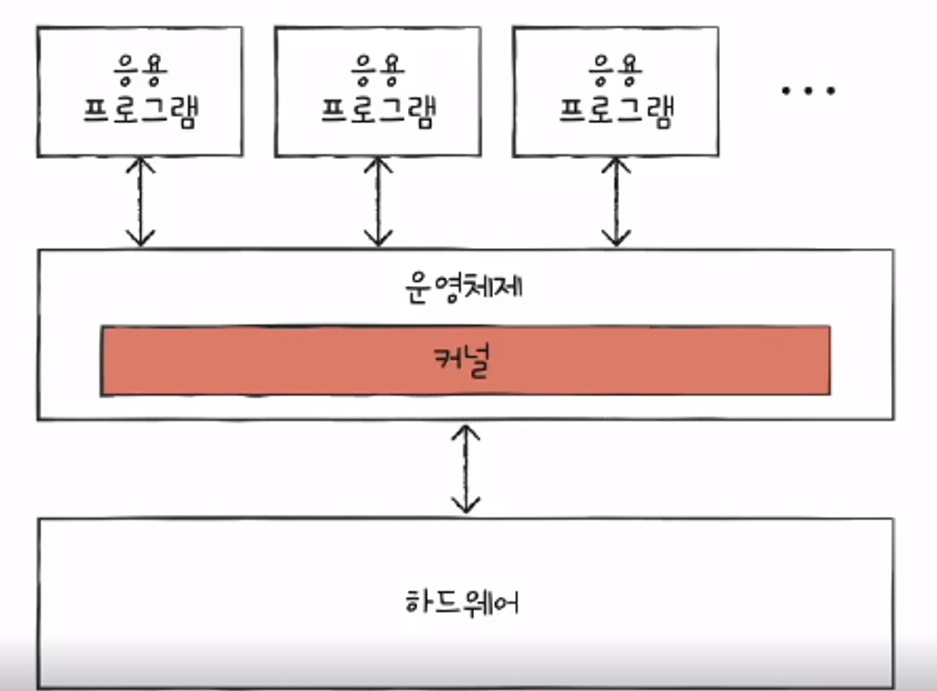
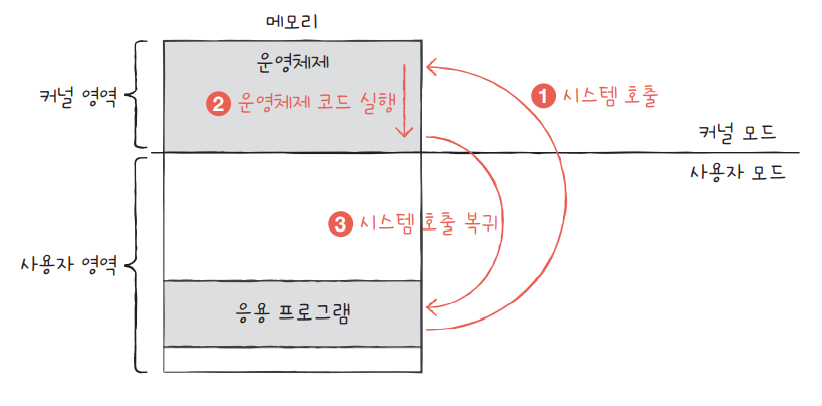
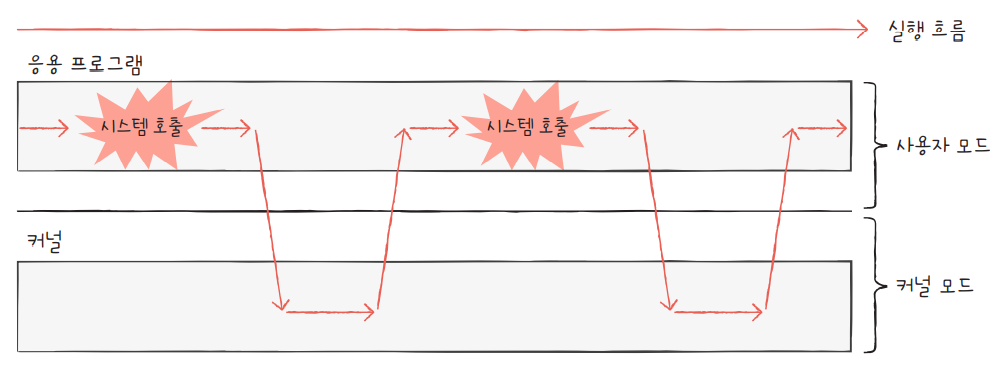

# OS(Operating System)

운영체제(OS)란 하드웨어와 소프트웨어를 연결해,  
각종 소프트웨어가 편리하게 하드웨어를 사용할 수 있게 해주는 `소프트웨어`

> OS도 소프트웨어이다.

---

## OS의 기능

1. 컴퓨터 시스템 내의 리소스를 효율적 & 형평성있게 관리
2. 각종 프로그램 & 사용자에게 편리한 인터페이스 제공

> 여기서 리소스는 CPU, 메모리, Disk, I/O device 등이 있다.

---

## OS의 분류

### single programming
한번에 하나의 프로세스만 실행하는 것 - DOS(Disk OS - 디스크 읽고 쓰는 작업 함)  
(특정 프로세스가 I/O 작업을 하면 CPU는 계속 멈춘다)

> I/O(Input/Output) 작업
> 
> 파일을 읽고 쓰는것  
> 서버 네트워크로 데이터를 주고 받는 것  
> 마우스, 키보드와 같은 입출력 장치와 데이터를 주고 받는 것

### multi programming(CPU 사용률을 극대화시키는 것이 목적)  
여러 개의 프로그램이 동시에 실행된다  
특정 프로세스가 I/O 작업을 하면, CPU는 다른 프로세스를 실행한다.  

> 여기서 한 프로세스의 CPU 사용 시간이 늘어나면 다른 프로세스는 계속 대기해야 한다.

### multi tasking
프로세스는 한번 CPU를 사용할 때 아주 짧은 시간(time quantum)만 실행하도록 하여,  
각 프로그램의 작업을 아주 작은 단위로 번갈아 처리한다.  
-> 작업 응답 시간을 최소화  
-> 특정 프로세스가 CPU를 점유하지 않게 된다. (멀티 프로그래밍 보완)

> 잘게 나뉘어진 프로세스끼리 작업이 스위칭되는 것을 컨텍스트 스위칭이라 한다.

> 멀티태스킹의 장점
> 
> 빠른 반응성 제공  
> CPU가 각 작업들을 번갈아 수행함으로써, 여러 작업을 동시에 실행하는 것처럼 보이게 만들어,  
> 사용자에게 더 빠른 반응성을 제공, 동시에 여러 프로그램이 실행되는 것처럼 보이게 한다.  
> 
> -> 대화형 시스템(interactive system)
> - 사용자와 실시간으로 상호 작용하도록 설계된 시스템 유형
> - 사용자의 입력에 대한 결과를 즉각적으로 확인 가능
> - CLI, GUI로 제공

---

> 시분할 시스템(Time Sharing System)
> 
> 다수의 사용자가 동시에 컴퓨터 자원을 공유하고,  
> 각각의 사용자에게 마치 시스템 전체를 독점적으로 사용하는 것처럼 느끼게 하는 시스템

시분할 시스템 - 여러 `사용자`가 컴퓨터에 접속  
멀티 프로그래밍 - 여러 `작업`을 컴퓨터에서 실행

---

### Multi Processing

> 여기서 Processing은 Processor + ing 이다.  
> (not Process)

여러 개의 CPU 코어가 동시에 작업을 처리하는 것

여러 프로세서가 **단일 태스크 또는 멀티 태스크들을 동시에 작업**할 수 있어서  
컴퓨팅 성능과 효율성이 크게 향상된다.

> Multi Processing vs Multi Process
> 
> 멀티 프로세싱은 여러 개의 CPU 코어가 동시에 작업을 처리하는 것  
> -> 전체적인 처리 속도 향상
> 
> 멀티 프로세스는 하나의 응용 프로그램을 여러 개의 프로세스로 분리하여 실행하는 것  
> -> 프로그램의 안전성 향상(한 프로세스 죽어도, 다른 프로세스 살아 있음)

---

## 커널(Kernel)

컴퓨터가 켜졌을 때, 메모리에 업로드되는 운영체제의 일부분을 커널(Kernel)이라 한다.  
(OS는 너무 커서 일부분만 메모리에 올림)

하드웨어와 관련된 작업을 직접 수행  
시스템의 전반을 관리/감독하는 역할

하드웨어 리소스를 관리한다.  
(프로세스/스레드, 메모리, 디스크, I/O device)

---

## 유저 모드 & 커널 모드

유저 모드 - 시스템 리소스 접근에 제약이 있는 모드  
대부분의 프로그램은 유저 모드를 사용 - 시스템 리소스 접근에 제약이 있다

(커널 영역의 코드를 실행할 수 없는 모드)

> 프로그램 실행 중에 인터럽트가 발생하거나 시스템콜을 호출하면 
> 커널 모드로 전환된다.

커널 모드 - 시스템 리소스 접근에 제약이 없는 모드  
시스템콜을 통해 실행된다.

(커널 영역의 코드를 실행할 수 있는 모드)

> 커널 모드가 있는 이유
> 
> 하드웨어 리소스를 보호하기 위해  
> (유저 모드에서 시스템 리소스 접근에 제약이 없다면 특정 프로그램이 리소스를 점유할 수 있다 - 다른 프로그램 영향)

---

## 시스템콜(System Call)

OS가 제공하는 인터페이스로,  
프로그램이 OS 커널이 제공하는 서비스를 제공받고 싶을 때(리소스에 접근할 때)  
커널모드로 전환하기 위한 방법

종류  
프로세스/스레드, 파일 I/O, 소켓, device, 프로세스 통신

> 시스템 콜이 발생하면 해당 시스템콜에 대한 커널 코드가 커널 모드에서 실행된다.

> 시스템콜은 일종의 인터럽트이다.(소프트웨어 인터럽트)  
> (인터럽트는 I/O 장치에 의해 발생하기도 하지만 인터럽트를 발생시키는 특정 명령어에 의해 발생하기도 하는데,  
> 이를 소프트웨어 인터럽트라고 한다)

일반적으로 응용 프로그램은 실행 과정에서 운영체제 서비스들을 매우 빈번하게 이용한다.  
그 과정에서 빈번하게 시스템 호출을 발생시키고 사용자 모드와 커널 모드를 오가며 실행된다.

> 응용 프로그램은 OS가 제공하는 인터페이스를 통해서만 하드웨어 리소스를 사용할 수 있다.

---

> OS의 이벤트에 대한 처리 방식(메커니즘)은 두가지가 있다.

## 인터럽트

프로그램을 실행하는 도중에 발생하는 이벤트  

안터럽트가 발생하면 현재 실행중인 작업을 중단하고  
발생된 상황을 처리한 후 다시 실행중인 작업으로 복귀한다.

> 인터럽트 예시(종류)
> 
> (하드웨어 인터럽트)  
> 전원에 문제가 있을 때,  
> I/O 작업이 완료됐을 때,
> 
> (소프트웨어 인터럽트)  
> 예외 처리 상황(잘못된 메모리에 접근할 때, ...),  
> 해당 프로세스에 대한 시간이 다 됐을 때(컨텍스트 스위칭),  
> 시스템콜 호출

인터럽트가 발생하면 CPU는 즉각적으로 해당 인터럽트를 처리하기 위해 커널 모드에서 실행한다.

> I/O request 보낸(시스템콜) process는 sleep, 다른걸로 context switch  
> 디바이스 끝나면 프로세스는 ready 상태가 된다.

---

### 인터럽트 동작 순서

1. 인터럽트 요청
2. 프로그램 실행 중단 : 현재 실행중이던 Micro operation 까지 수행한다.
3. 현재의 프로그램 상태 백업 : PCB(Process Control Block), PC(Program Counter) 등
4. 인터럽트 처리루틴(ISR) 실행 : 인터럽트를 요청한 장치를 식별한다.
5. 인터럽트 서비스 루틴 실행 : 인터럽트 원인을 파악하고 실질적인 작업을 수행한다. 처리기 레지스터 상태를 보존한다.  
   (서비스 루틴 수행 중 우선순위가 더 높은 인터럽트가 발생하면 또 재귀적으로 1~5를 수행한다)
6. 상태복구 : 인터럽트 발생 시 저장해둔 PC(Program counter)를 다시 복구한다.
7. 중단된 프로그램 실행 재개 : PC의 값을 이용하여 이전에 수행중이던 프로그램을 재개한다.

---

## 폴링

폴링(polling)은 운영체제에서 장치의 상태를 지속적으로 확인하여 상태의 변화를 감지하는 메커니즘  
I/O device에 request를 보내고 원하는 조건이나 데이터를 얻을 때까지 응답을 기다린다.

> I/O 이벤트가 끝나길 기다리면서 리소스 사용량이 증가하고 CPU time이 너무많이 waste될 수 있음

> 인터럽트 vs 폴링
> 
> 무조건 interrupt가 좋은것은 아님  
> device 처리 속도가 빠르다면 polling이 더좋음  
> 느리다면 interrupt가 더좋음  
> (context switch 비용이 expensive 하기 때문)

---

## DMA(Data Memory Access)

CPU 이외에 메모리 접근이 가능한 장치  
DMA를 사용하게 되면, 로컬 버퍼에서 메모리를 읽어오는 작업을 CPU가 담당하는 것이 아니라, DMA가 대행한다.

> 원칙적으로 메모리는 cpu에 의해서만 접근할 수 있는 장치이다.  
> 따라서 CPU 외의 장치가 메모리에 접근하기 위해서 CPU에게 인터럽트를 발생시켜 CPU가 이를 대행하는 식으로만 가능하다.  
> 하지만, 모든 메모리 접근 연산이 cpu에 의해서만 이루어질 경우, 입출력 장치가 메모리 접근을 원할때마다 인터럽트에 의해 CPU의 업무가 방해를 받게되어  
> CPU사용의 효율성이 저하되는 문제가 발생한다.

DMA는 일종의 컨트롤러로, CPU가 입출력 장치들의 메모리 접근 요청에 의해 자주 인터럽트 당하는 것을 막아주는 역할을 한다.

> DMA는 바이트(byte)단위가 아니라 블록(block)이라는 큰 단위로 정보를 메모리로 읽어온 후에 cpu에게 인터럽트를 발생시켜 해당 작업의 완료를 알려준다.
