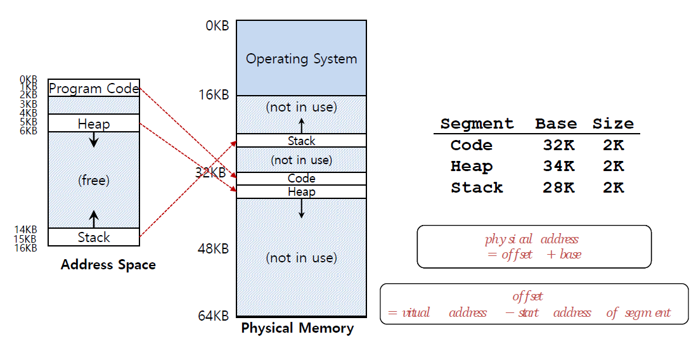
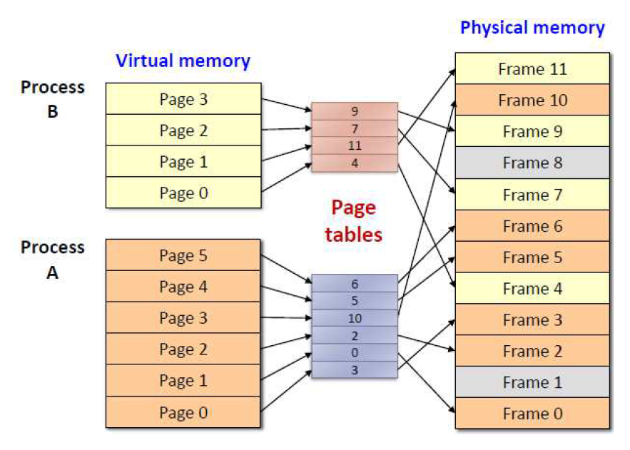
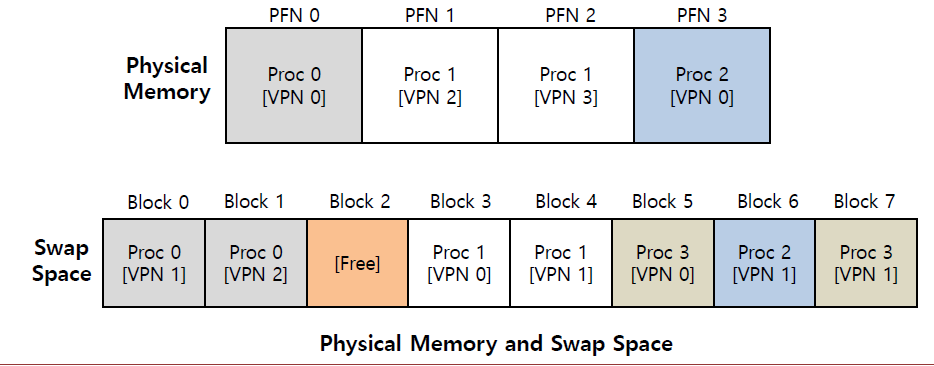
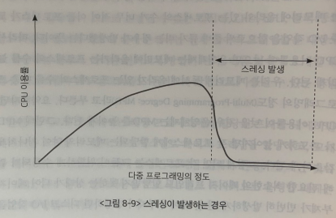
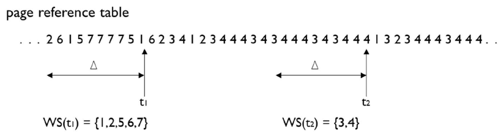

## 메모리(Memory)

메모리는 주소를 통해 접근하는 저장장치

> 컴퓨터 시스템은 32-bit or 64-bit 주소 체계를 사용한다.  
> 메모리의 한 단위(관리의 최소 단위)는 1 Byte
>
> 32-bit: 최대 4GB개의 메모리를 관리할 수 있다.

---

> 메모리가 중요한 이유
>
> CPU의 연산 속도가 아무리 빨라도,  
> 연산을 할 대상은 메모리에 저장되어 있다.
>
> 메모리에서 값을 가져와서 CPU에서 연산을 진행하는데,  
> 메모리에서 값을 가져오는 속도가 느리다면,  
> 이는 CPU의 연산 속도에 영향을 주게 된다.

---

## Memory Virtualization

OS는 physical memory를 virtualize 한다.

주소 공간(address space)은 실행 중인 프로세스에 대한 모든 것을 포함하고 있다.  
(code, heap, stack 등)

실행 중인 프로그램의 모든 address는 virtual이다.
(OS는 virtual address를 physical address로 translate 한다)

> 가상 메모리를 사용함으로써 얻는 이점
> 1. 메모리 의존성을 없앤다.
> 2. 접근을 통제할 수 있다.

> DEP(Data Execution Prevention)
>
> 데이터를 담아야 할 메모리 영역에, 코드를 집어넣어서 실행하는 것을 막아주는 시스템  
> 원격 코드 실행을 막기 위함

---

## 메모리 배치 기법

프로세스가 메모리에 할당될 때 어떻게 배치되는지를 결정하는 여러 방법들이 있다.

---

> 외부 단편화 vs 내부 단편화
>
> 외부 단편화(External Fragmentation)란  
> 프로세스의 메모리가 비연속적으로 저장되어서, 중간 중간 작은 빈 공간이 생기는 현상  
> (그래서 요청에 대한 메모리를 할당할 전체 공간은 충분하지만, 메모리가 비연속적이라 할당할 수 없는 경우)
>
> 내부 단편화(Internal Fragmentation)란  
> 프로세스에게 고정적으로 할당된 공간보다 실제 사용하는 공간이 적어, 빈 공간이 생기는 현상  
> (해당 공간은 사용할 수 없다)

---

### Segmentation

프로세스의 주소 공간을 logical 단위의 세그먼트로 나누어 물리적 메모리에 올리는 방법이다.  
일반적으로는 코드(code), 데이터(data), 스택(stack) 등의 기능 단위로 세그먼트를 정의한다.

> 세그먼트는 의미를 가질 수 있는 논리적인 단위이기 때문에 크기는 균일하지 않다.

세그먼테이션 기법에서는 논리적 주소가 <세그먼트 번호, 오프셋> 으로 나뉘어 사용된다.  
세그먼트 번호는 해당 논리적 주소가 프로세스 주소 공간 내에서 몇 번째 세그먼트에 속하는지를 나타낸다.  
오프셋은 그 세그먼트 내에서 얼마만큼 떨어져 있는지에 대한 정보를 나타낸다.

세그먼테이션 기법에서는 주소 변환을 위해 세그먼트 테이블을 사용한다.  
이 때 세그먼트 테이블의 각 세그먼트는 base(시작 지점)와 bound(크기 제한)를 가지고 있다.

> offset을 알려면, 각 segment가 어디서 시작하는지 알아야 한다.

외부 단편화가 발생할 수 있다.

### Paging

메모리를 고정된 프레임인 페이지(page)로 나누어 관리하는 기법이다.

프로세스의 주소 공간을 페이지 단위로 나눠서 메모리에 적재한다.  
CPU는 분리된 메모리 프레임을 참조할 때 `페이지 테이블`(page table)을 통해 가상 주소에서 물리 주소로 바뀐 주소로 참조한다.

외부 단편화가 발생하지 않는다.  
대신 내부 단편화가 발생할 수 있다.

---

Paging Table과 Segment Table 모두 메모리에 저장된다.

> 매핑 테이블의 장점  
> 특정 프로세스가 죽어도, 해당 프로세스가 점유하고 있떤 세그먼트(페이지)를 신속히 회수할 수 있다.  
> -> 자원 낭비가 없다.
> 
> 어플리케이션이 바보짓을 해도, 메모리 못쓰는 공간이 나오지 않는다.

---

> Segmentation Fault
>
> (포인터가 가리키고 있는 주소가 Segment의 범위를 벗어났을 때 발생하는 오류)  
> 포인터가 가리키는 주소를 찾아갔는데, 그 주소는 invalid 한 주소라서  
> Virtual Address에 해당하는 Segment가 없다.  
> -> Segmentation Fault
>
> 가상메모리를 사용하기 때문에 이런 오류가 났던 것이다.

---

### Demang Paging

프로그램이 시작하면, 사용될 페이지만 메모리에 적재하는 것

-> 여러 개의 프로그램을 동시에 실행할 수 있다.  
대신 요구하는 페이지가 메모리에 없어서,  
디스크에서 메모리에 적재하는 동안 속도가 느려질 수 있다.

CPU가 메모리에 접근을 요청할 때마다 MMU가 page table에서 찾는다.

---

## MMU(Memory Management Unit)

주소 변환과 메모리 보호, 페이지 교체 정책 관리를 하는 하드웨어 장치이다.

---

## TLB(Translation Lookaside buffer)

주소 변환 과정에서 가상 주소를 물리 주소로 빠르게 변환하기 위해 사용되는 캐시  
MMU 내에 있다.

만약 TLB에 가상 페이지 번호가 캐시되어 있다면,  
이에 해당하는 Physical Page Number를 반환하여 주소 변환을 완료한다.  
이 과정은 메모리에 접근하는 시간을 단축시키고, 시스템의 성능을 향상시킵니다.

그러나 TLB에 가상 페이지 번호가 캐시되어 있지 않거나 TLB에 대한 접근이 실패한 경우에는  
보조 저장장치에서 필요한 매핑 정보를 가져와야 한다.  
이 과정은 TLB miss라고 불리며, 일반적으로 시간이 더 오래 걸린다.  
그러나 이후에 가져온 매핑 정보를 TLB에 저장하고, 나중에 같은 가상 주소에 액세스할 때 재사용된다.

---

## Swapping

동시에 여러 프로세스의 address space를 관리하는데,  
이떄 physical memory가 부족할 수 있다.

이떄 disk에서 swap space를 할당할 수 있는데,  
이를 swapping이라 한다.

> Swap Space
> 
> page를 관리하기 위해 disk에 할당된 공간

---

프로세스의 특정 address space가 메모리에 있는지, swap space에 있는지 체크하기 위해  
paging table에 present bit가 있다.  
(present bit = 0 - page fault(해당 페이지가 메모리에 없다))

---

만약 메모리가 가득 찬다면,  
OS는 메모리에 새로운 페이지를 받을 공간을 마련해야 한다.  
-> 메모리에 있는 기존 페이지를 내쫓아야 한다.

이때 어떤 페이지를 내쫓을지 결정하는 page-replacement policy가 여러 개 있다.

> 내쫓을 페이지를 결정한 후,  
> 해당 페이지는 swap space에 저장될 수도 있고,  
> 그냥 없앨 수도 있다.  
> (이떄는 나중에 찾을 때 디스크에서 다시 탐색함)

## Page Replacement

### FIFO(First-In First-Out)

가장 먼저 메모리에 적재된 페이지를 삭제하는 알고리즘

### LRU(Least Recently Used)

가장 마지막으로 사용된 페이지를 삭제하는 알고리즘  
(사용했던 페이지를 따로 저장해놔야 한다)

### LFU(Least Frequently Used)

가장 적게 사용된 페이지를 삭제하는 알고리즘  
(이때 각각의 페이지가 몇번 사용됐는지 따로 저장해놔야 한다)

### Clock 알고리즘

가장 최근에 사용된 페이지를 제외하고, 남은 페이지들 중 하나를 삭제하는 알고리즘  
(최근에 사용된 페이지 번호만 저장하면 되기 때문에, LRU보다 오버헤드 적음)

---

> 프로세스가 원할하게 수행되기 위해서는 일정 수준 이상의 페이지 프레임을 할당 받아야 한다.  
> 프로세스가 최소한의 페이지 프레임을 할당받지 못할 경우 성능상의 심각한 문제가 발생할 수 있다.
> 
> 집중적으로 참조되는 페이지들의 집합을 메모리에 한꺼번에 적재하지 못하면  
> 페이지 부재율이 크게 상승해 CPU 이용률이 급격히 떨어질 수 있다.  
> 이와 같은 현상을 쓰레싱(thrashing)이라고 부른다

## 쓰레싱(Thrashing)

과도한 페이지 부재(Page Fault)로 인해  
시스템이 대부분의 시간을 페이지 교체 작업에 소모하면서  
성능이 급격히 저하되는 상태

### 쓰레싱이 발생하는 시나리오

1. CPU 이용률이 낮아(레디 큐가 자주 비는 상황) OS는 메모리에 올라갈 프로세스의 수를 늘린다.  
   > 메모리에 동시에 올라가 있는 프로세스의 수를  
   > 다중 프로그래밍의 정도(Mutil-Programming Degree : MPD)라고 부른다
2. 그런데 MPD가 과도하게 높아지면 각 프로세스에게 할당되는 메모리의 양이 지나치게 감소하게 된다.
3. 각 프로세스는 그들이 원할하게 수행되기 위해 필요한 최소한의 페이지 프레임도 할당받지 못하는 상태가 되어 페이지 부재가 빈번하게 발생하게 된다.
4. 페이지 부재가 발생하면 디스크 I/O 작업을 수반하므로 문맥교환을 통해 다른 프로세스에게 CPU가 이양된다.
5. 이때 다른 프로세스 역시 할당받은 메모리 양이 지나치게 적으면 페이지 부재가 발생할 수밖에 없다.
6. 이러한 상황이 반복어 모든 프로세스가 페이지 부재를 발생시켜 시스템은 페이지 부재를 처리하느라 매우 분주해지고 CPU의 이용률은 급격히 떨어지게 된다.
7. OS는 다시 1번으로 인식하게 된다. (다시 반복)
8. 이 경우 프로세스들은 서로의 페이지를 교체하며 스왑 인과 스왑 아웃을 지속적으로 발생시키고,  
   CPU는 대부분의 시간에 일을 하지 않게 된다. (스레싱 현상)

스레싱이 발생하지 않도록 하면서 CPU 이용률을 최대한 높일 수 있도록 MPD를 조절하는 것이 중요하다.  

MPD를 적절히 조절해 CPU 이용률을 높이는 동시에 스레싱 발생을 방지하는 방법에는 워킹셋 알고리즘이 있다.

---

### 워킹셋 알고리즘

프로세스는 일정 시간 동안 특정 주소 영역을 집중적으로 참조하는 경향이 있다.  
(이렇게 집중적으로 참조되는 페이지들의 집합을 지역성 집합(locality-set)이라고 한다)

워킹셋 알고리즘은 이러한 지역성 집합이 메모리에 동시에 올라갈 수 있도록 보장하는 메모리 알고리즘을 뜻한다.  

> 워킹셋 알고리즘에서는 프로세스가 일정 시간 동안 원활히 수행되기 위해  
> 한꺼번에 메모리에 올라와 있어야 하는 페이지들의 집합을 워킹셋이라고 정의한다.

프로세스의 워킹셋을 구성하는 페이지들이 한꺼번에 메모리에 올라갈 수 있는 경우에만 그 프로세스에게 메모리를 할당한다.  
만약 그렇지 않을 경우에는 프로세스에게 할당된 페이지 프레임들을 모두 반납시킨 후 그 프로세스의 주소 공간 전체를 디스크로 스왑 아웃 시킨다.

> 위킹셋 알고리즘에서 워킹셋의 크기는 시간의 흐름에 따라 변한다.
> 
> 워킹셋 알고리즘은  
> 프로세스가 메모리를 많이 필요로 할 때에는 많이 할당하고  
> 적게 필요로 할 때에는 적게 할당하는  
> 일종의 동적인 프레임 할당 기능까지 수행한다고 할 수 있다.

> 이와 같은 방법을 통해 워킹셋 알고리즘은 MPD를 조절하고 스레싱을 방지하게 된다.

