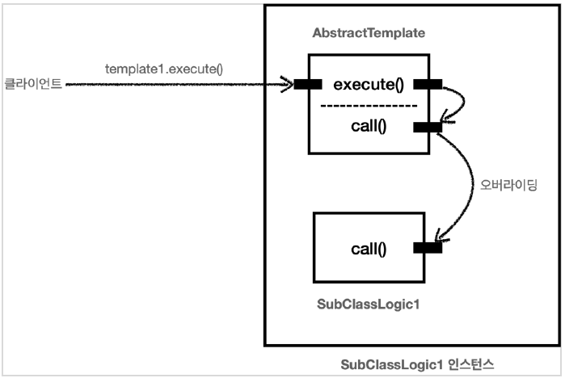

프로젝트를 진행하다 보면 여러 기능을 구현하게 되는데,  
이중에도 경중이 나뉜다.

### 핵심 기능 vs 부가 기능

핵심 기능은 해당 객체가 제공하는 고유의 기능이다.

> OrderService의 핵심 기능은 주문을 등록하는 것이다.

부가 기능은 핵심 기능을 보조하기 위해 제공하는 기능이다.

> OrderService의 부가 기능은  
> 로그를 남기는 기능, 트랜잭션 기능, 예외 처리 기능 등이 있다.

하나의 클래스에 여러 기능이 섞여 있다면  
이를 분리하여 관리하는 것이 좋다.

---

### 좋은 설계

좋은 설계는 변하는 것과 변하지 않는 것을 분리하는 것이다.

> OrderService에서  
> 변하는 것: 주문 등록 기능
> 변하지 않는 것: 로그, 트랜잭션, 예외 처리

이를 템플릿 메서드 패턴(Template Method Pattern)을 이용해 이런 문제를 해결할 수 있다.

---

## 템플릿 메서드 패턴

템플릿 메서드 패턴은  
상위 클래스에서 처리의 흐름을 정의하고,  
하위 클래스에서 처리의 내용을 구체화하는 디자인 패턴이다.

---

### 템플릿 메서드 패턴 구현 예시

특정 기능의 시간을 측정하는 클래스를 구현한다고 가정해보자.

```java
public abstract class AbstractTemplate {
    public void execute() {
        long start = System.currentTimeMillis();
        code();
        long end = System.currentTimeMillis();
        System.out.println("수행 시간: " + (end - start));
    }

    protected abstract void call();
}
```

템플릿은 기준이 되는 거대한 틀이다.  
템플릿이라는 틀에 변하지 않는 부분을 몰아둔다.  
그리고 일부 변하는 부분을 별도로 호출해서 해결한다.

> 위 AbstractTemplate 클래스에서  
> measure() 메서드는 변하지 않는 부분이다. (시간 측정)  
> code() 메서드는 변하는 부분이다. (구체적인 기능)

그리고 위 클래스를 상속 받아서 구체적인 기능을 구현한다.

```java
public class ConcreteTemplate extends AbstractTemplate {
    @Override
    protected void call() {
        // 구체적인 기능 구현
    }
}
```

### 템플릿 메서드 패턴 인스턴스 호출 그림



---

### 템플릿 메서드 패턴의 정의

GOF 디자인 패턴에서는 템플릿 메서드 패턴을 다음과 같이 정의한다.

> Define the skeleton of an algorithm in an operation, deferring some steps to subclasses.  
> Template Method lets subclasses redefine certain steps of an algorithm without changing the algorithm's structure.  
> (알고리즘의 구조를 정의하는데 사용되는 연산을 정의하고, 일부 단계를 하위 클래스로 연기한다.  
> 템플릿 메서드는 알고리즘의 구조를 변경하지 않고 알고리즘의 특정 단계를 하위 클래스에서 재정의할 수 있게 한다.)

---

### 템플릿 메서드의 단점

템플릿 메서드 패턴은 상속을 사용한다.  
따라서 상속에서 오는 단점들을 가지고 있다.

1. 자식 클래스가 부모 클래스와 컴파일 시점에 강하게 결합된다는 문제 (의존관계에 대한 문제)
2. 자식 클래스는 부모 클래스의 기능을 전혀 사용하지 않는다. (불필요한 기능을 상속받는 문제)
3. 다중 상속이 불가능하다.
4. 이 패턴을 구현하기 위해, 별도의 클래스나 익명 내부 클래스를 생성해야 한다.

> 부모 클래스를 수정하면 자식 클래스에 영향을 미칠 수 있다.

---

템플릿 메서드 패턴과 비슷한 역할을 하면서 상속의 단점을 제거할 수 있는 디자인 패턴이 바로  
전략 패턴(Strategy Pattern)이다.

---

