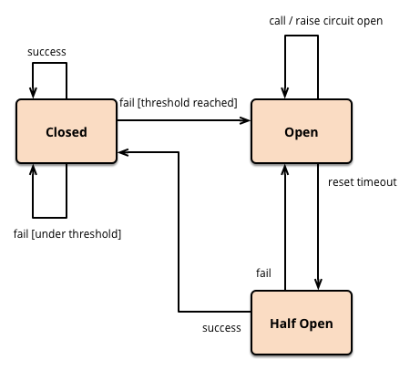

# 서킷 브레이커 패턴

## 서킷 브레이커 패턴의 필요성

개발을 하다보면 외부 API를 호출해야 하는 경우가 많다.

> 만약 시스템이 MSA(Microservice Architecture)로 구성되어 있다면,  
> 내부 서비스 간에도 외부 API를 호출하는 경우가 매우 많아질 수 밖에 없다.

문제는 외부 API 호출 시,  
외부 API 서버가 다운되거나 응답이 느려지는 경우가 발생할 수 있다.

호출한 API 서버에 장애가 발생했다면 장애가 전파되어,  
호출한 서비스도 장애가 발생할 수 있다.  
(또한 장애가 발생한 서비스에 계속 요청을 보내는 것은 장애 전파를 더욱 가속화시킨다)

그래서 장애가 발생한 서비스를 탐지하고, 요청을 보내지 않도록 차단할 필요가 있다.  
이때 서킷 브레이커 패턴이 사용된다.

## 서킷 브레이커 패턴이란?

외부 시스템(API, 데이터베이스 등) 호출 실패가 반복될 경우,  
추가 호출을 차단하여 시스템 전체의 장애 전파를 방지하는 디자인 패턴

> 서킷 브레이커 패턴은 시스템의 안정성을 보장하기 위해 설계된 보호 메커니즘이다.

> 실제 전기 회로의 서킷 브레이커와 비슷한 역할을 한다.  
> 
> 전류가 흐르는 상황에서 전기 회로가 과부하되면,  
> 회로를 차단하여 회로가 더 이상 손상을 입지 않도록 하는 역할을 한다.

## 서킷 브레이커 패턴의 동작 원리

서킷 브레이커는 다음 3가지 상태를 기반으로 동작한다.

### Closed (닫힘 상태)

모든 요청이 정상적으로 외부 시스템에 전달된다.  
실패율이 낮거나 임계치(예: 실패율 50%)를 넘지 않는 경우 유지된다.  
실패가 발생하면 내부 카운터로 실패 횟수를 기록한다.

### Open (열림 상태)

실패율이 임계치를 초과하면 서킷 브레이커는 Open 상태로 전환된다.  
Open 상태에서는 외부 시스템 호출을 즉시 차단하고, 에러를 반환하거나 Fallback 로직을 실행한다.  
외부 시스템에 추가 부하를 주지 않기 위해 일정 시간 동안 요청을 차단한다.

### Half-Open (반열림 상태)

일정 시간이 지나면 Half-Open 상태로 전환된다.  
일부 요청(테스트 요청)을 허용하여 외부 시스템이 복구되었는지 확인한다.  
테스트 요청이 성공하면 Closed 상태로 전환되며, 실패하면 다시 Open 상태로 전환된다.

### 각 상태 전환 시나리오

맨 처음 Closed 상태에서 시작

`Closed -> Closed`: 성공한 경우 or 실패율이 임계치를 넘지 않는 경우  
`Closed -> Open`: 실패율이 임계치를 초과하는 경우

`Open -> Half-Open`: Open 상태에서 일정 시간이 지난 경우

`Half-Open -> Closed`: 테스트 요청이 성공한 경우  
`Half-Open -> Open`: 테스트 요청이 실패한 경우

### Half-Open 상태에서 테스트 요청 케이스

Half-Open 상태가 되었다면  
해당 외부 API에 대한 테스트 요청을 보내야 한다.

이때 테스트 요청을 직접 보낼 수도 있지만,  
클라이언트로부터 요청을 받아 테스트 요청을 보내는 방법도 있다.

## 서킷 브레이커 패턴의 이점

- 장애 감지 및 격리
- 자동 시스템 복구
- 빠른 실패 및 고객 응답
- 장애 서비스로의 부하 감소
- 장애 대안 커스터마이징

