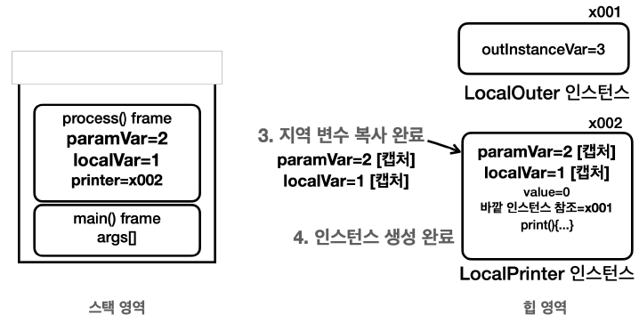

# 중첩 클래스(Nested Class)

클래스 내부에 선언된 클래스를 중첩 클래스라고 한다.

```java
class Outer {
    // 중첩 클래스
    class Nested {
    }
}
```

중첩 클래스는 클래스를 정의하는 위치에 따라 다음과 같이 분류한다.
1. 정적 중첩 클래스
2. 내부 클래스
3. 지역 클래스
4. 익명 클래스

> 1번만 static이고,  
> 2,3,4번은 non-static이다.

```java
class Outer {
    // 정적 중첩 클래스
    static class StaticNested {
    }

    // 내부 클래스
    class Inner {
    }
    
    void method() {
        int localVar = 0;
        
        // 지역 클래스
        class Local {
        }
        
        Local local = new Local();
    }

    void method2() {
        Runnable r = new Runnable() { // 익명 클래스
            @Override
            public void run() {
            }
        };
    }
}
```

선언 위치  
1. 정적 중첩 클래스: 정적 변수와 같은 위치
2. 내부 클래스: 인스턴스 변수와 같은 위치
3. 지역 클래스: 지역 변수와 같은 위치

> 지역 클래스는 접근 제어자를 사용할 수 없다.

---

## 중첩(Nested) 클래스 vs 내부(Inner) 클래스

중첩과 내부를 분류하는 핵심은 바깥 클래스 입장에서 볼 때  
`안에 있는 클래스가 나의 인스턴스에 소속이 되는가 않은가`의 차이이다.

정적 중첩 클래스는 바깥 클래스와 전혀 다른 클래스이다.  
따라서 바깥 클래스의 인스턴스에 소속되지 않는다.

내부 클래스는 바깥 클래스를 구성하는 요소이다.  
따라서 바깥 클래스의 인스턴스에 소속된다.

---

## 정적 중첩 클래스(Static Nested Class)

### 중첩 클래스를 사용하는 이유

`1. 논리적 그룹화`  
특정 클래스가 다른 하나의 클래스 안에서만 사용되는 경우,  
해당 클래스 안에 포함되는 것이 논리적으로 더 그룹화 된다.

패키지를 열었을 때 다른 곳에서 사용될 필요가 없는 중첩 클래스가  
외부에 노출되지 않는 장점도 있다.

`2. 캡슐화`  
중첩 클래스는 바깥 클래스의 private 멤버에도 접근할 수 있다.  
이렇게 해서 둘을 긴밀하게 연결하고 불필요한 public 메서드를 제거할 수 있다.

### 중첩 클래스를 언제 사용해야 할까?

특정 클래스가 다른 하나의 클래스 안에서만 사용되거나,  
둘이 아주 긴밀하게 연결되어 있는 특별한 경우에만  
사용해야 한다.

> Map 인터페이스의 Entry 인터페이스가 대표적인 예시이다.

외부의 여러 클래스가 특정 중첩 클래스를 사용한다면  
그 중첩 클래스는 독립적인 클래스로 만들어야 한다.

> 이 사항은 인텔리제이에서도 경고를 띄워준다.

---

## 4가지 간단 정리

정적 중첩 클래스  
static이 붙음, 바깥 클래스의 인스턴스에 소속되지 않음

내부 클래스  
static이 붙지 않음, 바깥 클래스의 인스턴스에 소속됨

지역 클래스  
내부 클래스의 특징 + 지역 변수에 접근

익명 클래스  
지역 클래스의 특징 + 이름이 없음

---

## 내부 클래스 주의할 점

`내부(Inner) 클래스는 외부 참조를 한다`  

일반적으로 내부 클래스를 만들기 위해서는  
먼저 외부 클래스를 초기화한 뒤에 내부 클래스를 초기화 해야 한다.

이러한 과정을 거치면, 내부 클래스는 자신을 만들어준 인스턴스에 대한 `외부 참조`를 가지게 된다.

> 내부 클래스가 외부의 멤버를 사용하지 않아도, 숨겨진 외부 참조를 가지고 있다.

즉 내부 클래스를 만들면,  
외부 클래스의 인스턴스가 가비지 컬렉션의 대상이 되지 않는다.

만약 외부 클래스가 메모리를 많이 사용하는 경우,  
이로 인해 (외부 객체가 GC 되지 않아) 메모리 누수로 인한  
OutOfMemoryError가 발생할 수 있다.

### 그냥 정적 중첩 클래스를 사용하자

---

## 지역, 익명 클래스 & 람다의 지역 변수 캡처

### 변수의 생명주기

클래스 변수(static 변수)는 메서드 영역에 존재하고, 
프로그램 종료 시까지 존재한다.

인스턴스 변수는 힙 영역에 존재하고,  
인스턴스가 GC의 대상이 될 때까지 존재한다.

지역 변수는 스택 영역에 존재하고,  
메서드가 종료되면 사라진다.

> 지역 변수는 스택 프레임 안에 존재한다.  
> 메서드가 호출되면 생성되고,  
> 메서드 호출이 종료되면 스택 프레임이 제거되면서  
> 그 안에 있는 지역 변수도 사라진다.

`지역 변수는 생명 주기가 아주 짧다`

만약 지역 클래스 or 익명 클래스에서 지역 변수를 사용하는데  
지역 변수의 생명 주기가 끝나면 어떻게 될까?

```java
public class LocalOuter {
    private int outInstanceVar = 3;
    public Printer process(int paramVar) {
        int localVar = 1;
        class LocalPrinter implements Printer {
            int value = 0;
            @Override
            public void print() {
                System.out.println("value=" + value);

                System.out.println("localVar=" + localVar);
                System.out.println("paramVar=" + paramVar);
                System.out.println("outInstanceVar=" + outInstanceVar);
            }
        }
        Printer printer = new LocalPrinter();

        return printer;
    }
    public static void main(String[] args) {
        LocalOuterV3 localOuter = new LocalOuterV3();
        Printer printer = localOuter.process(2);

        printer.print(); // ?
    }
}
```

지역 클래스는 지역 변수에 접근할 수 있다.

이떄 지역 변수의 생명주기는 짧고, 지역 클래스를 통해 생성한 인스턴스의 생명주기는 길다.

> 지역 클래스의 인스턴스는 살아있지만, 지역 변수는 이미 제거된 상태일 수 있다.

### 지역 변수 캡처

이런 문제를 해결하기 위해 자바는 지역 클래스의 인스턴스를 생성하는 시점에 필요한  
지역 변수를 복사해서 생성한 인스턴스에 함께 넣어둔다.

이런 과정을 변수 캡처라 한다.

> 필요한 지역 변수만 캡처한다.



### 지역 변수 캡처 주의사항

지역 클래스가 접근하는 지역 변수는 절대로 중간에 값이 변하면 안된다.  
(effective final - final 키워드가 없어도 값이 변하지 않는 변수)

캡처 변수의 값을 변경하지 못하는 이유
- 지역 변수의 값을 변경하면 인스턴스에 캡처한 변수의 값도 변경해야 한다.
- 반대도 마찬가지

-> 이는 예상하지 못한 곳에서 값이 변경될 수 있다.

자바는 캡처한 지역 변수의 값을 변하지 못하게 막아서  
이런 문제들을 차단한다.

```java
public class LocalOuter {
    public static void main(String[] args) {
        int i = 0;
        Runnable lamda = () -> {
            // i = 10; // 컴파일 에러
            System.out.println(i);
        };
    }
}
```