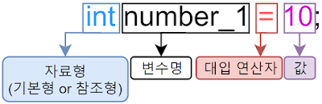
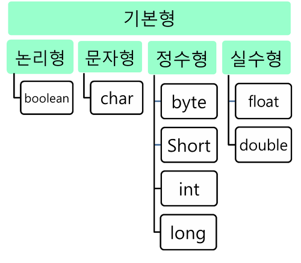
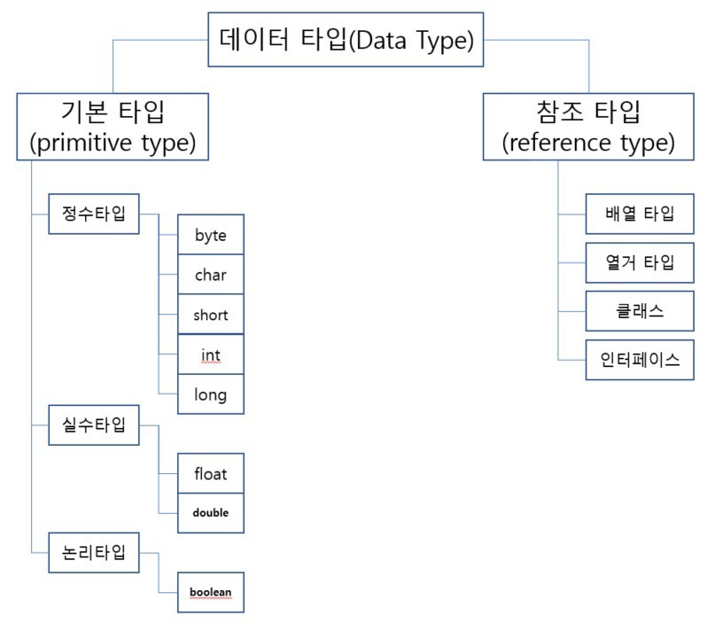

# 기본형 & 참조형

> 기본형과 참조형 타입의 차이점
> 
> 기본형은 스택 영역에 값 자체가 할당되는 것이며,   
> 참조형은 스택 영역에 해당 객체가 저장된 주소가 저장된다.(해당 객체는 힙 영역에 저장됨)  
> 기본형은 null 값을 가질 수 없지만, 참조형은 null 값을 가질 수 있다.

변수(variable)  
데이터를 저장하기 위해 프로그램에 의해 이름을 할당받은 메모리 공간을 의미



변수의 데이터 타입은 크게 기본형과 참조형으로 나뉜다.

기본형(primitive type): 실제 값을 저장  
참조형(reference type): 객체의 주소를 저장(null or 객체의 주소를 갖는다)

## 기본형(primitive type)

기본형 타입에는 크게 논리형(boolean), 문자형(char), 정수형(byte, short, int, long), 실수형(float, double)으로 나뉜다.



### 기본형 타입의 특징

1. 소문자로 시작
2. null 값을 가질 수 없다(기본값이 정해져 있음)
3. 모두 스택(stack)에 저장됨
4. 저장공간에 실제 자료 값을 가진다.

---

## 참조형(reference type)

기본적으로 제공하는 클래스, 프로그래머가 만든 클래스, 배열, 열거 타입 등을 모두 참조형이라 한다.  
(기본형 타입을 제외한 나머지 모두)



### 참조형 타입의 특징
1. 자료가 저장된 공간의 주소를 저장한다.
2. 메모리의 힙(heap)에 실제 값을 저장하고, 그 참조값(주소값)을 갖는 변수는 스택에 저장
3. 참조형 변수는 null로 초기화 가능

### 참조형 타입 주의할 점

> 자바는 항상 변수의 값을 복사해서 대입한다.

```
Member m1 = new Member();
m1.age = 20;
Member m2 = m1;
m2.age = 10;

System.out.println(m1.age); // 20이 아닌 10
```

```Member m2 = m1;``` 이 코드에서,  
m2가 m1이 가리키는 주소를 저장했다.  
-> m2가 가리키는 객체의 값을 바꾸면 m1이 가리키는 객체의 값도 바뀐다.

