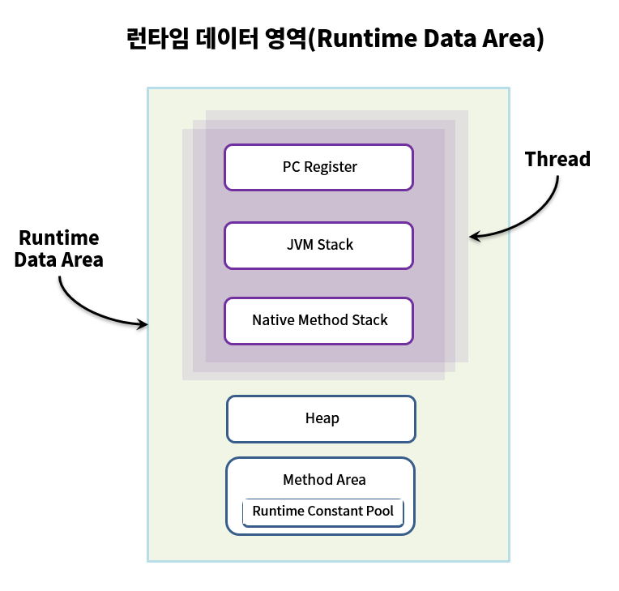
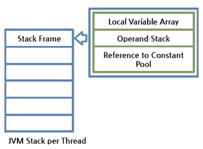

# JVM의 구조

> JVM: 컴파일 된 자바 코드(바이트코드)를 실행시켜 주는 가상 머신

---

## JVM의 컴포넌트

JVM은 5가지 컴포넌트로 구성되어 있다.
- 클래스 로더
- 메모리
- 실행 엔진
- 네이티브 메소드 인터페이스(JNI)
- 네이티브 메소드 라이브러리

자바 코드를 실행하기 위한 JVM의 핵심 컴포넌트
-  클래스 로더
- 실행 엔진(인터프리터, JIT 컴파일러, GC)
- 런타임 데이터 영역

---

## 클래스 로더

역할  
자바 바이트코드(.class 파일)를 받아서, 동적 로딩(Dynamic Loading)을 통해 필요한 클래스들을 로딩 및 링크하여,  
JVM의 메모리인, 런타임 데이터 영역에 올리는 역할 

### 클래스 로더의 클래스 로드 과정

클래스 로더 컴포넌트는 .class 파일에서 바이트코드를 읽어 메모리에 저장하는 시스템으로 아래 3가지 과정을 수행한다.
1. 로딩(loading): 클래스 파일을 가져와서 JVM의 메모리에 로드하는 과정  
   (로드할 클래스가 여럿이면 Main() 메서드를 포함하는 클래스를 우선 로드)
2. 링크(linking): 레퍼런스를 연결하는 과정
   > 2-1. 검증(verifying): 읽어들인 클래스가 자바 언어 명세(Java Language Specification) 및 JVM 명세에 명시된 대로 구성되어 있는지 검사하는 과정  
   > > (클래스 로드 모든 과정에서 가장 복잡하고 시간이 많이 걸리는 과정)
   > 
   > 2-2. 준비(preparing): 클래스가 필요로 하는 메모리를 할당하는 과정  
   > > (필요한 메모리: 클래스에서 정의한 필드, 메서드, 인터페이스들을 나타내는 데이터 구조들 등)
   > 
   > 2-3. 분석(resolving): 클래스의 상수 풀 내 모든 심볼릭 레퍼런스를 다이렉트 레퍼런스로 변경하는 과정
3. 초기화(initializing): 클래스 변수들을 적절한 값으로 초기화 (static 필드 설정한 값으로 초기화)

> 심볼릭 레퍼런스, 다이렉트 레퍼런스
> 
> 심볼릭 레퍼런스: 기본 자료형(primitive data type)을 제외한 모든 타입(클래스와 인터페이스)을  
> 명시적인 메모리 주소 기반의 레퍼런스가 아니라 심볼릭 레퍼런스를 통해 참조한다.
> 
> 컴파일 과정에서 링크될 부분을 직접 참조가 아닌 간접 참조로 두는 것을 심볼릭 레퍼런스라 하는 것임  
> (추후 라이브러리 구현체가 변경되더라도 byte code를 변경하지 않아도 되도록 추상화 단계를 두었다고 이해)  
> 클래스 로더가 심볼릭 레퍼런스를 실제 라이브러리의 구현체로 매핑시키는 과정이 symbolic ref -> direct ref

---

## JVM의 메모리(런타임 데이터 영역)

JVM이라는 프로그램이 운영체제 위에서 실행됨녀서 할당받는 메모리 영역

런타임 메모리 영역은 6가지로 구분된다.

> 스택, PC, 네이티브 메소드 스택은 **스레드 별로 사용하는 영역**이고,  
> 힙과 메소드 영역(Runtime Constant Pool 포함)은 **모든 스레드가 공유**한다. (공유 자원)
>
> 스레드 별로 사용하는 영역은 스레드 시작시 생성 & 스레드가 완료되면 삭제  
> 공유 자원은 JVM이 시작되고 생성 & 종료 시 삭제

스택(Stack): 스택 프레임이라는 구조체를 저장하는 스택  
(JVM은 오직 JVM 스택에 스택 프레임을 추가하고 제거하는 동작만 수행한다)

> JVM 내에서 메서드가 수행될 떄마다 하나의 스택 프레임이 생성되어,  
> 해당 스레드의 JVM 스택에 추가되고 메서드가 종료되면 스택 프레임이 제거된다.
> 
> 스택 프레임이 저장하는 것들: 
> - 지역 변수 배열(this 레퍼런스(0), 메서드에 전달된 파라미터들, 메서드의 지역 변수들이 저장됨)
> - 피연산자 스택(메서드의 실제 작업 공간)
> - (현재 실행 중인 메서드가 속한 클래스의) 런타임 상수 풀에 대한 레퍼런스

PC(Program Counter registers): 현재 수행 중인 명령의 주소를 가진다.

네이티브 메소드 스택(Native Method Stacks): 자바 외의 언어로 작성된 네이티브 코드를 위한 스택  
(JNI를 통해 호출하는 C/C++ 등의 코드를 수행하기 위한 스택)

힙(Heap): 동적으로 생성된 객체를 저장하는 공간 & 가비지 컬렉션 대상

메서드 영역: JVM이 읽어 들인 클래스 & 인터페이스 각각의 런타임 상수 풀, 필드와 메서드에 대한 정보,  
static 변수, 메서드의 바이트코드 등을 보관한다.

> Runtime Constant Pool: 각 클래스와 인터페이스의 상수 뿐만 아니라, 메서드와 필드에 대한 모든 레퍼런스까지 담고 있는 테이블
> > 어떤 메서드나 필드를 참조할 때 JVM은 런타임 상수 풀을 이용해 해당 메서드나 필드의 실제 메모리상 주소를 찾아서 참조한다

---

## 실행 엔진

실행 엔진은 클래스 로더를 통해 런타임 데이터 영역에 배치된 바이트 코드를 명령어 단위로 읽는다.

실행 엔진은 아래의 3가지 주요 컴포넌트가 있다.
- 인터프리터(Interpreter): 바이트코드를 한 줄씩 실행한다.
- JIT 컴파일러: 인터프리터의 효율을 높이기 위해 인터프리터가 반복되는 코드를 발견하면,
  JIT 컴파일러로 네이티브 코드로 바꾼 후 컴파일된 네이티브 코드를 사용한다.
- GC(Garbage Collector): 더 이상 참조하지 않는 객체를 모아서 정리한다. (GC는 따로 설명)

### 인터프리터

바이트 코드 명령어를 하나씩 읽어서 해석하고 실행한다.  
하나하나의 해석은 빠르지만 전체적인 실행 속도는 느리다는 단점을 가지고 있다.  

(JVM 안에서 바이트코드는 기본적으로 인터프리터 방식으로 동작한다)

### JIT 컴파일러

인터프리터의 단점을 보완하기 위해 도입된 방식으로  
바이트 코드 전체를 컴파일하여 네이티브 코드로 변경하고 이후에는 해당 메서드를 더 이상 인터프리팅 하지 않고  
네이티브 코드로 직접 실행하는 방식이다.

> 네이티브 코드를 실행하는 것이 하나씩 인터프리팅하는 것보다 빠르고,  
> 네이티브 코드는 캐시에 보관하기 때문에 한 번 컴파일된 코드는 계속 빠르게 수행되게 된다.

> 하지만 JIT 컴파일러가 컴파일하는 과정은 바이트 코드를 하나씩 인터프리팅 하는 것보다 훨씬 오래 걸리기 때문에,  
> JIT 컴파일러를 사용하는 JVM은 내부적으로 해당 메서드가 얼마나 자주 사용되는지 체크하고,  
> 일정 기준을 넘었을 때, JIT 컴파일러를 통해 컴파일 하여 네이티브 코드를 생성한다.

> JIT 컴파일러는 중간단계의 표현인 IR(Intermediate Representation)로 변환하여 
> 최적화를 수행하고 그 다음에 네이티브 코드를 생성

---

## 네이티브 메소드 인터페이스, 라이브러리

네이티브 메소드 인터페이스(JNI)는 자바 어플리케이션에서 C, C++, 어셈블리로 작성된 함수를 사용하도록 제공하는 인터페이스  
코드상에서 native 키워드를 사용한 메소드를 호출

네이티브 메소드 라이브러리는 C, C++로 작성된 라이브러리를 말한다.

---

## Reference

https://d2.naver.com/helloworld/1230