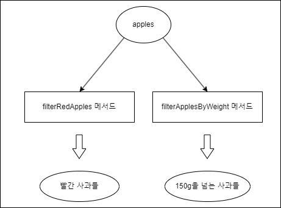

# 모던 자바인액션

## 1. 동적 파라미터화

우리가 어떤 상황에서 일을 하든, 소비자의 요구사항은 항상 바뀐다.

동작 파라미터화를 이용하면 자주 바뀌는 요구사항에 효과적으로 대응할 수 있다. 

동작 파라미터화란 아직은 어떻게 실행할 것인지 결정하지 않은 코드 블록을 의미한다.

예시
```java
public interface ApplePredicate {
	boolean test(Apple apple);
}

public List<Apple> filterApple(List<Apple> apples, ApplePredicate p){
    // ApplePredicate를 파라미터로 받는다.
    // test 함수를 통해 apple들의 값을 비교하면서 filter 수행한다.
    ...
}
```

---

### 요구사항
```java
public class Apple{
    int weight;
    String color;
}
```

사과를 재배하는 농부가 사과를 구별하고 싶어서,
내가 사과를 분류해주는 프로그램을 구현한다고 하자.

처음에 농부는 빨간사과를 분류하고 싶다고 했다.

```java
public List<Apple> filterRedApple(List<Apple> apples){
    List<Apple> result = new ArrayList<>();
    for(Apple apple: apples){
        if(apple.color == "RED")
        result.add(apple);
    }
    return result;
}
```

모든사과를 입력하면 빨간사과만 리턴하는 함수를 짰는데,
나중에 농부가 150g을 넘는 사과를 분류하고 싶다고 했다.

그래서 나는 filterApplesByWeight 라는 메서드를 추가로 생성했다.

```java
List<Apple> filterApplesByWeight(List<Apple> apples) {
	List<Apple> result = new ArrayList<>();
	for(Apple apple: apples){
    	if(apple.getWeight() > 150){
        	result.add(apple);
        }
    }
    return result;
}
```

---

### 기존 코드의 문제점

기존 메서드들을 비교해 보면 겹치는 코드가 너무 많다.

```java
List<Apple> filterApples(List<Apple> apples) {
	List<Apple> result = new ArrayList<>();
	for(Apple apple: apples){
    	if(/* 사과를 분류하는 기준 */){ // 이 코드를 제외하고 모두 같은 코드
        	result.add(apple);
        }
    }
    return result;
}
```

위처럼 사과를 분류하는 기준을 제외한 다른 코드는 모두 같다.

여기서 농부가 또 다른 분류기준을 주면 어떻게될까?

그럼 또 새로운 메서드를 추가할 것인가?

---

### 문제 해결 과정

결국 농부의 요구사항은 사과를 어떤 속성에 기초해서(빨간색인가?, 150g을 넘는가?) 분류할 것인지, 아닌지를 판단만 하면 되므로, 참 또는 거짓을 반환하는 함수를 만든다

```java
public interface ApplePredicate() {
	boolean test(Apple apple);
}
```

다음 예제처럼 여러 선택조건을 대표하는 여러버전의 ApplePredicate를 정의할 수 있다.

```java
public class AppleWeightPredicate implements ApplePredicate {
    @Override
    public boolean test(Apple apple) {
      return apple.getWeight() > 150;
    }
}

public class AppleRedColorPredicate implements ApplePredicate {
    @Override
    public boolean test(Apple apple) {
        return apple.getColor() == Color.RED;
    }
}

```

이 다음은 filterApples에서 ApplePredicate 객체를 받아 애플의 조건을 검사하도록 메서드를 고친다.

```java
List<Apple> filterApples(List<Apple> apples, ApplePredicate p) {
	List<Apple> result = new ArrayList<>();
	for(Apple apple: apples){
    	if(p.test(apple)){ // 깔끔하다
        	result.add(apple);
        }
    }
    
    return result;
}
```

만약 빨간 사과를 분류하고 싶다면
filterApples(apples, new AppleColorPredicate())처럼
AppleColorPredicate 객체를 선언해서 filterApples 메서드를 호출해주면 되고,

150g을 넘는 사과를 분류하고 싶다면,
filterApples(apples, new AppleWeightPredicate()) 처럼 선언해주면 된다.

---

### 그림으로 정리

위의 문제 해결 과정을 그림으로 보자



(다른 메서드)
기존 코드의 문제점은 분류기준이 바뀔때마다 새로운 메서드를 생성해야 한다는 것이다.


그래서 동작 파라미터화를 적용하면,


(같은 메서드)
ApplePredicate라는 인터페이스가 filterApples메서드의 인자로 입력되면서,

사과를 분류하는 기준(동작)을 메서드의 파라미터로 받아서, 좀더 유연하게 사과를 분류할 수 있게 되었다.

---

### 한개의 파라미터, 다양한 동작

이렇게 동작 파라미터화, 즉 메서드가 다양한 동작(또는 전략)을 받아서 내부적으로 다양한 동작을 수행할 수 있다.