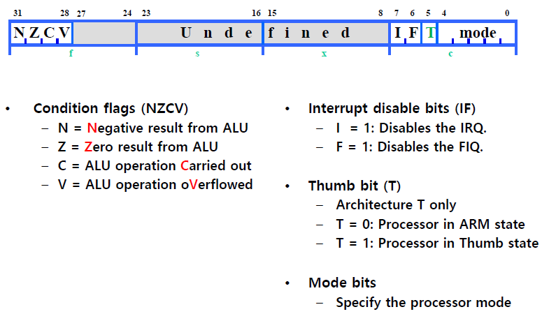

# 어셈블리프로그래밍설계및실습

이 강의에서 배우는 것

Basic assembly programming skills

    assembly language의 구조
    ARM instructions and assembly programming

Microprocessor architectures and operations

    Instruction set structure
    ARM operations
    ARM programming model

---

`Processor / CPU(Central Processing Unit)`

메인 메모리에 있는 프로그램의 instructions를 Fetch함

Execution of instructions for basic arithmetic/logic operations and so on

Control of components in the processor responding to instructions

Interface to input/output and main memory

`Registers`

CPU에 있는 high-speed temporary storage

`ALU(Arithmetic Logic Unit)`

계산을 하기위한 하드웨어

`CU(Control Unit)`

`Buses`

---

요즘은 processor나 microprocessor나 같은 의미로 쓰임

---

c++, JAVA, Python은 high-level language

Assembly language는 low-level language

---

c언어를 컴파일하는 과정

c언어 -> assembly language -> machine language(0,1)

---

assembly language의 장점

space-efficiency, time-efficiency, Accessibility to system hardware

high-level language의 장점

소프트웨어 이식성, development, maintenance

---

Assembly Instructions

`ADD r1, r3, #5`

여기서 ADD는 Opcode(데이터로 뭘할지)

그 뒤는 Operands(어떤 데이터 - 레지스터, 숫자)

---

## Numbers

1 hexadecimal digit = 4 binary digits

bit = b(inary dig)it

MSB = Most Significant Bit(가장 높은 숫자)

LSB = Least Significant Bit(가장 낮은 숫자)

---

Sign and magnitude - 맨 앞숫자는 sign bit, 나머진 양수나 음수나 같음

이 표현은 연산할때 별로임

1's complement number - 양수를 뒤집은 수가 음수의 표현, 연산할때 편함, 대신 0이 두가지로 표현됨(이게 별로)

2's complement number - 숫자를 뒤집고 1을 더한게(1's complement number에서 1더한것) 음수의 표현, 연산할때 편함, 0은 1가지로 표현됨(0000)

---

2's complement numbers는 양수와 양수를 더했을때 `overflow` 발생, 음수와 음수를 더했을 떄 `underflow` 발생

    컴퓨터로 표현하는 수는 범위가 제한되어 있기 때문에 발생

정확히는 overflow는 + + 를 더했을때 -가 나온것

underflow는 - - 를 더했을때 +가 나온것

    - + 는 overflow나 underflow가 발생하지 않는다.

---

Sign Extension

맨 앞 숫자(sign bit)를 같은 숫자로 늘리는 과정

---

## Instruction Set Architecture(ISA)

Opcode: What to do with the data(ADD, SUB, ...)

Operands(Sources/Destination): Where to det data and put the result(registers, memory, I/O device, Numbers)

ISA: the computer architecture visible to assembly language programmers or complier designers ISA includes

---

CISC(Complex Instruction Set Computers) vs RISC(Redueced Instruction Set Computers)

그냥 CISC는 복잡함

RISC는 간단함(instruction size가 고정, load-store architecture)

RISC의 장점: die size가 작음, development time 짧다, 성능 좋음(higher clock speed, pipelining)

RISC의 결점: poor code density(단위가 짧기 때문에 표현할 수 있는 명령어가 적다)

---

### Registers vs Memory

register는 CPU 내에 있음

Memory는 CPU 밖에 있음

register보다 memory의 capacity가 매우 높다

memory보다 register의 access time이 짧다

---

### Endian

Big Endian - LSB has highest address

Little Endian - LSB has lowest address(요즘은 이걸로 통일됨)

---

Alignment

맨앞 두 bits가 00으로 맞춰야함

---

### Mu0: Design of a Simple Processor

16bits에서 4bits가 opcode, 12bits가 S

LDA S 0000 - S위치 메모리의 값을 ACC에 로드

STO S 0001 - ACC의 값을 S위치 메모리에 저장

ADD S 0010 - ACC에 S위치 메모리의 값을 더함

SUB S 0011 - 빼는거

JMP S 0100 - S로 점프

JGE S 0101 - ACC값이 0보다 크거나 같다면 S로 점프

JNE S 0110 - ACC값이 0이 아니라면 S로 점프

STP   0111 - stop

---

### MU0 Datapath

PC: program counter: 다음으로 실행할 instruction의 address를 가지고 있음

ACC: accumulator라고 불리는 signle register: 현재 data 값을 가지고 있음

ALU: Arithmetic-Logic Unit: 연산 수행

IR: Instruction Register: 현재 실행될 instruction code를 가지고 있음

Instruction decode and control logic

    그리고 CPU 밖의 Main Memory

---

EX, fetch는 누구나 함, 근데 몇몇 instruction은 메모리에 접근해야하는 stage가 필요

---

### ARM Processor

Advanced RISC Machines(ARM)
1. 작은 사이즈와 낮은 파워소비, 높은 스피드로 작동
2. Load/Store architecture
3. Fixed-length instructions
4. pipeline

    ARM은 단순하다, clock frequency가 높다

ARM은 32-bit architecture

32-bit data/address bus & 32-bit instruction

    Byte - 8bits
    Halfword - 16bits
    Word - 32bits

32-bit ARM instruction set 
16-bit Thumb instruction set

---

ARM은 7개의 basic operating mode를 가지고 있다.

1. User - 일반 모드(안막힘)
2. FIQ - high proirity interrupt가 왔을때 
3. IRQ - low priority interrupt가 왔을때
4. Supevisor - reset이 오거나, 소프트웨어 실행이 막혔을때?
5. Abort - memory access violation을 handle 하기 위해
6. Undef - undefined instructions를 handle 하기 위해
7. System - user mode에서 same register를 쓰는것을 막기위해?

    FIQ 모드가 되면 r8부터는 시스템에 맡겨진다.
    다른 privilege 모드는 r13부터 맡겨짐

---

ARM은 37개의 32-bits 길이의 register를 가지고 있음

r0-r12 register는 그냥 별 의미 없음

r13 - stack pointer register 
r14 - link register 
r15 - program counter

cpsr - current program status register

spsr - saved program status register

    spsr만 5개 register가 쓰인다, 다른건 다 1개만

    privileged mode에서 spsr에 can access

---

Program Status Register

---

13(sp),14(lr),15(pc)번 레지스터는 안쓰는게좋음

13번레지스터- Stack Pointer register

각 함수가 시작하는 위치를 저장함, 이 위치를 저장하는 레지스터

    함수는 스택방식으로 call됨
    가장 마지막으로 호출한것이, 가장 먼저 마무리됨

    그래서 queue가 아닌 stack

14번레지스터 - Link register

돌아올곳의 주소를 저장하는 레지스터

    BL(Branch and Link) 명령어를 통해 저장됨

>

    13번은 주소의 모음이 있는 주소를 저장
    14번은 주소를 저장

    13번에 있는 스택은 여러데이터가 있지만
    14번은 딱 한개만 저장(돌아올곳)

---

13,14 레지스터를 특정레지스터로 지정했지만

사용 가능

그런데 다른 명령어에 의해 값이 바뀔수있음

---

15번 레지스터

다음에 수행할 명령어가 있는 위치(0,4,8,C, ...)

뒤의 최하위 두비트는 00이다.

    ARM 프로세서의 모든 명령어는 32 bits wide
    메모리는 바이트 단위로 저장되어있음
    PC는 4개씩 읽는다

15번레지스터는 일반 레지스터로 사용 불가능

---

`Exceptions`

모든예외처리루틴은 어딘가에 있음

그위치를 첫 부분에 포인터들로 저장해놓음(vector table)

(reset, undefined instruction, ...)

---

강의뒷부분 7TDMI는 안함

---

directive 어셈블러한테 어떤ㄷㅇ작하라고 가리키는것

CODE32, AREA, ...

---

label은 대소문자 구분해야함

---

실제로 lsl이라는 몀령어는 없다

ARM Processor에서 사용하는 명령어가 아님

사용자가 편하게 하도록 사용됨

    lsl r0, r0, #1 하면
    mov r0, r0, lsl #1 됨

    LDR도 마찬가지

---

ARM 명령어는 모두 32bit

---

### `Data Processing Instructions`

`Add & Subtract operation`

opcode{cond}{S} Rn, Rd, \<Operand2>

opcode - ADD, ADC, SUB, SBC, RSB, RSC

RSB = reverse substract

cond - Execution condition code

S - status update suffix

Rn - destination register

Rd - Source(Operand1) register

\<Operand2> - #Immediate, Rm(register) (LSL 등 붙을 수도 있음)

`Logical operation`

AND, ORR, EOR, BIC(r1n(~r2))

`Compare & Test operation`

CMP, CMN, TST, TEQ - set flag, does not store result

(CMP r1, r2)

`Move operation`

    Compare & Test와 Move operation은 레지스터 두개만 받음

    Compare & Test는 두개를 연산함

    Move는 오른쪽 레지스터의 값을 왼쪽 레지스터로

---

ADD vs ADC

ADD는 그냥 더하기

ADC는 더할때 carry 값까지 더해주는 것

---

`logical과 arithmetic의 차이`

left일때는 둘다 같음

(right 일때) logical은 그냥 0이 채워짐 
arithmetic은 sign bit로 채워짐

---

### Data Transfer Instruction

opcode{type}{cond} Rd/Rn, \<address_mode>

\<address_mode> - register indirect (with immediet offset/with a (scaled) register)

[r0] => register indirect - 레지스터에 있는 값을 주소로 생각하겠다.

[r0, #4] - r0+4의 값에 있는 주소로 생각

[r0, #4]! - r0에 4를 더함, r0의 값에 있는 주소로 생각

[r0], #4 - r0의 값에 있는 주소로 생각, r0에 4를 더함

---

(Pre-Indexing) 
LDR r6, [r7, #4]! - r7에 4를 더해서 그게 주소값이 됨

    !의 의미 r7에 4가 증가되어 있음

    왜 쓸까? - array 같은 데이터 구조에서 사용하기 위해(다음으로 가려고)

(Post-Indexing) 
LDR r6, [r7], #4  - r7에 4를 더해서 그게 주소값이 됨

    r7에 가서 데이터를 읽어오고, r7에 4를 더해서 업데이트

순서에 차이가 있다

0000이라면 
pre-indexing은 0004,0008, ... 
post-indexing은 0000,0004, ...

첫번째 가져오는 element가 달라진다.

---

LDR/STR의 제약조건은 32bit 주소를 명령어안에 포함불가능, 레지스터를 사용한다.

---

`Multiple Load & Store operation`

메모리에 있는 다수의 데이터를 레지스터로 저장 or 레지스터의 값들을 메모리에 저장

opcode{access_mode} {cond} Rn{!}, reglist

opcode - LDM, STM

access_mode - IA(increment address) after transfer, IB, DA, DB

(0020 start) 
IA - 0020, 0024, 0028, ... 
IB - 0024, 0028, 0032, ... 
DA - 0020, 0016, 0012, ... 
DB - 0016, 0012, 0008, ... 

Rn - base register 

! - 쓰면 Rn값이 맨 처음 값으로 written back

reglist - {r0-r6}, {r0, r2, r7}

`Swap operation`

레지스터와 메모리의 값을 바꿔줌 - 이때 원자성을 띈다

---

### Control Flow Instructions

`Branch operation`

opcode{cond} \<label>

opcode - B, BL(Branch and Link)

label - 코드에서 이름붙힌곳?

---

### Condition Field

All operations can be performed conditionally,
testing condition flags in `CPSR`

오버플로우는 sign bit가 바뀌는것 - 데이터의 표현범위가 벗어나는것(양수더했는데 음수, 음수 더했는데 양수)

carry는 그냥 한비트 넘는 값이 있을때

명령어 뒤에 S가 붙어 있다면, 명령어 수행뒤에 Control Flag를 바꾸라는것

    SPSR은 에러가 났을때 현재 CPSR의 값을 저장해놓는 곳

