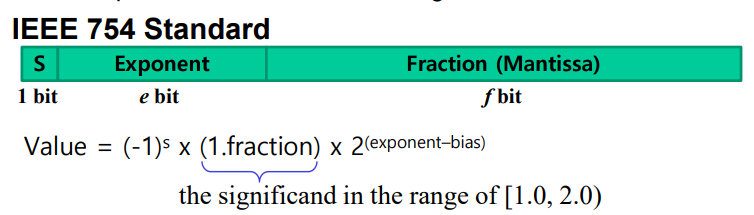
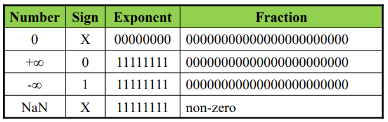
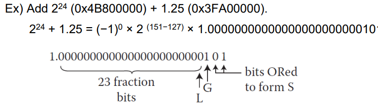
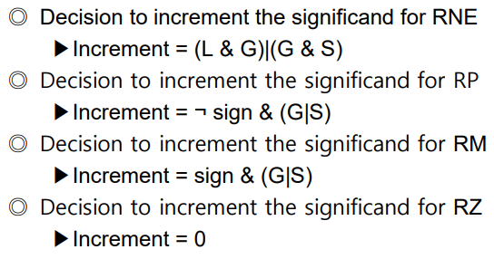

### Floating-Point Numbers

소수점을 표현하기 위한 두가지 방법
1. fixed-point
2. floating-point - 좀더 다양하게 표현가능

`fixed-point` - 잘 안씀

01101000 = 0110.1100 = $2^2+2^1+2^{-1}+2^{-2}=6.75$

integer파트의 비트 수와 fraction파트의 비트 수가 고정되어 있음

이 방식에서 음수를 표현하기 위한 방법
1. sign/magnitude notation - 음수면 MSB에 1붙이고, 양수면 0붙임
2. Two's complement notation - 똑같이 invert & +1

`Floating-Point`

(trade-off between precision and range)

> 이러한 방식을 사용하는 이유는,<br>
> 큰 수를 표현할 때는 아주 큰 수를 표현하는 경우가 많지만(천문학),<br>
> 작은 수를 표현할 때는 아주 작은 수를 표현할 때가 많다.(전자 크기 등)

가장 높은 자리의 1까지 이동한다.<br>
(similar to decimal scientific notation)<br>
273 = + 2.73 x 10^2<br>
M = 2.73, B = 10, E = 2

general 표현<br>
$+-M x B^E$<br>
M = mantissa, B = base, E = exponent

IEEE 754에서 floating-point를 정의해 놨다.



single precision: 32bit notation: e = 8 bits, f = 23 bits, bias = 127<br>
Double precision: 64bit notation: e = 11 bits, f = 52 bits, bias = 1023

#### Floating-Point Numbers: Special Cases



NaN - Not a Number<br>
이걸 왜 씀?
1. 예상을 벗어난 결과를 알려주기 위해
2. invalide value(메모리가 초기화되지 않았을 때)

#### Rounding

실제 소숫점이 32bit로 표현이 정확하게 안될때 사용함

방법 4가지
1. RNE(Round to Nearest Even) - 가장 가까운 곳으로 맞춰줌
2. RP(Round to Plus Infinity) - 무조건 plus 방향으로 가까운 곳으로 맞춰줌
3. RM(Round to Minus Infinity) - 무조건 minus 방향으로 가까운 곳으로 맞춰줌
4. RZ(Round to Zero) - 무조건 0의 방향으로 가까운 곳으로 맞춰줌

예시 - 1.100101을 3fraction bits로 rounding
1. RM: 1.100
2. RP: 1.101
3. RZ: 1.100
4. RNE: 1.101

연산수행하고 결과가 32bits를 넘어갈때, rounding을 사용할 떄 추가 비트를 사용함
1. guard bit (G) - fraction bit 바로 다음 bit
2. sticky bit (S) - guard bit 다음 bit(밑의 bits는 ORing 해줌)



RNE, RP, RM, RZ를 guard bit와 sticky를 이용한 연산으로 한번에 수행 가능함


#### Addition of Floating-Point Numbers

1. exponent and fraction bits를 추출
2. fraction에 1 붙힘(.0010 -> 1.0010)
3. exponents를 비교
4. exponent가 작은 쪽의 fraction에, 작은 만큼 오른쪽으로 shift
5. fractions을 더함
6. fraction을 normalize & add exponent
7. result rounding
8. exponent와 fraction assemble

---

### Stack & Subroutines

스택 명령어  

(sp 위치 지점)  
SRAM_BASE EQU 0x20000200  
LDR sp, =SRAM_BASE

PUSH {rX} - rX의 값을 스택에 넣음, 스택 포인터 다음 인덱스로  
POP {rX} - 해당 스택이 가리키고 있는 값을 rX에 저장, 스택 포인터 이전 인덱스로  
(푸쉬하면 sp 값이 4 작아짐, 팝하면 sp 값이 4 커짐)

(sp는 서브루틴의 임시 레지스터 값들을 저장하는데 사용된다)
```
STMFD sp!,{r0-r12, lr}
; stack all registers and the return address

........
........
........

LDMFD sp!,{r0-r12, pc}  
; load all the registers and return automatically
```

---

LDM/STM<address mode>

address mode
1. IA - increment, after(연산하고 다음 인덱스)
2. IB - increment, before(다음 인덱스 후 연산)
3. DA - decrement, after
4. DB - decrement, before

stack type address mode
1. FD - descending, full(연산하고 다음 인덱스)
2. ED - descending, empty(다음 인덱스 후 연산)
3. FA - ascending
4. EA - ascending  

> D와 A는 같이 안씀(default는 D)

---

서브루틴

재귀함수의 특성 - reentrant

서브루틴의 파라미터들을 저장하는 방법
- Predefined set of registers(빠르지만 개수 제한이 있다)
- Specified block of memory(위치 지정을 위한 파라미터 한개면 충분하다는 장점 있음)
- Stack

---

### ADR vs ADRL

ADR(ADdress Relative), ADRL(ADdress Relative Long) 둘 모두 
해당 라벨의 `상대적인 주소`를 반환하여 연산을 진행한다.

하지만 여기서 차이점이 있다.

ADR은 해당 라벨의 12비트만을 취한다 (-2048 ~ 2047)  
ADRL은 해당 라벨의 전체 32비트를 취한다.

여기서 relative는 `상대적인`이라는 뜻으로, relative addressing은 현재 위치의 상대적인 주소를 지정하는 것을 의미한다.

> 참고로 LDR/STR에서 R은 relative가 아니라 register를 의미한다.
>
> =를 이용하면 ADR과 같은 결과가 나올 수 있다.  
> ADR r2, Loop == LDR r2, =Loop

ADR(L)은 라벨의 위치를 PC를 이용해서 계산한다.  
-> 같은 instruciton이 다른 위치에 있다면, disassembly의 결과는 다를 것이다.(PC 값이 다르기 떄문)

---

