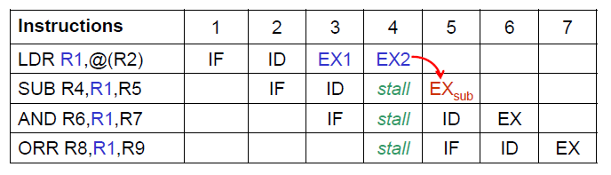
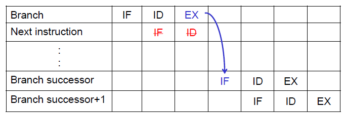
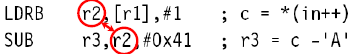

# 이전 강의에서 중요했던 것들

### ARM의 특징
1. Load/Store architecture
2. Fixed-length instructions
3. Pipeline
4. Enhanced power-saving design

=> Simplicity - operating at higher clock frequencies

### Condition flags
1. N: set when the result was Negative(MSB of the result is 1)
2. Z: set when the result was Zero
3. C: set when a Carry occurs
4. V: set when oVerflow occurs

### Condition


### Status Update Field {S}
일반 명령어에 S를 붙이면, CPSR의 flags가 업데이트 됨  
ADD - 그냥 더함  
ADDS - 더하고, CPSR(flags) 업데이트  
> CMP, CMN은 flags만 업데이트하는 명령어 (S 안씀)  
> (CMP는 앞 숫자에서 뒤 숫자를 빼서 결과를 통해 flags를 업데이트)

### ARM Instructions

Arithmetic operation(MUL 제외)  
ADD - Rd <- Rn + operand2  
ADC - Rd <- Rn + operand2 + carry flag  
SUB - Rd <- Rn - operand2  
SBC - Rd <- Rn - operand2 + carry flag - 1(borrow)  
RSB - Rd <- operand2 - Rn  
RSC - Rd <- operand2 - Rn + carry flag - 1(borrow)

multiword arithmetic을 할 때,  
상위 명령을 제외한 명령어에 S(set flags(carry))  
하위 명령을 제외한 명령에 C(carry 더해줘야 함)

Logical (boolean) operations  
AND - Rd <- Rn n operand2  
EOR - Rd <- Rn (XOR) operand2  
ORR - Rd <- Rn u operand2  
BIC - Rd <- Rn n (~operand2) // bit clear

Comparizons(no result - just set condition codes)  
CMP - Rn - operand2, set flag no result written  
CMN - Rn + operand2, set flags no result written  
TST - Rn n operand2, set flags no result written  
TEQ - Rn (XOR) operand2, set flags no result written  
(S를 안쓰고 contdition flags를 업데이트)

Data movement between registers  
MOV - Rd <- operand2  
MVN - Rd <- ~operand2  
(operand1(Rn)를 사용하지 않는다)

LSL: logical shift left & MSB는 carry bit  
LSR: logical shift right & LSB는 carry bit  
ASR: arithmetic shift right & LSB는 carry bit  
ROR: rotate right & LSB는 carry bit  
RRX: rotate right extended by carry - carry bit가 LSB가 됨

MUL{cond}{S} Rd, Rm, Rs ; Rd = Rm x Rs, Rd, Rm 같이 사용 불가, PC 사용 불가

STR r0, \[r1]  ; 메모리에서 (r1의 값)해당 자리를 r0로 store한다.  
LDR r2, \[r1] ; 메모리에서 (r1의 값)해당 자리의 값을 r2로 load  
(여기서 r1이 base register)

offset이 적용되는 기준
1. Pre-indexed addressing(미리 인덱스가 더해지고 주소를 찾는다)
	- STR r0, \[r1, #4] ; r1에 12만큼 더한 자리가 메모리의 위치
	- STR r0, \[r1, #4]! ; auto-increment(명령 수행 후 r1에 12를 더함)
2. Post-indexed addressing(주소를 찾고 인덱스가 더해진다)
	- STR r0, \[r1], #4 ; auto-increment

> 여기서 STR r0, \[r1, #12] 명령만 r1에 변화가 없다(non-auto increment)

> 특정 element 접근할 때는, pre-indexed addressing이 편하다  
> 배열의 인덱스들을 접근할 때는, post-indexed addressing이 편하다  
> 여기서 byte 단위로 접근하려면, #1  
> halfword 단위로 접근하려면, #2  
> word 단위로 접근하려면, #4

> shift하는 값을 register로 표현하려면  
> (r4가 몇 번째 element인지 가리킴)  
> r4, lsl #2 해줘야 함 - r4에 곱하기 4해야 제대로 가리킬 수 있다  
> (메모리는 바이트 단위로 element를 저장하기 때문 & ARM은 32-bit 단위로 한번에 저장함)

B  
BL  
BX

---

# 8 Floating-Point Numbers

소수점(fraction)을 표현하기 위한 두가지 방법
1. fixed-point - binary point가 고정되어 있음
2. floating-point - binary point의 MSB가 무조건 1, 좀 더 다양하게 표현가능

`fixed-point` - 잘 안씀

01101000 = 0110.1100 = $2^2+2^1+2^{-1}+2^{-2}=6.75$

integer파트의 비트 수와 fraction파트의 비트 수가 고정되어 있음

이 방식에서 음수를 표현하기 위한 방법
1. sign/magnitude notation - 음수면 MSB에 1붙이고, 양수면 0붙임
2. Two's complement notation - 똑같이 invert & +1

`Floating-Point`

(trade-off between precision and range) - 정밀도가 낮아지지만, 표현할 수 있는 범위가 매우 커진다.

> 이러한 방식을 사용하는 이유는,<br>
> 큰 수를 표현할 때는 아주 큰 수를 표현하는 경우가 많지만(천문학),<br>
> 작은 수를 표현할 때는 아주 작은 수를 표현할 때가 많다.(전자 크기 등)

general 표현  
$+-M * B^E$  
M = mantissa, B = base, E = exponent

`IEEE 754`에서 floating-point를 정의해 놨다.


single precision: 32bit notation: e = 8 bits, f = 23 bits, bias = 127<br>
Double precision: 64bit notation: e = 11 bits, f = 52 bits, bias = 1023

`floating-point 예시`  
$-0.4375_{10}$  
$= -0.00111_2 = -1.11 * 2^{-2}$  
sign bit is negative: 1  
exponent bit: (127 - 2) = 125 = $01111101_2$  
remaining 23 bits are fraction bits: $1100...0_2$  
=> Written in hexadecimal: 0xBEE00000

exponent가 커질수록, 정밀도가 감소한다.

### Floating-Point Numbers: Special Cases


NaN - Not a Number<br>
이걸 왜 씀?
1. 예상을 벗어난 결과를 알려주기 위해(unexpected condition)
2. invalid value(메모리가 초기화되지 않았을 때)

### Rounding

실제 소숫점이 32bit(64bit)로 표현이 정확하게 안될때 사용함

방법 4가지
1. RNE(Round to Nearest Even) - 가장 가까운 곳으로 맞춰줌
2. RP(Round to Plus Infinity) - 무조건 plus 방향으로 가까운 곳으로 맞춰줌
3. RM(Round to Minus Infinity) - 무조건 minus 방향으로 가까운 곳으로 맞춰줌
4. RZ(Round to Zero) - 무조건 0의 방향으로 가까운 곳으로 맞춰줌

예시 - 1.100101을 3fraction bits로 rounding
1. RM: 1.100
2. RP: 1.101
3. RZ: 1.100
4. RNE: 1.101

연산수행하고 결과가 32bits를 넘어갈때, rounding을 사용할 떄 추가 비트를 사용함
1. guard bit (G) - fraction bit 바로 다음 bit
2. sticky bit (S) - guard bit 다음 bit(밑의 bits는 ORing 해줌 - 1이 하나라도 있으면 1, 아예 0이면 0)


RNE, RP, RM, RZ를 guard bit와 sticky를 이용한 연산으로 한번에 수행 가능함


### Addition of Floating-Point Numbers

1. exponent and fraction bits를 추출
2. fraction에 1 붙힘(.0010 -> 1.0010)
3. exponents를 비교
4. exponent가 작은 쪽의 fraction에, 작은 만큼 오른쪽으로 shift
5. fractions을 더함
6. fraction을 normalize & adjust exponent
7. result rounding
8. exponent와 fraction assemble

---

# 9 Stack & Subroutines

Stack  
LIFO, a pointer pointing to the top element

Subroutines  
Small blocks of code in a large program

스택 명령어  

(sp 위치 지점)  
SRAM_BASE EQU 0x20000200  
LDR sp, =SRAM_BASE

PUSH{cond} reglist (== STMDB) - 스택 포인터 이전(다음) 인덱스로 이동 후, 레지스터의 값을 스택에 넣음
POP{cond} reglist (== LDMIA) - 해당 스택이 가리키고 있는 값을 레지스터에 저장, 스택 포인터 이전(다음) 인덱스로  
(푸쉬하면 sp 값이 4 작아짐(커짐), 팝하면 sp 값이 4 커짐(작아짐))

(sp는 서브루틴의 임시 레지스터 값들을 저장하는데 사용된다)
```
STMFD sp!,{r0-r12, lr}
; stack all registers and the return address

........
........
........

LDMFD sp!,{r0-r12, pc}  
; load all the registers and return automatically
```

---

LDM/STM<address mode> {cond} Rn{!}, reglist

{address_mode} specifies how and when the base register (Rn)
changes.

using "!" option to update base register

LDM/STM의 장점
1. Compact code size
2. Short execution time

address mode
1. IA - increment, after(연산하고 다음 인덱스 계산)
2. IB - increment, before(다음 인덱스 계산 후 연산)
3. DA - decrement, after
4. DB - decrement, before

> 0x0 에서 STMIA {#1, #2, #3} 을 하면(가상, 원래는 레지스터 사용)  
> 0x0 - #1, 0x4 - #2, 0x8 - #3 으로 저장 됨  
> (IB는 0x4-#1, 0x8-#2, 0xC-#3)
>
> 그런데 0x10에서 STMDA {#1, #2, #3} 을 하면  
> 0x10 - #3, 0x0C - #2, 0x08 - #1 으로 저장 됨 (반대다)  
> (DB는 0xC-#3, 0x8-#2, 0x4-#1)
 
stack type address mode
1. FD(== DB) - descending, full(다음 인덱스 후 연산, full이라는 건 현재 위치에서 pop하면 있음)
2. ED(== DA) - descending, empty(연산하고 다음 인덱스, empty라는 건 현재 위치에서 pop하면 없음)
3. FA(== IB) - ascending
4. EA(== IA) - ascending  

> F(ull) == B(efore), E(mpty) == A(fter)  
> D(escending) == D(ecrement), A(scending) == I(ncrement)

> Descending을 많이 쓴다 함(ARM은 Descending과 Ascending 둘 다 지원 함)

---

서브루틴

재귀함수의 특성 - reentrant

서브루틴의 파라미터들을 저장하는 방법
- Predefined set of registers(빠르지만 개수 제한이 있다)
- Specified block of memory(위치 지정을 위한 파라미터 한개면 충분하다는 장점 있음)
- Stack(메모리에 저장하는 것과 비슷)

---
# 10 Constants & Literal Pool

constants - immediate operand로 불림(no register or memory access)

32-bit에 딱 맞는 상수는 불가능(ARM에서)

모든 상수는 0에서 2^32-1 사이가 아니다?

MOV instruction에서 [7-0]을 [11-8] * 2 크기 만큼 rotate right시킨다.(bit[25] = 1 일때)

MOV, MVN을 통해 상수를 레지스터에 로딩 가능  
그런데 너무 큰 수는 LDR 사용해야 함

> 어셈블러는 LDR을 이용해 상수를 로딩하는 코드를, 처음에 MOV, MVN으로 시도해본다.  
> 만약 안된다면, LDR inst는 special memory block으로부터 constant를 fetch한다. (literal pool)

> literal pool은 일반적으로 코드 블록의 마지막 명령 바로 뒤에 있는 모든 END 명령어 뒤에 배치된다.

LDR을 사용할 때 PC 상대(relative) 주소가 사용됨  
(PC 주소에 일정 값을 더해서 literal pool에 있는 값을 로드한다)
- PC 상대주소를 사용하는데 최대 범위 +- 4KB(초과하면 문제 발생)

'LTORG' directive to build a literal pool in memory

> LTORG directive를 사용하면 직접 원하는 위치에 literal pool을 생성할 수 있다.   
어셈블러가 LTORG directive를 만나면 이전 LTORG 이후 사용된 모든 리터럴 피연산자들을 포함하는 리터럴 풀이 생성된다.

`label/symbol의 address를 레지스터에 loading 할 때 사용하는 inst`  
ADR, ADRL

`ADR vs ADRL`

ADR(ADdress Relative), ADRL(ADdress Relative Long) 둘 모두 
해당 라벨의 `상대적인 주소`를 반환하여 연산을 진행한다.

하지만 여기서 차이점이 있다.

ADR은 해당 라벨의 12비트만을 취한다 (-2048 ~ 2047)  
ADRL은 해당 라벨의 전체 32비트를 취한다.

> ADRL은 ADR로 even-rotated 8-bit number를 표현할 수 없을 때 사용한다 함

여기서 relative는 `상대적인`이라는 뜻으로, relative addressing은 현재 위치의 상대적인 주소를 지정하는 것을 의미한다.

> 참고로 LDR/STR에서 R은 relative가 아니라 register를 의미한다.
>
> =를 이용하면 ADR과 같은 결과가 나올 수 있다.  
> ADR r2, Loop == LDR r2, =Loop

ADR(L)은 라벨의 위치를 PC를 이용해서 계산한다.  
-> 같은 instruciton이 다른 위치에 있다면, disassembly의 결과는 다를 것이다.(PC 값이 다르기 떄문)

---

# 11 Performance Optimization

General Optimization
1. Compiler/Assembler optimization
2. Programming optimization

Programming optimization
1. ARM-featured optimization
- multiple register load/store
- scaled register operand (with barrel shifter)
- addressing modes
- conditional execution
2. ARM-assembly-based optimization
- instruction-scheduling
- register allocation
- conditional execution

## ARM-featured optimization

(Multiple Data Transfer) LDR/STR 대신 LDM/STM 사용하는 것 - 코드가 작아진다 -> 캐싱 좋아짐 & 적은 inst를 fetch

(Barrel shifter) shift operation과 다른 operation을 결합하는 것(combine)  
-> high code density(밀도가 높아진다)

(Addressing Modes) pre-indexed or post-indexed LDR/STR  
-> auto-index (base register를 자동으로 업데이트) -> less unnecessary instructions

(Conditional Execution)

> => 결국 코드 개수를 줄여서 최적화 하는 것이 ARM-featured Optimization이네
>
> multiple LDR/STR -> LDM/STM  
> ADD, LSL -> ADD lsl #1  
> LDR/STR auto-index

---

`pipelines of ARM processors`  
FETCH -> DECODE -> EXECUTE

fetch - bring instruction from memory into instruction pipeline  
decode - decode instruction and select registers for operands(한 사이클에 3개의 register 읽기 가능)  
execute
- To shift the 2 nd operand shifted and perform the ALU operation
- To read registers and write back the results
- Any data loaded/stored from/to memory (more cycles)

> Hazard/Interlock: If the required data is unavailable from the previous instruction, then the processor stalls.

이상적인 파이프라이닝은 fetch/decode/execute 3 사이클아다.

`data hazards`  
(LDR - fetch/decode/compute memory address/fetch memory -> register)



`control hazards`  
branch의 실행은 PC를 바꾸거나 바꾸지 않는다. 



> 이를 위한 branch prediction이 있음

---

## ARM-assembly-based optimization

1. load instruciton의 scheduling  
load inst는 자주 발생한다, load 할때는 stall을 피하기 위해 careful scheduling



2. load scheduling by preloading(그냥 필요한 값들 미리 로딩하라고)  
For the first loop, insert an extra load outside the loop.  
For the last loop, be careful not to read any data. This can be effectively done by conditional execution.  

3. load scheduling by unrolling(ex - 3개의 루프를 돌리고 있을 때, 첫번째 루프 준비 안됐다면, 2,3번째 루프 돌리는 것)

4. packing

single register에 multiple 값들을 pack 하는 것

> ex) 16-bit 두개의 값을 레지스터 한개에 넣어 놓음

5. conditional execution

combining conditional execution and conditional setting  
ex) TEQNE, ...

> ex) SUB, CMP 하지 말고, SUBS(연산하고 state 업데이트 함)로 state 줄인다.

---

`general rules for optimization`  
- minimize the use of branches
- avoid using dest register
- minimize memory access

---

# 추가 메모

LDRB - 1바이트만 메모리에 로드

여기서 conditional flag 붙히려면  
LDRBPL이 아니라, LDRPLB 네

레지스터의 MSB가 1이면 (hex로 표현할 때) - 0x10000000 이 아니라, 0x80000000