### 7 모바일 보안

#### 모바일 운영체제의 역사

팜 OS - 1996년에 개발된 운영체제, 개인용 정보 단말기(달력, 메모 등)  
윈도 CE(Compact Embedded) - MS가 만든 모바일 전용 운영체제  
블랙베리 OS - RIM에 의해 만들어진 모바일 운영체제, 메세지 & email  
IOS - 애플의 모바일 운영체제(처음에는 OS X였음 - 맥북의 운영체제)
안드로이드 - 구글과 핸드폰 업체들이 개발한 개방형 모바일 운영체제(2007 시작 HTC의 Dream)

#### 모바일 운영체제의 보안과 취약점

`IOS` 
IOS는 보안에 대한 기본적인 통제권을 애플이 소유하고 있음 
애플은 보안 모델을 기초로 4가지의 시스템 보안 체계를 가짐
1. 안전한 부팅 절차 확보 - 애플 암호화 로직의 서명된 방식에 의해 무결성 확인 후 동작
2. 시스템 소프트웨어 개인화 - 애플의 아이튠즈를 통해 배포, 다운그레이드 금지
3. 응용 프로그램에 대한 서명 - 모든 앱에 대해 코드 무결성 사인
4. 샌드박스 활용 - 앱끼리 데이터 주고 받을 수 없음, 시스템 파일 접근 금지, 음악, 문서 주고받는건 시스템 API 이용

> 애플 이외에도 멀티태스킹과 원격지에서 IOS 로그인을 금지함
>
> IOS의 보안상의 문제점은 대부분 탈옥(jailbreak)한 IOS 기기에서 발생 
> (IOS의 루트의 패스워드는 alpine으로 설정되어 있음(옛날)) 

`안드로이드` 
(안드로이드는 리눅스 커널을 기반으로 함) 
사용자의 선택에 따라 보안 수준을 선택할 수 있음 -> 각종 바이러스와 악성코드가 유포되었으며 백신이 보급되고 있음

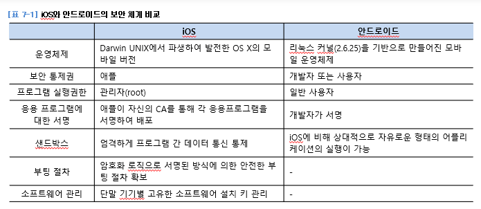

`모바일기기의 취약점은 이동성`

무선 랜의 경우 노트북을 수신율이 높은 안테나를 붙여서 차를 타고 보안이 취약한 무선 랜을 탐색하여 해킹을 시도 -> 워 드라이빙

`블루투스의 취약점과 위협`
1. 블루프린팅(해킹하기전에 시스템의 기본적인 설계도를 확보하는 것 - SDP를 활용함)
2. 블루스나프 - 블루트스의 취약점을 이용하여 장비의 임의 파일에 접근하는 공격(OPP를 사용하여 정보를 열람)
3. 블루버그 - 블루트스 장비간 취약한 연결 관리를 악용한 공격(블루투스 기기는 한 번 연결되면 이후에는 다시 연결해주지 않아도 서로 연결됨)

---

RSA에서 p와 q는 PRNG에서 정해준다.
$e*d = 파이(n)*t+1 === 1 mod 파이(n)$
1< e < 파이(n)

해시함수의 가장큰특징은 일방향성 & representation(재현성 - 오늘과 어제의 결과가 같다) & 무결성

---
# 8 암호에 대한 이해

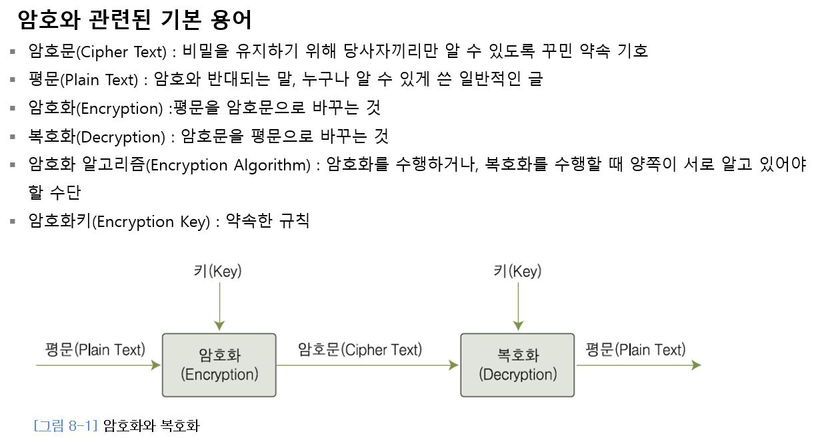

### 암호의 역사

최초의 암호 - BC 480년(스테가노그래피 - 실제로 전달하고자 하는 정보 자체를 숨기는 것)

> 최초의 암호는 전치법 아닌가?(BC 400년, 스태가노그래피 - BC 480년)

전치법 - 암호문과 봉의 굵기를 알려주면, 암호문을 봉에 감아서 해석하는 방식 
-> 봉의 굵기가 암호화 키

대체법: 해당 글자를 다른 글자로 대체하여 암호화하는 방법
> 단일치환  
> a -> b, z -> a - 시저 암호(순서가 있음)  
> 그냥 랜덤 - 모노 알파베틱 암호(경우의 수가 26!)

> 다중치환  
> 비즈네르 암호화: 26×26의 알파벳 대칭표를 이용해서 암호화하고자 하는 평문과 암호화키의 맵핑을 이용하
	여 암호화와 복호화를 수행하는 방식  
> 플레이페어 암호: 2개로 이뤄진 문자 쌍을 다른 문자 쌍으로 대체하는 암호화 방법

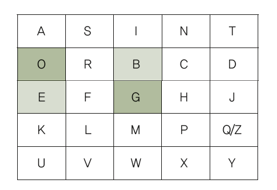  
(BE -> GO)

### 대칭 암호화 방식

암호학적 강도를 높일 때는 혼돈과 확산을 이용
> 혼돈 : 암호문의 통계적 성질과 평문의 통계적 성질의 관계를 난해하게 만드는 성질  
확산 : 각각의 평문 비트와 키 비트가 암호문의 모든 비트에 영향을 주는 성질

`DES 알고리즘`  
64비트 블록 암호화 알고리즘, 56비트 크기의 암호화 키로 암호화됨  
생성 가능한 암호화 키는 $2^{56}$가지

방법(DES 암호화, 복호화 과정 그림 이해 필요)
1. 하나의 블록인 64비트를 L1(32비트)과 R1(32비트)으로 나눔
2. R1을 암호화 키로 생성한 S-Box로 f 함수를 만들어 치환 작업을 한 후 이 값을 L1과 XOR한 다음 L2와 R2의 위치를 바꿈

암호화 과정 한 단계를 라운드(round)라 표현
DES는 이러한 과정을 하나의 블록에 대해 알고리즘을 16번 수행하므로 16라운드 알고리즘

복호화는 암호화의 반대로 수행

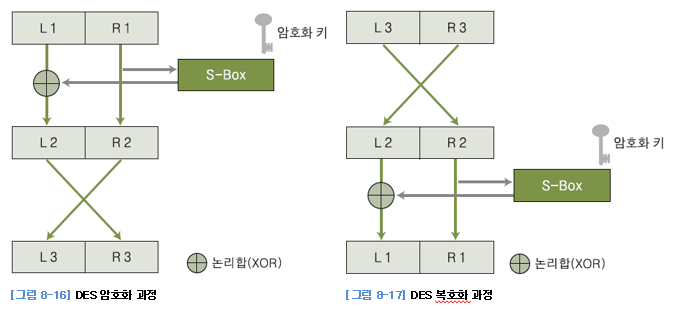

`트리플 DES 알고리즘`  
암호화 및 복호화 과정에서 2개의 암호화 키를 사용  
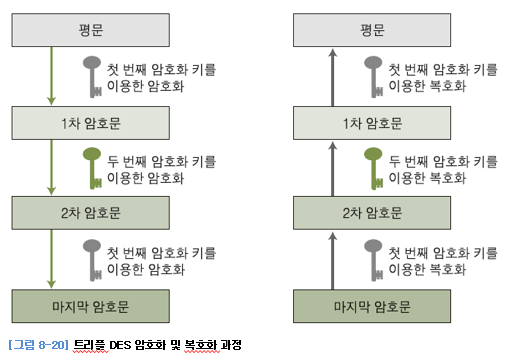

`이 외 대칭 암호화 방식`  
- AES 알고리즘(1997, 30년, 128-bit, 다양한 키의 길이)
- SEED 알고리즘(1999, 한국인터넷진흥원, 128-bit, 전자상거래에서 전송되는 개인정보 보호 목적)
- ARIA 알고리즘(2004, NSRI, 128-bit)
- IDEA(PES->IPES->IDEA(1992), 64-bit(8 round), 키는 128-bit, 키 교환에 쓰임)
- RC5(1994, RSA 연구소의 리베스트, 32/64/128-bit 키, 속도는 DES의 10배)
- Skipjack(1998, NSA, Clipper 칩에 내장)

### 비대칭 암호화 방식

`등장 배경`  
대칭 암호화 방식으로는 암호화 키 교환의 문제를 해결할 수 없었음.   
이를 위해 비대칭 암호화 방식이 연구됨.

`RSA 암호화 알고리즘` - 소수를 이용한 알고리즘

암호에 필요한 키는 공개한다.  
암호를 풀 수 있는 키는 비공개한다.

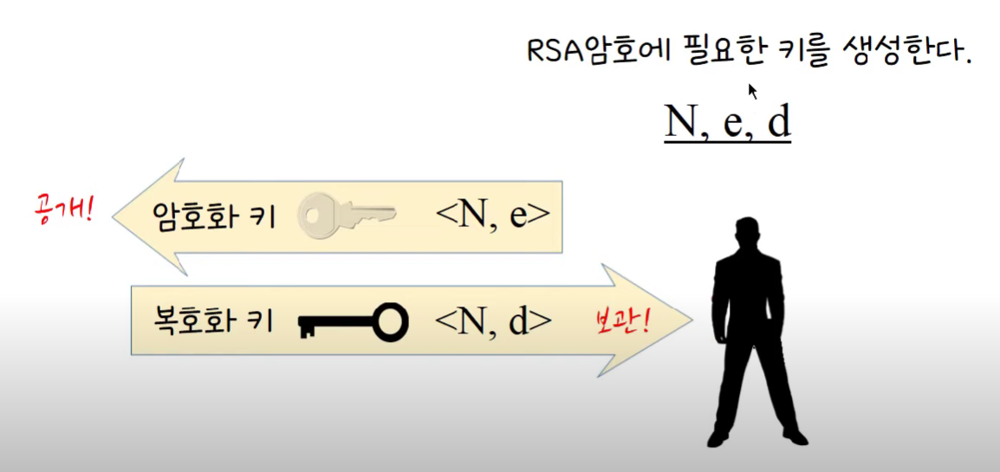

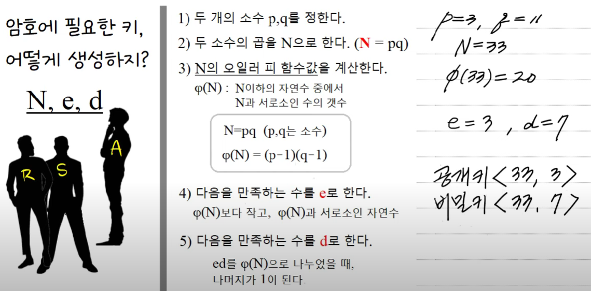

필요한 수학 개념
1. $a^{\phi(n)} \equiv 1$ (mod n) (a와 n이 서로소인 자연수일 때)
2. $a^{p-1} \equiv 1$ (mod p) (자연수 a와 소수 p가 서로소일 때)

>여기서 $a \equiv b$ (mod n)이 의미하는 것은  
a를 n으로 나눴을 때의 나머지와 b를 n으로 나눴을 때의 나머지가 같다는 뜻이다.

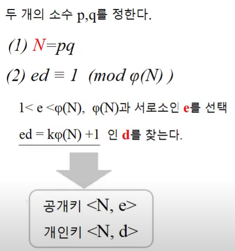

공개 암호화 키 - <N, e>  
비밀 복호화 키 - d

공개키 & 비공개키 정하는 방법
1. 소수인 p와 q를 설정
2. N = p x q
3. $\phi(n)$ 찾는다 ($\phi(n)$ = (p-1)(q-1))
4. $\phi(n)$와 서로소인 e를 찾는다. (1 < e < $\phi(n)$)
5. $ed \equiv 1$ (mod $\phi(n)$)인 d를 찾는다. (ed = k $\phi(n)$ + 1)

> 평문 = $x$ ($x$은 N와 서로소)  
암호화: $x^e \equiv M$ (mod N)  
암호문 = M  
복호화: $M^d \equiv x$ (mod N)
평문 $x$ 얻음

---

`비대칭 암호화의 구조`  
각 개인이 공개키(public key)와 개인키(private key)를 소유하는 구조

대부분 공개키를 이용해 암호화하고, 개인키를 통해 복호화한다.

`비대칭 암호화의 기능`  
1. 기밀성
2. 부인 방지 - 철수의 개인키로 암호화된 편지는 철수의 공개키로만 열 수 있으므로, 상대방은 그 편지가 철수가 쓴 것임을 확신할 수 있음

> 기밀성은 공개키로 암호화하고, 비밀키로 복호화할 때 적용,  
부인 방지는 비밀키로 암호화하고, 공개키로 복호화할 때 적용

### 해시

`해시의 정의`  
하나의 문자열을, 이를 상징하는 더 짧은 길이의 값이나 키로 변환하는 것

(해시를 이용하면 해시값을 통해 해시되기 전의 값을 추측하는 것이 불가능)

> 보안에서는 해시를 무결성 확인을 위한 알고리즘으로 사용  
무결성: 오직 허가된 사람들에게만 정보가 개방되고, 그들에 의해서만 수정될 수 있음을 보장한다는 의미

MD5, SHA1(MD5보다 조금 느리지만, 좀더 안전) 등이 있음

---

secret key-공개키?
d=

한국인터넷증흥원 - KISA

`네트워크 구조 모델은 인증기관의 상호인증(crosscertification)`

정보통신부 -> 과기정통부(민간영역)

행정자치부 -> 행정안전부()

현재 인증서는 X.509 버전 3 <- 외워

PGP 인증 -> 1과3이 관계가 없어도, 1-2, 2-3 관계가 있다면 1-3도 관계 가능

공인인증서 폐기 목록 방식
1. Positive rule - 들어올 수 있는 사람들을 저장
2. Negative rule - 들어오면 안되는 사람만 저장

전자봉투의 핵심은 복호화에 필요한 비밀키를 `따로` 보내는 것

공개키? 비밀키? 사설키? 개인키?

SET은 특정 업체의 프로토콜이라 시험내기 애매하다 함
(개념만 이해)

SET의 이중서명(중요) - 구매정보와 지불정보를 각각 해시 & 두 해시값을 합친 뒤 다시 해시

이중서명의 목적 - 상점이 사용자의 계좌정보를 모르게 함

Cyper cash, First Virtual, 스마트카드 안중요

스테가노그래피 - 심층암호

---

# 9. 암호를 이용한 전자상거래

전자상거래의 보안 공격 유형
1. 인증에 대한 공격(다른 사용자로 위장)
2. 송/수신 부인 공격(거래 내역에 대해 부인하는 것)
3. 기밀성에 대한 공격(정보가 유출되는 것)
4. 무결성에 대한 공격(거래 정보가 변조되는 것)

전자상거래가 성공하기 위한 조건
- 네트워크 상에서 상대방 및 자신의 신분 확인 수단 필요
- (공증을 보장할 수 있는)제 3자의 중재 필요
- 전자지불 방식의 안전성을 보장하기 위한 방법 필요

## 공개키 기반 구조(PKI)
공개키 기반 구조(PKI, Public Key Infrastructure)는 메시지의 암호화 및 전자서명을 제공하는 복합적인 보안 시스템 환경

> 동사무소에 신분증을 제출해서 인증하는 구조  
> (인터넷에서) 동사무소: CA, 신분증: 공인인증서

공개키 기반 구조가 되기 위해서는 인증 정보를 일원화하여 호환성을 갖추고 있어야 하고 개인이 이를 쉽게 접근할 수 있어야 함  
(동사무소, 시청, 정부와 같은 트리형 구조가 필요)

`PAA(Policy Approval Authorities, 정책승인기관)` like 정부  
공인인증서에 대한 정책을 결정하고 하위 기관의 정책을 승인하는 기관  
미래창조과학부가 담당

`PCA(Policy Certification Authorities, 정책인증기관)` like 시청  
RootCA를 발급하고 기본 정책을 수립하는 기관  
우리나라의 KISA가 여기에 해당

> RootCA: 모든 인증서의 기초가 되는 인증서를 보유하고 있음  
인증서에 포함된 공개키에 대응되는 개인키로 생성한 자체 서명 인증서를 사용

`CA(Certification Authority, 인증기관)` like 동사무소  
PCA의 하위 기관으로 인증서 발급과 취소 등의 실질적인 업무를 하는 기관  
NCA, yessign 등이 이에 속함(상호 신뢰)

`RA(Registration Authority, 등로기관)`  
사용자의 신분을 확인하고 CA 간 인터페이스를 제공하는 기관

네트워크 구조 모델은 인증기관이 상호인증(crosscertification)을 통해 연결되어 있는 모델

> 상호인증: 두 인증기관이 상대방의 공개키를 서로 인증해주는 인증서를 발급하여 사용하는 것

공인인증서 - 공개키와 그것의 소유자를 연결시켜주는 전자문서  
(펠더가 1978년에 처음 제안)  
(X.509 버전 3 표준을 따름)  

인증서의 특성
- 누구나 사용자의 인증서를 획득하고, 공개키를 획득할 수 있음
- 인증기관 외에는 인증서를 수정/발급할 수 없음
- 같은 인증 구조 내의 사용자는 상호인증서 신뢰가 가능

공인인증서 폐기 목록 방식
1. Positive rule - 이 목록에 포함된 인증서만 사용
2. Negative rule - 이 목록에 포함되지 않은 인증서만 사용

## 전자서명과 전자봉투

`전자서명`: 서명자가 해당 전자문서에 서명하였음을 나타내기 위해 전자문서에 첨부되거나 논리적으로 결합된 전자적 형태의 정보  
(인감도장: 공인인증서, 계약서: 전자계약서)

`전자서명의 원리`  
전자서명에는 원본의 해시값을 구한 뒤, 그 해시값에 부인방지 기능을 부여하기 위해 공개키 방법을 사용  
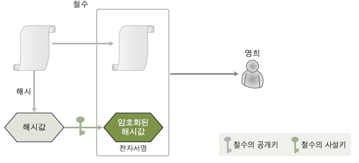
받은사람은 상대방의 공개키를 이용해 암호화된 해시값을 복호화하고, 원본 문서를 해시한 값과 비교  
(일치하면 전달된 편지가 상대방으로부터 온것이고, 위조되지 않았음을 확신할 수 있음)
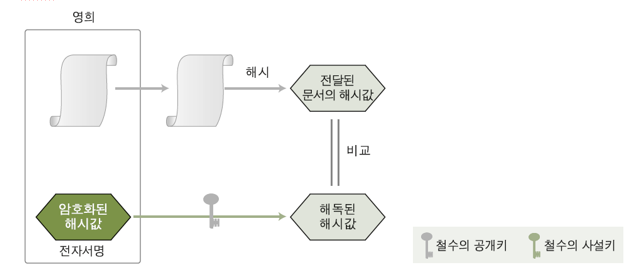

`전자서명이 제공하는 기능`
1. 위조 불가
2. 인증
3. 재사용 불가
4. 변경 불가
5. 부인 방지

`전자봉투`  
전달하고자 하는 메시지를 암호화하여 한 사람을 통해서 보내고, 암호화 키는 따로 보내는 것을 암호학적으로 구현한 것

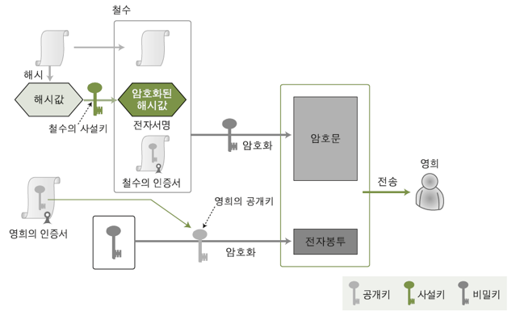
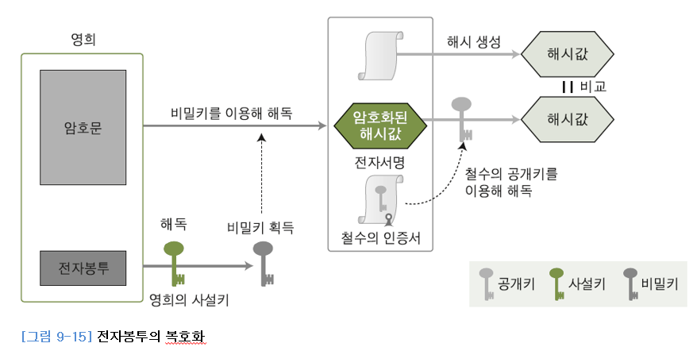

평문의 해시값을 `사설키`로 암호화  
평문, 암호화된 해시값, 보내는 사람의 인증서를 `비밀키`로 암호화 -> 암호문  
복호화에 필요한 비밀키를 `받는 사람의 공개키`로 암호화 -> 전자봉투  

전자봉투를 `받는 사람의 사설키`로 복호화 -> 암호문 해독할 비밀키 획득  
`전자봉투에서 얻은 비밀키`로 암호문을 해독 -> 평문, 보내는 사람의 인증서, 암호화된 해시값 얻음  
평문의 해시값과 암호화된 해시값을 `보내는 사람의 공개키`로 해독한 값을 비교 -> 같으면 문제 없음

전자봉투는 기밀성, 무결성, 부인 방지를 모두 지원함

> 해시값 암호화/복호화는 비대칭 방식 - 부인 방지 위해  
> 전자봉투에 사용되는 것도 비대칭 방식 - 기밀성 위해  
> 암호화할 때 사용되는 것은 대칭키(비밀키)(DES 등에 사용되는)

## SET - 개념만 이해
SET(Secure Electronic Protocol): 비자와 마스터 카드 회사의 합의에 의해 만들어진 프로토콜

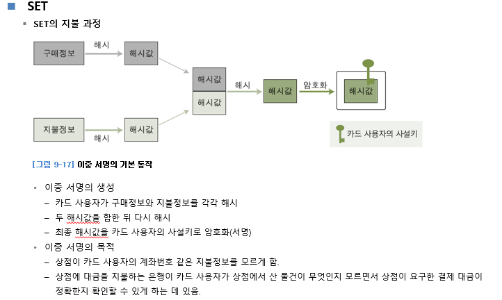

## 암호화 통신

`전자우편의 암호화`

PGP를 사용하는 사람들끼리 신뢰 관계를 통해 인증(상호인증)

S/MINE - 인증서 서비스를 통하여 암호화되는 메일 서비스를 제공

PEM - 높은 보안성 but 구현의 복잡성

`네트워크의 암호화`

2계층 - PPTP, L2TP, L2F

> PPTP - MS가 제안한 VPN 프로토콜, Point-to-Point Protocol(PPP)에 기초, 두 대의 컴퓨터가 직렬 인터페이스를 이용하여 통신할 때 사용(PC를 전화선으로 서버에 연결)  
> L2TP - 시스코가 제안한 L2F와 PPTP가 결합된 프로토콜

(PPTP와 L2TP모두 PPP 트래픽을 암호화 & 둘다 사용자 인증이나 데이터 암호화/압축등의 보안기능을 PPP에서 제공하는 것을 사용)

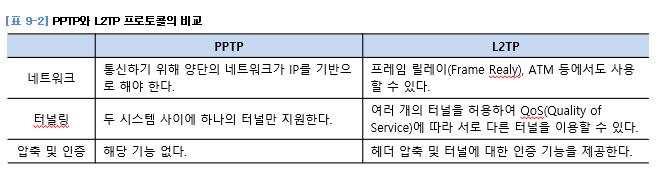

3계층 - IPSec(3계층의 암호화 프로토콜)  
IP 스푸핑이나 스니핑 공격에 대한 대응 방안이 될 수 있음  
주요 기능 
- AH(Authentication Header)를 통한 인증
- ESP(Encapsulation Security Payload)를 이용한 기밀성
- IKE(Internet Key Exchange)를 이용한 비밀키 교환

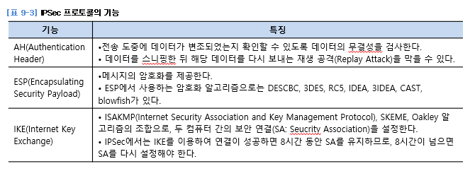

4계층 - SSL(중요)

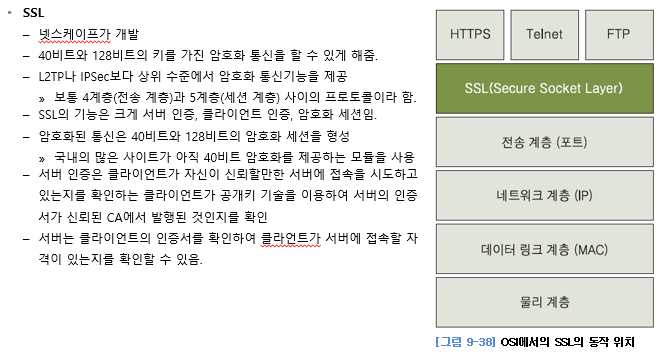

스테가노그래피 - '정보를 은밀하게 전달'하기 위한 목적이 큼

워터마크 - 로고 표시한 것, 저작물 조작되지 않도록 & 저작물의 사용자가 알아보도록

---

### 10. 보안 시스템 메모

IPS에 들어오면 일단 샌드박스에서 실행시킨다.
문제없으면, 넘어가고
문제 생기면(감염 등), 그 메모리를 다 날림 -> 가상머신 자체를 날려버림

vpn은 터널링기법을 제공 -> 해킹에 안전

---

# 10. 보안 시스템

## 10.1 인증 시스템
인증을 하고자 하는 주체(Subject)에 대해 식별(Identification)하고, 이에 대한 인증(Authentication & Authorization) 서비스를 제공하는 시스템

인증의 방법론 4가지
- Something You Know: 알고 있는 정보(패스워드)
- Something You Are: 생체 조직을 통해 인증하는 방식(지문, 홍채, 서명)
- Something You Have: 사용자가 소유한 인증 수단(신분증, 스마트키, OTP, 공인인증서)
- Somewhere You Are: 사용자의 위치 정보(사용자 IP, 콜백)

`SSO(Single Sign On)`  
모든 인증을 하나의 시스템에서 즉, 시스템이 몇 대가 되어도 하나의 시스템에서 인증에 성공하면 다른 시스템에 대한 접근 권한도 모두 얻음

> 대표적인 인증 방법으로 `커버로스(Kerberos)`를 이용한 윈도우의 액티브 디렉터리가 있음

## 10.2 방화벽
네트워크에서 말하는 방화벽은 보안을 높이기 위한 가장 일차적인 방법  
신뢰하지 않는 외부 네트워크와 신뢰하는 내부 네트워크 사이를 지나는 패킷을 미리 정한 규칙에 따라 차단하거나 보내주는 기능을 하는 하드웨어나 소프트웨어

> 네트워크의 군인 역할

`방화벽의 주요 기능`  
1. 접근 제어
- 구현 방법에 따라 패킷 필터링 방식과 프록시 방식으로 나뉨
- 룰셋을 통해서 수행됨(방화벽을 기준으로 보호하고자 하는 네트워크의 외부와 내부에 존재하는 시스템들의 IP와 포트 단위로 이루어짐)
2. 로깅과 감사 추적
3. 인증
- 메시지 인증(VPN과 같은 신뢰할 수 있는 통신선을 통해 전송되는 메시지의 신뢰성을 보장), 사용자 인증(패스워드를 통한 단순한 인증부터 OTP, 토큰 기반 인증 등), 클라이언트 인증(모바일 사용자 인증)과 같은 방법을 사용
4. 데이터의 암호화
- 보통 VPN의 기능을 이용

## 10.3 침입 탐지 시스템(IDS)
침임 탑지 시스템(IDS, Intrusion Detection System)은 네트워크에서 백신과 유사한 역할을 하는 것

> 네트워크의 경찰 역할

IDS는 설치 위치와 목적에 따라 두 가지로 나뉨
1. 호스트 기반의 침입 탐지 시스템(HIDS)
2. 네트워크 기반의 침입 탐지 시스템(NIDS)

`IDS의 주요 기능`  
1. 데이터의 수집
- HIDS는 운영체제에 부가적으로 설치되어 운용되거나 일반 클라이언트에 설치(네트워크에 대한 침입탐지는 불가능, 스스로가 공격 대상이 될 때만 침입 탐지 가능), 어떤 사용자가 어떤 접근을 시도하고 어떤  작업을 했는지에 대한 기록을 남기고 추적
- NIDS는 네트워크에서 하나의 독립된 시스템으로 운용(감시 영역이 상대적으로 매우 크다), 감사와 로깅을 할 때 네트워크 자원이 손실되거나 데이터가 변조되지 않음

`IDS의 방법론`  
1. 오용 탐지 기법 
- 이미 발견되고 정립된 공격 패턴을 미리 입력 & 탐지되면 알려주는 것
- 오판률이 낮고 효율적
- 모르는 공격은 탐지할 수 없고, 대량의 데이터를 분석하는 데는 부적합
- 전문가 시스템을 이용한 IDS는 이를 기반으로 함
2. 상태 전이 기법  
- 각각의 공격 상황에 대한 시나리오를 작성해두고 각각의 상태에 따른 공격을 분석
- 결과가 매우 직관적이나 세밀한 시나리오를 만드는 것이 매우 어려움
- 추론 엔진이 들어가기 때문에 시스템에 부하를 줄 수 있음
3. 이상 탐지 기법
- 정상적인 상태를 기준으로 함 & 상대적으로 급격한 변화를 일으키거나 확률이 낮은 일이 발생하면 침입탐지를 알림
- 인공지능, 면역 시스템이 이에 해당함

`책임 추적성과 대응`  
IDS는 공격을 발견하면 관리자에게 알리기만 함  
능동적인 대응을 하는 시스템은 침입 차단 시스템이라고 정함

`IDS의 설치 위치`

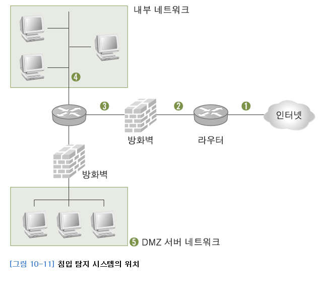

3번(방화벽 뒤에) 많이 둔다 함

## 10.4 침입 방지 시스템(IPS)
침입 방지 시스템(IPS, Intrusion Prevention System)은 패킷 하나하나를 검사하여 그 패턴을 분석한 뒤, 정상적인 패킷이 아니면 방화벽 기능을 가진 모듈로 이를 차단

> IDS와 방화벽의 조합으로 생각할 수 있음

최근에는 IPS에 가상머신(Virtual Machine, Sandbox)을 이용한 악성코드 탐지라는 개념을 도입하여 적용
- 가상머신에서 실행된 코드나 패킷들이 키보드 해킹이나 무차별 네트워크 트래픽 생성과 같은 악성코드와 유사한 동작을 보이게 되면 해당 패킷을 차단

`IPS의 설치`  
방화벽 다음에 설치함
- 방화벽이 네트워크의 앞부분에서 불필요한 외부 패킷을 한 번 걸러주어 IPS가 더 효율적으로 패킷을 검사할 수 있기 때문

## 10.5 VPN

> 해외에 있어도 국내 게임을 할 수 있다.  
> 회사 내의 서버를 집에서도 보안된 상태로 접근할 수 있다.

VPN(Virtual Private Network)은 방화벽, IDS와 함께 사용되는 보안 솔루션 중 하나  
원격의 두 지점 간을 내부 네트워크처럼 이용할 수 있음

## 10.6 출입 통제 및 모니터링 장비
감시 카메라, 엑스레이 검사기(종이의집 총 검사), 금속 탐지기, 보안 스티커

## 10.7 기타 보안 솔루션

`NAC`  
NAC(Network Access Control) 시스템은 과거 IP 관리 시스템에서 발전한 솔루션  
기본적인 개념은 IP 관리 시스템과 거의 같고, IP 관리 시스템에 네트워크에 대한 통제를 강화한 것

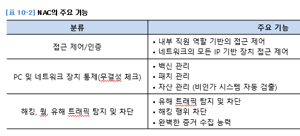

> NAC의 접근 제어 및 인증 기능은 일반적으로 `MAC 주소`를 기반으로 수행됨

네트워크에 접속하려면, NAC에 MAC 주소를 알려줘야 함  
(NAC는 등록된 MAC 주소만 네트워크에 접속할 수 있게 허용)
- 라우터로 구분된 서브 네트워크마다 에이전트 시스템이 설치되어 있어야 함

`보안 운영체제`  
Secure OS는 OS에 보안 커널을 추가로 이식한 것

`백신`  
바이러스나 웜, 그리고 인터넷으로 유포되는 악성 코드까지 탐지하고 제거할 수 있음

`PC 방화벽`  
네트워크 상의 웜이나 공격자로부터 PC를 보호하기 위해서 사용  
(PC 내부로 유입되는 패킷 뿐만 아니라 패킷까지 모두 차단하고, 사용자에게 해당 네트워크 패킷의 적절성 여부를 확인한다)
> 윈도우 방화벽에서는 인바운드 규칙과 아웃바운드 규칙을 상세하게 통제할 수 있다

`스팸 필터 솔루션`  
메일 서버 앞단에 위치하여, 프록시 메일 서버로서 동작  
SMTP 프로토콜을 이용한 DoS 공격이나 폭탄 메일, 스팸 메일을 차단  
내부 정보 유출 방지

1. 메일 헤더 필터링
2. 제목 필터링
3. 본문 필터링
4. 첨부파일 필터링

`DRM`  
DRM(Digital Right Management)은 문서 보안에 초점을 맞춘 기술  
문서 열람/편집/인쇄까지의 접근 권한을 설정하여 통제  
특정한 형태의 문서만 통제하는 것이 아니라 MS워드나 hwp, txt, pdf 파일 등 사무에 사용하는 대부분의 파일을 통제할 수 있음  
커널에 삽입된 DRM 모듈은 응용 프로그램이 문서를 작성하여 하드 디스크에 저장할 때 이를 암호화하여 기록  
응용 프로그램에서 하드 디스크에 암호화되어 저장된 파일을 읽을 때 문서를 읽고자 하는 이가 암호화된 문서를 읽을 자격이 있는지를 확인한 후 이를 복호화하여 응용 프로그램에 전달해줌.

> 회사에서 볼 수 있던 문서를, 집에서는 볼 수 없다

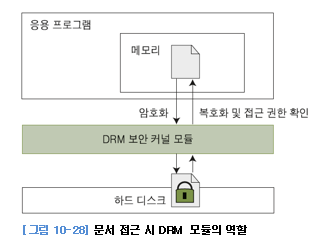

DRM 인증 체제는 인증서를 이용하는 경우가 많음

---
# 11 침해 대응과 포렌식

## 11.1 침해 대응

`CERT(Computer Emergency Response Team)`  
1988년 모리스 웜때문에 생김, 건물의 경비원의 역할과 유사

`CERT의 대응 절차`  
1. 사전 대응
2. 침해 사고 발생
3. 사고 탐지  
> 침해 사고 발생을 실시간으로 식별하는 과정은 주로 IDS나 IPS, 네트워크 트래픽 모니터링 장비(MRTG: Multirouter Traffic Grapher), 네트워크 관리 시스템(NMS: Network Management System)을 통해 이루어짐
4. 대응(단기 대응, 백업 및 증거 확보, 시스템 복구)
5. 제거 및 복구
6. 후속 조치 및 보고

> 무조건 팀장한테 보고하는 게 중요하다 함

## 11.2 포렌식에 대한 이해

`디지털 포렌식의 정의`  
컴퓨터 관련 조사, 수사를 지원하며 디지털 데이터가 법적 효력을 갖도록 하는 과학적, 논리적 절차와 방법을 연구하는 학문

증거의 종류  
- 직접 증거(사실을 직접적으로 증명하는 증거)
- 간접 증거(간접적으로 추측하게 해주는 증거)
- 인적 증거(증인의 증언, 감정인의 진술, 전문가의 의견)
- 물적 증거(범행에 사용한 동기, 사람의 신체)

전문 증거  
포렌식에 의해 수집된 증거는 기본적으로 간접 증거에 속함  
전문 증거는 인정의 기초가 되는 실험 사실을 실험자 자신이 법원에 직접 보고하지 않고, 진술이나 진술 기재서를 통해 간접적으로 보고하는 경우를 말함

> 증거 개시 제도(미국에서 2008/01부터 도입) 
- 정식재판이 진행되기 전 공판준비절차 단계에서 서로가 각자 가지고 있는 증거를 동시에 개시하는 것
- 미리 오픈하지 않은 증거는 법정에서 원칙적으로 사용하지 못함

`포렌식의 기본 원칙`  
- 정당성의 원칙(모든 증거는 적법한 절차를 거쳐서 획득한 것이어야 함)  
- 재현의 원칙(똑같은 환경에서 같은 결과가 나와야 함)  
- 신속성의 원칙(컴퓨터 내부는 휘발성을 가진 것이 많아서 신속하게 이뤄줘야 함)  
- 연계 보관성의 원칙(증거는 획득되고 난 뒤 이송/분석/보관/법정 제출이라는 일련의 과정이 명확해야 하고, 이러한 과정에 대한 추적이 가능해야 함) - 연계 보관성(chain of custody)
- 무결성의 원칙(수집된 정보는 연계 보관성을 만족해야 하고, 각 단계에서 위조/변조 되어서는 안 되며, 이러한 사항을 매번 확인해야 함 - 하드디스크는 각 단계마다 해시값을 확인하여 무결성 입증)

> 연계 보관성 중요

`포렌식 수행 절차`  
수사 준비 - 증거물 획득 - 보관 및 이송 - 분석 및 조사 - 보고서 작성

`사이버 수사 기구`  
1. 국가정보원 - 국가사이버안전센터
2. 대검찰청 첨단범죄 수사과
3. 경찰청 사이버테러대응센터

## 11.3 증거 수집

`네트워크의 증거 수집`  
보안 솔루션 이용(MTRG(Multi Router Traffic Grapher) - 네트워크 링크상의 트래픽 부하를 감시하는 툴), 네트워크 로그 서버 이용, 스니퍼 운용

`시스템(PC)에서의 증거 수집`  
1. 활성 데이터 수집(바로바로 캡쳐, 카메라로 녹화),   

2. 윈도우 시스템
- net session - 현재 해커의 세션이 남아있는지 확인
- query - 로그인되어 있는 세션 확인(query user), 사용자 세션 정보 확인(query session), 사용자별 시스템의 프로세스 목록 확인(query process))  
> 명령 창에서 실행된 명령은 doskey /history 명령을 이용해 확인할 수 있음
- 메모리 덤프 수행(메모리에 남은 정보를 보관)

3. 유닉스 시스템
- w, who, last - 리눅스에서 현재 세션이 형성되어 있는 사용자를 확인할 때 사용
- history - 실행한 명령 목록 확인

4. 시스템 로그 분석

5. 저장 장치 분석(기본 증거 데이터 - 임의의 변경을 막기 위해 쓰기 금지를 보장하는 장치를 연결 & (쓰기 금지 시킴)원본 하드 디스크를 이미지 장치를 이용해서 복사 & 획득된 이미지는 포렌식 이미지 전용 분석 툴을 사용해 분석)

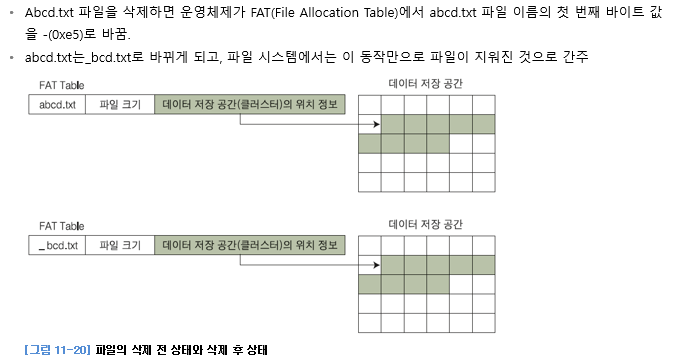

FAT, HTFS의 대표적인 툴 - EnCase(Guidance Software Inc에서 만듬)  
2002년도에 만들어진 검찰 디지털 증거 분석시스템(D.E.A.S)

`데이터 및 응용 프로그램에서의 증거 수집`  
이메일 분석  
인터넷 분석 - 브라우저의 쿠키나 index.dat 파일 이용(방문 사이트의 정보를 획득하고 작업 내용 파악)  
CAATs(DB에 있는 대량의 숫자 정보의 무결성 및 정확성을 확인하기 위해 수행되는 분석 방법, 사용하는 툴 ACL)

---

# 12 사회공학

## 12.1 사회공학에 대한 이해

사회공학의 정의 - 컴퓨터 보안에서 인간 상호 작용의 깊은 신뢰를 바탕으로 사람들을 속여 정상 보안 절차를 깨뜨리고 정보를 얻기 위한 비기술적 침입 수단

사회공학에 취약한 조직 - 조직원 수가 많고, 조직의 구성체가 여러 곳에 분산되어 있고, 조직원의 개인정보가 노출되고, 보안 교육이 부재하고, 정보의 분류와 관리가 적절하지 않은 조직

사회공학 대상 - 정보의 가치를 잘 모르는 사람, 특별한 권한을 가진 사람, 제조사 & 벤더, 해당 조직에 새로 들어온 사람

## 12.2 사회공학 기법

### 인간기반 사회 공학 기법
직접적 - 권력 이용, 동정심에 호소, 가장된 인간관계 이용  
도청  
어깨너머로 훔쳐 보기  
휴지통 뒤지기

### 컴퓨터 기반 사회 공학 기법
시스템 분석(Eraser 툴 이용 등)  
악성 소프트웨어 전송  
인터넷을 이용한 사회공학 공격 - 신상털기  
피싱 - 이메일 이용  
파밍 - 사용자의 도메인 탈취, 악성코드 감영 (DNS 스푸핑과 같은 공격)  
스미싱 - 문자를 이용한 공격

## 12.3 사회공학에 대한 대응책
가장 효과적인 방법은 조직 구성원에게 보안 관련 교육을 충분히 수행함으로써, 구성원들의 보안 의식과 낯선 사람들에 대한 경계심을 높이는 것

---

# 13 보안 관리

## 13.1 정보 보안 거버넌스

정보 보안 거버넌스의 개념 - 조직의 보안을 달성하기 위한 구성원들 간의 지배 구조

> CSO - 최고 보안 책임자  
CTO - 최고 기술 책임자  
CIO - 최고 ㅇㅇ 책임자

정보 보안 거버넌스 구현의 어려움
1. 효율적 조직 구성의 어려움 - 의사결정 구조에서 정보 보안 조직을 어떻게 구성할지에 대한 해답을 찾기 어려움
2. 성과 측정의 어려움
3. 경영진과 조직 구성원의 무관심

정보 보안 거버넌스의 점검 사항  
경영진의 경영 의식이 정보 보안 거버넌스의 점검 사항 중 가장 중요하다, 두번째는 직원 교육과 훈련

## 13.2 보안 프레임워크

### ISO 27001

영국의 BSI에서 제정한 BS 7799를 기반으로 구성  
일종의 보안 인증이자 보안 프레임워크  
2005/10에 국제 표준이 됨

> iso 27001 - 관리적 보안이 많다  
(보안의 3대 요소 - 시스템, 물리(CCTV), 관리(적) 보안)

### ISMS
ISMS(Information Security Management System)를 흔히 정보 보안 경영시스템이라고 해석

> isms는 MIS에서 가져온 것?

> ISO 27001에서는 PDCA 모델을 통해서 ISMS를 발전시켜 나갈 수 있다고 말함  
> PDCA(중요)  
> PDCA 모델의 적용
>1. 계획 - ISMS 수립
>2. 수행 - ISMS 구현과 운영
>3. 점검 - ISMS 모니터링과 검토
>4. 조치 - ISMS 관리와 개선
>
> PDCA(Plan/Do/Check/Action) - 여기서 A가 가장 중요(피드백)

## 13.3 보안 조직

`보안 조직의 종류`

시스템 운영팀 하위에 보안 인력이 위치한 경우 - 가장 소극적인 형태, 한정된 업무만 수행, 관리적인 측면의 보안을 고려할 수 없음

IT 기획팀 하위에 보안 인력이 위치한 경우 - 시스템 운영팀 하위보다 좀 더 나은 통제력을 갖춤

CEO 또는 CSO 직속의 별도의 조직으로 보안팀을 운영하는 경우 - 보안팀이 회사 전체의 보안 프레임워크를 적용하는 것이 불가능함

`보안팀의 역할`  
각종 통제 사항을 관리, 모니터링, 위험 분석, 정보 보안 교육, 비상 계획의 수립과 운영

> 보안팀은 컨트롤 타워같은 것? - 모니터링을 하지, 직접 세팅하는 것은 아니다?

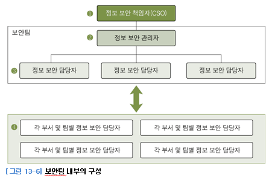

정보 보안 책임자(CSO)의 주요 업무 - 예산 확보  
정보 보안 관리자의 주요 업무 - 정보 보안 업무 기획 & 점검  
정보 보안 담당자 - 전체 시스템의 보안 관리 & 보안 교육

## 13.4 보안 정책과 절차

`보안 정책에 대한 이해`  
회사 내부 업무에 대한 문서화 수준은 곧 회사의 수준  
정책은 목적과 방향에 따라 세 가지로 구분
1. 규칙으로서 지켜져야 할 정책(Regulatory)
2. 하려는 일에 부합하는 정책이 없을 때 참고하거나 지키도록 권유하는 정책(Advisory)
3. 어떠한 정보나 사실을 알리는 데 목적이 있는 정책(Informative)

`영미권의 보안 정책`  
Securiy Policy, Standards, Guidelines, Procedures

`국내의 보안 정책`  
정보 보안 정책서, 정보 보안 지침서, 정보 자산 분류 절차서, 전산센터 운영 절차서, ...