### 목차

1 [정보 보안의 세계](#-1-정보-보안의-세계)

2 [시스템 보안](#-2-시스템-보안)

3 [네트워크 보안](#-3-네트워크-보안)

4 [웹 보안](#-4-웹-보안)

6 [악성 코드](#-6-악성-코드)

---

# 1 정보 보안의 세계

## 1.1 해킹과 보안의 역사

해킹이란 `남의 컴퓨터 시스템에 침입하여 장난이나 범죄를 저지르는 일` (국어사전)

1950년 이전 
- 폴란드의 암호보안전문가들이 '애니그마'를 개발
- '알란 튜링'이 최초의 컴퓨터 '콜로서스'를 개발

(`Hack`이라는 말은 전기 기차, 트랙, 스위치를 보다 빠르게 조작하다 라는 의미로 처음 사용됨)

1960년대
- 최초의 미니 컴퓨터 PDP-1, 최초의 컴퓨터 연동망 ARPA
- 운영체제 유닉스의 개발
- 전화망 침입을 통한 무료 전화 해킹(2600MHz)

1970년대
- 최초의 이메일 전송
- 마이크로소프트 설립
- 최초의 데스크톱 컴퓨터솔
- 애플 컴퓨터의 탄색

1980년대
- 초기의 PC
- 네트워크 해커라는  개념이 처음 생겨남
- 카오스 컴퓨터 클럽(CCC)
- 리차드 스톨만에 의해 GNU 계획이 세상에 알려짐
- 케빈 미토닉(산타 크루즈 오퍼레이션 침입)
- 로버트 타판 모러스(웜 만듬)

1990년대
- 해킹 대회 데프콘
- 리눅스 0.0.1(리누스 토발즈)
- 트로이 목마, 백 오리피스

2000년대
- 분산 서비스 거부 공격(DDoS)
- 웜과 바이러스
- 개인정보 유출과 도용

## 1.2 보안의 3대 요소

기밀성(Confidentiality): 인가(authorization)된 사용자만 정보 자산에 접근할 수 있는 것

무결성(Integrity): 적절한 권한을 가진 사용자에 의해 인가된 방법으로만 정보를 변경할 수 있도록 하는 것

가용성(Availability): 정보 자산에 대해 적절한 시간에 접근 가능한 것을 의미

> 기밀성과 가용성은 반비례 관계

## 1.3 보안 전문가와 자격 요건

보안 전문가가 갖춰야 할 기초 소양: `윤리의식`<br>
진정한 정보 보안 전문가는 올바른 윤리 의식을 반드시 가지고 있어야 한다.

## 1.4 보안 관련 법

정보통신망 이용촉진 및 정보보호 등에 관한 법률(안전한 정보통신망 환경을 조성하는 것이 목적) - 3~7년 징역 2~5천만원 벌금

정보통신 기반 보호법(ISP같은 주요 정보통신 기반 시설에 대한 보호법) - 10년 징역 1억 벌금

---

# 2 시스템 보안

## 2.1 시스템 보안에 대한 이해

시스템과 관련한 보안 기능
1. 계정과 패스워드 관리
2. 세션 관리
3. 접근 제어
4. 권한 관리
5. 로그 관리
6. 취약점 관리

보안이 필요한 것들 - 운영체제, 데이터베이스, 응용 프로그램, 네트워크 장비

## 2.2 계정과 패스워드 관리

식별(Identification)이란 아이디라는 문자열을 통해 그 자신이 누구인지 확인하는 과정

아이디만으로는 정확한 식별이 어려워 인증(Authentication)을 위한 다른 무언가(패스워드)를 요청

`보안을 위한 인증의 4가지 접근방법`
1. 알고 있는 것 - 패스워드
2. 가지고 있는 것(신분증이나 OTP를 통해 인증을 수행하는 방법) - 출입카드
3. 스스로의 모습(홍채와 같은 생체 정보를 통해 인증을 수행하는 방법) - 지문 인식
4. 위치하는 곳(현재 접속을 시도하는 위치의 적절성을 확인하는 방법) - 콜백


운영체제의 계정 관리 - 윈도우에서는 관리자권한을 가진 계정을 administrator라고 함<br>
윈도우의 주요 그룹(Administrators, Power Users, Backup Operators, Users, Guests)

|구분|특징|
|--|--|
|Administrators|대표적인 관리자 그룹으로, 윈도우 시스템의 모든 권한을 가지고 있다|
|Power Users|Administrators가 가진 권한을 대부분 가짐|
|Backup Operators|시스템 파일을 백업하는 권한을 가짐|
|Users|관리 계정에 비해 한정된 권한 가짐|
|Guests|Users 그룹과 같은 권한 가짐|

유닉스의 계정 관리 - 기본 관리자 계정 root

데이터베이스의 계정 관리 - MS-SQL의 관리자 계정 sa, 오라클의 관리자 계정 sys, system과 Scott(기본 계정)

응용프로그램의 계정 관리 - TFTP(인증이 필요하지 않는 응용 프로그램)

네트워크 장비의 계정 관리 - 계정이라는 개념이 존재하지 않음, 그렇지만 계정을 생성하여 각 계정으로 사용할 수 있는 명령어 집합을 제한할 수 있음

`패스워드 관리` - 그냥 길고, 특수문자 대문자 포함된 것들(경우의 수가 많아져 브루트-포스 공격 방지가능) & 패스워드 정책(주기적으로 패스워드 변경, 잘못된 입력시 계정 잠금)

## 2.3 세션 관리

세션의 의미 - 사용자와 컴퓨터 또는 두 컴퓨터 간의 활성화된 접속

세션을 유지하기 위한 보안 사항
1. 세션 하이재킹이나 네트워크 패킷 스니핑에 대응하기 위해 암호화를 하는 것
2. 세션에 대한 지속적인 인증을 하는 것

## 2.4 접근 제어

접근 제어의 의미 
- 적절한 권한을 가진 인가자만 특정 시스템이나 정보에 접근할 수 있도록 통제하는 것
- 시스템의 보안 수준을 갖추기 위한 가장 기본적 수단
- 시스템 및 네트워크에 대한 접근 제어의 가장 기본적인 수단은 IP와 서비스 포트이다.

`운영체제의 접근 제어`

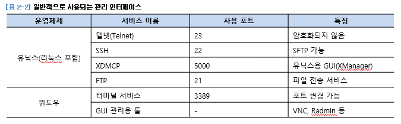

`네트워크 장비의 접근 제어` - AC(Access Control List)L을 통한 네트워크 트래픽 접근 제어

## 2.5 권한 관리

운영체제의 권한 관리 - 접근권한은 누적, 파일에대한 접근 권한이 디렉터리에 대한 접근 권한보다 우선, '허용'보다 '거부'가 우선

유닉스 - rxw(421)

데이터베이스의 권한 관리
1. 질의문에 대한 권한 관리 - DDL, DML, DCL

DDL과 DML은 DCL에 의해 허용(Grant) 또는 거부(Deny)된다.

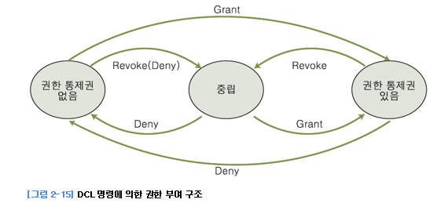

응용프로그램의 권한 관리 - 응프 내의 권한보다 응프 자체의 실행 권한이 더 중요함, 자신을 실행한 계정의 권한을 물려받음

## 2.6 로그 관리

AAA
1. Authentication(인증) - 자신의 신원(Identity)을 시스템에 증명하는 과정
2. Authorization(인가) - 인증을 완료해 시스템에 로그인이 허락된 사용자라고 판명되어 로그인하는 과정
3. Accounting - 시스템에 로그인한 후 시스템에 이에 대한 기록을 남기는 활동

운영체제의 로그 관리
1. 윈도우는 이벤트라고 불리는 중앙 집중화된 형태로 로그를 수집하여 저장

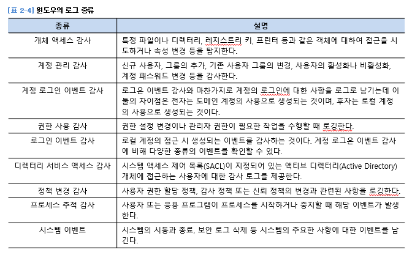

2. 유닉스의 로그 - UTMP는 유닉스 시스템의 가장 기본적인 로그, 텍스트가 아닌 바이너리 형태로 로그가 저장됨

WTMP - utmp 데몬과 비슷하게 사용자들의 로그인, 시스템에 재부팅에 대한 정보를 담고 있음, last 명령어로 확인

데이터베이스의 로그 관리
1. MS-SQL - 로그인 감사와 C2 감사 추적(DB의 CRUD에 대한 정보를 로그로 남기는것)을 설정
2. 오라클 - 감사 로그가 활성화된 후 남길 수 있는 감사의 종류는 문장 감사(지정된 문장 실행 기록), 권한 감사(특정한 권한 사용 기록), 객체 감사(특정한 객체에 대한 작업 기록)가 있음

데이터베이스의 모니터링<br>
DB에 대한 로그를 남기는 가장 좋은 방법은 별도의 DB 모니터링 툴을 도입하는 것<br>
네트워크에 트래픽을 모니터링할 수 있는 태핑(Tapping) 장비를 설치하고, 패킷 중 DB 질의문을 확인하여 로그로 남김

응용 프로그램의 로그 관리

네트워크 장비의 로그 관리
- MRTG(네트워크 트래픽 모니터링 시스템), NMS(네트워크 관리 시스템)
- 라우터나 스위치의 인증을 일원화하기 위해 인증 서버로 TACACS+를 사용하기도 함

(라우터나 스위치는 자체적으로 로그를 저장할 공간이 없음)<br>
(각 네트워크 장비에서 생성되는 로그를 네트워크를 통해 로그 서버에 전송)

## 2.7 취약점 관리

1. 패치 관리 - 업데이트 통해 자동 관리
2. 응용 프로그램별 고유 위험 관리
3. 응용 프로그램을 통한 정보 수집 제한

# 3 네트워크 보안

## 3.1 네트워크에 대한 이해

`OSI 7계층` - 국제 표준화 기구 ISO는 다양한 네트워크의 호환을 위해 표준 네트워크 모델을 만듬

`1계층 - 물리 계층` - 인터넷 이용시의 랜 케이블, 전화선, 동축 케이블 또는 광 케이블 등의 시스템 간의 물리적인 연결매체

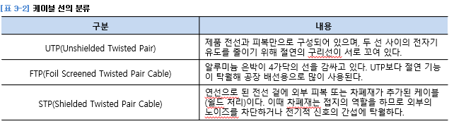

`2계층 - 데이터 링크 계층` - 두 포인트 칸 신뢰성 있는 전송을 보장하기 위한 계층

상호 통신을 위해 `MAC` 주소를 할당받는다.

    MAC 주소는 총 12개의 16진수 숫자로 구성
    앞 6개 16진수는 OUI(네트워크 카드를 만든 회사)
    뒤 6개 16진수는 Host Identifier(회사에서 임의로 붙이는 일종의 시리얼)

2계층에서 사용하는 통신 장비는 `스위치`(패킷의 흐름을 제어)

`3계층 - 네트워크 계층`

여러개의 노드를 거칠때마다 경로를 찾아주는 역할을 하는 계층

라우팅, 흐름 제어, 세그멘테이션, 오류 제어 등을 수행

경로를 찾기 위한 주소 - `IP`

    IP 주소는 8비트의 수 4개로 구성
    A,B,C,D,E 클래스가 있음
    A 클래스 - 첫번재 자리가 네트워크 주소, 나머지가 호스트 주소
    B 클래스 - 두번째 자리까지가 네트워크 주소, 나머지가 호스트 주소
    C 클래스 - 세번째 자리까지가 네트워크 주소, 나머지가 호스트 주소
    (D 클래스는 멀티미디어 방송을 할 때 자동으로 부여된다.)
    (E 클래스는 테스팅을 위한 주소 대역 & 사용 안함)

3계층에서 사용되는 네트워크 통신 장비 - `라우터`

    MAC vs IP

    MAC은 주민등록번호같은것 - 변하지 않음

    IP 주소는 내가 위치해 있는 곳 - 변할수있음

`4계층 - 전송 계층`

양끝단의 사용자들이 신뢰성 있는 데이터를 주고받을 수 있도록 함으로써, 상위 계층들이 데이터 전달의 유효성이나 효율성을 신경 쓰지 않도록해줌

대표적인프로토콜 TCP

여기선 `포트 번호`를 사용함 - 응용프로그램과 통하는 통로 번호

1 ~ 1024 포트는 자주 사용하는 서비스에 할당됨

    여기서 알아야할것
    1. 7계층
    2. 유명한 포트번호

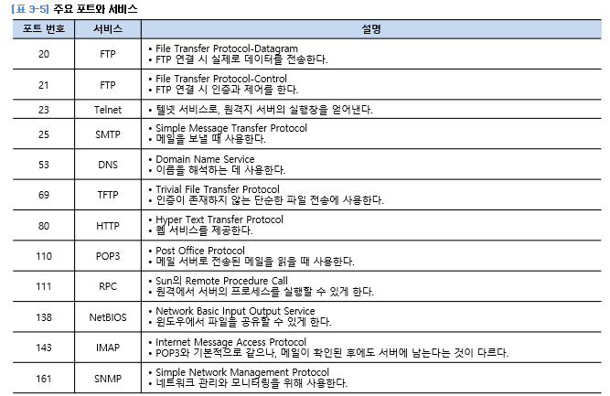

3,4계층 정보는 netstat -an 명령으로 확인가능

```3-way hankshaking``` - 매우 중요, 그릴줄 알아야함(클라에서 SYN, 서버에서 SYN+ACK, 클라에서 ACK)

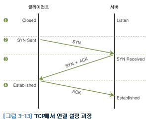

```TCP 세션의 종료``` - (클라에서 FIN, 서버에서 ACK, 시간좀 지나고 서버에서 FIN, 클라에서 ACK)

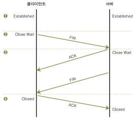

    TCP vs UDP

    TCP는 연결 지향 프로토콜, 흐름제어와 에러제어 등의 기능을 통해 확실한 전송을 보장함
    하지만 완전하지는 않음

    UDP는 데이터의 신뢰성있는 전송을 보장하지 않음, 전송 경로 확립을 위한 번잡함을 생략하고 시간을 절약할 수 있음

> 이더넷은 2계층의 스위치에서 사용되는 프로토콜

`5계층 - 세션 계층` - 양끝단의 응용 프로세스가 통신을 관리하기 위한 방법을 제공, 정보교환을 효과적으로 할수있는 추가 서비스 제공

`6계층 - 표현 계층` - 코드간의 번역을 담당, 데이터의 구조를 하나로 표현함으로써, 응용 계층의 데이터 형식 차이로 인한 부담을 덜어줌

`7계층 - 응용 프로그램 계층` - HTTP, FTP 등 제공

패킷에는 (...), 4계층 프로토콜의 종류, 클라 IP 주소, 웹 브라우저의 포트번호, 서버 IP 주소, 웹 서버의 포틑번호, 출발지 MAC 주소, 목적지 MAC 주소가 있다.


## 3.2 서비스 거부(Dos) 공격

`DoS(Denier of Service)` - 그냥 훼방을 놓는 공격

Boink, Bonk, TearDrop 공격

    TCP의 신뢰성 있는 연결을 위한 기능

    신뢰성 확보를 위해 재요청과 수정을 하는데, 재요청과 수정이 공격 대상 -> 자원 고갈 시킴

    사실 이런 기법들은 거의다 막혀있음

`취약점 공격형`<br>
Bonk 공격 - (다 자기가 0번이라고 하면서 서버 방해)<br>
TearDrop 공격 - 패킷의 시퀀스 넘버를 이상하게 함 - 잘라놓은 패킷이 이어지지 않아짐<br>
Land 공격 - 출발지 IP 주소와 목적지 IP 주소를 같게 해서 요청(IP 주소는 공격 대상의 IP 주소)

`자원 고갈 공격형`<br>
Ping of Death 공격 - 패킷을 최대한 길게함 -> 엄청 잘게 쪼개짐 -> 많아짐<br>
SYN Flooding 공격 - 계속 서버에 요청해서(SYN만 보냄), 다른 사용자 요청 못하게 함(이 공격은 SYN Received의 대기시간을 줄이는 방법으로 해결 가능)<br>
HTTP GET Flooding 공격 - GET Method를 통해 무한대로 실행하는 것(url 계속 입력해서 보냄)<br>
HTTP CC 공격 - HTTP 1.1 버전에서 썼음<br>
동적 HTTP Request Flooding 공격 - 지속적으로 요청 페이지를 변경하여 웹 페이지를 요청<br>
Smurf 공격 - ICMP 패킷과 임의의 시스템을 이용하여 패킷을 확장하여 서비스 거부 공격을 수행<br>
Mail Bomob 공격 - 폭탄 메일(스팸 메일)

---

`DDoS` - 분산 서비스 거부 공격

    DDoS는 해킹 기법

    DoS는 해킹 기법을 아우르는 개념

DDoS공격의 5가지 조건<br>
공격자, 마스터, 핸들러, 에이전트, 데몬

    공격자: 공격을 주도하는 해커의 컴퓨터
    마스터: 공격자에게 직접 명령을 받는 시스템으로 여러 대의 에이전트를 관리함
    핸들러 프로그램: 마스터 시스템의 역할을 수행하는 프로그램
    에이전트: 공격 대상에 직접 공격을 가하는 시스템
    데몬 프로그램: 에이전트 시스템의 역할을 수행하는 프로그램

봇넷: 좀비가 된 PC들의 네트워크<br>
봇넷에 있는 각각의 PC를 좀비PC

## 3.3 스니핑 공격

수동적인 공격

도청, UTP 장비를 태핑(Tapping)해서 전기적 신호를 분석해 정보를 찾아내는 것

전기적 신호를 템페스트 장비를 이용해 분석하는 것

    스니핑 원리
    
    (네트워크에 접속하는 모든 시스템은 설정된 IP 주소값과 고유한 MAC 주소값을 가지고 있음)
    (2계층과 3계층에서 자신의 것과 일치하지 않는 패킷은 무시함)

    스니핑을 수행하는 공격자는 자신이 가지지 말아야할 정보까지 모두 볼 수 있어야 하므로 2계층과 3계층 정보를 이용한 필터링을 해제하는 랜카드의 모드를 사용 - 프러미큐어스(Promicuous) 모드

`스위치 재밍 공격` - 스위치의 주소 테이블의 기능을 마비시키는 공격 (MACOF 공격)<br>
스위치에 랜덤한 형태로 생성한 MAC을 가진 패킷을 무한대로 보내서, 저장 용량을 넘게되어 원래기능을 잃고 더미허브처럼 작동하게됨

`SPAN 포트 태핑 공격` - 포트 미러링을 이용한 것<br>
각 포트에 전송되는 데이터를 미러링하고, 포트에도 똑같이 보내주는 것<br>
SPAN포트는 기본적으로 하나의 설정사항으로 이뤄짐,<br>
but 포트 태핑은 하드웨어적인 장비로 제공되고 이를 Splitter라고 부르기도 함

스니퍼의 탐지 - 출석부를때 이름이 다른 학생이 출석하는 느낌?(다른 학생은 프러미큐어스 모드)

    여기서 출석이 탐지하는것
    이름이 다른 학생은 프러미큐어스 모드로 스니핑 공격중임

스니퍼 탐지 방법
1. Ping 이용 - 대부분의 스니퍼는 일반 TCP/IP에서 동작 - 존재하지않는 MAC주소를 보냈는데 응답이 왔다 -> 해당 호스트 스니핑중
2. ARP 이용 - ping과 유사, 위조된 ARP request보내서 응답오면 걸린것
3. DNS 이용 - 가짜 ID와 패스워드를 썼는데, 공격자가 그걸 이용하면 걸린것
4. ARP watch를 이용 - ARP 트래픽을 모니터링, 이를 변하게 하는 패킷이 탐지되면 메일로 알려줌

> ARP(Address Resolution Protocol) - 주소 결정 프로토콜

## 3.4 스푸핑 공격

속이는 공격

MAC, IP 주소, 포트 모든것을 공격할 수 있다(속일 수 있다)

`ARP 스푸핑 공격` - 클라와 서버 사이에 공격자 컴퓨터가 들어옴(상대방 MAC 주소가 자기자신이라고 속임)

클라와 서버는 이를 모르고 패킷을 주고받지만, 공격자 컴퓨터는 둘 사이의 패킷정보를 다 읽음

-> MAC 주소값을 고정시켜서 패킷을 주고받으면 이 공격 막을 수 있다.<br>
(IP 주소를 속이더라도 MAC주소는 속일 수 없기 떄문)

    클라는 서버에 해당하는 MAC 주소를 고정시키면, (arp -s)
    다른 컴퓨터가 중간에 가로챌 수 없다.

`IP 스푸핑 공격` - IP 주소를 속이는 것

    트러스트 인증법: 특정 IP의 패킷은 검사안하고 그냥 통과시킴, 유닉스 계열에서 사용
    (윈도우는 액티브 디렉토리 사용함)

    공격자가 해당 IP주소를 가지고 서버에 접근하는것
    (클라는 DoS 공격을 통해 접근 못하게 함)

`ICMP 리다이렉트 공격` - 공격자가 라우터가 되어 다른 라우터로 리다이렉트 시킴(이때 모든 패킷을 스니핑)

    ICMP 리다이렉트 - 로드 밸런싱에서 사용함

`DNS 스푸핑 공격` - 실제 DNS 서버 보다 빨리 공격 대상에게 DNS Response 패킷을 보내, 공격 대상이 잘못된 IP 주소로 웹 접속을하도록 유도하는 공격(공격자 컴퓨터가 DNS 서버 컴퓨터보다 클라와 가까이 있어야 가능한 공격)

## 3.5 세션 하이재킹 공격

세션(Session): 사용자와 컴퓨터, 또는 두 대의 컴퓨터 간의 활성화된 상태

세션 하이재킹: 두 시스템 간 연결이 활성화된 상태, 즉 로그인된 상태를 가로채는 것을 뜻함

TCP 세션 하이재킹 - 서버와 클라이언트에 각각 잘못된 시퀀스 넘버를 위조해서 연결된 세션에 잠시 혼란을 준뒤 자신이 끼어드는 방식(클라와 서버사이에 공격자 컴퓨터가 있어야함(ARP 스푸핑 등))

    다시 3-way handshaking을 통해, 공격자는 클라 대신 연결되어 있던 TCP 연결을 그대로 물려받음

    이에 대한 대응은 SSH을 쓰거나, 클라와 서버 사이 MAC 주소를 고정시킨다.

    (맨 처음에 RST 패킷을 서버에 보낸다)

## 3.6 무선 네트워크 공격과 보안

무선 랜 - 기본적으로 이더넷과 비슷한 개념, 무선 랜을 사용하기 위해서는 내부의 유선 네트워크에 AP(Access Point) 장비를 설치해야 함

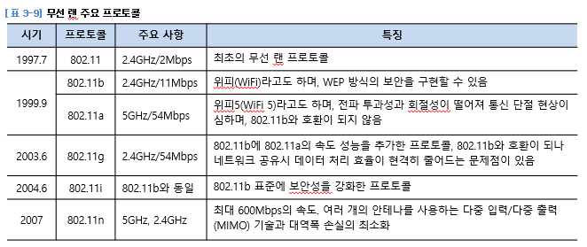

AP 보안 - 물리적인 보안 및 관리자 패스워드 변경, SSID 브로드캐스팅 금지

무선 랜 통신 암호화 - WEP의 암호화, WPA, WPA-PSK의 암호화, EAP와 802.1x의 암호화


# 4 웹 보안

## 4.1 웹에 대한 이해

1969년 ARPA에 의해 전세계를 연결하는 네트워크가 만들어짐 - 이 네트워크를 `알파넷`이라 부름

1994년 카이스트가 `하나망`을 일반에 개방하여 `코넷`을 시작

`WWW(Word Wide Web)`: 세계 규모의 거미집(웹이라고 함) & 1989년 유럽 원자핵 공동 연구소(CERN)에서 근무하던 `팀 버너스 리`에 의해 시작됨<br>
(처음에는 Hyper Text Project라고 명명했음)

## 4.2 HTTP에 대한 이해

`HTTP 프로토콜`

0.9버전은 서버로부터의 단순 읽기만 지원<br>
0.9버전은 하나의 웹페이지 안에서는 텍스트와 그림마다 Connect 과정을 반복해서 거쳐야 했음 - 비효율적(Connect-Request-Response)

`HTTP Request`

GET방식 - URL을 통해 요청 데이터에 대한 인수 전송

POST방식 - HTTP 헤더에 데이터 전송, 인수 값을 URL을 통해 전송x -> 다른이가 링크를 통해 해당 페이지 볼 수 없음<br>
(파일 업로드는 POST 방식으로만 할 수 있음 - 데이터가 URL을 통해서 노출x(최소한의 보안성))

> HEAD방식: 서버측의 데이터 검색하고 요청하는데 사용<br>
OPTIONS방식: 자원에대한 Req/Res 관계에서 선택사항의 정보를 요청할 때 사용<br>
PUT방식: 데이터를 지정한 URI 장소에 그 이름으로 저장<br>
DELETE방식: URI에 지정되어 있는 자원을 서버에서 삭제함<br>
TRACE방식: 요구 메시지의 최종 수신처까지의 루프백 검사용으로 쓰임

`HTTP Response`

헤더 정보 뒤에는 실제 데이터가 전달됨. 데이터 전달이 끝나면 서버는 연결을 끊음

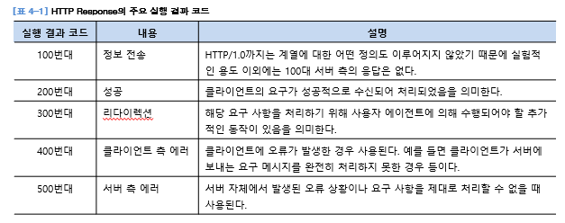


## 4.3 웹 서비스에 대한 이해

HTML - 가장 단순한 형태의 웹 언어

정적인 웹페이지 전송은 웹브라우저를 통해 서버의 무엇인가를 바꿀 수 있는 가능성 낮음 - 공격 어려움

SSS(Server Side Script) - JSP와 같은 동적인 페이지를 제공하는 스크립트

JSP는 서블릿을 통해 처리, ASP는 DLL이나 OCX를 이용해 처리, 다음 결과를 HTML 파일로 만들어 클라에게 전송

CSS(Client Side Script) - 자바스크립트이용, 클라 측의 웹브라우저에 의해 해석되고 적용됨

## 4.4 웹 해킹에 대한 이해

웹 취약점 스캐너를 통한 정보 수집<br>
장점 : 웹 취약점 스캐너를 통한 정보 수집은 빠른 시간 내에 다양한 접속 시도를 수행할 수 있음.<br>
단점 : 웹 구조를 파악하고 취약점을 수집하기가 쉽지 않음.

웹 프록시를 통한 취약점 분석<br>
웹 프록시는 클라이언트가 웹 서버와 웹 브라우저 간에 전달되는 모든 HTTP 패킷을 웹 프록시를 통해서 확인하면서 수정하는 것이 가능

서버에서 클라이언트로 전송되는 패킷 변조<br>
(당첨됐다고 서버를 속이고 상품 받는 것)

구글 해킹을 통한 정보 수집(검색 엔진 이용)

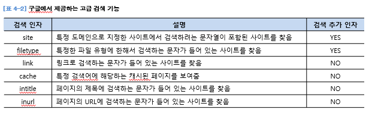

검색 엔진의 검색을 피하는 방법 - 웹서버의 홈디렉토리의 robots.txt 파일을 만들어 검색할 수 있게 만듬

## 4.5 웹에 주요 취약점 10가지

(OWASP(국제웹보안표준기구)에서 해마다 웹관련 상위 10개 주요 취약점 발표)

`1 - 명령 삽입 취약점`

클라 요청을 처리하기 위해 받는 인수에 특정 명령을 실행하는 코드를 포함시킴(SQL injection)<br>
웹 서비스가 예외적인 문자열을 적절히 필터링하지 못하는 경우 발생

`2 - XSS 취약점`

XSS(Cross Site Scripting) - 공격자에 의해 작성된 스크립트가 다른 사용자에게 전달되는 것
다른 사용자의 웹 브라우저 내에서 적절한 검증 없이 실행

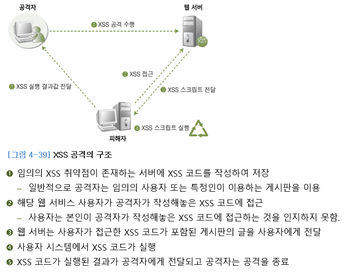

`3- 취약한 인증 및 세션 관리`

취약한 패스워드 설정, 데이터 신뢰도에 대한 증명의 권한을 클라에게 넘기면 안됨

`4 - 직접 객체 참조`

1. 디렉터리 탐색(웹 브라우저에서 경로의 상위로 탐색하여 특정 파일 다운)
2. 파일 업로드 제한 부재(악의적인 파일 전송, 해당 파일 실행하여 서버 장악)
3. 리버스 텔넷(웹 해킹을 통해 시스템의 권한을 획득한 후 해당 시스템에 텔넷과 같이 직접 명령을 입력하고 확인할 수 있는 쉘을 획득하기 위한 방법 & 방화벽이 존재하는 시스템을 공격할 때 자주 사용)

`5 - CSRF 취약점`

CSRF(Cross Site Request Forgery)는 불특정 다수를 대상으로 로그인된 사용자가 자신의 의지와는 무관하게 공격자가 의도한 행위를 하게 만드는 공격

`6 - 보안 설정 취약점`

1. 디렉터리 리스팅: 브라우저를 통해 디렉터리에 있는 파일과 목록을 나열하는 것
2. 백업 및 임시 파일 존재
3. 주석 관리 미흡

`7 - 취약한 정보 저장 방식` - 보호하고자 하는 데이터의 중요도에 따라 암호화 로직을 사용하고, DB 테이블 단위에서 암호화를 ㅜㅅ행

`8 - URL 접근 제한 실패` - 인증필요한 페이지에 대한 인증 미처리 - 인증위한 세션값(쿠키) 사용

`9 - 인증 시 비암호화 채널 사용`

`10 - 부적절한 오류 처리`

## 4.6 웹 취약점 보안

특수문자 필터링

서버측 통제 작용

지속적인 세션 관리

---

# 6 악성 코드

## 6.1 악성코드

제작자가 의도적으로 사용자에게 피해를 주고자 만든 모든 악의적 목적을 가진 프로그램 및 매크로, 스크립트 등 컴퓨터상에서 작동하는 모든 실행 가능한 형태

악성코드의 역사

1972 - 컴퓨터 바이러스의 개념이 처음 등장<br>
1984 - 프레드 코헨이 컴퓨터 바이러스의 개념 정립<br>
1986 - 최초의 바이러스 `브레인 바이러스`<br>
1988 - 최초의 웜 `모리스 웜`<br>
1999 - 매크로 바이러스 `멜리사 바이러스` 출현<br>
2001 - 웜에 의한 대규모 피해 발생(코드 레드)<br>
2005 - MMS를 이용해 악성코드를 퍼뜨리는 휴대폰 악성코드 `컴워리어` 등장

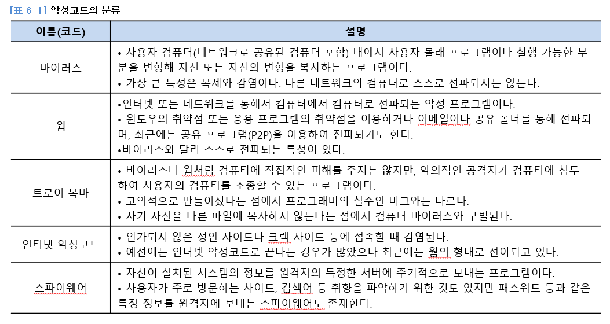

악성 프로그램으로 인해 발생할 수 인한 증상
1. 시스템 관련: 파일시스템 파괴, CMOS 정보 파괴, 시스템 종료
2. 네트워크 관련: 대량 메일 발송, 네트워크 속도 저하
3. 하드 디스크 관련: 하드디스크포맷, 하드 디스크의 특정부분파괴
4. 파일 관련: 백도어 및 웜을 위한 백업 파일 생성, 파일 삭제
5. 특이 증상: 특정음 발생, 이상화면출력

## 6.2 바이러스

사용자 컴퓨터 내에서 사용자 몰래 프로그램이나 실행 가능한 부분을 변형해 자신 또는 자신의 변형을 복사하는 프로그램<br>
`복제와 감염` 특징

시스템의 부팅 순서<br>
POST -> CMOS 로드 -> MBR 로드(이때 부트 바이러스 감염) -> 운영체제 정보 로드

`1세대 원시형 바이러스`
1. 부트 바이러스: MBR과 함께 PC 메모리에 저장되고, 부팅할 때 자동으로 동작->모든 프로그램 감염
2. 파일 바이러스: 바이러스에 감염된 실행 파일이 실행될 때 바이러스 코드를 실행(COM, EXE 파일)(최초의 파일 바이러스 - 예루살렘 바이러스)

썬데이, 스콜피온, 크로우, FCL, CIH

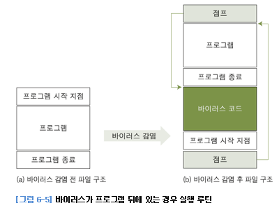

`2세대 암호형 바이러스`: 바이러스 코드를 쉽게 파악하고 제거할 수 없도록 암호화된 바이러스<br>
슬로우, 캐스케이드, 원더러, 버글러 바이러스

`3세대 은폐형 바이러스`: 바이러스에 감염된 파일들이 일정한 잠복 기간을 가지게 한 바이러스<br>
브레인, 조시, 512, 4096 바이러스

`4세대 다형성 바이러스`: 코드조합을 다양하게 할 수 있는 조합 프로그램을 암호형 바이러스에 덧붙여 감염됨. 실행될 때마다 바이러스 코드 자체를 변경시켜 식별자를 통해 구분하기 어렵게 함

`5세대 매크로 바이러스`: 응용프로그램 및 사무용 관련 프로그램이 개발되면서 스크립트 형태의 실행 환경을 이용하여 전파되는 바이러스. 주로 MS 오피스 프로그램의 매크로 기능을 이용하여 감염<br>
워드 컨셉트, 와쭈, 액셀-라룩스 바이러스

## 6.3 웜

인터넷 또는 네트워크를 통해서 컴퓨터에서 컴퓨터로 전파되는 프로그램. 다른 컴퓨터의 취약점을 이용하여 스스로 전파되거나 메일로 전파됨

`복제와 전파`가 목적 -> 시스템, 인터넷 전송속도 느리게 하는게 주 목적

웜의 종류
1. MASS Mailer형 웜: 자기 자신을 포함하는 대량 메일 발송을 통해 확산되는 웜. 제목이 없거나 특정 제목으로 전송되는 메일을 읽었을 때 감염
    베이글, 넷스카이, 두마루, 소빅
2. 시스템 공격형 웜: 운영체제 고유의 취약점을 통해 내부 정보를 파괴 혹은 컴퓨터를 사용할 수 없는 상태로 만들거나 외부 공격자가 시스템 내부에 접속할 수 있도록 백도어를 설치한다.
    아고봇, 블래스터, 웰치아
3. 네트워크 공격형 웜:특정 네트워크나 시스템에 대해 서비스 거부 공격을 수행한다.
    져봇, 클레즈


## 6.4 기타 악성코드

`백도어와 트로이 목마`: 정상적인 인증 과정을 거치지 않고 운영체제나 프로그램 등에 접근할 수 있도록 만든 일종의 관리 목적의 통로이다. 시용자가 의도하지 않은 코드를 정상적인 프로그램에 삽입한 형태

`인터넷 악성코드`: 인가되지 않은 성인 사이트나 크랙 사이트 등에 접속할 때 감염된다. 예전에는 인터넷 악성코드로 끝나는 경우가 많았으나, 최근에는 웜의 형태로 전이되고 있다.

`스파이웨어`: 자신이 설치된 시스템의 정보를 원격지의 특정한 서버에 주기적으로 보내는 프로그램. 


## 6.5 악성코드 탐지 및 대응책

1. 네트워크 상태 점검하기
2. 정상적인 프로세스와 비교하기
3. 백도어의 실질적인 파일 확인하기
4. 시작 프로그램과 레지스트리 확인하기
5. 백도어 제거하기(백도어 프로세스 중지 -> 백도어 파일 삭제 -> 레지스트리 삭제)

// 윈도우 주요 프로세스


