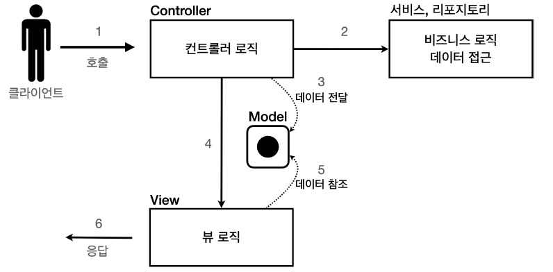

# MVC 패턴 개요

## MVC 패턴이 적용되기 전의 문제점

`너무 많은 역할`

하나의 서블릿이나 JSP 파일이 너무 많은 역할을 담당한다.  
(비즈니스 로직 & 뷰 렌더링)  
-> 유지보수가 어려워진다.

`라이프 사이클의 차이`

비즈니스 로직과 뷰 렌더링의 라이프 사이클이 다르다.

> 라이프 사이클이 다른 부분들을 하나의 코드로 관리하는 것은  
> 좋지 않다.

`기능 특화`

JSP 같은 뷰 템플릿은 화면을 렌더링 하는데 최적화 되어 있다.  
-> 이 부분만 담당하는 것이 좋다.

---

## MVC(Model View Controller) 패턴

MVC 패턴은 하나의 서블릿이나, JSP로 처리하던 것을  
컨트롤러(Controller), 모델(Model), 뷰(View)라는 영역으로  
서로 역할을 나눈 것을 말한다.

### 컨트롤러

HTTP 요청을 받아서 파라미터를 검증하고, 비즈니스 로직을 실행한다.  
그리고 뷰에 전달할 결과 데이터를 조회해서 모델에 담는다.

### 모델

뷰에 출력할 데이터를 담아둔다.

### 뷰

모델에 담겨있는 데이터를 사용해서 화면을 그리는 일에 집중한다.

> 뷰는 모델에 있는 데이터만 가지고 화면을 그리면 되므로,  
> 비즈니스 로직이나 데이터 접근을 몰라도 된다.

---

## MVC 패턴 규칙

### 1. Model은 Controller와 View에 의존하지 않는다.

### 2. View는 Model에만 의존해야 하고, Controller에는 의존하면 안된다.

### 3. View가 Model로부터 데이터를 받을 때는, 사용자마다 다르게 보여주어야 하는 데이터에 대해서만 받아야 한다.

### 4. Controller는 Model과 View에 의존해도 된다.

### 5. View가 Model로부터 데이터를 받을 떄, 반드시 Controller를 통해서 받아야 한다.

---

## MVC 패턴 그림

---