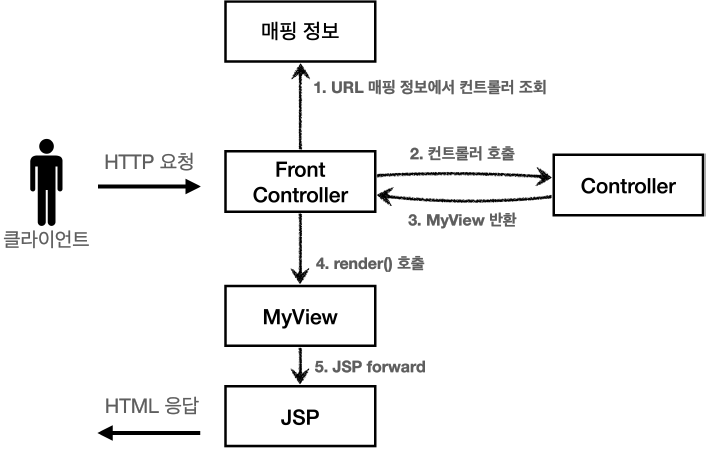

## v0 - 맨 처음 코드

각각의 컨트롤러가 HttpServlet을 상속받아서,  
`service` 메서드를 오버라이딩하여 구현하고 있다.

```java
@RequiredArgsConstructor
@WebServlet("/member/list")
public class MemberListController implements HttpServlet {
    private final MemberRepository memberRepository;
    @Override
    protected void service(HttpServletRequest request, HttpServletResponse response)
            throws ServletException, IOException {
        System.out.println("MvcMemberListServlet.service");
        List<Member> members = memberRepository.findAll();
        request.setAttribute("members", members);
        
        String viewPath = "/WEB-INF/views/members.jsp";
        RequestDispatcher dispatcher = request.getRequestDispatcher(viewPath);
        dispatcher.forward(request, response);
    }
}
```

> `members.jsp` 파일에는 화면을 그리는 코드가 들어있다.

---

MVC 패턴을 적용한 덕분에 컨트롤러의 역할과 뷰를 렌더링하는 역할을 명확하게 구분할 수 있게 되었다.


하지만 위 코드의 아쉬운 점들이 있다.  

### 현재 MVC 컨트롤러의 단점

새로운 컨트롤러를 추가할 때마다 아래의 단점들이 발생한다.

#### 1. 포워드 중복  
뷰로 이동하는 코드가 중복된다.

```
String viewPath = "/WEB-INF/views/members.jsp";
RequestDispatcher dispatcher = request.getRequestDispatcher(viewPath);
dispatcher.forward(request, response);
```

#### 2. ViewPath의 중복

뷰의 경로가 중복된다.

> 만약 jsp가 아닌 thyemleaf로 변경한다면,  
> 모든 컨트롤러의 뷰 경로를 수정해야 한다.

#### 3. 사용하지 않는 코드

HttpServletRequest, HttpServletResponse를 사용하지 않는 컨트롤러도 있다.

> 위 컨트롤러도 HttpServletResponse를 사용하지 않고 있다.

---

## 결국 공통 처리가 어렵다

이 문제를 해결하기 위해 프론트 컨트롤러(Front Controller) 패턴을 도입해보자.

> 입구를 하나로

---

## v1 - 프론트 컨트롤러 패턴


ControllerV1 이라는 인터페이스를 도입하고,  
각 컨트롤러는 이 인터페이스를 구현하도록 변경한다.

```java
public interface ControllerV1 {
    void process(HttpServletRequest request, HttpServletResponse response) throws ServletException, IOException;
}
```

그리고 프론트 컨트롤러 서블릿을 도입한다.

```java
@WebServlet(name = "frontControllerServletV1", urlPatterns = "/front-controller/v1/*")
public class FrontControllerServletV1 extends HttpServlet {
    private final Map<String, ControllerV1> controllerMap = new HashMap<>();

    public FrontControllerServletV1() {
        controllerMap.put("/front-controller/v1/members/new-form", new MemberFormControllerV1());
        controllerMap.put("/front-controller/v1/members/save", new MemberSaveControllerV1());
        controllerMap.put("/front-controller/v1/members", new MemberListControllerV1());
    }

    @Override
    protected void service(HttpServletRequest request, HttpServletResponse response) throws ServletException, IOException {
        System.out.println("FrontControllerServletV1.service");

        String requestURI = request.getRequestURI();

        ControllerV1 controller = controllerMap.get(requestURI);
        if (controller == null) {
            response.setStatus(HttpServletResponse.SC_NOT_FOUND);
            return;
        }

        controller.process(request, response);
    }
}
```

### service()

먼저 request의 URI를 조회해서 실제 호출할 컨트롤러를 찾는다.  
그리고 찾은 컨트롤러를 호출한다.

### v1을 도입하면

프론트 컨트롤러를 도입함으로써 공통 처리가 가능해졌다.

---

### 아직 남은 문제

> 아직 모든 컨트롤러에서 뷰 경로를 직접 지정하고 있다. (중복도 여전히 존재)
>
> ```
> String viewPath = "/WEB-INF/views/members.jsp";
> RequestDispatcher dispatcher = request.getRequestDispatcher(viewPath);
> dispatcher.forward(request, response);
> ```

이 부분을 깔끔하게 분리하기 위해 별도로 뷰를 처리하는 객체를 도입한다.

## v2 - 뷰 분리



기존 v1은 각 컨트롤러에서 직접 뷰를 호출하고 있었다.  
v2에서는 각 컨트롤러가 뷰에 대한 별도의 객체를 반환하도록 변경한다.

```java
public class MyView {
    private final String viewPath;

    public MyView(String viewPath) {
        this.viewPath = viewPath;
    }

    public void render(HttpServletRequest request, HttpServletResponse response) throws ServletException, IOException {
        RequestDispatcher dispatcher = request.getRequestDispatcher(viewPath);
        dispatcher.forward(request, response);
    }
}
```

```java
public interface ControllerV2 {
    MyView process(HttpServletRequest request, HttpServletResponse response) throws ServletException, IOException;
}
```

```java
public class MemberListControllerV2 implements ControllerV2 {
    private final MemberRepository memberRepository = MemberRepository.getInstance();

    @Override
    public MyView process(HttpServletRequest request, HttpServletResponse response) throws ServletException, IOException {
        List<Member> members = memberRepository.findAll();
        request.setAttribute("members", members);
        return new MyView("/WEB-INF/views/members.jsp");
    }
}
```

```java
public class FrontControllerServletV2 extends HttpServlet {
    private final Map<String, ControllerV2> controllerMap = new HashMap<>();

    public FrontControllerServletV2() {
        controllerMap.put("/front-controller/v2/members/new-form", new MemberFormControllerV2());
        controllerMap.put("/front-controller/v2/members/save", new MemberSaveControllerV2());
        controllerMap.put("/front-controller/v2/members", new MemberListControllerV2());
    }

    @Override
    protected void service(HttpServletRequest request, HttpServletResponse response) throws ServletException, IOException {
        System.out.println("FrontControllerServletV2.service");

        String requestURI = request.getRequestURI();

        ControllerV2 controller = controllerMap.get(requestURI);
        if (controller == null) {
            response.setStatus(HttpServletResponse.SC_NOT_FOUND);
            return;
        }

        MyView view = controller.process(request, response);
        view.render(request, response);
    }
}
```

### v1 -> v2로 변경된 점

딱 한가지다.

기존 컨트롤러들이 더 이상 뷰를 직접 호출하지 않고,  
`MyView` 객체를 반환하도록 변경했다.

뷰를 호출하는 부분은 프론트 컨트롤러에서 처리한다.

> 각 컨트롤러들은 경로만 반환하면 된다.

---

