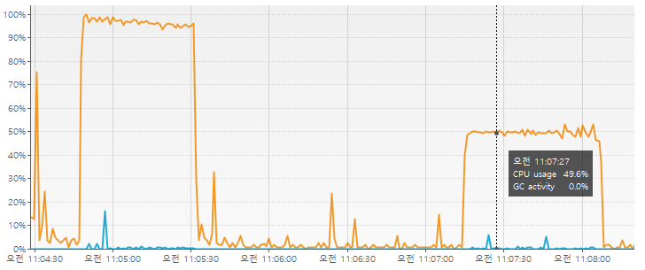

# cgroup을 이용한 리소스 제한

## cgroup이란?

cgroup은 리눅스 커널의 기능 중 하나로, 프로세스 그룹에 대한 리소스 사용량을 제한하는 기능을 제공한다.  

cgroup은 리소스 제한 기능을 그룹 단위로 제공하기 때문에, 여러 프로세스를 그룹으로 묶어서 리소스 제한을 할 수 있다.

---

## cgroup 제한 방식

cgroup은 디렉토리를 통해 그룹을 생성하고, 그룹에 속한 프로세스에 대한 리소스 사용량을 제한한다.

---

## cgroup 실습

cgroup을 이용해 특정 프로그램의 CPU 사용량을 제한하는 실습을 진행해보자.

> 현재 테스트하는 환경은 ubuntu 20.04이다.  
> (cgroup-v2를 사용하고 있다)

### cgroup 마운트 확인

먼저 cgroup이 마운트 되어 있는지 확인한다.

```bash
mount -l | grep cgroup
# cgroup2 on /sys/fs/cgroup type cgroup2 (rw,nosuid,nodev,noexec,relatime)
```

위와 같이 출력되면 cgroup이 마운트 되어 있는 것이다.

### cgroup 컨트롤러 확인

`/sys/fs/cgroup/cgroup.controllers` 파일을 통해 cgroup이 사용하는 컨트롤러를 확인할 수 있다.

```bash
cat /sys/fs/cgroup/cgroup.controllers
# cpuset cpu io memory pids
```

위와 같이 출력되면 cgroup이 사용하는 컨트롤러로 `cpuset`, `cpu`, `io`, `memory`, `pids`가 있다.  
-> 이 말은 cgroup을 통해 CPU, 메모리, I/O, 프로세스 개수 등을 제한할 수 있다는 뜻이다.

> 내가 사용한 서버는 싱글 코어이기 때문에 `cpuset` 컨트롤러를 사용할 수 없다.  
> (애초에 결과에 `cpuset`이 없다)

// todo cpuset 설명

### 하위 그룹 컨트롤러 설정

`echo "+cpu" | tee /sys/fs/cgroup/cgroup.subtree_control` 

위 명령어를 통해 하위 그룹에 cpu 컨트롤러를 사용할 수 있도록 설정한다.

> `tee` 명령어는 표준 입력을 파일로 출력하는 명령어이다.  
> 파이프라인을 통해 echo 명령어의 출력이 tee 명령어의 입력으로 들어가고, tee 명령어는 파일로 출력한다.

위 작업을 하지 않아도, 이미 cgroup.subtree_control 파일에 `cpu`가 설정되어 있을 수 있다.

### cgroup 그룹 생성

`/sys/fs/cgroup` 디렉토리에 새로운 디렉토리를 생성한다.

```bash
mkdir /sys/fs/cgroup/example
```

위 명령을 수행하면  
생성된 디렉토리에 cgroup 컨트롤러를 설정할 수 있는 파일들이 생성된다.

### cgroup 컨트롤러 설정

`/sys/fs/cgroup/example` 디렉토리에 cpu 컨트롤러를 설정한다.

```bash
echo "50000 100000" > /sys/fs/cgroup/example/cpu.max
```

> cpu.max 파일에는 두 개의 값이 들어간다.  
> `<max> <period>`  
> 첫 번째 값은 해당 cgroup이 사용할 수 있는 CPU 시간의 최대값을 나타내고,  
> 두 번째 값은 주기를 나타낸다.
> 
> 둘 다 마이크로초 단위로 설정한다.

즉 위 명령어는 CPU 리소스 사용률을 50%로 제한하는 것이다.

> 맨 처음 생성된 cpu.max 파일에는  
> `max 100000`  
> 이라고 적혀있을 것이다.
> 
> max - 제한 없이 CPU를 사용할 수 있다는 의미이다.

### cgroup 프로세스 추가

`/sys/fs/cgroup/example` 파일에 PID를 추가하여 해당 cgroup에 프로세스를 추가한다.

```bash
echo <PID> | tee /sys/fs/cgroup/example/cgroup.procs
```

PID는 프로세스 ID를 의미한다.  
위 명령어를 통해 해당 PID의 프로세스가 cgroup에 추가된다.  
-> 해당 프로세스는 cgroup의 제한을 받게 된다.

### cgroup 제한 확인

나는 자바 프로그램의 CPU 사용량을 cgroup을 통해 제한했다.

이 결과를 visualVM을 통해 확인했다.

> visualVM 뿐만 아니라, `top` 명령어를 통해도 확인할 수 있다.



위 그래프에서 왼쪽은 cgroup을 사용하지 않았을 때의 CPU 사용량이고,  
오른쪽은 cgroup을 사용했을 때의 CPU 사용량이다.

부하가 들어올 때 왼쪽은 CPU 사용량이 100%에 가까워지는 반면,  
오른쪽은 CPU 사용량이 50%에 머물렀다.  
-> cgroup을 통해 CPU 사용량을 제한할 수 있음을 확인할 수 있다.

---

## cgroup vs cpulimit

cpulimit는 cgroup 처럼 특정 프로세스의 CPU 사용량을 제한하는 프로그램이다.

하지만 cgroup과 cpulimit은 cpu 리소스를 제한하는 방식이 다르다.

cgroup은 프로세스의 cpu 시간을 제한하는 방식이다.  
(직접 cpu 시간을 제한한다)

cpulimit는 프로세스의 cpu 사용률을 제한하는 방식이다.  
(프로세스가 사용하는 cpu 사용률을 제한한다)

이때 cpulimit는 주기적으로 프로세스의 cpu 사용률을 모니터링하고,  
제한된 cpu 사용률을 넘어가면 프로세스를 일시 중지시킨다.

> 이로 인해 cpulimit는 설정한 cpu 사용률을 넘어가는 경우가 발생할 수 있다.  
> (모니터링에 의한 오버헤드 때문)

