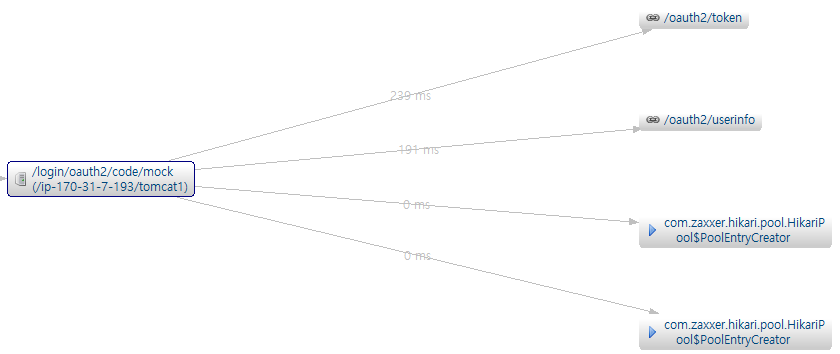
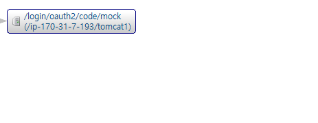
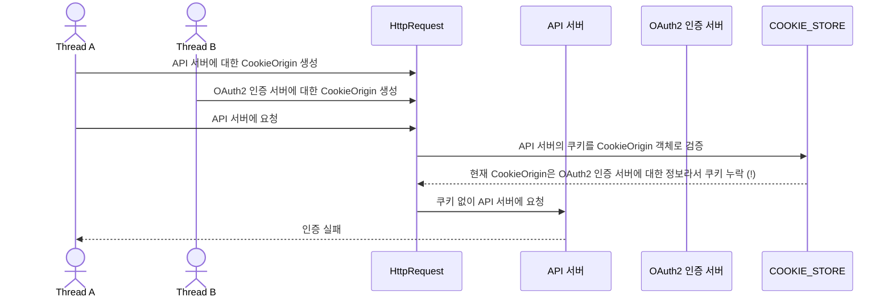
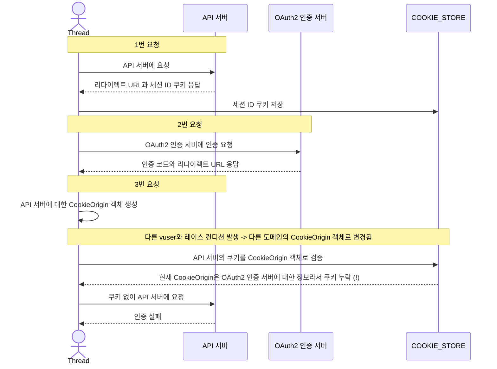

## nGrinder 부하 테스트 중 발생한 OAuth2 인증 문제 분석 및 해결

이글은 nGrinder를 이용하여 부하테스트를 시작하기 전에 발생한  
vuser의 OAuth2 인증 문제를 해결한 과정을 정리한 글입니다.

> vuser: nGrinder에서 사용하는 가상 유저

---

### 개요

API 서버의 TPS를 측정하기 위해 nGrinder를 이용한 부하테스트를 진행하고 있었다.

이때 해당 서버는 OAuth2 인증을 사용하고 있기 때문에,  
인증을 받기 위해 2개의 도메인에 요청을 보내야 했다.  
(API 서버, OAuth2 인증 서버)

> vuser가 API 서버의 인증을 받기 위해 총 3번의 요청이 필요하다.
> 1. API 서버에 요청 (바로 OAuth2 인증 서버로 리다이렉트 된다)
> 2. OAuth2 인증 서버에서 인증 후, 인증 코드를 받는 요청 (인증 성공 시, API 서버로 리다이렉트 된다)
> 3. 인증 코드를 이용해 API 서버에 인증 요청  
>    (WAS 내부에서 직접 액세스 토큰 요청, userInfo 요청을 수행한다)
> 
> 위 3번의 요청을 통해 인증을 받고, 이후 API 서버에 부하를 주게 된다.

---

### 문제 발생

nGrinder를 이용해서 100명의 vuser로 성능테스트를 해봤는데  
(프로세스 1개, 스레드 100개)

실제 API 테스트 전의 OAuth2 인증에서 문제가 발생했다.

> 100명의 vuser에서 51명만 인증에 성공하고, 나머지는 실패했다.

---

### 원인 분석 1 - 어떤 시점에 vuser의 요청이 실패했는가?

> 일단 3번의 요청 중 1번(API 서버), 2번 요청(OAuth2 인증 서버)은 성공한 것으로 확인했다.  
> 따라서 3번 요청(API 서버)의 로그를 분석해봤다.

스카우터를 이용해 인증에 성공한 유저와 실패한 유저의 요청 플로우 비교해봤다.

성공한 인증 요청의 플로우  
(내부에서 액세스 토큰 요청, userInfo 요청을 모두 성공적으로 수행했다)  
  

> `com.zaxxer.hikari.pool.HikariPool$PoolEntryCreator` 요청은  
> userInfo 요청 이후 DB에서 발생하는 요청이다.  
> (DB 커넥션 풀에서 커넥션을 가져오는 요청)

실패한 인증 요청의 플로우  
(내부에서 아무 요청도 하지 못했다)  


실패한 유저의 요청 플로우를 보니,  
OAuth2 인증을 위한 액세스 토큰 요청, userInfo 요청을 하지 않고 바로 종료됐다.

> 따라서 이 문제는 OAuth2 모의 인증 서버의 문제가 아니라,  
> API 서버에서 OAuth2 인증을 처리하는 로직에서 발생한 문제일 것으로 예상했다.

---

### 원인 분석 2 - API 서버에서 OAuth2 인증 처리 로직 분석

> API 서버는 사용자 인증을 위해 스프링 시큐리티를 사용하고 있었다.

그리고 인증에 실패한 요청의 에러 로그에서  
authorization_request_not_found 라는 에러 메시지를 확인했다.  


해당 로그 메시지가 어디서 발생했는지 알아보기 위해  
스프링 시큐리티의 OAuth2 인증 로직을 디버깅 해봤다.

디버깅을 통해 알아낸 사실은,  
인증 요청을 검증하는 단계에서 요청에 `JSESSIONID` 쿠키가 담기지 않아서  
인증 요청을 처리할 수 없었던 것이었다.

> 스프링 시큐리티는 OAuth2 인증을 처리하기 위해  
> 1번 요청에으로 서블릿 세션에 클라이언트의 정보를 저장하고  
> 응답으로 해당 세션의 ID를 쿠키로 전달한다.  
> 그리고 3번 요청에서 인증 요청을 처리할 때 서블릿 세션을 이용한다.  
> (3번 요청에서 세션을 찾기 위해 요청에 쿠키가 있어야 한다)
> 
> 따라서 특정 vuser의 요청에서 쿠키가 제대로 담기지 않아서  
> 인증에 실패한 것이었다.

---

### 원인 분석 3 - nGrinder 스크립트 코드

> API 서버의 http 메시지 로그를 확인해보니,  
> 1번 요청에선 응답으로 쿠키를 전달한 것을 확인했다.

쿠키가 담기지 않은 이유를 알아보기 위해  
nGrinder를 이용하기 위한 스크립트 코드를 분석했다.

nGrinder를 이용하기 위해 작성한 스크립트는 다음과 같다.
```java
class TestRunner {
    private HTTPRequest httpRequest = new HTTPRequest();
    
    @BeforeThread
    public void beforeThread() {
          request.GET("{API 서버}"); // 1번 요청
          
          request.GET("{Mock 서버}"); // 2번 요청
        
          request.GET("{API 서버}"); // 3번 요청
    }
    
    public void request(){
        // 실제 API 서버에 부하를 주는 요청
   }
}
```

> `beforeThread()` 메서드는 실제 부하를 주기 전,  
> 스레드 별로 실행되는 메서드이다.
> 
> 이 메서드에서 각 스레드의 인증을 진행한다.

3번 요청에서 문제가 발생했기 때문에,  
(쿠키가 담기지 않아 인증에 실패했다)  
`HttpRequest` 객체를 디버깅해야 한다.

---

### 원인 분석 4 - 요청에 쿠키가 담기지 않는 이유 (HttpRequest 객체 분석)

nGrinder는 `HttpRequest` 객체를 이용해 vuser의 요청을 처리한다.  
이때 쿠키를 관리하기 위해 두가지 필드를 사용한다.
1. `CookieStore COOKIE_STORE` 필드  
   -> 쿠키를 저장하는 저장소
2. `CookieOrigin cookieOrigin` 필드  
   -> 쿠키의 도메인, 경로 등을 설정하는 필드

1번 `COOKIE_STORE` 필드는 인스턴스 필드이지만 `ThreadLocal`로 선언되어 있어서  
각 스레드마다 별도의 쿠키 저장소를 사용한다.

그런데 2번 `cookieOrigin` 필드는 인스턴스 필드로만 선언되어 있어서  
모든 스레드가 같은 쿠키 도메인, 경로를 사용하게 된다.

> 이로 인해 nGrinder의 스레드가 동시에 요청을 보낼 때,  
> 쿠키 저장소는 각 스레드마다 별도로 사용되지만,  
> 쿠키 도메인, 경로는 모든 스레드가 공유하게 된다.

nGrinder가 HTTP 요청을 보내기 전 쿠키를 설정하는 코드

```java
class HttpRequest {
    // ...
    
    private List<Header> getMatchedCookies(String uriString) {
        URI uri = URI.create(uriString);
        
        int port = uri.getPort();
        if (port == -1) {
            port = 80;
        }

        boolean isSecure = uri.getScheme().equalsIgnoreCase("https");

        cookieOrigin = new CookieOrigin(uri.getHost(), port, uri.getPath(), isSecure);  // (1) !

        final List<Cookie> cookies = COOKIE_STORE.getCookies();
        // Find cookies matching the given origin
        final List<Cookie> matchedCookies = new ArrayList<>();
        final Date now = new Date();
        boolean expired = false;
        for (final Cookie cookie : cookies) {
            if (!cookie.isExpired(now)) {
                if (COOKIE_SPEC.match(cookie, cookieOrigin)) {
                    matchedCookies.add(cookie);                                         // (2)
                }
            }
        }
        
        // ...

        return COOKIE_SPEC.formatCookies(matchedCookies);
    }
    
    // ...
}
```

위 코드는 요청을 보내기 전 쿠키를 담기 위한 메서드이다.  
(현재 요청에 해당하는 쿠키만 반환한다)

`getMatchedCookies` 메서드의 실행 순서
1. `CookieOrigin` 필드에 현재 요청에 대한 새로운 객체를 생성한다.
2. 1번에서 생성한 `CookieOrigin` 객체를 이용해  
   `COOKIE_STORE`에 있는 쿠키들을 검증하여 맞는 쿠키만 반환한다.

위 메서드를 통해 반환된 쿠키 헤더는 요청에 담겨서 보내지게 된다.

---

### nGrinder 레이스 컨디션 문제 설명

쿠키가 담기지 않는 이유는 다음과 같다.

두 개 이상의 스레드가 동시에 다른 도메인에 요청을 보낼 때,  
`CookieOrigin` 객체를 공유하기 때문에  
특정 스레드 요청에 쿠키가 담기지 않는 문제가 발생한다.

---

`레이스 컨디션으로 인해 인증에 실패하는 시퀀스 다이어그램 예시`  
(두 개의 스레드가 동시에 요청을 보내는 시나리오)

> 요청을 보내는 스레드: A, B  
> 스레드 A는 API 서버에 요청을 보내고,  
> 스레드 B는 모의 서버에 요청을 보낸다.

동시에 요청을 보내면서 레이스 컨디션이 발생하는 시나리오



> 실제 쿠키 검증 로직은 `COOKIE_STORE`가 아닌 `HttpRequest` 객체 내부에서 이루어진다.  
> 위 다이어그램은 쉬운 이해를 위해 `COOKIE_STORE` 객체에서 진행되는 것으로 표현했다.

---

### 문제가 발생한 전체 시나리오 정리

> 레이스 컨디션이 발생해 인증이 실패하는 시나리오를  
> 한 스레드의 요청에 대한 시퀀스 다이어그램으로 정리했다.



---

두개 이상의 스레드가 동시에 다른 도메인에 요청을 보내는 문제를 해결해야 한다.

### 해결 방법

nGrinder의 레이스 컨디션 문제를 해결하기 위해  
스레드 동기화를 이용했다.

> `CountDownLatch`를 이용했다.
>
> `CountDownLatch`는 특정 스레드가 다른 스레드들이 모두 작업을 마칠 때까지 대기하도록 하는 클래스이다.

```java
class TestRunner {
   private CountDownLatch latch1 = new CountDownLatch(100); // 스레드 개수를 이용해 CountDownLatch 생성
    private CountDownLatch latch2 = new CountDownLatch(100);
    private HTTPRequest httpRequest = new HTTPRequest();
    
    @BeforeThread
    public void beforeThread() {
          request.GET("{API 서버}");
        
          latch1.countDown();
          latch1.await(); // 모든 스레드들이 1번 요청을 마칠 때까지 대기
          
          request.GET("{Mock 서버}");
          
          latch2.countDown();
          latch2.await(); // 모든 스레드들이 2번 요청을 마칠 때까지 대기
        
          request.GET("{API 서버}");
    }
    
    // ...
}
```

위 코드를 추가해줌으로써 모든 스레드들이 항상 동시에 같은 서버에만 요청을 보내도록 처리했다.  

> 이로 인해 레이스 컨디션 문제가 해결되었고,  
> 모든 요청에 쿠키가 담겨서 인증 문제가 해결되었다. ^^

---