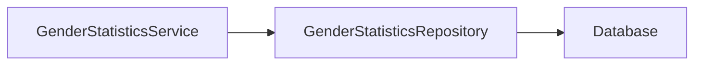

## 해결하려는 문제
성별 통계 API에 레디스를 이용해 캐시를 도입하여 응답 속도를 높인다.

## 해결 방법

DB에서만 데이터를 가져오던 방식에서 레디스 캐시를 조회하는 방식으로 변경

### 1. GenderStatisticsService의 dependency 변경

기존 `GenderStatisticsService` 클래스 의존 구조

변경된 `GenderStatisticsService` 클래스 의존 구조

### 2. GenderStatisticsCacheFallbackService의 역할

1. `GenderStatisticsCacheFetchService`를 이용해 레디스 캐시에 데이터를 조회한다.
2. 캐시로부터 데이터를 가져오는 과정 중에 에러가 발생하면  
   `GenderStatisticsRepositoryFetchService`를 이용해 데이터를 가져온다.

캐시에서 데이터를 가져오는 중에 에러가 발생했을 때만,  
DB에서 데이터를 가져온다.

캐시로부터 데이터를 가져올 때,  
DB와의 데이터 불일치는 검증하지 않는다.

### 캐시의 데이터를 업데이트 하는 방법

1. 스프링 부트를 실행할 때  
   `GenderStatisticsCacheStartupService`를 이용해 데이터를 캐시에 저장한다.
2. 매일 오전 4시  
   `GenderStatisticsCacheScheduledService`를 이용해 캐시의 데이터를 업데이트한다.  
   (31일전-2일전 데이터 -> 30일전-1일전 데이터)
3. `Article`/`User` 데이터의 변경이 발생했을 때  
   `ArticleService`/`UserService`에서 `ApplicationEventPublisher`를 이용해 이벤트를 발행하고,  
   `GenderStatisticsCacheSynchronizer`를 이용해 캐시의 데이터를 업데이트한다.

> `GenderStatisticsCacheScheduledService`는  
> 31일전 데이터를 레포지토리에서 가져와 캐시에서 삭제한다.  
> 그리고 1일전 데이터를 레포지토리에서 가져와 캐시에 저장한다.

### 추가로 구현한 클래스

`GenderStatisticsCacheVerifyScheduledService`  
매일 오전 5시에 캐시의 데이터와 DB의 데이터를 비교한다.  
데이터 불일치가 발생하면 캐시의 데이터를 업데이트한다.

`StatisticsPeriodManager`  
통계 데이터의 기간을 관리한다.

> 추후 캐시 데이터의 쓰기 작업을 하는 클래스들의  
> lock을 관리하기 위해(1), 그리고 테스트를 위해(2)  
> 만들었다.  
> (Clock을 주입받아 테스트에서 시간을 조작한다.)

---

## 레디스와 DB의 데이터 정합성 유지 방법: 슬라이딩 윈도우

> 슬라이딩 윈도우:  
> 데이터를 일정 기간만큼 유지하고, 새로운 데이터가 들어오면  
> 가장 오래된 데이터를 삭제한다.

통계 API는 최근 30일간의 데이터를 가공하여 제공하고 있다.

레디스에서 하루가 지날 때마다,  
31일전 데이터를 삭제하고 1일전 데이터를 추가한다.  
=> 이렇게 되면 레디스에는 항상 최근 30일간의 데이터가 유지된다.

---

