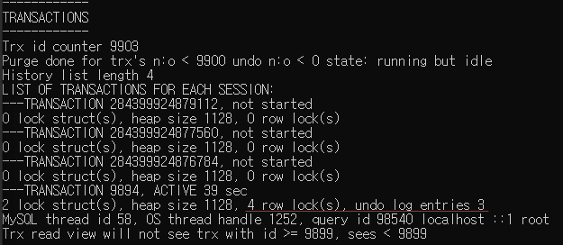

### MySQL 서버의 현재 구성된 시스템 변수를 보는 방법

```SHOW [ GLOBAL  | SESSION ] VARIABLES```

이 값들을 이용해 서버의 동작 및 구성을 확인할 수 있다.

### MySQL 서버의 현재 상태 정보를 보는 방법

```SHOW [ GLOBAL  | SESSION ] STATUS```

이 값들을 이용해 모니터링 할 수 있다.

> 특정 변수만 보고 싶다면 뒤에 `LIKE 'A%'` 를 붙여주면 된다.

> [ GLOBAL | SESSION ] 을 붙이지 않으면,  
> 자동으로 SESSION으로 인식한다.

---

### show engine innodb status

InnoDB 스토리지 엔진의 현재 상태를 보여주는 정보를 반환하는 명령어

이를 이용해 현재 몇개의 레코드가 lock이 걸렸는지,  
트랜잭션 별로 undo log에 레코드가 몇개 있는지,  
등등 현재 상태에 대한 다양한 정보를 알 수 있다.

`이미지 예시`



현재 9894번 id인 트랜잭션이 4개의 레코드 락을 걸고 있고,  
3개의 undo log를 갖고 있다.

---

### Performance_schema DB의 data_locks 테이블

현재 잠금이 걸린 레코드에 대한 정보를 보여주는 테이블

몇가지 중요한 칼럼
- engine_transaction_id: 현재 락을 걸고 있는 트랜잭션의 id
- object_name: 락을 걸고 있는 레코드가 있는 테이블의 이름
- index_name: 락이 걸린 인덱스의 이름
- lock_mode: 어떤 락이 걸렸는지 보여준다.
  (S: 공유 락, X: 배타 락, GAP: 갭락)
- lock_data: 레코드의 정보(값)

---

특정 범위에 대해 락을 걸면  
MySQL InnoDB는 그 다음 레코드도 락을 건다.  
(갭 락)

---

## MySQL User 및 권한 관리

### mysql 유저 생성

`CREATE USER '{유저_이름}'@'localhost' IDENTIFIED BY '{비밀번호}';`

위 명령어를 통해 mysql 유저를 생성할 수 있다.

> 여기서 localhost는 해당 유저가 접속할 수 있는 호스트를 의미한다.

localhost 대신 사용할 수 있는 값은 다음과 같다.
- % : 모든 호스트
- localhost : 로컬 호스트
- 특정 IP : 해당 IP 주소
- 특정 도메인 : 해당 도메인

> 특정 IP나 특정 도메인을 입력하면, 해당 IP나 도메인에서만 접속이 가능하다.

---

> `SELECT User, Host FROM mysql.user;`  
> 위 명령어를 통해 현재 생성된 유저를 확인할 수 있다.

---

### 맨 처음 생성한 유저의 권한

맨 처음 유저를 생성하면, 해당 유저는 아무런 권한도 가지고 있지 않다.

> `show grants for '{유저_이름}'@'localhost';`  
> 위 명령어를 통해 해당 유저의 권한을 확인할 수 있다.

맨 처음 위 명령어를 입력하면 다음과 같은 결과가 나온다.

```
GRANT USAGE ON *.* TO '{유저_이름}'@'localhost'
```

위 결과를 보면, 해당 유저는 모든 데이터베이스에 대한 사용 권한이 없다는 것을 알 수 있다.

USAGE 권한은 해당 데이터베이스에 대한 권한이 없다는 것을 의미한다.  
(접속만 가능하고, 사용은 불가능)

---

### 권한 부여

`GRANT {권한} ON {데이터베이스}.{테이블} TO '{유저_이름}'@'localhost';`

위 명령어를 통해 유저에게 권한을 부여할 수 있다.

{권한}에는 DML, DDL, DCL, TCL 등이 들어갈 수 있다.

> 위 명령어를 통해 특정 데이터베이스의 권한을 얻어야  
> 해당 데이터베이스에 접근할 수 있다.

---